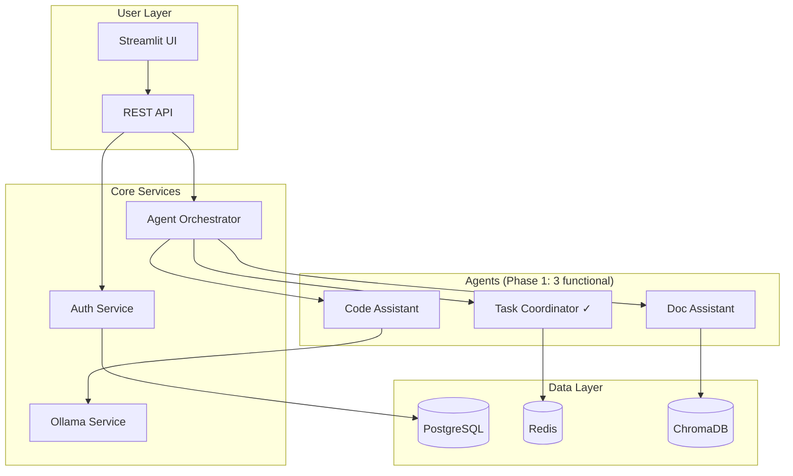

# Target State - Realistic MVP Architecture
**Target Date**: 4-6 weeks from 2025-08-08
**Philosophy**: Working simplicity over complex stubs

## Architectural Decisions

### System Architecture (Simplified)


### Core Principles
1. **Every service must have real functionality** (no stubs)
2. **Authentication required for all endpoints** (except health)
3. **UUID primary keys throughout** (no SERIAL)
4. **Environment-based configuration** (no hardcoded secrets)
5. **Comprehensive error handling** (no silent failures)

## Phase 1: Foundation (Week 1-2)

### Database Schema (UUID-based)
```sql
-- Core tables with UUID PKs
CREATE TABLE users (
    id UUID PRIMARY KEY DEFAULT gen_random_uuid(),
    email VARCHAR(255) UNIQUE NOT NULL,
    password_hash VARCHAR(255) NOT NULL,
    created_at TIMESTAMP DEFAULT NOW(),
    updated_at TIMESTAMP DEFAULT NOW()
);

CREATE TABLE agents (
    id UUID PRIMARY KEY DEFAULT gen_random_uuid(),
    name VARCHAR(100) UNIQUE NOT NULL,
    type VARCHAR(50) NOT NULL,
    status VARCHAR(20) DEFAULT 'inactive',
    capabilities JSONB,
    created_at TIMESTAMP DEFAULT NOW()
);

CREATE TABLE tasks (
    id UUID PRIMARY KEY DEFAULT gen_random_uuid(),
    user_id UUID REFERENCES users(id),
    agent_id UUID REFERENCES agents(id),
    status VARCHAR(20) DEFAULT 'pending',
    payload JSONB,
    result JSONB,
    created_at TIMESTAMP DEFAULT NOW(),
    completed_at TIMESTAMP
);

-- All foreign keys indexed
CREATE INDEX idx_tasks_user_id ON tasks(user_id);
CREATE INDEX idx_tasks_agent_id ON tasks(agent_id);
CREATE INDEX idx_tasks_status ON tasks(status);
```

### Authentication Implementation
```python
# JWT-based auth with refresh tokens
class AuthService:
    - POST /auth/register
    - POST /auth/login -> {access_token, refresh_token}
    - POST /auth/refresh
    - POST /auth/logout
    - GET /auth/me (protected)
```

### Agent Communication Protocol
```python
# Standardized message format
class AgentMessage:
    id: UUID
    type: Enum[TASK, RESULT, ERROR]
    source: AgentID
    target: AgentID
    payload: Dict
    timestamp: DateTime
    correlation_id: UUID
```

## Phase 2: Core Agents (Week 3-4)

### Three Functional Agents

#### 1. Task Coordinator (Already Complete ✅)
- Priority queue management
- Task distribution
- Status tracking
- Timeout handling

#### 2. Code Assistant Agent
```python
class CodeAssistant:
    capabilities = [
        "code_review",
        "bug_detection", 
        "refactoring_suggestions",
        "test_generation"
    ]
    
    async def process(task: Task):
        # Real implementation using tinyllama
        code = task.payload.get("code")
        analysis = await ollama.analyze(code)
        suggestions = parse_analysis(analysis)
        return {
            "suggestions": suggestions,
            "confidence": 0.7
        }
```

#### 3. Documentation Assistant
```python
class DocAssistant:
    capabilities = [
        "summarization",
        "q&a",
        "search",
        "generation"
    ]
    
    async def process(task: Task):
        # Real RAG implementation
        query = task.payload.get("query")
        embeddings = await generate_embeddings(query)
        results = await chromadb.search(embeddings)
        answer = await ollama.generate(query, context=results)
        return {
            "answer": answer,
            "sources": results
        }
```

## Phase 3: Integration (Week 5-6)

### Vector Database Integration
- Document upload endpoint
- Embedding generation pipeline  
- ChromaDB storage
- Semantic search API

### Monitoring & Observability
- Custom Grafana dashboards
- Agent performance metrics
- Task completion rates
- Error rate tracking
- Latency percentiles

### API Gateway Configuration
```yaml
# Kong routes for actual services
services:
  - name: backend-api
    url: http://backend:8000
    routes:
      - paths: ["/api/v1"]
        methods: ["GET", "POST", "PUT", "DELETE"]
    plugins:
      - name: jwt
      - name: rate-limiting
        config:
          minute: 60
      - name: request-size-limiting
        config:
          allowed_payload_size: 10
```

## Success Criteria

### Functional Requirements
- [ ] User can register and login
- [ ] User can submit tasks to agents
- [ ] Agents process tasks and return real results
- [ ] Results are persisted and retrievable
- [ ] Documents can be uploaded and searched

### Non-Functional Requirements  
- [ ] < 2 second response time (95th percentile)
- [ ] 100 concurrent users supported
- [ ] 99% uptime during business hours
- [ ] All endpoints authenticated
- [ ] Comprehensive error messages

### Quality Gates
- [ ] 80% test coverage
- [ ] No hardcoded secrets
- [ ] All SQL uses parameterized queries
- [ ] Docker images < 1GB
- [ ] Memory usage < 4GB per service

## Migration Path

### From Current to Target
1. **Day 1**: Apply UUID migration to database
2. **Day 2**: Implement JWT authentication
3. **Day 3**: Convert first stub to functional agent
4. **Week 2**: Complete core agent implementations
5. **Week 3**: Integrate vector database
6. **Week 4**: Configure Kong routes
7. **Week 5**: Performance testing
8. **Week 6**: Documentation and handoff

## Risk Mitigation

### Technical Risks
- **Risk**: tinyllama too limited
  - **Mitigation**: Design for model swapping, test with larger models
  
- **Risk**: Performance bottlenecks
  - **Mitigation**: Implement caching, optimize database queries
  
- **Risk**: Agent communication failures
  - **Mitigation**: Circuit breakers, retry logic, timeout handling

### Rollback Strategy
- Each phase independently deployable
- Feature flags for new functionality
- Database migrations reversible
- Previous version tagged and tested