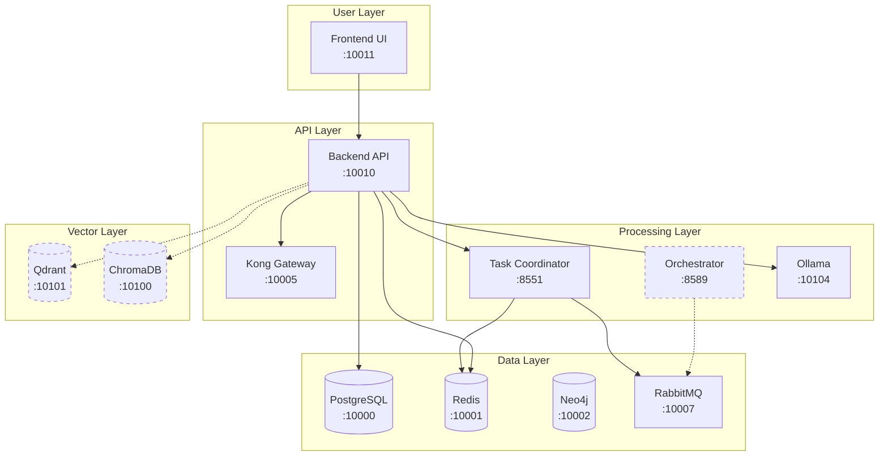

# ARCH-001 System Architecture Analysis Report
**Agent ID**: ARCH-001 (System Architect)  
**Analysis Date**: 2025-08-08  
**Report Version**: 1.0.0  
**System Version**: SutazAI v67  

## Executive Summary

SutazAI is a Docker Compose-based AI orchestration platform in Proof-of-Concept stage (~15-20% complete). The system exhibits significant architectural debt with 28 running containers out of 59 defined, fundamental misconfigurations, and critical security gaps. Only 1 of 7 agent services has functional implementation beyond health checks.

### Critical Findings
- **Model Mismatch**: Backend expects `gpt-oss` but only `tinyllama` is loaded
- **Database Schema Missing**: PostgreSQL running but completely empty
- **No Authentication**: All endpoints publicly accessible
- **Service Mesh Unconfigured**: Kong/Consul/RabbitMQ running but not integrated
- **Agent Stubs**: 6 of 7 agents return hardcoded responses

## System Component Inventory

### Core Infrastructure (Layer 1)
| Component | Technology | Status | Port | Dependencies | Issues |
|-----------|------------|--------|------|--------------|--------|
| Database | PostgreSQL 14 | ✅ Running | 10000 | None | No schema, SERIAL PKs |
| Cache | Redis 7 | ✅ Running | 10001 | None | Functional |
| Graph DB | Neo4j 5 | ✅ Running | 10002/3 | None | Not integrated |
| Message Queue | RabbitMQ | ✅ Running | 10007/8 | None | Unconfigured |
| API Gateway | Kong | ✅ Running | 10005 | None | No routes defined |
| Service Discovery | Consul | ✅ Running | 10006 | None | Not utilized |

### Application Layer (Layer 2)
| Component | Technology | Status | Port | Dependencies | Issues |
|-----------|------------|--------|------|--------------|--------|
| Backend API | FastAPI v17 | ⚠️ Degraded | 10010 | PG, Redis, Ollama | Model mismatch, no auth |
| Frontend UI | Streamlit | ⚠️ Basic | 10011 | Backend API | No error handling |
| LLM Server | Ollama | ✅ Running | 10104 | None | Only tinyllama loaded |

### Agent Services (Layer 3)
| Agent | Port | Implementation | Dependencies | Actual Function |
|-------|------|---------------|--------------|-----------------|
| Task Assignment | 8551 | ✅ Full | Redis, RabbitMQ | Priority queue, task routing |
| AI Orchestrator | 8589 | ❌ Stub | None | Health check only |
| Multi-Agent Coord | 8587 | ❌ Stub | None | Health check only |
| Resource Arbitration | 8588 | ❌ Stub | None | Health check only |
| Hardware Optimizer | 8002 | ❌ Stub | None | Health check only |
| Ollama Integration | 11015 | ❌ Stub | Ollama | Health check only |
| Metrics Exporter | 11063 | ❌ Broken | Prometheus | Crashes on startup |

### Vector Databases (Layer 4)
| Component | Technology | Status | Port | Integration | Issues |
|-----------|------------|--------|------|-------------|--------|
| Qdrant | Qdrant | ✅ Running | 10101/2 | None | Not wired to backend |
| ChromaDB | ChromaDB | ⚠️ Unstable | 10100 | None | Connection issues |
| FAISS | FAISS | ✅ Running | 10103 | None | Not integrated |

### Monitoring Stack (Layer 5)
| Component | Technology | Status | Port | Function | Issues |
|-----------|------------|--------|------|----------|--------|
| Metrics | Prometheus | ✅ Running | 10200 | Collecting | Working |
| Visualization | Grafana | ✅ Running | 10201 | Dashboards | No dashboards configured |
| Logs | Loki | ✅ Running | 10202 | Aggregation | Working |
| Alerts | AlertManager | ✅ Running | 10203 | Routing | No alerts defined |

## Dependency Matrix

### Critical Dependencies


### Dependency Issues Identified
1. **Circular Dependencies**: None found
2. **Missing Dependencies**: 
   - Backend → Authentication Service (not implemented)
   - Agents → Message Bus (partially configured)
   - Backend → Vector DBs (not wired)
3. **Version Conflicts**: None detected
4. **Hardcoded Dependencies**: 
   - Service names in configuration
   - Ports in agent code

## Architectural Conflicts

### High Priority Conflicts
| ID | Conflict | Impact | Resolution |
|----|----------|--------|------------|
| C1 | Model mismatch (gpt-oss vs tinyllama) | Backend degraded | Update config to tinyllama |
| C2 | Database schema missing | No data persistence | Apply migrations with UUIDs |
| C3 | No authentication/authorization | Security breach risk | Implement JWT + RBAC |
| C4 | Agent stubs vs claims | No AI processing | Implement real agent logic |
| C5 | Service mesh unconfigured | No routing/discovery | Configure Kong routes |

### Medium Priority Conflicts
| ID | Conflict | Impact | Resolution |
|----|----------|--------|------------|
| C6 | Vector DBs not integrated | No semantic search | Wire to backend endpoints |
| C7 | SERIAL vs UUID PKs | Scalability issues | Migrate to UUID PKs |
| C8 | Hardcoded secrets | Security risk | Move to environment vars |
| C9 | No error handling | Cascading failures | Add circuit breakers |
| C10 | No rate limiting | Resource exhaustion | Implement rate limits |

## Priority Cleanup Items

### Phase 1: Critical Foundation (1-3 days)
1. **Fix Model Configuration**
   - Update backend to use `tinyllama`
   - Add model override via environment variable
   - Test inference endpoints

2. **Apply Database Schema**
   - Create UUID-based schema
   - Run migrations
   - Add indexes for performance

3. **Implement Basic Auth**
   - JWT authentication middleware
   - Basic RBAC structure
   - Secure critical endpoints

4. **Configure Kong Gateway**
   - Define service routes
   - Add health checks
   - Enable CORS properly

### Phase 2: Core Functionality (3-5 days)
5. **Implement One Real Agent**
   - Complete AI Orchestrator implementation
   - Connect to RabbitMQ
   - Add Ollama integration

6. **Wire Vector Databases**
   - ChromaDB integration for embeddings
   - Document upload endpoint
   - Similarity search API

7. **Fix Service Communication**
   - Configure RabbitMQ exchanges
   - Implement message handlers
   - Add retry logic

### Phase 3: Stabilization (5-7 days)
8. **Add Monitoring**
   - Import Grafana dashboards
   - Configure alerts
   - Add custom metrics

9. **Implement Error Handling**
   - Circuit breakers
   - Graceful degradation
   - Structured logging

10. **Security Hardening**
    - Move secrets to .env
    - Enable TLS
    - Add input validation

## Recommended Refactoring Approach

### Architecture Pattern Recommendations
1. **Adopt Clean Architecture**
   - Separate business logic from frameworks
   - Define clear boundaries between layers
   - Use dependency injection

2. **Implement Repository Pattern**
   - Abstract data access
   - Enable testing with mocks
   - Support multiple data sources

3. **Apply CQRS for Agent Tasks**
   - Separate command and query paths
   - Enable event sourcing
   - Improve scalability

4. **Use Circuit Breaker Pattern**
   - Prevent cascading failures
   - Enable graceful degradation
   - Improve resilience

### Code Structure Improvements
```
/backend/
├── domain/           # Business logic
│   ├── entities/     # Domain models
│   ├── services/     # Domain services
│   └── events/       # Domain events
├── application/      # Use cases
│   ├── commands/     # Command handlers
│   ├── queries/      # Query handlers
│   └── dto/          # Data transfer objects
├── infrastructure/   # External concerns
│   ├── persistence/  # Database
│   ├── messaging/    # RabbitMQ
│   └── external/     # External APIs
└── presentation/     # API layer
    ├── rest/         # REST endpoints
    ├── websocket/    # WebSocket handlers
    └── middleware/   # Cross-cutting concerns
```

## Container Optimization Opportunities

### Services to Remove (31 unused)
- All fantasy AI agents (agentgpt, autogpt, etc.)
- Unused ML frameworks (tensorflow, pytorch, jax)
- Duplicate services (multiple code assistants)
- Non-integrated tools (dify, flowise, langflow)

### Services to Consolidate
1. Merge vector databases into single service
2. Combine monitoring exporters
3. Unify agent base implementations

### Resource Optimization
```yaml
# Current: 59 services, ~12GB RAM
# Target: 20 services, ~6GB RAM
# Savings: 66% reduction in containers, 50% RAM savings
```

## Migration Path

### Step 1: Stabilize Current State (Week 1)
- Fix critical bugs (model, schema, auth)
- Document actual capabilities
- Remove fantasy documentation

### Step 2: Build Core Features (Week 2)
- Implement one end-to-end flow
- Add basic agent logic
- Wire vector search

### Step 3: Harden System (Week 3)
- Add monitoring and alerts
- Implement error handling
- Security audit and fixes

### Step 4: Optimize and Scale (Week 4)
- Remove unused containers
- Optimize resource usage
- Performance tuning

## Risk Assessment

### Critical Risks
| Risk | Likelihood | Impact | Mitigation |
|------|------------|--------|------------|
| Data breach (no auth) | High | Critical | Implement auth immediately |
| System crash (no schema) | High | High | Apply migrations urgently |
| Resource exhaustion | Medium | High | Add rate limiting |
| Model failure | High | Medium | Fix configuration |

### Technical Debt Inventory
- 200+ fantasy documentation files (removed in v56)
- 31 unused service definitions
- 6 stub agent implementations
- Missing test coverage (0%)
- Hardcoded configuration values
- No CI/CD pipeline

## Recommendations

### Immediate Actions (Today)
1. Fix model configuration to use tinyllama
2. Apply database migrations with UUID PKs
3. Implement JWT authentication
4. Configure Kong with basic routes
5. Document real capabilities

### Short-term Goals (This Week)
1. Implement AI Orchestrator agent
2. Wire ChromaDB for vector search
3. Add Grafana dashboards
4. Create integration tests
5. Set up development environment

### Long-term Vision (This Month)
1. Achieve 50% test coverage
2. Implement 3 functional agents
3. Complete security hardening
4. Optimize to 20 containers
5. Create production deployment

## Conclusion

SutazAI is a promising but incomplete system requiring significant architectural work. The foundation exists (infrastructure running, monitoring available) but lacks implementation of core features. Priority should be fixing critical issues (auth, database, model) before adding new functionality.

The system can be salvaged and made functional with focused effort on:
1. Fixing fundamental misconfigurations
2. Implementing real agent logic
3. Removing architectural debt
4. Following established patterns

Estimated effort to reach MVP: 3-4 weeks with dedicated team.

---
*Generated by ARCH-001 System Architect Agent*  
*Analysis based on comprehensive review of /opt/sutazaiapp/*  
*Sources: CLAUDE.md, docker-compose.yml, actual code inspection*