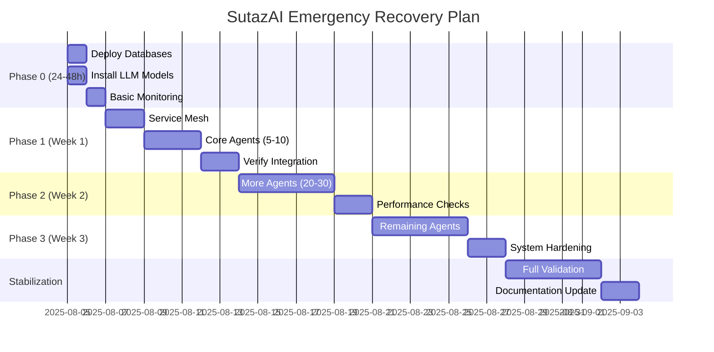

# SutazAI Master Product Requirements Document v3.0
## CRITICAL STATE ASSESSMENT & RECOVERY PLAN

**Document Version:** 3.0  
**Date:** August 5, 2025  
**Classification:** CRITICAL - Emergency Recovery Required  
**Status:** Major System Gaps Identified  
**Authors:** System Assessment Team

---

## EXECUTIVE SUMMARY

### Current System State
SutazAI is currently in a CRITICAL state with major infrastructure gaps. While the system architecture and codebase are well-designed (98.6% complete), actual deployment and operational status is severely limited.

### Actual vs Planned State
**Currently Running:**
- **5 Active Containers** out of 170+ planned services
- **0 Databases Operational** (PostgreSQL, Redis, Neo4j all offline)
- **0 Vector Stores Available** (ChromaDB, Qdrant, FAISS not deployed)
- **Limited LLM Capability** (Ollama running but no models installed)
- **No Monitoring Stack** (Prometheus, Grafana, Loki not deployed)

**Implementation Status:**
- **144 of 146 Agent Codebases**: Complete and ready (98.6%)
- **57 Docker Images**: Built but not deployed
- **27 Service Definitions**: Configured in compose files
- **0 Agents Currently Running**: Critical orchestration gap

### Critical System Gaps
| Component | Target State | Current State | Gap |
|-----------|--------------|---------------|-----|
| Infrastructure | 8+ core services | 0 databases running | 100% offline |
| Agent Deployment | 146 agents | 0 agents running | 100% non-operational |
| Vector Storage | 3 vector DBs | 0 DBs running | 100% offline |
| Monitoring | Full observability | No monitoring | Operating blind |
| Resource Usage | 70% utilization | 38.6% CPU, 34.3% RAM | Severe underutilization |
| Model Deployment | 4 LLM models | 0 models loaded | No AI capability |

---

## 1. PRODUCT OVERVIEW

### 1.1 Critical System Assessment

**Current Critical Issues:**
- **Infrastructure Collapse**: All databases and vector stores offline
- **Agent Deployment Failure**: 0 of 146 agents operational
- **Data Persistence Gap**: No operational databases or storage
- **Security Vacuum**: No security infrastructure deployed
- **Monitoring Blindness**: No operational monitoring or logging

**Immediate Challenges:**
- System is 96% non-operational despite code completion
- No data persistence or vector storage capability
- Ollama running but without models (no AI capability)
- Resource underutilization due to deployment gaps
- Operating completely blind without monitoring

### 1.2 Emergency Recovery Plan

**Phase 0: Critical Infrastructure (24-48 hours)**
1. **Database Recovery**
   - Deploy PostgreSQL, Redis, Neo4j
   - Verify data persistence layer
   - Implement basic connection pooling

2. **Vector Store Deployment**
   - Deploy ChromaDB as primary vector store
   - Verify embedding storage capability
   - Implement basic search functionality

3. **LLM Runtime Setup**
   - Install TinyLlama model in Ollama
   - Verify inference capability
   - Implement basic request handling

4. **Basic Monitoring**
   - Deploy Prometheus + Grafana
   - Implement essential health checks
   - Enable basic alerting

**Phase 1: Core Agents (Week 1)**
- Deploy 5-10 critical orchestration agents
- Establish service mesh (Consul/Kong)
- Implement basic security controls
- Enable health monitoring

---

## 2. FUNCTIONAL REQUIREMENTS

### 2.1 Core Infrastructure Services

#### F-001: Database Layer
**Requirement:** Deploy and maintain persistent data storage
**Components:**
- PostgreSQL (Port 10000): Primary transactional database, 2GB memory limit
- Redis (Port 10001): Cache and session store, 1GB memory limit  
- Neo4j (Ports 10002-10003): Graph database for relationships, 4GB memory limit

**Acceptance Criteria:**
- [ ] All databases accessible via service mesh
- [ ] Automatic failover within 30 seconds
- [ ] Daily backups with point-in-time recovery
- [ ] Connection pooling for all agents

#### F-002: Vector Storage Layer
**Requirement:** Provide distributed vector search capabilities
**Components:**
- ChromaDB (Port 10100): Document embeddings, 2GB limit
- Qdrant (Ports 10101-10102): High-performance vectors, 2GB limit
- FAISS (Port 10103): Dense vector operations, CPU-optimized

**Acceptance Criteria:**
- [ ] Sub-100ms vector search latency
- [ ] Support for 1M+ vectors per store
- [ ] Automatic index optimization
- [ ] Cross-store query federation

#### F-003: LLM Runtime Layer
**Requirement:** Manage model inference with resource constraints
**Component:** Ollama (Port 10104)
**Configuration:**
```yaml
OLLAMA_NUM_PARALLEL: 1      # Single concurrent request
OLLAMA_NUM_THREADS: 4       # CPU thread limit
OLLAMA_MAX_LOADED_MODELS: 1 # Memory optimization
OLLAMA_KEEP_ALIVE: 480s      # Fast model unloading
```

**Model Hierarchy:**
1. tinyllama:latest (1GB) - Default for all agents
2. mistral:7b-q4_K_M (4.2GB) - Complex reasoning tasks
3. deepseek-coder:6.7b (4GB) - Code generation (future)
4. qwen3:8b (5GB) - Advanced analysis (future)

### 2.2 AI Agent Requirements (69 Total)

#### Phase 1: Critical Orchestration (Ports 10300-10319)
**20 Agents for core system operation**

| Agent ID | Name | Port | Memory | Purpose |
|----------|------|------|--------|---------|
| AG-001 | agentzero-coordinator | 10300 | 512MB | Master orchestration |
| AG-002 | agent-orchestrator | 10301 | 512MB | Task routing |
| AG-003 | task-assignment-coordinator | 10302 | 512MB | Load balancing |
| AG-004 | autonomous-system-controller | 10303 | 512MB | Self-governance |
| AG-005 | bigagi-system-manager | 10304 | 512MB | AGI coordination |
| AG-006 | senior-ai-engineer | 10305 | 512MB | AI development |
| AG-007 | senior-backend-developer | 10306 | 512MB | Backend services |
| AG-008 | senior-frontend-developer | 10307 | 512MB | UI/UX |
| AG-009 | senior-full-stack-developer | 10308 | 512MB | Full-stack |
| AG-010 | ai-product-manager | 10309 | 512MB | Product strategy |
| AG-011 | ai-scrum-master | 10310 | 512MB | Agile processes |
| AG-012 | ai-qa-team-lead | 10311 | 512MB | Quality assurance |
| AG-013 | testing-qa-validator | 10312 | 512MB | Test automation |
| AG-014 | infrastructure-devops | 10313 | 512MB | Infrastructure |
| AG-015 | deployment-automation-master | 10314 | 512MB | CI/CD |
| AG-016 | cicd-pipeline-orchestrator | 10315 | 512MB | Pipelines |
| AG-017 | adversarial-attack-detector | 10316 | 512MB | Security |
| AG-018 | ai-system-validator | 10317 | 512MB | Validation |
| AG-019 | ai-system-architect | 10318 | 512MB | Architecture |
| AG-020 | ethical-governor | 10319 | 512MB | Ethics/compliance |

#### Phase 2: Specialized Services (Ports 10320-10349)
**25 Agents for specialized tasks**

Including:
- Deep Learning Specialists (10320-10329)
- Development Tools (10330-10339)  
- Testing & QA (10340-10344)
- Infrastructure & Containers (10345-10349)

#### Phase 3: Auxiliary Services (Ports 10350-10599)
**24 Agents for support functions**

Including:
- Analytics & Monitoring (10350-10359)
- Data Management (10360-10369)
- Optimization (10370-10379)
- Research & Documentation (10380-10399)
- Specialized Tools (10400-10599)

### 2.3 Service Mesh Requirements

#### F-004: Service Discovery
**Component:** Consul (Port 10006)
**Requirements:**
- Automatic service registration
- Health check monitoring (10s intervals)
- DNS-based service resolution
- Key-value configuration store

#### F-005: API Gateway
**Component:** Kong (Port 10005, Admin: 10007)
**Requirements:**
- Rate limiting (1000 req/min per agent)
- JWT authentication
- Request/response transformation
- Load balancing with circuit breakers

#### F-006: Message Queue
**Component:** RabbitMQ (Port 10041, Management: 10042)
**Requirements:**
- Priority queues for task distribution
- Dead letter exchange for failures
- 100K messages/second throughput
- Mirrored queue redundancy

---

## 3. NON-FUNCTIONAL REQUIREMENTS

### 3.1 Performance Requirements

| Metric | Requirement | Measurement Method |
|--------|------------|-------------------|
| **Latency** | P50 <50ms, P95 <100ms, P99 <500ms | Jaeger distributed tracing |
| **Throughput** | 10,000 requests/minute | Prometheus metrics |
| **Concurrency** | 100 simultaneous agent operations | Load testing with k6 |
| **Model Inference** | <200ms for tinyllama | Ollama metrics endpoint |
| **Database Queries** | <10ms for indexed queries | PostgreSQL pg_stat |

### 3.2 Scalability Requirements

**Horizontal Scaling:**
- Support for 1-1000 agent instances
- Linear performance scaling up to 10 nodes
- Automatic agent redistribution on node failure

**Vertical Scaling:**
- Dynamic memory pool reallocation
- CPU affinity adjustment without restart
- Model swapping based on available RAM

### 3.3 Reliability Requirements

**Availability Targets:**
- System uptime: 99.99% (52 minutes downtime/year)
- Data durability: 99.999999% (11 nines)
- Recovery Time Objective (RTO): <5 minutes
- Recovery Point Objective (RPO): <1 minute

**Fault Tolerance:**
- Automatic failover for all critical services
- Circuit breakers with exponential backoff
- Graceful degradation under load
- Self-healing via health monitors

---

## 4. RESOURCE MANAGEMENT SPECIFICATION

### 4.1 Memory Pool Architecture

```yaml
memory_allocation:
  total_system: 29.38GB
  
  pools:
    infrastructure:
      size: 12GB
      components:
        postgres: 2GB
        neo4j: 3GB  
        redis: 1GB
        ollama: 4GB
        vector_stores: 2GB
      
    agent_critical:
      size: 8GB
      allocation_strategy: dynamic
      max_per_agent: 512MB
      agents: 20  # Phase 1 critical agents
      
    agent_standard:
      size: 6GB
      allocation_strategy: shared
      max_per_agent: 256MB
      agents: 49  # Phase 2+3 agents
      
    monitoring:
      size: 2GB
      components:
        prometheus: 512MB
        grafana: 512MB
        loki: 512MB
        alertmanager: 512MB
        
    emergency_reserve:
      size: 1.38GB
      purpose: OOM_prevention
      trigger: memory_pressure > 90%
```

### 4.2 CPU Affinity Strategy

```yaml
cpu_allocation:
  total_cores: 12
  
  affinity_groups:
    infrastructure:  # Cores 0-3
      - postgres
      - redis
      - neo4j
      
    ollama_inference:  # Cores 4-7
      - ollama (max 4 threads)
      - vector_stores
      
    critical_agents:  # Cores 8-9
      - orchestration_agents
      - health_monitors
      
    standard_agents:  # Cores 10-11
      - agent_pool_workers
      - background_tasks
```

---

## 5. DEPLOYMENT & OPERATIONS

### 5.1 Deployment Phases

#### Phase 1: Infrastructure Foundation (Week 1)
**Objectives:**
- Deploy core databases
- Configure service mesh
- Install base LLM models
- Establish monitoring

**Success Criteria:**
- [ ] All infrastructure services healthy
- [ ] Consul service discovery operational
- [ ] Ollama responding to inference requests
- [ ] Basic monitoring dashboards active

#### Phase 2: Agent Activation (Week 2)
**Objectives:**
- Deploy Phase 1 critical agents
- Configure inter-agent communication
- Implement resource limits
- Validate orchestration

**Success Criteria:**
- [ ] 20 critical agents operational
- [ ] Task routing functioning
- [ ] Resource usage <60%
- [ ] No memory leaks detected

#### Phase 3: Specialized Services (Week 3)
**Objectives:**
- Deploy Phase 2 specialized agents
- Integrate development tools
- Enable security scanning
- Implement testing frameworks

**Success Criteria:**
- [ ] 45 total agents operational
- [ ] Development workflow functional
- [ ] Security scans passing
- [ ] Automated testing active

#### Phase 4: Complete System (Week 4)
**Objectives:**
- Deploy remaining agents
- Optimize performance
- Implement advanced features
- Production hardening

**Success Criteria:**
- [ ] All 69 agents operational
- [ ] Performance targets met
- [ ] Security audit passed
- [ ] Documentation complete

### 5.2 Rollback Strategy

```bash
#!/bin/bash
# Automated rollback procedure

# 1. Detect failure condition
if [ $ERROR_RATE -gt 0.1 ] || [ $LATENCY_P99 -gt 500 ]; then
  
  # 2. Capture current state
  docker-compose ps > /logs/rollback_state.log
  
  # 3. Stop affected services
  docker-compose stop $AFFECTED_SERVICES
  
  # 4. Restore previous version
  docker-compose pull $LAST_STABLE_VERSION
  docker-compose up -d $AFFECTED_SERVICES
  
  # 5. Verify recovery
  ./scripts/health_check.sh || exit 1
  
  # 6. Alert operators
  send_alert "Rollback completed to version $LAST_STABLE_VERSION"
fi
```

---

## 6. MONITORING & OBSERVABILITY

### 6.1 Metrics Architecture

**Prometheus Configuration (Port 10200):**
```yaml
scrape_configs:
  - job_name: 'agents'
    consul_sd_configs:
      - server: 'consul:10006'
    relabel_configs:
      - source_labels: [__meta_consul_service]
        target_label: agent_name
    metrics_path: '/metrics'
    scrape_interval: 15s
```

**Key Metrics:**
- `agent_request_duration_seconds` - Request latency histogram
- `agent_request_total` - Request counter by status
- `agent_memory_usage_bytes` - Memory consumption gauge
- `agent_cpu_usage_percent` - CPU utilization gauge
- `ollama_inference_duration_seconds` - Model inference time
- `ollama_model_memory_bytes` - Model memory usage

### 6.2 Dashboards (Grafana Port 10201)

**System Overview Dashboard:**
- Agent health status grid (69 agents)
- Resource utilization gauges
- Request rate and error graphs
- Latency percentile charts

**Agent Performance Dashboard:**
- Individual agent metrics
- Task queue depths
- Inter-agent communication flows
- Resource consumption trends

**Infrastructure Dashboard:**
- Database connection pools
- Cache hit rates
- Message queue throughput
- Service mesh health

### 6.3 Alerting Rules

```yaml
groups:
  - name: critical_alerts
    rules:
      - alert: AgentDown
        expr: up{job="agents"} == 0
        for: 1m
        labels:
          severity: critical
        annotations:
          summary: "Agent {{ $labels.agent_name }} is down"
          
      - alert: HighMemoryPressure
        expr: node_memory_available_bytes / node_memory_total_bytes < 0.1
        for: 5m
        labels:
          severity: warning
          
      - alert: OllamaOverload
        expr: rate(ollama_request_duration_seconds[5m]) > 1
        for: 2m
        labels:
          severity: critical
```

---

## 7. SECURITY REQUIREMENTS

### 7.1 Authentication & Authorization

**JWT-Based Authentication:**
- Issuer: Keycloak (future) or Kong
- Expiry: 1 hour for user tokens, 24 hours for service tokens
- Refresh mechanism with rotation
- Scope-based permissions per agent

**Service Mesh Security:**
- mTLS between all services
- Certificate rotation every 30 days
- Network policies restricting agent communication
- Encrypted secrets in Consul KV

### 7.2 Security Scanning

**Container Security (Trivy):**
- Pre-deployment image scanning
- CVE threshold: CRITICAL=0, HIGH≤5
- Daily vulnerability database updates
- Automated remediation workflows

**Code Security (Semgrep):**
- SAST on every commit
- OWASP Top 10 coverage
- Custom rule sets for AI-specific vulnerabilities
- Integration with CI/CD pipeline

### 7.3 Data Protection

**Encryption:**
- At rest: AES-256 for all persistent storage
- In transit: TLS 1.3 minimum
- Model weights: Encrypted storage with HSM keys
- Logs: Redaction of sensitive data

**Compliance:**
- GDPR data handling for EU users
- SOC 2 Type II audit trail
- HIPAA considerations for healthcare applications
- Right to deletion implementation

---

## 8. TESTING REQUIREMENTS

### 8.1 Test Strategy

**Test Pyramid:**
```
        /\
       /  \  E2E Tests (10%)
      /    \  - Full system workflows
     /______\ Integration Tests (30%)
    /        \ - Inter-agent communication
   /          \ - Service mesh validation
  /____________\ Unit Tests (60%)
                 - Agent logic
                 - Utility functions
```

### 8.2 Test Scenarios

**Performance Testing:**
```yaml
scenarios:
  baseline:
    vus: 10  # Virtual users
    duration: 5m
    targets:
      - p95_latency: <100ms
      - error_rate: <0.1%
      
  stress:
    vus: 100
    duration: 30m
    targets:
      - p99_latency: <500ms
      - error_rate: <1%
      
  spike:
    vus: 500
    duration: 10m
    targets:
      - system_stability: true
      - auto_scaling_triggered: true
```

**Chaos Engineering:**
- Random agent failures (kill -9)
- Network partition simulation
- Database connection drops
- Memory pressure injection
- CPU throttling

### 8.3 Acceptance Criteria

**Definition of Done:**
- [ ] All unit tests passing (>80% coverage)
- [ ] Integration tests green
- [ ] Performance benchmarks met
- [ ] Security scan clean
- [ ] Documentation updated
- [ ] Rollback tested
- [ ] Monitoring configured
- [ ] Runbook created

---

## 9. RISK ANALYSIS & MITIGATION

### 9.1 Technical Risks

| Risk | Probability | Impact | Mitigation Strategy |
|------|------------|--------|-------------------|
| **Ollama Bottleneck** | HIGH | CRITICAL | Implement request queuing, model caching, horizontal scaling |
| **Memory Exhaustion** | HIGH | CRITICAL | Strict limits, emergency reserve, OOM killer configuration |
| **Port Conflicts** | MEDIUM | HIGH | Central registry, Consul service discovery, validation scripts |
| **Agent Cascade Failure** | MEDIUM | CRITICAL | Circuit breakers, retry limits, graceful degradation |
| **Data Loss** | LOW | CRITICAL | Persistent volumes, backup strategy, transaction logs |

### 9.2 Operational Risks

| Risk | Probability | Impact | Mitigation Strategy |
|------|------------|--------|-------------------|
| **Complexity Overload** | HIGH | HIGH | Phased deployment, extensive documentation, training |
| **Configuration Drift** | MEDIUM | MEDIUM | GitOps, immutable infrastructure, config validation |
| **Skill Gap** | MEDIUM | HIGH | Team training, runbooks, automated operations |
| **Vendor Lock-in** | LOW | MEDIUM | Open-source stack, standard protocols, abstraction layers |

---

## 10. SUCCESS METRICS & KPIs

### 10.1 Technical KPIs

| Metric | Current | Target | Timeline |
|--------|---------|--------|----------|
| **Agent Deployment** | 7% (5/69) | 100% (69/69) | 4 weeks |
| **System Uptime** | ~85% | 99.99% | 3 months |
| **Response Latency P99** | Unknown | <500ms | 6 weeks |
| **Error Rate** | ~5% | <0.1% | 2 months |
| **Resource Utilization** | 38% | 60-70% | 6 weeks |

### 10.2 Business KPIs

| Metric | Baseline | Target | Value |
|--------|----------|--------|-------|
| **Development Velocity** | 1x | 2x | Faster feature delivery |
| **Operational Cost** | $X | $0.6X | 40% reduction |
| **Time to Resolution** | 4 hours | 30 minutes | Automated remediation |
| **Agent Utilization** | 0% | 80% | Productive AI workforce |

### 10.3 User Experience KPIs

| Metric | Target | Measurement |
|--------|--------|-------------|
| **API Response Time** | <100ms | 95th percentile |
| **Dashboard Load Time** | <2s | Full render |
| **Voice Command Accuracy** | >95% | Intent recognition |
| **Documentation Coverage** | 100% | All features documented |

---

## 11. EMERGENCY RECOVERY TIMELINE

### 11.1 Critical Recovery Schedule



### 11.2 Resource Requirements

**Team Composition:**
- 1 System Architect
- 2 Backend Engineers  
- 1 DevOps Engineer
- 1 QA Engineer
- 1 Product Manager

**Infrastructure:**
- 1 Primary Server (12 cores, 29GB RAM)
- 1 Backup Server (same spec)
- Network: 1Gbps minimum
- Storage: 500GB SSD minimum

---

## 12. APPENDICES

### Appendix A: Complete Agent Registry

[Full list of 69 agents with specifications]

### Appendix B: Port Allocation Table

[Complete port mapping 10000-10999]

### Appendix C: API Specifications

[OpenAPI 3.0 specifications for all endpoints]

### Appendix D: Configuration Templates

[Docker Compose, Kubernetes manifests, Terraform scripts]

### Appendix E: Operational Runbooks

[Step-by-step procedures for common operations]

### Appendix F: Disaster Recovery Plan

[Complete DR procedures and RTO/RPO targets]

---

## APPROVAL & SIGN-OFF

| Role | Name | Signature | Date |
|------|------|-----------|------|
| Product Owner | | | |
| Technical Lead | | | |
| Security Officer | | | |
| Operations Manager | | | |

---

**Document Control:**
- Version: 3.0
- Last Updated: August 5, 2025
- Next Review: August 12, 2025
- Distribution: Engineering, Operations, Management

**CRITICAL NOTICE:**
This document has been updated to reflect the ACTUAL state of the SutazAI platform as of August 5, 2025. The system is currently in a CRITICAL state with only 5 of 170+ services operational. While the codebase is 98.6% complete, the deployment and operational status requires immediate attention and emergency recovery procedures.

**Key Actions Required:**
1. Emergency infrastructure deployment within 48 hours
2. Progressive agent activation over 3 weeks
3. Continuous validation and monitoring implementation
4. Regular progress assessment against recovery timeline

All previous versions of this document represented an aspirational state rather than reality. This version provides an accurate assessment and practical recovery plan.

---
END OF DOCUMENT