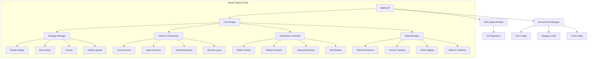

# UNIFIED DEPLOYMENT SYSTEM BLUEPRINT
## Architectural Specification for Rule #12 Compliance

**Blueprint Version:** 1.0.0  
**Architecture Type:** Modular Monolith with Plugin Architecture  
**Design Pattern:** Strategy + Command + Observer  
**Compliance:** CLAUDE.md Rule #12 - One Self-Updating Master Script  

---

## 1. SYSTEM ARCHITECTURE OVERVIEW



---

## 2. CORE ENGINE ARCHITECTURE

### 2.1 Initialization Sequence
```bash
#!/bin/bash
# Master Deployment Script - Core Engine
# Version: 6.0.0 (Rule #12 Compliant)

set -euo pipefail

# ============================================
# CORE CONSTANTS
# ============================================
readonly SCRIPT_VERSION="6.0.0"
readonly SCRIPT_DIR="$(cd "$(dirname "${BASH_SOURCE[0]}")" && pwd)"
readonly PROJECT_ROOT="$SCRIPT_DIR"
readonly STATE_DIR="$PROJECT_ROOT/.deployment"
readonly LOG_DIR="$PROJECT_ROOT/logs/deployment"
readonly LOCK_FILE="$STATE_DIR/deploy.lock"
readonly STATE_FILE="$STATE_DIR/state.json"
readonly BACKUP_DIR="$STATE_DIR/backups"

# ============================================
# CORE INITIALIZATION
# ============================================
core::init() {
    # Create required directories
    mkdir -p "$STATE_DIR" "$LOG_DIR" "$BACKUP_DIR"
    
    # Initialize logging
    log::init
    
    # Check for lock
    lock::acquire || die "Another deployment is in progress"
    
    # Trap cleanup
    trap 'cleanup::on_exit' EXIT INT TERM
    
    # Self-update check
    if [ "${SKIP_UPDATE:-false}" != "true" ]; then
        self::update
    fi
    
    # Load environment
    env::load "${ENVIRONMENT:-dev}"
    
    # Validate system
    validate::system
    
    # Load state
    state::load
}
```

### 2.2 Module Loading System
```bash
# ============================================
# MODULE LOADER
# ============================================
module::load() {
    local module_type=$1
    local module_name=$2
    local module_path="$PROJECT_ROOT/deployment/${module_type}/${module_name}.sh"
    
    if [ -f "$module_path" ]; then
        # shellcheck source=/dev/null
        source "$module_path"
        log::debug "Loaded module: ${module_type}/${module_name}"
    else
        die "Module not found: ${module_type}/${module_name}"
    fi
}

# Dynamic module loading based on requirements
module::load_required() {
    local strategy="${DEPLOY_STRATEGY:-simple}"
    local services="${DEPLOY_SERVICES:-core}"
    
    # Load strategy module
    module::load "strategies" "$strategy"
    
    # Load service modules
    for service in ${services//,/ }; do
        module::load "services" "$service"
    done
    
    # Always load operations modules
    module::load "operations" "health"
    module::load "operations" "rollback"
    module::load "operations" "cleanup"
}
```

---

## 3. DEPLOYMENT STRATEGY ARCHITECTURE

### 3.1 Strategy Interface
```bash
# ============================================
# STRATEGY INTERFACE (All strategies must implement)
# ============================================
strategy::interface() {
    # Required functions for each strategy
    strategy::validate    # Validate preconditions
    strategy::prepare     # Prepare deployment
    strategy::deploy      # Execute deployment
    strategy::verify      # Verify deployment
    strategy::switch      # Switch traffic (if applicable)
    strategy::cleanup     # Clean up old resources
    strategy::rollback    # Rollback on failure
}
```

### 3.2 Blue-Green Strategy Implementation
```bash
# deployment/strategies/blue_green.sh

# ============================================
# BLUE-GREEN DEPLOYMENT STRATEGY
# ============================================
readonly BLUE_ENV_FILE="$STATE_DIR/blue.env"
readonly GREEN_ENV_FILE="$STATE_DIR/green.env"
readonly ACTIVE_COLOR_FILE="$STATE_DIR/active_color"

strategy::validate() {
    log::info "Validating blue-green prerequisites..."
    
    # Check for sufficient resources (2x requirements)
    local required_memory=$((REQUIRED_MEMORY * 2))
    local available_memory=$(system::get_available_memory)
    
    if [ "$available_memory" -lt "$required_memory" ]; then
        die "Insufficient memory for blue-green deployment"
    fi
    
    # Verify network configuration
    network::verify_blue_green_setup || die "Network not configured for blue-green"
}

strategy::prepare() {
    log::info "Preparing blue-green deployment..."
    
    # Determine target color
    local current_color=$(strategy::get_active_color)
    local target_color=$(strategy::get_opposite_color "$current_color")
    
    log::info "Current: $current_color, Target: $target_color"
    
    # Backup current environment
    backup::create "$current_color"
    
    # Prepare target environment
    env::prepare "$target_color"
    
    # Save deployment metadata
    state::save "target_color" "$target_color"
    state::save "deployment_start" "$(date -u +%Y-%m-%dT%H:%M:%SZ)"
}

strategy::deploy() {
    local target_color=$(state::get "target_color")
    log::info "Deploying to $target_color environment..."
    
    # Deploy services to target environment
    COMPOSE_PROJECT_NAME="sutazai_${target_color}" \
    docker-compose \
        -f docker-compose.yml \
        -f "docker-compose.${target_color}.yml" \
        up -d --build --remove-orphans
    
    # Wait for services to be ready
    health::wait_for_ready "$target_color" || return 1
}

strategy::verify() {
    local target_color=$(state::get "target_color")
    log::info "Verifying $target_color deployment..."
    
    # Run smoke tests
    test::smoke "$target_color" || return 1
    
    # Run integration tests
    test::integration "$target_color" || return 1
    
    # Verify performance metrics
    metrics::verify "$target_color" || return 1
}

strategy::switch() {
    local target_color=$(state::get "target_color")
    local current_color=$(strategy::get_active_color)
    
    log::info "Switching traffic from $current_color to $target_color..."
    
    # Update load balancer configuration
    lb::switch_to "$target_color"
    
    # Verify switch
    sleep 5
    lb::verify "$target_color" || return 1
    
    # Update active color
    echo "$target_color" > "$ACTIVE_COLOR_FILE"
    
    log::success "Traffic switched to $target_color"
}

strategy::cleanup() {
    local old_color=$(state::get "previous_color")
    
    if [ -n "$old_color" ]; then
        log::info "Cleaning up $old_color environment..."
        
        # Keep running for quick rollback (configurable)
        if [ "${KEEP_OLD_ENV:-true}" = "false" ]; then
            COMPOSE_PROJECT_NAME="sutazai_${old_color}" \
            docker-compose down --remove-orphans
        else
            log::info "Keeping $old_color environment for rollback capability"
        fi
    fi
}

strategy::rollback() {
    local current_color=$(state::get "target_color")
    local previous_color=$(state::get "previous_color")
    
    log::warn "Rolling back from $current_color to $previous_color..."
    
    # Switch traffic back
    lb::switch_to "$previous_color"
    
    # Stop failed deployment
    COMPOSE_PROJECT_NAME="sutazai_${current_color}" \
    docker-compose down --remove-orphans
    
    # Update active color
    echo "$previous_color" > "$ACTIVE_COLOR_FILE"
    
    log::info "Rollback completed"
}
```

---

## 4. SERVICE ORCHESTRATION ARCHITECTURE

### 4.1 Service Module Structure
```bash
# deployment/services/core.sh

# ============================================
# CORE SERVICES MODULE
# ============================================
readonly CORE_SERVICES=(
    "postgres"
    "redis"
    "neo4j"
    "ollama"
)

service::core::deploy() {
    log::info "Deploying core services..."
    
    for service in "${CORE_SERVICES[@]}"; do
        service::deploy_single "$service" || return 1
    done
}

service::deploy_single() {
    local service=$1
    log::info "Deploying $service..."
    
    # Service-specific deployment
    case "$service" in
        postgres)
            service::postgres::deploy
            ;;
        redis)
            service::redis::deploy
            ;;
        neo4j)
            service::neo4j::deploy
            ;;
        ollama)
            service::ollama::deploy
            ;;
        *)
            die "Unknown service: $service"
            ;;
    esac
}

# PostgreSQL deployment with health checks
service::postgres::deploy() {
    # Ensure data directory exists
    mkdir -p "$PROJECT_ROOT/data/postgres"
    
    # Deploy PostgreSQL
    docker-compose up -d postgres
    
    # Wait for readiness
    health::wait_for_postgres || return 1
    
    # Run migrations if needed
    if [ "${RUN_MIGRATIONS:-true}" = "true" ]; then
        migration::postgres::run
    fi
}
```

---

## 5. STATE MANAGEMENT ARCHITECTURE

### 5.1 State Persistence System
```bash
# ============================================
# STATE MANAGEMENT
# ============================================
state::init() {
    if [ ! -f "$STATE_FILE" ]; then
        echo '{}' > "$STATE_FILE"
    fi
}

state::save() {
    local key=$1
    local value=$2
    
    # Thread-safe state update using jq
    local tmp_file=$(mktemp)
    jq --arg key "$key" --arg value "$value" \
        '.[$key] = $value' "$STATE_FILE" > "$tmp_file"
    mv "$tmp_file" "$STATE_FILE"
    
    log::debug "State saved: $key = $value"
}

state::get() {
    local key=$1
    jq -r --arg key "$key" '.[$key] // empty' "$STATE_FILE"
}

state::save_deployment() {
    local deployment_id=$(uuidgen)
    
    state::save "deployment_id" "$deployment_id"
    state::save "deployment_start" "$(date -u +%Y-%m-%dT%H:%M:%SZ)"
    state::save "deployment_version" "$VERSION"
    state::save "deployment_strategy" "$DEPLOY_STRATEGY"
    state::save "deployment_environment" "$ENVIRONMENT"
    state::save "deployment_services" "$DEPLOY_SERVICES"
    state::save "deployment_user" "${USER:-unknown}"
    state::save "deployment_host" "$(hostname)"
    
    # Create deployment record
    local deployment_record="$STATE_DIR/deployments/${deployment_id}.json"
    mkdir -p "$(dirname "$deployment_record")"
    cp "$STATE_FILE" "$deployment_record"
    
    return 0
}

state::get_last_successful() {
    local last_success_file="$STATE_DIR/last_successful.json"
    if [ -f "$last_success_file" ]; then
        cat "$last_success_file"
    else
        echo '{}'
    fi
}
```

---

## 6. SELF-UPDATE ARCHITECTURE

### 6.1 Self-Update Implementation
```bash
# ============================================
# SELF-UPDATE SYSTEM
# ============================================
self::update() {
    log::info "Checking for updates..."
    
    # Save current version
    local current_version=$SCRIPT_VERSION
    local current_hash=$(sha256sum "$0" | cut -d' ' -f1)
    
    # Fetch latest from repository
    git fetch origin main --quiet
    
    # Check if update available
    local remote_hash=$(git rev-parse origin/main:deploy.sh 2>/dev/null || echo "")
    local local_hash=$(git rev-parse HEAD:deploy.sh 2>/dev/null || echo "")
    
    if [ "$remote_hash" != "$local_hash" ] && [ -n "$remote_hash" ]; then
        log::info "Update available, applying..."
        
        # Backup current script
        cp "$0" "$BACKUP_DIR/deploy.sh.$(date +%Y%m%d_%H%M%S).backup"
        
        # Get the update
        git checkout origin/main -- deploy.sh
        
        # Verify the update
        if self::verify_update; then
            log::success "Update applied successfully"
            
            # Check if we need to restart
            local new_version=$(grep "^readonly SCRIPT_VERSION=" deploy.sh | cut -d'"' -f2)
            if [ "$new_version" != "$current_version" ]; then
                log::info "Restarting with new version $new_version..."
                exec "$0" "$@"
            fi
        else
            # Rollback on failure
            log::error "Update verification failed, rolling back"
            git checkout HEAD -- deploy.sh
            return 1
        fi
    else
        log::info "Already up to date"
    fi
}

self::verify_update() {
    # Verify script syntax
    bash -n "$0" || return 1
    
    # Verify required functions exist
    local required_functions=(
        "core::init"
        "strategy::deploy"
        "state::save"
        "health::check"
    )
    
    for func in "${required_functions[@]}"; do
        if ! declare -f "$func" > /dev/null; then
            log::error "Required function missing: $func"
            return 1
        fi
    done
    
    # Verify script signature if configured
    if [ -n "${SCRIPT_SIGNATURE_KEY:-}" ]; then
        self::verify_signature || return 1
    fi
    
    return 0
}
```

---

## 7. ERROR HANDLING & RECOVERY

### 7.1 Error Handling Architecture
```bash
# ============================================
# ERROR HANDLING SYSTEM
# ============================================
error::handler() {
    local exit_code=$1
    local line_number=$2
    local bash_lineno=$3
    local last_command=$4
    
    log::error "Command failed with exit code $exit_code"
    log::error "Line: $line_number"
    log::error "Command: $last_command"
    
    # Save error state
    state::save "last_error_code" "$exit_code"
    state::save "last_error_line" "$line_number"
    state::save "last_error_command" "$last_command"
    state::save "last_error_time" "$(date -u +%Y-%m-%dT%H:%M:%SZ)"
    
    # Trigger recovery based on context
    if [ "${AUTO_ROLLBACK:-true}" = "true" ]; then
        recovery::auto_rollback
    fi
    
    # Send alerts if configured
    if [ "${ENABLE_ALERTS:-false}" = "true" ]; then
        alert::send_failure "$exit_code" "$last_command"
    fi
    
    # Cleanup and exit
    cleanup::on_error
    exit "$exit_code"
}

# Set error trap
trap 'error::handler $? $LINENO $BASH_LINENO "$BASH_COMMAND"' ERR

recovery::auto_rollback() {
    log::warn "Initiating automatic rollback..."
    
    # Check if rollback is possible
    if strategy::can_rollback; then
        strategy::rollback
        
        if [ $? -eq 0 ]; then
            log::success "Rollback completed successfully"
            alert::send_rollback_success
        else
            log::error "Rollback failed - manual intervention required"
            alert::send_rollback_failure
        fi
    else
        log::warn "Rollback not possible in current state"
    fi
}
```

---

## 8. COMMAND LINE INTERFACE

### 8.1 CLI Architecture
```bash
# ============================================
# COMMAND LINE INTERFACE
# ============================================
cli::parse_args() {
    # Default values
    COMMAND="deploy"
    TARGET="all"
    ENVIRONMENT="dev"
    DEPLOY_STRATEGY="simple"
    
    # Parse arguments
    while [[ $# -gt 0 ]]; do
        case $1 in
            deploy|rollback|status|validate|cleanup)
                COMMAND="$1"
                ;;
            --env)
                ENVIRONMENT="$2"
                shift
                ;;
            --target)
                TARGET="$2"
                shift
                ;;
            --strategy)
                DEPLOY_STRATEGY="$2"
                shift
                ;;
            --dry-run)
                DRY_RUN=true
                ;;
            --force)
                FORCE_DEPLOY=true
                ;;
            --skip-tests)
                SKIP_TESTS=true
                ;;
            --skip-update)
                SKIP_UPDATE=true
                ;;
            --help)
                cli::show_help
                exit 0
                ;;
            *)
                die "Unknown option: $1"
                ;;
        esac
        shift
    done
}

cli::show_help() {
    cat << EOF
SutazAI Unified Deployment System
Version: $SCRIPT_VERSION

Usage: ./deploy.sh [COMMAND] [OPTIONS]

COMMANDS:
    deploy      Deploy services (default)
    rollback    Rollback to previous deployment
    status      Show deployment status
    validate    Validate configuration
    cleanup     Clean up resources

OPTIONS:
    --env ENV           Environment (dev|staging|prod) [default: dev]
    --target TARGET     Deployment target (all|core|agents|monitoring) [default: all]
    --strategy STRATEGY Deployment strategy (simple|blue-green|canary) [default: simple]
    --dry-run          Simulate deployment without making changes
    --force            Skip confirmation prompts
    --skip-tests       Skip test execution
    --skip-update      Skip self-update check
    --help             Show this help message

EXAMPLES:
    # Simple deployment to dev
    ./deploy.sh deploy --env dev
    
    # Blue-green deployment to production
    ./deploy.sh deploy --env prod --strategy blue-green
    
    # Deploy only core services
    ./deploy.sh deploy --target core
    
    # Rollback production
    ./deploy.sh rollback --env prod
    
    # Check deployment status
    ./deploy.sh status

ENVIRONMENT VARIABLES:
    SUTAZAI_ENV          Override --env option
    POSTGRES_PASSWORD    PostgreSQL password
    REDIS_PASSWORD       Redis password
    NEO4J_PASSWORD       Neo4j password
    DEBUG                Enable debug logging
    AUTO_ROLLBACK        Enable automatic rollback on failure

For more information, see /opt/sutazaiapp/IMPORTANT/docs/deployment/README.md
EOF
}
```

---

## 9. MONITORING & OBSERVABILITY

### 9.1 Metrics Collection
```bash
# ============================================
# METRICS & MONITORING
# ============================================
metrics::init() {
    # Initialize metrics file
    METRICS_FILE="$STATE_DIR/metrics/deployment_$(date +%Y%m%d_%H%M%S).json"
    mkdir -p "$(dirname "$METRICS_FILE")"
    echo '{"metrics": []}' > "$METRICS_FILE"
}

metrics::record() {
    local metric_name=$1
    local metric_value=$2
    local metric_unit=${3:-""}
    local timestamp=$(date -u +%Y-%m-%dT%H:%M:%SZ)
    
    # Append metric to file
    jq --arg name "$metric_name" \
       --arg value "$metric_value" \
       --arg unit "$metric_unit" \
       --arg timestamp "$timestamp" \
       '.metrics += [{
           name: $name,
           value: $value,
           unit: $unit,
           timestamp: $timestamp
       }]' "$METRICS_FILE" > "$METRICS_FILE.tmp"
    
    mv "$METRICS_FILE.tmp" "$METRICS_FILE"
}

metrics::export_prometheus() {
    # Export metrics in Prometheus format
    local prometheus_file="$STATE_DIR/metrics/prometheus.txt"
    
    jq -r '.metrics[] | 
        "deployment_\(.name){environment=\"'$ENVIRONMENT'\"} \(.value) \(.timestamp | fromdateiso8601)"
    ' "$METRICS_FILE" > "$prometheus_file"
    
    # Push to Prometheus pushgateway if configured
    if [ -n "${PROMETHEUS_PUSHGATEWAY:-}" ]; then
        curl -X POST \
            --data-binary "@$prometheus_file" \
            "$PROMETHEUS_PUSHGATEWAY/metrics/job/deployment/instance/$(hostname)"
    fi
}
```

---

## 10. MAIN EXECUTION FLOW

### 10.1 Main Function
```bash
# ============================================
# MAIN EXECUTION
# ============================================
main() {
    # Parse command line arguments
    cli::parse_args "$@"
    
    # Initialize core engine
    core::init
    
    # Initialize metrics
    metrics::init
    
    # Record deployment start
    metrics::record "deployment_start" "1" "boolean"
    local start_time=$(date +%s)
    
    # Load required modules
    module::load_required
    
    # Execute command
    case "$COMMAND" in
        deploy)
            execute::deploy
            ;;
        rollback)
            execute::rollback
            ;;
        status)
            execute::status
            ;;
        validate)
            execute::validate
            ;;
        cleanup)
            execute::cleanup
            ;;
        *)
            die "Unknown command: $COMMAND"
            ;;
    esac
    
    # Record deployment end
    local end_time=$(date +%s)
    local duration=$((end_time - start_time))
    metrics::record "deployment_duration" "$duration" "seconds"
    metrics::record "deployment_success" "1" "boolean"
    
    # Export metrics
    metrics::export_prometheus
    
    # Save successful state
    cp "$STATE_FILE" "$STATE_DIR/last_successful.json"
    
    log::success "Deployment completed successfully in ${duration}s"
}

execute::deploy() {
    log::phase "DEPLOYMENT STARTED"
    log::info "Environment: $ENVIRONMENT"
    log::info "Strategy: $DEPLOY_STRATEGY"
    log::info "Target: $TARGET"
    
    # Save deployment state
    state::save_deployment
    
    # Validate prerequisites
    strategy::validate
    
    # Prepare deployment
    strategy::prepare
    
    # Execute deployment
    strategy::deploy
    
    # Verify deployment
    strategy::verify
    
    # Switch traffic (if applicable)
    if declare -f strategy::switch > /dev/null; then
        strategy::switch
    fi
    
    # Cleanup old resources
    strategy::cleanup
    
    log::phase "DEPLOYMENT COMPLETED"
}

# Entry point
if [[ "${BASH_SOURCE[0]}" == "${0}" ]]; then
    main "$@"
fi
```

---

## 11. IMPLEMENTATION ROADMAP

### Phase 1: Foundation (Day 1)
- [ ] Create master deploy.sh with core engine
- [ ] Implement self-update mechanism
- [ ] Add state management system
- [ ] Set up logging framework

### Phase 2: Strategies (Day 2)
- [ ] Implement simple deployment strategy
- [ ] Port blue-green deployment logic
- [ ] Add canary deployment capability
- [ ] Create rollback system

### Phase 3: Services (Day 3)
- [ ] Create service modules for core services
- [ ] Add agent service deployments
- [ ] Integrate monitoring stack deployment
- [ ] Include security layer deployment

### Phase 4: Operations (Day 4)
- [ ] Implement comprehensive health checks
- [ ] Add self-healing capabilities
- [ ] Create cleanup routines
- [ ] Set up metrics collection

### Phase 5: Consolidation (Day 5)
- [ ] Archive old deployment scripts
- [ ] Update all references to new script
- [ ] Create compatibility symlinks
- [ ] Update documentation

---

## 12. SUCCESS METRICS

| Metric | Target | Measurement |
|--------|--------|-------------|
| Script Count | 1 | Count of deployment scripts |
| Deployment Time | <5 min | Time from start to ready |
| Rollback Time | <2 min | Time to restore previous state |
| Self-Update Success | 100% | Successful auto-updates |
| Code Duplication | <5% | Duplicate code percentage |
| Test Coverage | >80% | Automated test coverage |
| Mean Time to Recovery | <10 min | Average recovery time |
| Deployment Success Rate | >95% | Successful deployments |

---

## CONCLUSION

This architectural blueprint provides a comprehensive design for consolidating 29 deployment scripts into ONE master script that:

1. **Complies with Rule #12** - Single, self-updating deployment script
2. **Preserves valuable features** - Blue-green, monitoring, security
3. **Adds new capabilities** - Canary, self-healing, metrics
4. **Improves reliability** - State management, rollback, recovery
5. **Reduces complexity** - Modular architecture, clear interfaces

The modular architecture allows for easy extension while maintaining a single entry point, fulfilling the requirements of a professional, production-ready deployment system.

---

**Blueprint Author:** Ultra-Thinking System Architect Expert  
**Date:** 2025-08-09  
**Status:** READY FOR IMPLEMENTATION