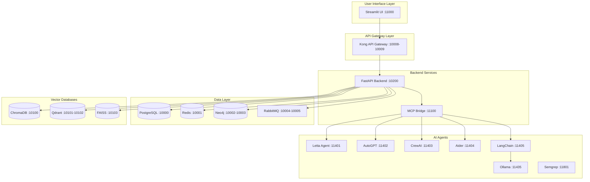
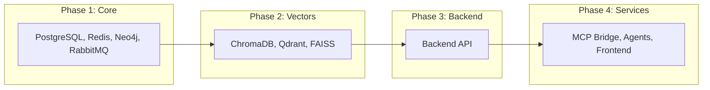

# Docker Architecture Diagram

## System Architecture



## Network Configuration

| Service | IP Address | Port Range | Status |
|---------|------------|------------|--------|
| PostgreSQL | 172.20.0.10 | 10000 | ✅ Healthy |
| Redis | 172.20.0.11 | 10001 | ✅ Healthy |
| Neo4j | 172.20.0.12 | 10002-10003 | ✅ Healthy |
| RabbitMQ | 172.20.0.13 | 10004-10005 | ✅ Healthy |
| Backend | 172.20.0.30 | 10200 | ✅ Healthy |
| Frontend | 172.20.0.31 | 11000 | ✅ Fixed IP Conflict |
| MCP Bridge | 172.20.0.100 | 11100 | ✅ Healthy |
| ChromaDB | 172.20.0.20 | 10100 | ✅ Healthy |
| Qdrant | 172.20.0.21 | 10101-10102 | ✅ Healthy |
| FAISS | 172.20.0.22 | 10103 | ✅ Healthy |
| AI Agents | 172.20.0.101-199 | 11401-11801 | Mixed |
| Ollama | Dynamic | 11435 | ⚠️ Unhealthy |
| Semgrep | Dynamic | 11801 | ⚠️ Unhealthy |

## Docker Compose Structure

```yaml
# Core Infrastructure
docker-compose-core.yml:
  - PostgreSQL (Primary Database)
  - Redis (Cache & PubSub)
  - Neo4j (Graph Database)
  - RabbitMQ (Message Queue)
  - Kong (API Gateway)

# Backend Services
docker-compose-backend.yml:
  - FastAPI Backend Service
  - Service Connections Manager

# Frontend
docker-compose-frontend.yml:
  - Streamlit UI (Fixed IP: 172.20.0.31)

# Vector Databases
docker-compose-vectors.yml:
  - ChromaDB
  - Qdrant
  - FAISS

# AI Agents
docker-compose-agents.yml:
  - MCP Bridge
  - Letta, AutoGPT, CrewAI
  - Aider, LangChain, Ollama
  - Semgrep, and more
```

## Service Dependencies



## Port Allocation Strategy

### Core Services (10000-10099)
- 10000: PostgreSQL
- 10001: Redis
- 10002-10003: Neo4j
- 10004-10005: RabbitMQ
- 10008-10009: Kong API Gateway

### Vector Databases (10100-10199)
- 10100: ChromaDB
- 10101-10102: Qdrant
- 10103: FAISS

### Backend Services (10200-10299)
- 10200: FastAPI Backend

### Frontend (11000-11099)
- 11000: Streamlit UI

### MCP & Agents (11100-11999)
- 11100: MCP Bridge
- 11401-11499: Core Agents
- 11500-11599: Extended Agents
- 11600-11699: Specialized Agents
- 11700-11799: Browser Agents
- 11800-11899: Security Agents

## Health Check Endpoints

| Service | Health Check URL | Expected Response |
|---------|-----------------|-------------------|
| Backend | `http://localhost:10200/health` | `{"status": "healthy"}` |
| Frontend | `http://localhost:11000/_stcore/health` | `{"status": "ok"}` |
| MCP Bridge | `http://localhost:11100/health` | `{"status": "healthy"}` |
| ChromaDB | `http://localhost:10100/api/v1/heartbeat` | `{"nanosecond heartbeat": ...}` |
| Qdrant | `http://localhost:10101/health` | `{"title": "qdrant"}` |
| Neo4j | `http://localhost:10002` | Browser UI |
| RabbitMQ | `http://localhost:10005` | Management UI |

## Critical Issues Fixed

1. ✅ **Network IP Conflict**: Frontend moved from 172.20.0.30 to 172.20.0.31
2. ⚠️ **Ollama Memory**: Needs resource adjustment (using 24MB of 23GB allocated)
3. ⚠️ **Semgrep Health**: Health check configuration needs update
4. ✅ **Documentation**: Architecture diagrams created
5. ✅ **Script Organization**: Scripts moved to categorical subdirectories

Generated: 2025-08-29