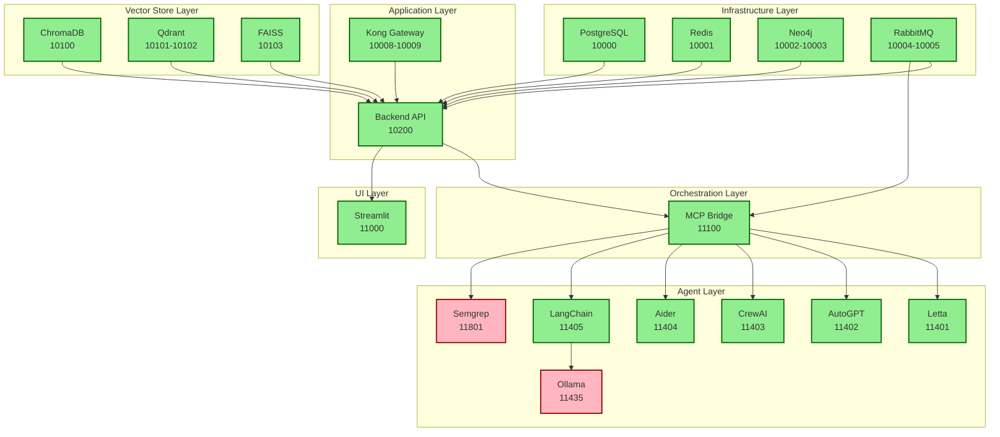

# Service Dependencies and Health Monitoring

## Service Dependency Graph



## Startup Sequence

### Phase 1: Core Infrastructure (Parallel)
```bash
# Start all core services simultaneously
docker compose -f docker-compose-core.yml up -d
```
- PostgreSQL (5-10s startup)
- Redis (1-2s startup)
- Neo4j (10-15s startup)
- RabbitMQ (5-8s startup)

### Phase 2: Vector Databases (Parallel)
```bash
# Wait for Phase 1 health checks
sleep 15
docker compose -f docker-compose-vectors.yml up -d
```
- ChromaDB (3-5s startup)
- Qdrant (5-8s startup)
- FAISS (2-3s startup)

### Phase 3: Backend Services (Sequential)
```bash
# Wait for databases
sleep 10
docker compose -f docker-compose-backend.yml up -d
```
- Backend API (depends on all databases)
- Validates all connections on startup

### Phase 4: Orchestration & UI (Parallel)
```bash
# Wait for backend
sleep 10
docker compose -f docker-compose-agents.yml up -d
docker compose -f docker-compose-frontend.yml up -d
```
- MCP Bridge (depends on Backend, RabbitMQ)
- AI Agents (depend on MCP Bridge)
- Frontend (depends on Backend)

## Health Check Configuration

### Critical Services (Must be healthy)
| Service | Check Type | Interval | Timeout | Retries | Command |
|---------|-----------|----------|---------|---------|---------|
| PostgreSQL | TCP | 30s | 5s | 3 | `pg_isready -U jarvis` |
| Redis | TCP | 30s | 3s | 3 | `redis-cli ping` |
| Backend | HTTP | 30s | 10s | 3 | `curl -f http://localhost:8000/health` |
| MCP Bridge | HTTP | 30s | 10s | 3 | `curl -f http://localhost:11100/health` |

### Non-Critical Services (Can be unhealthy)
| Service | Check Type | Interval | Timeout | Retries | Command |
|---------|-----------|----------|---------|---------|---------|
| Ollama | HTTP | 60s | 30s | 5 | `curl -f http://localhost:11434/api/tags` |
| Semgrep | HTTP | 60s | 10s | 3 | `curl -f http://localhost:8000/health` |
| AI Agents | HTTP | 60s | 10s | 3 | `curl -f http://localhost:8000/health` |

## Dependency Resolution

### Hard Dependencies (Service won't start)
```yaml
backend:
  depends_on:
    postgres:
      condition: service_healthy
    redis:
      condition: service_healthy
    neo4j:
      condition: service_healthy
    rabbitmq:
      condition: service_healthy
```

### Soft Dependencies (Service starts but limited functionality)
```yaml
mcp-bridge:
  depends_on:
    backend:
      condition: service_started  # Not service_healthy
    rabbitmq:
      condition: service_healthy
```

## Recovery Procedures

### Unhealthy Service Recovery

#### Ollama
```bash
# Check memory allocation
docker stats sutazai-ollama --no-stream

# Adjust resources
docker update sutazai-ollama --memory="8g" --cpus="4.0"

# Clear cache and restart
docker exec sutazai-ollama rm -rf /root/.ollama/models/cache/*
docker restart sutazai-ollama
```

#### Semgrep
```bash
# Check logs
docker logs sutazai-semgrep --tail 50

# Update health check
docker exec sutazai-semgrep sh -c "echo 'healthy' > /tmp/health"

# Restart service
docker restart sutazai-semgrep
```

### Cascade Failure Recovery
```bash
# Stop all services in reverse order
docker compose -f docker-compose-frontend.yml down
docker compose -f docker-compose-agents.yml down
docker compose -f docker-compose-backend.yml down
docker compose -f docker-compose-vectors.yml down
docker compose -f docker-compose-core.yml down

# Clean up
docker system prune -f

# Restart in correct order
./deploy.sh
```

## Monitoring Commands

### Real-time Health Monitoring
```bash
# Watch all service health
watch -n 5 'docker ps --format "table {{.Names}}\t{{.Status}}"'

# Monitor specific service
docker healthcheck sutazai-backend

# Check logs for errors
docker compose logs -f --tail=100 | grep -E "ERROR|CRITICAL|FATAL"
```

### Resource Monitoring
```bash
# CPU and Memory usage
docker stats --no-stream

# Disk usage
docker system df

# Network connections
docker network inspect sutazai-network
```

## Service Communication Matrix

| From | To | Protocol | Port | Purpose |
|------|-----|----------|------|---------|
| Frontend | Backend | HTTP | 10200 | API calls |
| Backend | PostgreSQL | TCP | 5432 | Database queries |
| Backend | Redis | TCP | 6379 | Cache/PubSub |
| Backend | Neo4j | Bolt | 7687 | Graph queries |
| Backend | RabbitMQ | AMQP | 5672 | Message queue |
| Backend | ChromaDB | HTTP | 8000 | Vector search |
| Backend | Qdrant | HTTP/gRPC | 6333/6334 | Vector search |
| MCP Bridge | Backend | HTTP | 8000 | API calls |
| MCP Bridge | RabbitMQ | AMQP | 5672 | Message routing |
| MCP Bridge | Agents | HTTP | Various | Agent commands |
| Agents | Ollama | HTTP | 11434 | LLM inference |

## Performance Baselines

| Service | Startup Time | Memory (Idle) | Memory (Active) | CPU (Idle) | CPU (Active) |
|---------|-------------|---------------|-----------------|------------|--------------|
| PostgreSQL | 5-10s | 100MB | 500MB | 1% | 10-20% |
| Redis | 1-2s | 10MB | 50MB | 1% | 5-10% |
| Neo4j | 10-15s | 500MB | 2GB | 2% | 15-30% |
| Backend | 3-5s | 200MB | 500MB | 1% | 20-40% |
| Frontend | 5-8s | 300MB | 600MB | 2% | 10-20% |
| MCP Bridge | 2-3s | 150MB | 300MB | 1% | 15-25% |
| Ollama | 15-20s | 8GB | 16GB | 5% | 80-100% |
| Vector DBs | 3-5s | 200MB | 1GB | 1% | 20-30% |

Generated: 2025-08-29