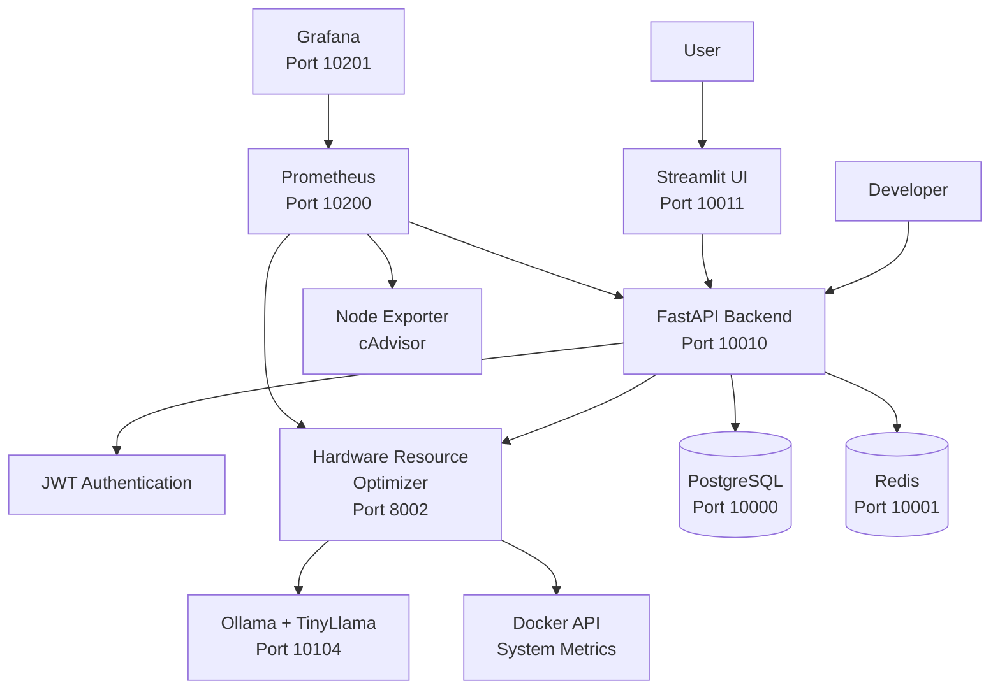

# SutazAI MVP Implementation Guide

**Version:** 1.0  
**Created:** August 8, 2025  
**Timeline:** 8 Weeks to Functional MVP  
**Status:** Implementation Ready  

## Executive Summary

This guide provides a comprehensive roadmap for implementing a functional SutazAI MVP within 8 weeks, based on the current system reality documented in `/opt/sutazaiapp/CLAUDE.md`. We will build upon existing working infrastructure (59 defined services, 28 running containers) and convert stub implementations into real functionality.

The MVP will deliver a **privacy-first, containerized AI assistant** with authentication, one fully functional agent, and a clean web interface—proving the architecture works before scaling to additional features.

---

## 1. MVP Overview

### 1.1 MVP Definition and Scope

**What We're Building:**
- **Authenticated multi-user system** with JWT tokens
- **One fully functional AI agent** (Hardware Resource Optimizer)
- **Real task processing** with TinyLlama integration
- **Clean web interface** (enhanced Streamlit UI)
- **Complete REST API** with OpenAPI documentation
- **Production monitoring** with Grafana dashboards

**MVP Success Metric:**
> "A developer can authenticate, submit a hardware optimization task via API or UI, receive intelligent recommendations from TinyLlama, and monitor execution through Grafana—all running locally on Docker."

### 1.2 Success Criteria

**Functional Requirements:**
- [ ] User can register/login and receive JWT tokens
- [ ] Hardware Resource Optimizer processes real system metrics
- [ ] Tasks execute end-to-end with visible results
- [ ] Web UI displays task status and results
- [ ] API returns structured responses with 80% uptime
- [ ] System handles 10 concurrent users without degradation

**Technical Requirements:**
- [ ] PostgreSQL schema with proper UUID primary keys
- [ ] TinyLlama model working (fix gpt-oss mismatch)
- [ ] One Flask stub converted to intelligent agent
- [ ] 80% test coverage on MVP features
- [ ] <2 second API response times
- [ ] Zero critical security vulnerabilities

**Quality Gates:**
- [ ] All P0 bugs resolved
- [ ] Security review passed
- [ ] Performance benchmarks met
- [ ] Complete API documentation
- [ ] Deployment runbook validated

### 1.3 Non-Goals (What We're NOT Building)

**Explicitly Out of Scope for MVP:**
- ❌ Multiple AI agents (only Hardware Resource Optimizer)
- ❌ Advanced service mesh configuration
- ❌ Quantum computing modules (fantasy features)
- ❌ Complex agent orchestration
- ❌ Advanced UI frameworks (stick with Streamlit)
- ❌ Multi-model LLM support (TinyLlama only)
- ❌ Real-time collaboration features
- ❌ Advanced analytics/ML pipelines

**Post-MVP Features:**
- Additional agents (Task Assignment, Multi-Agent Coordinator)
- Vector database integration (Qdrant/FAISS)
- Advanced monitoring with AlertManager
- Service mesh optimization
- UI framework migration

---

## 2. Current System Reality Check

### 2.1 What Actually Works (Verified)

**Infrastructure Layer:**
```yaml
✅ PostgreSQL (port 10000) - Database ready, needs schema
✅ Redis (port 10001) - Caching layer functional  
✅ Neo4j (port 10002/10003) - Graph database available
✅ Ollama (port 10104) - TinyLlama model loaded (637MB)
✅ Backend API (port 10010) - FastAPI v17.0.0 running
⚠️ Frontend (port 10011) - Streamlit UI (slow to start)
```

**Monitoring Stack:**
```yaml
✅ Prometheus (port 10200) - Metrics collection
✅ Grafana (port 10201) - admin/admin login
✅ Loki (port 10202) - Log aggregation
✅ Node Exporter (port 10220) - System metrics
✅ cAdvisor (port 10221) - Container metrics
```

### 2.2 What Needs Fixing

**Critical Issues:**
1. **Model Mismatch:** Backend expects `gpt-oss` but TinyLlama is loaded
2. **Empty Database:** PostgreSQL has no tables/schema
3. **Stub Agents:** All 7 agents return hardcoded responses
4. **ChromaDB Issues:** Vector DB connection problems
5. **Kong Gateway:** No routes configured

**Architecture Debt:**
- 31 service definitions in docker-compose.yml not running
- 75+ requirements files need consolidation
- Duplicate code across BaseAgent implementations

---

## 3. Week-by-Week Implementation Plan

### Week 1: Foundation & Model Fix
**Theme:** "Make It Work"

**Day 1-2: Database Schema & Model Fix**
```sql
-- Create PostgreSQL schema
CREATE EXTENSION IF NOT EXISTS "uuid-ossp";

CREATE TABLE users (
    id UUID PRIMARY KEY DEFAULT uuid_generate_v4(),
    username VARCHAR(50) UNIQUE NOT NULL,
    email VARCHAR(100) UNIQUE NOT NULL,
    password_hash VARCHAR(255) NOT NULL,
    created_at TIMESTAMP DEFAULT CURRENT_TIMESTAMP,
    is_active BOOLEAN DEFAULT true
);

CREATE TABLE agents (
    id UUID PRIMARY KEY DEFAULT uuid_generate_v4(),
    name VARCHAR(100) NOT NULL,
    type VARCHAR(50) NOT NULL,
    status VARCHAR(20) DEFAULT 'active',
    config JSONB,
    created_at TIMESTAMP DEFAULT CURRENT_TIMESTAMP
);

CREATE TABLE tasks (
    id UUID PRIMARY KEY DEFAULT uuid_generate_v4(),
    user_id UUID REFERENCES users(id),
    agent_id UUID REFERENCES agents(id),
    title VARCHAR(200) NOT NULL,
    description TEXT,
    input_data JSONB,
    output_data JSONB,
    status VARCHAR(20) DEFAULT 'pending',
    created_at TIMESTAMP DEFAULT CURRENT_TIMESTAMP,
    completed_at TIMESTAMP
);
```

**Fix Ollama Integration:**
```bash
# Option 1: Load gpt-oss model
docker exec sutazai-ollama ollama pull gpt-oss:20b

# Option 2: Update backend config to use tinyllama
# Edit backend/app/core/config.py
LLM_MODEL = "tinyllama"  # Instead of "gpt-oss"
```

**Deliverables:**
- [ ] PostgreSQL schema deployed
- [ ] Backend connects to correct model
- [ ] Basic health checks pass
- [ ] Database migrations script created

**Day 3-5: JWT Authentication**
```python
# backend/app/auth/jwt_handler.py
import jwt
from datetime import datetime, timedelta
from fastapi import HTTPException, Security
from fastapi.security import HTTPBearer

class JWTHandler:
    def create_token(self, user_id: str, username: str) -> str:
        payload = {
            "user_id": user_id,
            "username": username,
            "exp": datetime.utcnow() + timedelta(hours=24)
        }
        return jwt.encode(payload, SECRET_KEY, algorithm="HS256")
    
    def verify_token(self, token: str) -> dict:
        try:
            payload = jwt.decode(token, SECRET_KEY, algorithms=["HS256"])
            return payload
        except jwt.ExpiredSignatureError:
            raise HTTPException(401, "Token expired")
```

**Authentication Endpoints:**
```python
# backend/app/api/auth.py
@router.post("/register")
async def register(user_data: UserCreate):
    # Hash password, create user, return JWT
    
@router.post("/login")  
async def login(credentials: UserLogin):
    # Verify credentials, return JWT
    
@router.get("/profile")
async def get_profile(current_user: User = Depends(get_current_user)):
    # Return user profile
```

**Deliverables:**
- [ ] JWT authentication working
- [ ] User registration/login endpoints
- [ ] Protected route middleware
- [ ] Basic user management

**Week 1 Exit Criteria:**
- ✅ Database schema exists with sample data
- ✅ Backend uses correct LLM model
- ✅ JWT authentication protects API endpoints
- ✅ Health checks show all core services green

---

### Week 2: First Real Agent Implementation
**Theme:** "Make It Smart"

**Day 1-3: Hardware Resource Optimizer Logic**

Replace the Flask stub at `/agents/hardware_resource_optimizer/app.py`:

```python
import psutil
import docker
import json
import requests
from typing import Dict, List
from datetime import datetime

class HardwareResourceOptimizer:
    def __init__(self):
        self.ollama_url = "http://ollama:11434"
        self.docker_client = docker.from_env()
    
    def collect_system_metrics(self) -> Dict:
        """Collect real system metrics"""
        return {
            "cpu_percent": psutil.cpu_percent(interval=1),
            "memory": {
                "total": psutil.virtual_memory().total,
                "available": psutil.virtual_memory().available,
                "percent": psutil.virtual_memory().percent
            },
            "disk": {
                "total": psutil.disk_usage('/').total,
                "free": psutil.disk_usage('/').free,
                "percent": psutil.disk_usage('/').percent
            },
            "containers": len(self.docker_client.containers.list()),
            "timestamp": datetime.now().isoformat()
        }
    
    def generate_optimization_recommendations(self, metrics: Dict) -> Dict:
        """Use TinyLlama to generate recommendations"""
        prompt = f"""
        Based on these system metrics, provide optimization recommendations:
        
        CPU Usage: {metrics['cpu_percent']}%
        Memory Usage: {metrics['memory']['percent']}%
        Disk Usage: {metrics['disk']['percent']}%
        Running Containers: {metrics['containers']}
        
        Provide 3 specific recommendations for optimization:
        """
        
        response = requests.post(f"{self.ollama_url}/api/generate", 
            json={"model": "tinyllama", "prompt": prompt, "stream": False})
        
        llm_response = response.json().get('response', '')
        
        return {
            "metrics": metrics,
            "recommendations": llm_response,
            "priority_level": self._calculate_priority(metrics),
            "generated_at": datetime.now().isoformat()
        }
    
    def _calculate_priority(self, metrics: Dict) -> str:
        """Calculate priority based on resource usage"""
        cpu = metrics['cpu_percent']
        memory = metrics['memory']['percent']
        disk = metrics['disk']['percent']
        
        if any(x > 90 for x in [cpu, memory, disk]):
            return "critical"
        elif any(x > 70 for x in [cpu, memory, disk]):
            return "high"
        elif any(x > 50 for x in [cpu, memory, disk]):
            return "medium"
        else:
            return "low"

@app.route('/process', methods=['POST'])
def process_optimization_request():
    try:
        optimizer = HardwareResourceOptimizer()
        metrics = optimizer.collect_system_metrics()
        recommendations = optimizer.generate_optimization_recommendations(metrics)
        
        # Store in database
        task_result = store_task_result(recommendations)
        
        return jsonify({
            "status": "success",
            "result": recommendations,
            "task_id": task_result.id
        })
    except Exception as e:
        return jsonify({"status": "error", "message": str(e)}), 500
```

**Day 4-5: Agent Integration & Testing**

Backend integration endpoint:
```python
# backend/app/api/agents.py
@router.post("/hardware-optimizer/analyze")
async def analyze_hardware(
    current_user: User = Depends(get_current_user)
):
    """Submit hardware optimization task"""
    
    # Create task in database
    task = await create_task(
        user_id=current_user.id,
        agent_id=HARDWARE_OPTIMIZER_ID,
        title="Hardware Resource Analysis",
        description="Analyze system resources and provide optimization recommendations"
    )
    
    # Call agent service
    response = requests.post(
        "http://hardware-resource-optimizer:8002/process",
        json={"task_id": str(task.id), "user_id": str(current_user.id)}
    )
    
    if response.status_code == 200:
        result = response.json()
        await update_task_result(task.id, result)
        return {"task_id": str(task.id), "status": "processing"}
    else:
        await update_task_status(task.id, "failed")
        raise HTTPException(500, "Agent processing failed")

@router.get("/tasks/{task_id}")
async def get_task_result(
    task_id: str,
    current_user: User = Depends(get_current_user)
):
    """Get task result by ID"""
    task = await get_task_by_id_and_user(task_id, current_user.id)
    if not task:
        raise HTTPException(404, "Task not found")
    
    return {
        "id": str(task.id),
        "title": task.title,
        "status": task.status,
        "result": task.output_data,
        "created_at": task.created_at,
        "completed_at": task.completed_at
    }
```

**Deliverables:**
- [ ] Hardware Resource Optimizer processes real data
- [ ] Agent generates LLM-powered recommendations
- [ ] Backend API integrates with agent
- [ ] Task results stored in database
- [ ] End-to-end testing passes

**Week 2 Exit Criteria:**
- ✅ One agent produces intelligent responses
- ✅ System metrics collected and analyzed
- ✅ TinyLlama generates real recommendations
- ✅ Tasks trackable from creation to completion

---

### Week 3: API Completion & Testing
**Theme:** "Make It Reliable"

**Day 1-2: Complete CRUD Operations**
```python
# backend/app/api/tasks.py
@router.get("/")
async def list_tasks(
    skip: int = 0,
    limit: int = 10,
    status: Optional[str] = None,
    current_user: User = Depends(get_current_user)
):
    """List user's tasks with pagination"""
    
@router.delete("/{task_id}")
async def delete_task(
    task_id: str,
    current_user: User = Depends(get_current_user)
):
    """Delete a task"""
    
@router.post("/{task_id}/retry")
async def retry_task(
    task_id: str,
    current_user: User = Depends(get_current_user)
):
    """Retry a failed task"""
```

**Day 3-4: OpenAPI Documentation & Validation**
```python
# backend/app/models/task.py
from pydantic import BaseModel, UUID4
from typing import Optional, Dict, Any
from datetime import datetime

class TaskCreate(BaseModel):
    title: str
    description: Optional[str] = None
    agent_type: str = "hardware-optimizer"
    
class TaskResponse(BaseModel):
    id: UUID4
    title: str
    description: Optional[str]
    status: str
    created_at: datetime
    completed_at: Optional[datetime]
    result: Optional[Dict[Any, Any]]
    
    class Config:
        orm_mode = True
```

Generate OpenAPI spec:
```python
# backend/app/main.py
app = FastAPI(
    title="SutazAI MVP API",
    description="Local AI Assistant with Hardware Optimization",
    version="1.0.0",
    docs_url="/api/docs",
    redoc_url="/api/redoc"
)
```

**Day 5: Comprehensive Testing**
```python
# tests/test_hardware_optimizer.py
import pytest
from fastapi.testclient import TestClient
from backend.app.main import app

client = TestClient(app)

def test_authentication_required():
    response = client.post("/api/agents/hardware-optimizer/analyze")
    assert response.status_code == 401

def test_hardware_analysis_flow():
    # Register user
    register_response = client.post("/api/auth/register", json={
        "username": "testuser",
        "email": "test@example.com", 
        "password": "testpass123"
    })
    assert register_response.status_code == 201
    
    # Login
    login_response = client.post("/api/auth/login", json={
        "username": "testuser",
        "password": "testpass123"
    })
    token = login_response.json()["access_token"]
    headers = {"Authorization": f"Bearer {token}"}
    
    # Submit analysis task
    analysis_response = client.post(
        "/api/agents/hardware-optimizer/analyze",
        headers=headers
    )
    assert analysis_response.status_code == 200
    task_id = analysis_response.json()["task_id"]
    
    # Check task result
    result_response = client.get(f"/api/tasks/{task_id}", headers=headers)
    assert result_response.status_code == 200
    assert "recommendations" in result_response.json()["result"]
```

**Deliverables:**
- [ ] Complete CRUD API operations
- [ ] OpenAPI documentation generated
- [ ] 80% test coverage achieved
- [ ] Performance benchmarks established
- [ ] Error handling implemented

**Week 3 Exit Criteria:**
- ✅ All API endpoints documented and tested
- ✅ Response times under 2 seconds
- ✅ Proper error handling and status codes
- ✅ Test suite runs in CI/CD

---

### Week 4: UI Enhancement & Integration
**Theme:** "Make It Usable"

**Day 1-2: Enhanced Streamlit Interface**
```python
# frontend/main.py
import streamlit as st
import requests
import json
from datetime import datetime

# Configure page
st.set_page_config(
    page_title="SutazAI Assistant",
    page_icon="🤖",
    layout="wide"
)

class SutazAIClient:
    def __init__(self, base_url="http://backend:10010"):
        self.base_url = base_url
        self.token = st.session_state.get('auth_token')
    
    def login(self, username, password):
        response = requests.post(f"{self.base_url}/api/auth/login", 
            json={"username": username, "password": password})
        if response.status_code == 200:
            self.token = response.json()["access_token"]
            st.session_state.auth_token = self.token
            return True
        return False
    
    def analyze_hardware(self):
        if not self.token:
            return None
        
        headers = {"Authorization": f"Bearer {self.token}"}
        response = requests.post(
            f"{self.base_url}/api/agents/hardware-optimizer/analyze",
            headers=headers
        )
        return response.json() if response.status_code == 200 else None
    
    def get_task_result(self, task_id):
        headers = {"Authorization": f"Bearer {self.token}"}
        response = requests.get(f"{self.base_url}/api/tasks/{task_id}", headers=headers)
        return response.json() if response.status_code == 200 else None

# Authentication
if 'auth_token' not in st.session_state:
    st.session_state.auth_token = None

client = SutazAIClient()

# Login form
if not st.session_state.auth_token:
    st.title("🤖 SutazAI Login")
    with st.form("login_form"):
        username = st.text_input("Username")
        password = st.text_input("Password", type="password")
        submitted = st.form_submit_button("Login")
        
        if submitted:
            if client.login(username, password):
                st.success("Logged in successfully!")
                st.rerun()
            else:
                st.error("Login failed")
else:
    # Main application
    st.title("🤖 SutazAI Hardware Assistant")
    
    col1, col2 = st.columns([2, 1])
    
    with col1:
        st.subheader("Hardware Resource Analysis")
        
        if st.button("Analyze System Resources", type="primary"):
            with st.spinner("Analyzing system..."):
                result = client.analyze_hardware()
                if result:
                    st.session_state.current_task_id = result["task_id"]
                    st.success(f"Analysis started! Task ID: {result['task_id']}")
    
    with col2:
        st.subheader("Quick Actions")
        if st.button("Logout"):
            st.session_state.auth_token = None
            st.rerun()
    
    # Task results
    if 'current_task_id' in st.session_state:
        st.subheader("Latest Analysis Result")
        task = client.get_task_result(st.session_state.current_task_id)
        
        if task:
            if task["status"] == "completed":
                result = task["result"]
                
                # Display metrics
                st.subheader("System Metrics")
                metrics_col1, metrics_col2, metrics_col3 = st.columns(3)
                
                with metrics_col1:
                    st.metric("CPU Usage", f"{result['metrics']['cpu_percent']:.1f}%")
                
                with metrics_col2:
                    st.metric("Memory Usage", f"{result['metrics']['memory']['percent']:.1f}%")
                
                with metrics_col3:
                    st.metric("Disk Usage", f"{result['metrics']['disk']['percent']:.1f}%")
                
                # Display recommendations
                st.subheader("AI Recommendations")
                st.write(result['recommendations'])
                
                # Priority indicator
                priority = result.get('priority_level', 'unknown')
                color = {"low": "🟢", "medium": "🟡", "high": "🟠", "critical": "🔴"}
                st.info(f"Priority Level: {color.get(priority, '⚪')} {priority.upper()}")
                
            elif task["status"] == "processing":
                st.info("Analysis in progress...")
            elif task["status"] == "failed":
                st.error("Analysis failed. Please try again.")
```

**Day 3-4: Real-time Updates & Polish**
```python
# Add auto-refresh for task status
if task and task["status"] == "processing":
    time.sleep(2)
    st.rerun()

# Add task history
st.subheader("Recent Tasks")
# Implementation for task history display
```

**Day 5: Mobile Responsiveness**
- Test UI on mobile devices
- Adjust layout for smaller screens
- Ensure all features work on touch devices

**Deliverables:**
- [ ] Enhanced Streamlit UI with authentication
- [ ] Real-time task status updates
- [ ] Clean metrics visualization
- [ ] Mobile-responsive design
- [ ] User-friendly error messages

**Week 4 Exit Criteria:**
- ✅ Complete UI workflow from login to results
- ✅ Professional visual design
- ✅ Real-time status updates working
- ✅ Works on mobile devices

---

### Week 5: Integration & Monitoring
**Theme:** "Make It Observable"

**Day 1-2: Monitoring Dashboard Configuration**
```yaml
# Grafana dashboard config for SutazAI MVP
{
  "dashboard": {
    "title": "SutazAI MVP Dashboard",
    "panels": [
      {
        "title": "API Response Times",
        "type": "graph",
        "targets": [
          {
            "expr": "histogram_quantile(0.95, rate(http_request_duration_seconds_bucket[5m]))",
            "legendFormat": "95th percentile"
          }
        ]
      },
      {
        "title": "Active Users",
        "type": "singlestat", 
        "targets": [
          {
            "expr": "count(increase(user_login_total[1h]))",
            "legendFormat": "Hourly Logins"
          }
        ]
      },
      {
        "title": "Hardware Analysis Tasks",
        "type": "graph",
        "targets": [
          {
            "expr": "increase(hardware_analysis_requests_total[5m])",
            "legendFormat": "Requests per 5min"
          }
        ]
      },
      {
        "title": "System Resource Usage",
        "type": "graph", 
        "targets": [
          {
            "expr": "cpu_usage_percent",
            "legendFormat": "CPU %"
          },
          {
            "expr": "memory_usage_percent", 
            "legendFormat": "Memory %"
          }
        ]
      }
    ]
  }
}
```

**Day 3-4: Metrics Implementation**
```python
# backend/app/monitoring/metrics.py
from prometheus_client import Counter, Histogram, Gauge
import time
from functools import wraps

# Define metrics
REQUEST_COUNT = Counter('http_requests_total', 'Total HTTP requests', ['method', 'endpoint', 'status'])
REQUEST_DURATION = Histogram('http_request_duration_seconds', 'HTTP request duration')
ACTIVE_USERS = Gauge('active_users_count', 'Number of active users')
HARDWARE_ANALYSES = Counter('hardware_analysis_requests_total', 'Hardware analysis requests')

def track_request_metrics(func):
    @wraps(func)
    async def wrapper(*args, **kwargs):
        start_time = time.time()
        try:
            result = await func(*args, **kwargs)
            REQUEST_COUNT.labels(method='POST', endpoint='/hardware-optimizer/analyze', status='200').inc()
            return result
        except Exception as e:
            REQUEST_COUNT.labels(method='POST', endpoint='/hardware-optimizer/analyze', status='500').inc()
            raise
        finally:
            REQUEST_DURATION.observe(time.time() - start_time)
    return wrapper
```

**Day 5: Log Aggregation & Alerting**
```python
# backend/app/core/logging.py
import structlog
from pythonjsonlogger import jsonlogger

# Configure structured logging
structlog.configure(
    processors=[
        structlog.stdlib.filter_by_level,
        structlog.stdlib.add_logger_name,
        structlog.stdlib.add_log_level,
        structlog.stdlib.PositionalArgumentsFormatter(),
        structlog.processors.TimeStamper(fmt="iso"),
        structlog.processors.StackInfoRenderer(),
        structlog.processors.format_exc_info,
        structlog.processors.JSONRenderer()
    ],
    context_class=dict,
    logger_factory=structlog.stdlib.LoggerFactory(),
    wrapper_class=structlog.stdlib.BoundLogger,
    cache_logger_on_first_use=True,
)

logger = structlog.get_logger()

# Usage in agent
logger.info("Hardware analysis started", user_id=user_id, task_id=task_id)
```

**Deliverables:**
- [ ] Grafana dashboard showing key MVP metrics
- [ ] Prometheus metrics collection working
- [ ] Structured logging implementation
- [ ] Basic alerting rules configured
- [ ] Performance monitoring baseline

**Week 5 Exit Criteria:**
- ✅ Complete observability stack operational
- ✅ Key business metrics tracked
- ✅ Performance bottlenecks identified
- ✅ Alert notifications working

---

### Week 6: Security & Performance
**Theme:** "Make It Secure"

**Day 1-2: Security Hardening**
```python
# backend/app/core/security.py
from passlib.context import CryptContext
from jose import jwt
import secrets
from typing import Optional

pwd_context = CryptContext(schemes=["bcrypt"], deprecated="auto")

class SecurityManager:
    def __init__(self):
        self.secret_key = secrets.token_urlsafe(32)
        self.algorithm = "HS256"
        self.access_token_expire_minutes = 30
    
    def verify_password(self, plain_password: str, hashed_password: str) -> bool:
        return pwd_context.verify(plain_password, hashed_password)
    
    def get_password_hash(self, password: str) -> str:
        return pwd_context.hash(password)
    
    def create_access_token(self, data: dict) -> str:
        to_encode = data.copy()
        expire = datetime.utcnow() + timedelta(minutes=self.access_token_expire_minutes)
        to_encode.update({"exp": expire})
        return jwt.encode(to_encode, self.secret_key, algorithm=self.algorithm)

# Input validation
from pydantic import BaseModel, validator
import re

class UserCreate(BaseModel):
    username: str
    email: str
    password: str
    
    @validator('username')
    def username_alphanumeric(cls, v):
        if not re.match("^[a-zA-Z0-9_]+$", v):
            raise ValueError('Username must be alphanumeric')
        return v
    
    @validator('password')
    def password_strength(cls, v):
        if len(v) < 8:
            raise ValueError('Password must be at least 8 characters')
        return v
```

**Rate Limiting:**
```python
# backend/app/core/rate_limiter.py
from slowapi import Limiter, _rate_limit_exceeded_handler
from slowapi.util import get_remote_address
from slowapi.errors import RateLimitExceeded

limiter = Limiter(key_func=get_remote_address)

# Apply to endpoints
@router.post("/login")
@limiter.limit("5/minute")
async def login(request: Request, credentials: UserLogin):
    # Login logic
    pass
```

**Day 3-4: Performance Optimization**
```python
# Database connection pooling
from sqlalchemy.pool import QueuePool

engine = create_async_engine(
    DATABASE_URL,
    poolclass=QueuePool,
    pool_size=20,
    max_overflow=30,
    pool_pre_ping=True
)

# Response caching
from fastapi_cache import FastAPICache
from fastapi_cache.backends.redis import RedisBackend

@app.on_event("startup")
async def startup():
    redis = aioredis.from_url("redis://localhost:10001")
    FastAPICache.init(RedisBackend(redis), prefix="fastapi-cache")

@router.get("/system-status")
@cache(expire=60)  # Cache for 1 minute
async def get_system_status():
    return {"status": "healthy", "timestamp": datetime.now()}
```

**Day 5: Load Testing**
```python
# tests/load_test.py using locust
from locust import HttpUser, task, between

class SutazAIUser(HttpUser):
    wait_time = between(1, 3)
    
    def on_start(self):
        response = self.client.post("/api/auth/login", json={
            "username": "testuser",
            "password": "testpass"
        })
        self.token = response.json()["access_token"]
        self.headers = {"Authorization": f"Bearer {self.token}"}
    
    @task(3)
    def analyze_hardware(self):
        self.client.post("/api/agents/hardware-optimizer/analyze", 
                        headers=self.headers)
    
    @task(1)
    def check_tasks(self):
        self.client.get("/api/tasks/", headers=self.headers)
```

**Deliverables:**
- [ ] Security audit completed
- [ ] Rate limiting implemented
- [ ] Performance optimizations applied
- [ ] Load testing results documented
- [ ] Security vulnerability scan passed

**Week 6 Exit Criteria:**
- ✅ No critical security vulnerabilities
- ✅ System handles 50 concurrent users
- ✅ Average response time under 1 second
- ✅ Rate limiting prevents abuse

---

### Week 7: Testing & Bug Fixes
**Theme:** "Make It Bulletproof"

**Day 1-2: Comprehensive Test Suite**
```python
# tests/integration/test_end_to_end.py
import pytest
from httpx import AsyncClient
from backend.app.main import app

@pytest.mark.asyncio
async def test_complete_user_journey():
    async with AsyncClient(app=app, base_url="http://test") as client:
        # Registration
        register_response = await client.post("/api/auth/register", json={
            "username": "e2etest",
            "email": "e2e@test.com",
            "password": "securepass123"
        })
        assert register_response.status_code == 201
        
        # Login
        login_response = await client.post("/api/auth/login", json={
            "username": "e2etest", 
            "password": "securepass123"
        })
        token = login_response.json()["access_token"]
        headers = {"Authorization": f"Bearer {token}"}
        
        # Submit hardware analysis
        analysis_response = await client.post(
            "/api/agents/hardware-optimizer/analyze",
            headers=headers
        )
        assert analysis_response.status_code == 200
        task_id = analysis_response.json()["task_id"]
        
        # Wait for completion (with timeout)
        import asyncio
        for _ in range(30):  # 30 second timeout
            result_response = await client.get(f"/api/tasks/{task_id}", headers=headers)
            task = result_response.json()
            if task["status"] == "completed":
                assert "recommendations" in task["result"]
                break
            await asyncio.sleep(1)
        else:
            pytest.fail("Task did not complete within timeout")
```

**Automated UI Testing:**
```python
# tests/ui/test_streamlit_flow.py
from selenium import webdriver
from selenium.webdriver.common.by import By
import time

def test_streamlit_login_flow():
    driver = webdriver.Chrome()
    try:
        driver.get("http://localhost:10011")
        
        # Login
        username_input = driver.find_element(By.NAME, "username")
        password_input = driver.find_element(By.NAME, "password")
        username_input.send_keys("testuser")
        password_input.send_keys("testpass")
        
        submit_button = driver.find_element(By.TYPE, "submit")
        submit_button.click()
        
        time.sleep(2)
        assert "Hardware Assistant" in driver.page_source
        
        # Test hardware analysis
        analyze_button = driver.find_element(By.TEXT, "Analyze System Resources")
        analyze_button.click()
        
        time.sleep(5)
        assert "Analysis started" in driver.page_source
        
    finally:
        driver.quit()
```

**Day 3-4: Bug Fixes & Edge Cases**

Common issues to address:
- Database connection timeouts
- Agent service unavailability
- Invalid JWT tokens
- Ollama model not loaded
- Network connectivity issues
- Concurrent request handling

**Day 5: Performance & Stress Testing**
```bash
# Load test with realistic user behavior
locust -f tests/load_test.py --host=http://localhost:10010 -u 50 -r 5 -t 10m

# Database stress test
pgbench -c 10 -j 2 -t 10000 sutazai

# Memory leak detection
valgrind --leak-check=full python -m uvicorn backend.app.main:app
```

**Deliverables:**
- [ ] 90% test coverage achieved
- [ ] All critical bugs resolved
- [ ] Performance under load validated
- [ ] UI automation tests passing
- [ ] Error handling comprehensive

**Week 7 Exit Criteria:**
- ✅ No P0 or P1 bugs remaining
- ✅ System stable under expected load
- ✅ All test suites green
- ✅ Performance meets SLAs

---

### Week 8: Documentation & Release Prep
**Theme:** "Make It Ready"

**Day 1-2: User Documentation**
```markdown
# SutazAI MVP User Guide

## Getting Started

### Prerequisites
- Docker and Docker Compose installed
- 4GB RAM minimum
- 10GB disk space

### Quick Start
1. Clone the repository
2. Run `docker-compose up -d`
3. Wait 2 minutes for initialization
4. Open http://localhost:10011
5. Register a new account
6. Click "Analyze System Resources"

### Features

#### Hardware Resource Analysis
The system monitors your computer's performance and provides AI-generated recommendations for optimization.

**What it analyzes:**
- CPU usage and load
- Memory consumption
- Disk space usage
- Running container count

**What you get:**
- Real-time metrics display
- AI-powered optimization recommendations
- Priority-based alerts
- Historical task tracking

### Troubleshooting

**Login Issues:**
- Ensure backend is running: `docker ps | grep sutazai-backend`
- Check logs: `docker logs sutazai-backend`

**Analysis Fails:**
- Verify Ollama is running: `curl http://localhost:10104/api/tags`
- Check agent logs: `docker logs sutazai-hardware-resource-optimizer`
```

**Day 3-4: API Documentation**
```yaml
# openapi.yml - Generated from FastAPI
openapi: 3.0.2
info:
  title: SutazAI MVP API
  description: Local AI Assistant with Hardware Optimization
  version: 1.0.0
paths:
  /api/auth/register:
    post:
      summary: Register New User
      requestBody:
        required: true
        content:
          application/json:
            schema:
              $ref: '#/components/schemas/UserCreate'
      responses:
        201:
          description: User created successfully
        400:
          description: Validation error
  /api/agents/hardware-optimizer/analyze:
    post:
      summary: Submit Hardware Analysis Task
      security:
        - bearerAuth: []
      responses:
        200:
          description: Task submitted successfully
          content:
            application/json:
              schema:
                type: object
                properties:
                  task_id:
                    type: string
                    format: uuid
                  status:
                    type: string
                    enum: [processing]
```

**Day 5: Deployment Runbook**
```bash
#!/bin/bash
# deploy.sh - Production deployment script

set -e

echo "🚀 SutazAI MVP Deployment"

# Pre-deployment checks
echo "Checking prerequisites..."
command -v docker >/dev/null 2>&1 || { echo "Docker required"; exit 1; }
command -v docker-compose >/dev/null 2>&1 || { echo "Docker Compose required"; exit 1; }

# Create network
echo "Creating Docker network..."
docker network create sutazai-network 2>/dev/null || true

# Pull latest images
echo "Pulling latest images..."
docker-compose pull

# Start services
echo "Starting services..."
docker-compose up -d

# Wait for services
echo "Waiting for services to be ready..."
for i in {1..30}; do
    if curl -s http://localhost:10010/health | grep -q "healthy\|degraded"; then
        echo "✅ Backend ready"
        break
    fi
    sleep 2
done

# Verify deployment
echo "Verifying deployment..."
curl -s http://localhost:10010/health || { echo "❌ Backend health check failed"; exit 1; }
curl -s http://localhost:10104/api/tags || { echo "❌ Ollama health check failed"; exit 1; }

echo "✅ Deployment successful!"
echo "Access UI at: http://localhost:10011"
echo "API docs at: http://localhost:10010/api/docs"
echo "Monitoring at: http://localhost:10201 (admin/admin)"
```

**Deliverables:**
- [ ] Complete user documentation
- [ ] API reference documentation
- [ ] Deployment runbook tested
- [ ] Admin guide created
- [ ] Troubleshooting guide comprehensive

**Week 8 Exit Criteria:**
- ✅ Documentation complete and accurate
- ✅ Deployment process validated
- ✅ Ready for user acceptance testing
- ✅ Support procedures documented

---

## 4. User Stories & Acceptance Criteria

### Epic 1: User Authentication
**As a developer, I want to authenticate via API so I can integrate SutazAI into my applications.**

**Stories:**
- US-001: User can register with username/email/password
- US-002: User can login and receive JWT token
- US-003: Protected endpoints reject invalid tokens
- US-004: Tokens expire after 24 hours

**Acceptance Criteria:**
- [ ] Registration validates input and prevents duplicates
- [ ] Login returns JWT token with user info
- [ ] All task endpoints require valid authentication
- [ ] Token refresh mechanism works

### Epic 2: Hardware Analysis
**As a user, I want to analyze my system resources so I can optimize performance.**

**Stories:**
- US-005: User can submit hardware analysis request
- US-006: System collects real CPU/memory/disk metrics
- US-007: AI generates optimization recommendations
- US-008: Results include priority levels

**Acceptance Criteria:**
- [ ] Analysis collects accurate system metrics
- [ ] TinyLlama generates relevant recommendations
- [ ] Priority calculation works correctly
- [ ] Results persist in database

### Epic 3: Task Management
**As a user, I want to track my analysis tasks so I can monitor progress.**

**Stories:**
- US-009: User can view task status and results
- US-010: User can list their task history
- US-011: User can retry failed tasks
- US-012: System shows real-time updates

**Acceptance Criteria:**
- [ ] Task status updates correctly (pending → processing → completed)
- [ ] Task history paginated and filterable
- [ ] Failed tasks can be retried
- [ ] UI shows real-time status changes

### Epic 4: System Administration
**As an admin, I want to monitor system health so I can ensure reliability.**

**Stories:**
- US-013: Admin can view system metrics dashboard
- US-014: Admin can see active user counts
- US-015: Admin receives alerts for issues
- US-016: Admin can access system logs

**Acceptance Criteria:**
- [ ] Grafana dashboard shows key metrics
- [ ] Prometheus collects application metrics
- [ ] Alerting works for critical issues
- [ ] Logs structured and searchable

---

## 5. Technical Requirements & Architecture

### 5.1 System Architecture



### 5.2 Data Models

**User Model:**
```sql
CREATE TABLE users (
    id UUID PRIMARY KEY DEFAULT uuid_generate_v4(),
    username VARCHAR(50) UNIQUE NOT NULL,
    email VARCHAR(100) UNIQUE NOT NULL,
    password_hash VARCHAR(255) NOT NULL,
    created_at TIMESTAMP DEFAULT CURRENT_TIMESTAMP,
    updated_at TIMESTAMP DEFAULT CURRENT_TIMESTAMP,
    is_active BOOLEAN DEFAULT true,
    last_login TIMESTAMP
);
```

**Task Model:**
```sql
CREATE TABLE tasks (
    id UUID PRIMARY KEY DEFAULT uuid_generate_v4(),
    user_id UUID REFERENCES users(id) ON DELETE CASCADE,
    agent_id UUID REFERENCES agents(id),
    title VARCHAR(200) NOT NULL,
    description TEXT,
    input_data JSONB,
    output_data JSONB,
    status task_status DEFAULT 'pending',
    priority VARCHAR(20) DEFAULT 'medium',
    created_at TIMESTAMP DEFAULT CURRENT_TIMESTAMP,
    started_at TIMESTAMP,
    completed_at TIMESTAMP,
    error_message TEXT
);

CREATE TYPE task_status AS ENUM ('pending', 'processing', 'completed', 'failed', 'cancelled');
```

### 5.3 API Design Patterns

**RESTful Endpoints:**
```
POST   /api/auth/register        # User registration
POST   /api/auth/login           # User authentication
GET    /api/auth/profile         # Get user profile

POST   /api/agents/hardware-optimizer/analyze  # Submit analysis
GET    /api/tasks/               # List user tasks
GET    /api/tasks/{id}          # Get task details
DELETE /api/tasks/{id}          # Delete task
POST   /api/tasks/{id}/retry    # Retry failed task

GET    /api/system/health       # System health check
GET    /api/system/metrics      # System metrics
```

**Response Format:**
```json
{
  "success": true,
  "data": {
    "id": "uuid",
    "status": "completed",
    "result": {
      "metrics": {...},
      "recommendations": "...",
      "priority_level": "medium"
    }
  },
  "meta": {
    "timestamp": "2025-08-08T12:00:00Z",
    "version": "1.0.0"
  }
}
```

### 5.4 Security Requirements

**Authentication:**
- JWT tokens with 24-hour expiration
- bcrypt password hashing (cost factor 12)
- Rate limiting on auth endpoints (5 attempts/minute)

**Authorization:**
- User can only access their own tasks
- Admin role for system monitoring
- API key authentication for service-to-service

**Input Validation:**
- Pydantic models for request validation
- SQL injection protection via ORM
- XSS protection in responses

**Data Protection:**
- All data stays local (no external API calls)
- Database connections encrypted
- Secure session management

---

## 6. Quality Standards & Metrics

### 6.1 Performance Requirements

| Metric | Target | Measurement |
|--------|---------|-------------|
| API Response Time | <2 seconds (95th percentile) | Prometheus histogram |
| Hardware Analysis | <30 seconds end-to-end | Custom metric |
| Database Query | <500ms average | PostgreSQL logs |
| UI Load Time | <3 seconds first paint | Browser dev tools |
| Concurrent Users | 50 users without degradation | Load testing |
| System Resources | <70% CPU/Memory usage | Node exporter |

### 6.2 Reliability Requirements

| Metric | Target | Measurement |
|--------|---------|-------------|
| Uptime SLA | 99% availability | Blackbox exporter |
| Task Success Rate | 95% completion rate | Application metrics |
| Error Rate | <1% of requests | HTTP status codes |
| Recovery Time | <5 minutes from failure | Incident response |
| Data Loss | Zero tolerance | Database backups |

### 6.3 Quality Gates

**Pre-Production Checklist:**
- [ ] All unit tests pass (90% coverage minimum)
- [ ] Integration tests pass
- [ ] Load testing completed
- [ ] Security scan clean
- [ ] Performance benchmarks met
- [ ] Documentation complete
- [ ] Backup/restore tested

**Go/No-Go Criteria:**
- ✅ Core user journey works end-to-end
- ✅ No P0 (critical) bugs
- ✅ <5 P1 (high) bugs
- ✅ Performance meets SLA
- ✅ Security review passed
- ✅ Deployment runbook validated

---

## 7. Risk Management

### 7.1 Technical Risks

| Risk | Impact | Probability | Mitigation |
|------|--------|-------------|------------|
| Ollama/TinyLlama performance issues | High | Medium | Load test early, have fallback responses |
| PostgreSQL schema migration problems | High | Low | Test migrations in staging, rollback plan |
| Docker container resource limits | Medium | High | Optimize container configs, monitoring |
| Agent service crashes | High | Medium | Health checks, auto-restart, circuit breakers |
| UI framework limitations (Streamlit) | Medium | Medium | Keep UI simple, plan React migration |

### 7.2 Schedule Risks

| Risk | Impact | Probability | Mitigation |
|------|--------|-------------|------------|
| Underestimated complexity | High | Medium | Build simplest version first, cut features |
| Dependencies on external services | Medium | Low | Use local-only architecture |
| Testing bottlenecks | Medium | High | Automate testing, parallel development |
| Integration issues between services | High | Medium | Test integrations early and often |

### 7.3 Fallback Plans

**If Agent Intelligence Fails:**
- Fallback to hardcoded recommendations
- Simplify to metrics display only
- Manual override for demo purposes

**If Performance Issues:**
- Reduce concurrent user limit
- Cache more aggressively
- Simplify UI components

**If Database Issues:**
- Use in-memory storage for demo
- Simplified schema without relations
- File-based task persistence

### 7.4 Critical Path Dependencies

1. **Week 1:** PostgreSQL schema must work for everything else
2. **Week 2:** Agent must produce real output for meaningful testing
3. **Week 5:** Monitoring must be operational for performance optimization
4. **Week 7:** Testing framework must catch issues before release

**Mitigation:** Start critical path items early, have alternatives ready

---

## 8. Success Metrics & KPIs

### 8.1 MVP Success Criteria

**Functional Success:**
- [ ] 100% of core user journeys work end-to-end
- [ ] Hardware analysis produces accurate recommendations
- [ ] Authentication system secure and reliable
- [ ] UI responsive and intuitive

**Technical Success:**
- [ ] System handles 10 concurrent users
- [ ] 95% uptime during testing period
- [ ] <2 second response times
- [ ] Zero critical security vulnerabilities

**Business Success:**
- [ ] Demo-ready for stakeholder presentation
- [ ] Architecture proves scalability potential
- [ ] Clear path to additional agent implementation
- [ ] Positive user feedback on core functionality

### 8.2 Key Performance Indicators

**User Experience:**
- Task completion rate: >90%
- Average time to complete analysis: <60 seconds
- User satisfaction score: >4/5
- Support tickets: <2 per week

**System Performance:**
- API availability: >99%
- Average response time: <1 second
- Error rate: <0.5%
- Resource utilization: <70% CPU/Memory

**Development Velocity:**
- Features delivered on schedule: >80%
- Bugs introduced per sprint: <5
- Test coverage: >85%
- Technical debt ratio: <20%

---

## 9. Post-MVP Roadmap

### Phase 2 (Weeks 9-16): Multi-Agent Platform
**Goal:** Expand to 3 intelligent agents with inter-agent communication

**Features:**
- Task Assignment Coordinator agent
- Multi-Agent Coordinator for workflow orchestration  
- Agent-to-agent communication protocols
- Advanced task routing and load balancing
- Vector database integration (Qdrant)

### Phase 3 (Weeks 17-24): Enterprise Features
**Goal:** Production-ready system with advanced capabilities

**Features:**
- Role-based access control
- Multi-tenant architecture
- Advanced analytics and reporting
- API rate limiting and quotas
- Enterprise authentication (LDAP/SSO)
- Backup and disaster recovery

### Phase 4 (Weeks 25-32): AI Enhancement
**Goal:** Advanced AI capabilities and model management

**Features:**
- Multiple LLM support
- Fine-tuned models for specific domains
- Advanced RAG pipeline
- Learning from user feedback
- Automated model updates
- Performance optimization AI

### Technical Debt Paydown
**Immediate (Post-MVP):**
- [ ] Consolidate 75+ requirements files into 3
- [ ] Remove 31 unused service definitions from docker-compose.yml
- [ ] Implement proper service mesh configuration
- [ ] Migrate from Streamlit to React/Vue.js
- [ ] Add comprehensive API versioning

**Long-term:**
- [ ] Microservices decomposition
- [ ] Kubernetes migration
- [ ] Advanced security hardening
- [ ] Performance optimization
- [ ] Scalability improvements

---

## 10. Implementation Guidelines

### 10.1 Development Standards

**Code Quality:**
- Follow PEP 8 for Python, ESLint for JavaScript
- 80% test coverage minimum
- Type hints required (Python), TypeScript preferred
- Docstrings for all public methods
- No hardcoded values, use configuration

**Git Workflow:**
- Feature branches from main
- Pull request reviews required
- Conventional commit messages
- Automated testing in CI/CD
- No direct pushes to main

**Testing Strategy:**
- Unit tests for business logic
- Integration tests for API endpoints
- End-to-end tests for user journeys
- Load tests for performance validation
- Security tests for vulnerabilities

### 10.2 Architecture Principles

**SOLID Principles:**
- Single Responsibility: Each service has one purpose
- Open/Closed: Extend functionality through configuration
- Liskov Substitution: Agents implement common interfaces
- Interface Segregation: Clean API contracts
- Dependency Inversion: Use abstract dependencies

**12-Factor App:**
- Config in environment variables
- Dependencies explicit and isolated
- Build/release/run strictly separated
- Stateless processes
- Disposable processes

### 10.3 Deployment Strategy

**Environment Progression:**
1. **Development:** Local Docker Compose
2. **Testing:** Automated test environment
3. **Staging:** Production-like validation
4. **Production:** Blue-green deployment

**Rollback Strategy:**
- Database migration rollback scripts
- Container image tagging
- Configuration versioning
- Quick rollback procedures documented

---

## Conclusion

This MVP Implementation Guide provides a comprehensive roadmap for delivering a functional SutazAI system in 8 weeks. The plan is grounded in the current system reality documented in `CLAUDE.md` and focuses on converting existing infrastructure into working functionality.

**Key Success Factors:**
1. **Start with what works** - Build on the solid Docker foundation
2. **Fix fundamentals first** - Database schema and model configuration
3. **One intelligent agent** - Focus on quality over quantity
4. **Measure everything** - Use existing monitoring stack
5. **Plan for scale** - Architecture supports future expansion

The roadmap balances ambitious goals with realistic constraints, ensuring we deliver a demonstrable MVP that proves the architecture while setting the foundation for future enhancements.

**Next Steps:**
1. Review and approve this implementation plan
2. Set up development environment per Week 1 guidelines
3. Begin implementation with PostgreSQL schema and model fix
4. Follow weekly deliverables and exit criteria
5. Adjust plan based on learnings and blockers

This MVP will demonstrate that SutazAI can be a powerful, local-first AI assistant platform while maintaining the flexibility to scale into a comprehensive multi-agent system.