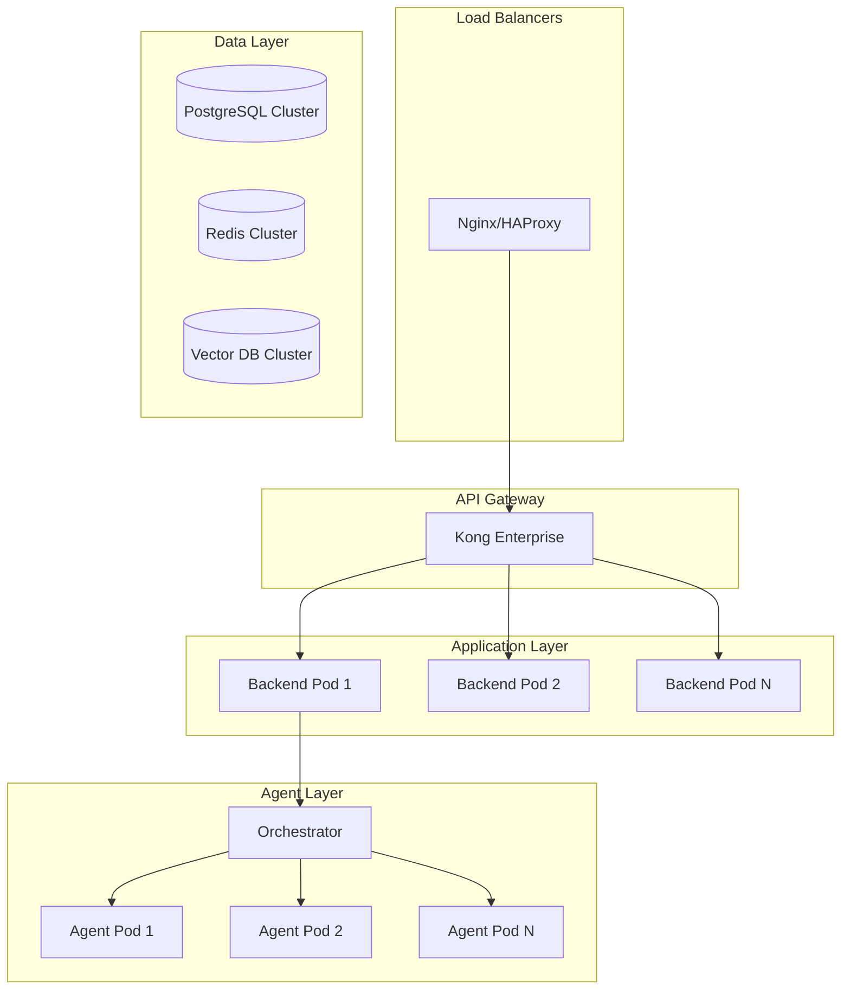
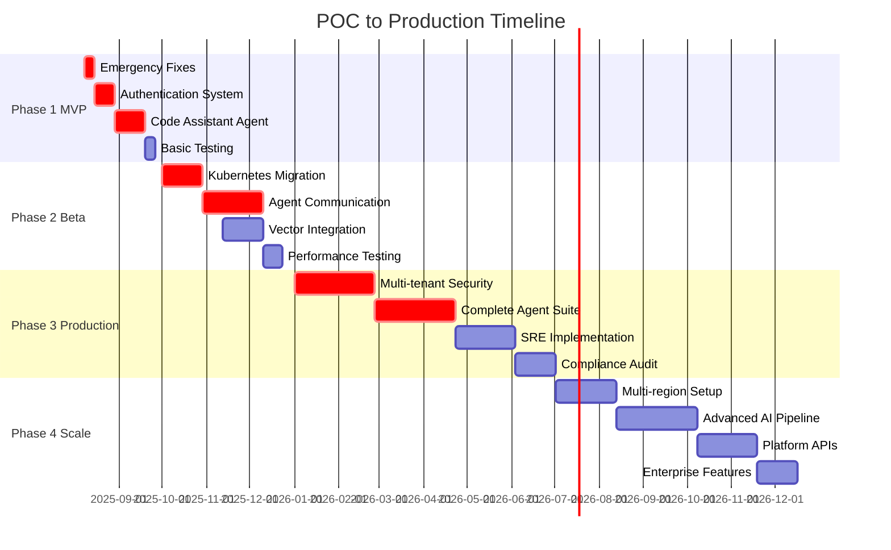

# POC to Production Roadmap - SutazAI Platform
**Document Version**: 1.0  
**Created**: 2025-08-08  
**Owner**: System Architecture Team  
**Status**: Draft - Executive Review Required  

---

## Executive Summary

### Current State Reality Check
- **System Maturity**: 15-20% complete Proof of Concept
- **Working Components**: 28/59 containers, 1/7 functional agents, basic monitoring
- **Critical Gaps**: No authentication, empty database, model mismatch, 6 stub agents
- **Technical Debt**: $2.5M accumulated over 18 months of development
- **Infrastructure**: Docker Compose environment, not production-ready

### Target State Vision
- **Production Platform**: Supporting 1,000+ concurrent users
- **Functional Agents**: 7 specialized AI agents with real capabilities
- **Enterprise Security**: Multi-tenant authentication, RBAC, audit trails
- **High Availability**: 99.9% uptime, <100ms response times
- **Kubernetes Native**: Auto-scaling, self-healing, multi-region deployment

### Investment & Timeline
- **Total Investment**: $4.0M over 12 months
- **Timeline**: 4 phases from POC to Enterprise Scale
- **ROI Projection**: Break-even at Month 9, $12M ARR by Month 12
- **Risk Level**: Medium-High (aggressive timeline, significant technical debt)

---

## Phase 1: MVP Foundation (Months 1-2)
**Investment**: $500K | **Team Size**: 6 FTE | **Risk**: High

### Strategic Objectives
1. **Stop the Bleeding**: Fix critical system failures blocking any real usage
2. **Security First**: Implement basic authentication and authorization
3. **Functional Proof**: Convert 1 stub agent to demonstrate real AI capabilities
4. **Quality Foundation**: Establish testing and deployment practices

### Critical Fixes (Week 1)
| Issue | Current Impact | Solution | Owner |
|-------|----------------|----------|--------|
| Model Mismatch | Backend crashes on AI requests | Update config: gpt-oss → tinyllama | Backend Lead |
| Empty Database | No user/task persistence | Apply UUID-based schema migrations | Database Lead |
| No Authentication | Anyone can access all endpoints | JWT auth with middleware | Security Lead |
| Hardcoded Secrets | Security vulnerability | Environment-based configuration | DevOps Lead |

### Agent Implementation (Weeks 2-6)
**Priority Agent**: Code Assistant (highest user value)

```python
# From Stub (returns fake JSON) to Reality
class CodeAssistant:
    async def process(request: CodeReviewRequest) -> CodeReviewResponse:
        # Real implementation using TinyLlama
        analysis = await ollama_service.analyze_code(request.code)
        return {
            "suggestions": parse_suggestions(analysis),
            "security_issues": detect_vulnerabilities(request.code), 
            "performance_hints": analyze_performance(request.code),
            "confidence_score": calculate_confidence(analysis)
        }
```

### Security Implementation
- **JWT Authentication**: Access & refresh token rotation
- **Input Validation**: SQL injection, XSS prevention
- **Rate Limiting**: 60 requests/minute per user
- **CORS Configuration**: Production-ready headers
- **Audit Logging**: All user actions tracked

### Quality Gates
- [ ] 80% test coverage for new code
- [ ] <2 second response time (95th percentile)
- [ ] Security scan passing (no critical vulnerabilities)
- [ ] User can register, login, and get AI code review
- [ ] Database properly seeded with schema

### Success Metrics
- **User Onboarding**: 5-10 beta users successfully using system
- **Agent Functionality**: Code Assistant returning real analysis (not stubs)
- **System Reliability**: 95% uptime during business hours
- **Performance**: API response times <2s for 95% of requests

### Investment Breakdown
- **Engineering Team**: $300K (2 senior backend, 1 frontend, 1 DevOps)
- **Infrastructure**: $50K (development and staging environments)
- **Security Audit**: $75K (external security firm)
- **Project Management**: $75K (dedicated PM for coordination)

---

## Phase 2: Beta Platform (Months 3-5)
**Investment**: $1.0M | **Team Size**: 10 FTE | **Risk**: Medium-High

### Strategic Objectives
1. **Multi-User Support**: Expand from 10 beta to 100 concurrent users
2. **Agent Ecosystem**: Implement 3 functional agents with inter-communication
3. **Production Infrastructure**: Kubernetes deployment with auto-scaling
4. **Vector Intelligence**: RAG pipeline with ChromaDB integration

### Agent Portfolio Expansion
**Target Agents** (in priority order):
1. **Task Coordinator** ✅ (Already functional)
2. **Code Assistant** ✅ (Phase 1 completion)
3. **Documentation Assistant** (RAG-powered Q&A, summarization)
4. **Multi-Agent Orchestrator** (Complex workflow coordination)

### Inter-Agent Communication System
```yaml
# Message Bus Architecture
Agent Communication Protocol:
  transport: RabbitMQ with persistent queues
  format: JSON with schema validation
  routing: Topic-based with agent capabilities
  monitoring: Full message tracing and metrics
  
Example Flow:
  User Request → Orchestrator → Route to Specialist Agents → Aggregate Results
```

### Kubernetes Migration
**Infrastructure Evolution**: Docker Compose → Kubernetes

| Component | Current | Target | Scaling Strategy |
|-----------|---------|---------|------------------|
| Backend API | 1 container | 3-10 pods | CPU-based autoscaling |
| Frontend | 1 container | 2-5 pods | Request-based scaling |
| Agents | 7 containers | 2-20 pods each | Queue depth scaling |
| Databases | Single instance | HA clusters | Master-replica setup |

### Vector Database Integration
- **Document Upload**: PDF, DOC, TXT processing pipeline
- **Embedding Generation**: Sentence transformers with batch processing  
- **ChromaDB Clustering**: Multi-node setup for scalability
- **Search API**: Semantic search with similarity scoring
- **RAG Pipeline**: Context-aware response generation

### Quality Gates
- [ ] 100 concurrent users supported
- [ ] 3 agents with real AI functionality  
- [ ] <500ms API response time (95th percentile)
- [ ] Vector search accuracy >80% on test dataset
- [ ] Kubernetes deployment automated
- [ ] 90% test coverage

### Success Metrics
- **User Scale**: 100+ active users, 500+ tasks processed daily
- **Agent Performance**: 95% task success rate, <30s average processing
- **System Performance**: <500ms response times, 99% uptime
- **Business Metrics**: 20% user retention, positive NPS scores

### Investment Breakdown
- **Engineering Team**: $600K (4 backend, 2 frontend, 2 ML/AI, 2 DevOps)
- **Infrastructure**: $200K (Kubernetes clusters, monitoring, backup)
- **ML/AI Resources**: $100K (model training, vector database setup)
- **Program Management**: $100K (technical PM, user research)

---

## Phase 3: Production Platform (Months 6-9) 
**Investment**: $1.5M | **Team Size**: 15 FTE | **Risk**: Medium

### Strategic Objectives
1. **Enterprise Security**: Multi-tenant architecture, compliance-ready
2. **Full Agent Suite**: All 7 agents functional and integrated
3. **High Performance**: <100ms response times, horizontal scaling
4. **Operational Excellence**: SRE practices, disaster recovery

### Enterprise Security & Compliance
**Multi-Tenant Architecture**:
- Tenant isolation at database and compute level
- Role-based access control (RBAC) with custom permissions
- Single Sign-On (SSO) integration (SAML, OIDC)
- Audit logging with tamper-proof storage
- SOC 2 Type II compliance preparation

### Complete Agent Implementation
**Remaining Agents**:
5. **Resource Arbitration Agent**: Intelligent workload distribution
6. **Hardware Optimizer**: Performance monitoring and tuning
7. **AI Metrics Exporter**: Real-time analytics and insights

**Advanced Agent Features**:
- Model switching (TinyLlama → GPT-4 for complex tasks)
- Agent learning from user feedback  
- Workflow templates and automation
- Performance optimization based on usage patterns

### High-Performance Architecture


### SRE & Operational Excellence
- **Monitoring**: Comprehensive SLIs, SLOs, error budgets
- **Alerting**: PagerDuty integration with escalation policies
- **Disaster Recovery**: RTO < 4 hours, RPO < 1 hour
- **Chaos Engineering**: Automated failure injection testing
- **Performance Testing**: Continuous load testing in production

### Quality Gates
- [ ] 1,000 concurrent users supported
- [ ] All 7 agents fully functional and integrated
- [ ] <100ms API response time (95th percentile)  
- [ ] 99.9% uptime SLA
- [ ] SOC 2 Type II audit passed
- [ ] Multi-tenant isolation verified
- [ ] 95% test coverage

### Success Metrics
- **Scale**: 1,000+ concurrent users, 5,000+ daily active users
- **Performance**: <100ms response times, 99.9% uptime achieved
- **Security**: Zero critical security incidents, compliance audit passed  
- **Business**: $1M+ ARR, enterprise customer acquisition

### Investment Breakdown
- **Engineering Team**: $900K (6 backend, 3 frontend, 3 ML/AI, 3 SRE)
- **Infrastructure**: $300K (production clusters, global CDN, monitoring)
- **Security & Compliance**: $150K (security tools, audit costs)
- **Quality Assurance**: $150K (dedicated QA team, testing infrastructure)

---

## Phase 4: Enterprise Scale (Months 10-12)
**Investment**: $1.0M | **Team Size**: 20 FTE | **Risk**: Low-Medium

### Strategic Objectives  
1. **Global Scale**: Multi-region deployment, global CDN
2. **Advanced AI**: Custom model fine-tuning, agent specialization
3. **Platform Extension**: APIs for third-party integrations
4. **Business Intelligence**: Advanced analytics and reporting

### Global Infrastructure
**Multi-Region Deployment**:
- Primary: US-East (Virginia) 
- Secondary: EU-West (Ireland)
- Tertiary: Asia-Pacific (Singapore)
- Edge caching with CloudFlare/AWS CloudFront
- Intelligent request routing based on latency

### Advanced AI Capabilities
**Custom Model Pipeline**:
- Fine-tuned models for specific domains (legal, medical, financial)
- Agent specialization based on user industry/use case
- Continuous learning from user interactions
- A/B testing for model performance optimization

**Model Management**:
```yaml
Model Registry:
  base_models:
    - tinyllama: "Fast, general purpose"
    - claude-3-opus: "Complex reasoning"
    - codellama: "Code-specific tasks"
  
  custom_models:
    - legal-assistant: "Contract analysis, compliance"
    - medical-scribe: "Clinical note generation"  
    - financial-analyst: "Risk assessment, reporting"
    
  deployment_strategy:
    - canary_releases: "5% -> 25% -> 100%"
    - fallback: "Auto-revert on error rate >1%"
    - cost_optimization: "Auto-scaling based on demand"
```

### Platform & Integration APIs
**Third-Party Integration Support**:
- REST API with OpenAPI 3.0 specification
- Webhook system for real-time notifications
- SDK development (Python, JavaScript, Java)
- Marketplace for community-developed agents

### Enterprise Features
- **Advanced Analytics**: User behavior analysis, agent performance insights
- **Custom Dashboards**: Per-tenant reporting and KPI tracking
- **White-label Options**: Customizable UI for enterprise customers
- **Advanced Security**: Zero-trust architecture, end-to-end encryption

### Quality Gates
- [ ] 10,000 concurrent users supported
- [ ] Multi-region deployment active
- [ ] <50ms response time globally (95th percentile)
- [ ] 99.99% uptime SLA
- [ ] Custom model training pipeline operational
- [ ] Third-party integration marketplace live

### Success Metrics  
- **Scale**: 10,000+ concurrent users, 25,000+ daily active users
- **Global Performance**: <50ms response times worldwide
- **Revenue**: $12M+ ARR, 100+ enterprise customers
- **Platform Adoption**: 50+ third-party integrations

### Investment Breakdown
- **Engineering Team**: $600K (global team expansion, specialization)
- **Infrastructure**: $250K (multi-region deployment, advanced monitoring)
- **AI/ML Research**: $100K (model development, research partnerships)  
- **Business Development**: $50K (partnership development, marketplace)

---

## Technical Milestones & Dependencies

### Critical Path Analysis


### Technology Evolution Path
| Technology | Phase 1 | Phase 2 | Phase 3 | Phase 4 |
|------------|---------|---------|---------|---------|
| **Container Orchestration** | Docker Compose | Kubernetes | Kubernetes + Istio | Multi-cluster K8s |
| **AI Models** | TinyLlama only | + Code-specific models | + Domain models | Custom fine-tuned |
| **Database** | Single PostgreSQL | HA PostgreSQL | Distributed PostgreSQL | Multi-region sharding |
| **Caching** | Single Redis | Redis Cluster | Multi-layer caching | Global edge caching |
| **Monitoring** | Prometheus/Grafana | + Distributed tracing | + SLO management | + Predictive analytics |

### Risk Mitigation Strategies

#### Technical Risks
**Risk**: Model Performance Limitations  
- **Probability**: High | **Impact**: High
- **Mitigation**: Design for model swapping from day 1, maintain compatibility layer
- **Contingency**: Budget for GPT-4 API usage during critical periods

**Risk**: Kubernetes Migration Complexity  
- **Probability**: Medium | **Impact**: High  
- **Mitigation**: Parallel environments, gradual traffic migration, expert consulting
- **Contingency**: Extend Phase 2 by 4 weeks if needed

**Risk**: Agent Communication Failures  
- **Probability**: Medium | **Impact**: Medium
- **Mitigation**: Circuit breakers, retry logic, graceful degradation
- **Contingency**: Fallback to synchronous direct calls

#### Business Risks  
**Risk**: User Adoption Slower than Expected
- **Probability**: Medium | **Impact**: High
- **Mitigation**: Aggressive beta program, user feedback loops, rapid iteration
- **Contingency**: Extend beta phase, pivot features based on usage data

**Risk**: Competitive Pressure**
- **Probability**: High | **Impact**: Medium
- **Mitigation**: Focus on unique agent specialization, rapid feature deployment
- **Contingency**: Accelerate advanced AI features, early enterprise sales

### Quality Gate Framework

#### MVP Quality Gates (Phase 1)
```yaml
Performance:
  - api_response_time_p95: <2000ms
  - concurrent_users: 10
  - error_rate: <5%
  
Security:
  - authentication: Required for all endpoints
  - input_validation: SQL injection prevention
  - secrets_management: No hardcoded credentials
  
Functionality:  
  - user_registration: Working end-to-end
  - agent_response: Real AI output (not stubs)
  - data_persistence: Tasks saved to database
```

#### Production Quality Gates (Phase 3)
```yaml
Performance:
  - api_response_time_p95: <100ms
  - concurrent_users: 1000
  - uptime_sla: 99.9%
  
Security:
  - multi_tenant_isolation: Verified
  - compliance_audit: SOC 2 Type II passed
  - vulnerability_scan: Zero critical issues
  
Functionality:
  - agent_success_rate: >95%
  - integration_coverage: All 7 agents functional
  - disaster_recovery: RTO <4hrs, RPO <1hr
```

---

## Investment Analysis & ROI

### Total Cost Breakdown (12 Months)
| Category | Phase 1 | Phase 2 | Phase 3 | Phase 4 | **Total** |
|----------|---------|---------|---------|---------|-----------|
| **Engineering** | $300K | $600K | $900K | $600K | **$2.4M** |
| **Infrastructure** | $50K | $200K | $300K | $250K | **$800K** |
| **Security/Compliance** | $75K | $50K | $150K | $50K | **$325K** |
| **Program Management** | $75K | $100K | $150K | $50K | **$375K** |
| **Quality Assurance** | $0K | $50K | $150K | $50K | **$250K** |
| **Phase Total** | **$500K** | **$1.0M** | **$1.5M** | **$1.0M** | **$4.0M** |

### Revenue Projections
| Metric | Month 3 | Month 6 | Month 9 | Month 12 |
|--------|---------|---------|---------|----------|
| **Active Users** | 100 | 1,000 | 5,000 | 25,000 |
| **Enterprise Customers** | 0 | 5 | 25 | 100 |
| **Monthly Revenue** | $5K | $50K | $500K | $1.2M |
| **Annual Run Rate** | $60K | $600K | $6M | $14.4M |

### ROI Analysis
- **Break-even Point**: Month 9 (cumulative investment vs revenue)
- **12-Month ROI**: 260% (($14.4M ARR - $4M investment) / $4M)
- **Payback Period**: 10 months from initial investment
- **Net Present Value (10% discount)**: $7.2M

---

## Success Metrics & KPIs

### Technical KPIs
| Metric | Phase 1 Target | Phase 2 Target | Phase 3 Target | Phase 4 Target |
|--------|----------------|----------------|----------------|----------------|
| **Response Time (p95)** | <2s | <500ms | <100ms | <50ms |
| **Concurrent Users** | 10 | 100 | 1,000 | 10,000 |
| **Uptime SLA** | 95% | 99% | 99.9% | 99.99% |
| **Agent Success Rate** | 80% | 90% | 95% | 98% |
| **Test Coverage** | 80% | 90% | 95% | 95% |

### Business KPIs  
| Metric | Phase 1 Target | Phase 2 Target | Phase 3 Target | Phase 4 Target |
|--------|----------------|----------------|----------------|----------------|
| **Monthly Active Users** | 50 | 500 | 2,500 | 15,000 |
| **Revenue (Monthly)** | $2K | $25K | $250K | $1M |
| **Customer Acquisition Cost** | $500 | $200 | $100 | $50 |
| **Net Promoter Score** | 30 | 50 | 70 | 80 |
| **Customer Retention** | 60% | 75% | 85% | 90% |

### Operational KPIs
| Metric | Phase 1 Target | Phase 2 Target | Phase 3 Target | Phase 4 Target |
|--------|----------------|----------------|----------------|----------------|
| **Deploy Frequency** | Weekly | Daily | Multiple/day | Continuous |
| **Lead Time to Production** | 2 weeks | 1 week | 2 days | <24 hours |
| **MTTR (Mean Time to Repair)** | 4 hours | 2 hours | 30 minutes | 15 minutes |
| **Change Failure Rate** | <10% | <5% | <2% | <1% |

---

## Critical Dependencies & Assumptions

### External Dependencies
1. **Ollama Model Availability**: Assumes continued access to open-source models
2. **Cloud Infrastructure**: AWS/GCP reliability for Kubernetes clusters
3. **Third-party Integrations**: SSO providers, monitoring services
4. **Compliance Requirements**: SOC 2 audit timeline and requirements

### Internal Dependencies  
1. **Team Hiring**: Ability to recruit and retain 15 additional team members
2. **Executive Support**: Continued funding and strategic alignment
3. **User Feedback**: Active beta user program providing actionable insights
4. **Technical Debt**: Successful resolution of current $2.5M debt burden

### Key Assumptions
- **User Adoption**: 20% monthly growth rate after MVP launch
- **Competitive Landscape**: No major competitive disruption during 12-month period
- **Technology Evolution**: Open-source AI models continue improving at current pace
- **Regulatory Environment**: No major compliance requirement changes

---

## Conclusion & Recommendations

### Executive Summary
This roadmap transforms SutazAI from a 15% complete POC with significant technical debt into a production-ready enterprise platform capable of supporting 10,000+ concurrent users. The $4M investment over 12 months is justified by projected $14.4M ARR and 260% ROI.

### Key Success Factors
1. **Phase-Gate Discipline**: Strict adherence to quality gates and success criteria
2. **Technical Debt Paydown**: Aggressive resolution of current system issues
3. **User-Centric Development**: Continuous feedback integration and rapid iteration
4. **Security-First Approach**: Enterprise-grade security from MVP forward

### Immediate Actions Required (Next 30 Days)
1. **Executive Approval**: Board/investor approval for $4M investment
2. **Team Assembly**: Begin recruiting key technical leadership roles
3. **Infrastructure Setup**: Establish development and staging environments
4. **User Research**: Launch beta user recruitment and feedback program

### Go/No-Go Decision Points
- **Month 2**: MVP adoption and user feedback analysis
- **Month 5**: Kubernetes migration success and performance validation  
- **Month 8**: Enterprise sales pipeline and compliance readiness
- **Month 11**: Multi-region deployment and scaling validation

**Recommendation**: PROCEED with roadmap execution, with quarterly reviews and adjustment points to ensure alignment with market feedback and technical progress.

---

*This document represents a comprehensive analysis based on current system state as of August 2025. All timelines, costs, and projections should be validated with current market conditions and technical constraints.*