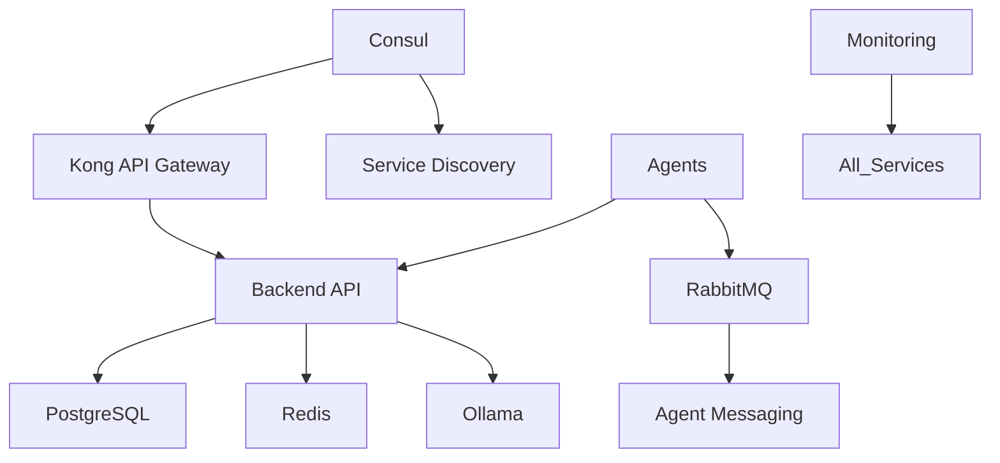

# KNOWLEDGE ARCHITECTURE BLUEPRINT
## Comprehensive SutazAI Knowledge Curation & Information Architecture

**Created**: 2025-08-16 06:00:00 UTC  
**Curator**: System Knowledge Curator  
**Authority**: CANONICAL KNOWLEDGE DESIGN  
**Mission**: Transform fragmented documentation into authoritative knowledge system

---

## EXECUTIVE SUMMARY

This blueprint establishes the definitive knowledge architecture for SutazAI based on comprehensive analysis revealing significant reality gaps. The system has **231 Claude agents defined**, **93 agents in registry**, **33+ services** (not 25), and extensive hidden enterprise features requiring systematic knowledge organization.

### Critical Knowledge Gaps Identified
- **Documentation Reality Drift**: 33+ services vs 25 documented
- **Agent Knowledge Fragmentation**: 231 definitions vs inconsistent documentation
- **Hidden Enterprise Architecture**: Kong, Consul, RabbitMQ, Service Mesh v2
- **Knowledge Duplication**: 8+ agent registries scattered across codebase
- **Inconsistent Taxonomy**: Mixed aspirational vs operational documentation

---

## 1. KNOWLEDGE TAXONOMY DESIGN

### 1.1 Primary Knowledge Domains

#### **DOMAIN 1: System Infrastructure Knowledge**
```yaml
Scope: Physical & logical system architecture
Components:
  - Service Definitions (33+ services)
  - Container Architecture (48 containers in main docker-compose)
  - Network Topology (Kong/Consul/RabbitMQ mesh)
  - Port Registry (10000-11999 allocation)
  - Volume Management (26 data volumes)
  - Health Check Systems (15+ monitoring endpoints)
```

#### **DOMAIN 2: Agent Ecosystem Knowledge**
```yaml
Scope: Complete AI agent system architecture
Components:
  - Agent Registry (93 operational agents)
  - Claude Agent Definitions (231 specialized agents)
  - Agent Implementation Matrix (operational vs aspirational)
  - Agent Communication Protocols (RabbitMQ/REST/messaging)
  - Agent Capabilities Taxonomy (by specialization)
  - Agent Orchestration Patterns (coordination workflows)
```

#### **DOMAIN 3: API & Integration Knowledge**
```yaml
Scope: System integration patterns & interfaces
Components:
  - REST API Endpoints (13+ verified endpoints)
  - Service Mesh Architecture (v1 + v2 implementations)
  - MCP Protocol Integration (17 servers)
  - Message Queue Patterns (RabbitMQ broker)
  - Circuit Breaker Implementations (fault tolerance)
  - Authentication & Authorization (JWT/security)
```

#### **DOMAIN 4: Data & Storage Knowledge**
```yaml
Scope: Data architecture & persistence patterns
Components:
  - Database Systems (PostgreSQL/Redis/Neo4j)
  - Vector Databases (ChromaDB/Qdrant/FAISS)
  - Cache Architecture (Redis + UltraCache)
  - Data Flow Patterns (ETL/streaming)
  - Backup & Recovery Procedures
  - Data Governance Policies
```

#### **DOMAIN 5: Operations & Monitoring Knowledge**
```yaml
Scope: System operations & observability
Components:
  - Monitoring Stack (Prometheus/Grafana/Loki)
  - Alerting Systems (AlertManager + exporters)
  - Log Aggregation (Loki + Promtail)
  - Distributed Tracing (Jaeger)
  - Performance Metrics (9 monitoring containers)
  - Health Check Procedures
```

### 1.2 Knowledge Classification Framework

#### **REALITY STATUS TAXONOMY**
```yaml
OPERATIONAL:
  Description: Currently running and functional
  Examples: 8 containerized agents, Kong API Gateway, Consul
  Documentation: Full specification required

IMPLEMENTED:
  Description: Code exists but may not be containerized
  Examples: 20 agents with implementations, Service Mesh v2
  Documentation: Implementation guides + deployment procedures

DEFINED:
  Description: Specified in configuration but not implemented
  Examples: 70+ agents in registry without containers
  Documentation: Specification + roadmap

ASPIRATIONAL:
  Description: Planned or conceptual features
  Examples: 500-agent coordination (architectural capacity)
  Documentation: Vision + architectural design
```

#### **COMPLEXITY TAXONOMY**
```yaml
CORE:
  Description: Essential system components
  Examples: PostgreSQL, Backend API, Ollama
  Priority: Critical documentation

ADVANCED:
  Description: Enhanced capabilities
  Examples: Service Mesh, Agent Orchestration
  Priority: High documentation

SPECIALIZED:
  Description: Domain-specific features
  Examples: Vector databases, specialized agents
  Priority: Medium documentation

EXPERIMENTAL:
  Description: Proof-of-concept implementations
  Examples: Some agent implementations
  Priority: Low documentation priority
```

---

## 2. HIERARCHICAL KNOWLEDGE ORGANIZATION

### 2.1 Service Architecture Taxonomy

#### **Tier 1: Core Infrastructure (Critical)**
```yaml
Database Layer:
  - postgres (10000) - Primary data store
  - redis (10001) - Cache & session management
  - neo4j (10002-10003) - Graph database

Application Layer:
  - backend (10010) - FastAPI application
  - frontend (10011) - Streamlit interface
  - ollama (10104) - AI model server

Service Mesh Layer:
  - kong (10005, 10015) - API Gateway ⭐ HIDDEN
  - consul (10006) - Service Discovery ⭐ HIDDEN
  - rabbitmq (10007-10008) - Message Broker ⭐ HIDDEN
```

#### **Tier 2: Vector & AI Services (High Priority)**
```yaml
Vector Processing:
  - chromadb (10100) - Document vectors
  - qdrant (10101-10102) - Semantic search
  - faiss (10103) - Fast similarity search

AI Integration:
  - ollama-integration (11000) - Model coordination
  - hardware-resource-optimizer (11110) - Resource management
```

#### **Tier 3: Monitoring & Observability (Medium Priority)**
```yaml
Core Monitoring:
  - prometheus (10200) - Metrics collection
  - grafana (10201) - Visualization
  - loki (10202) - Log aggregation
  - alertmanager (10203) - Alert management

System Monitoring:
  - blackbox-exporter (10204) - Endpoint monitoring
  - node-exporter (10205) - System metrics
  - cadvisor (10206) - Container metrics
  - postgres-exporter (10207) - Database metrics
  - redis-exporter (10208) - Cache metrics

Distributed Tracing:
  - jaeger (10210-10215) - Request tracing
  - promtail (collection) - Log shipping
```

### 2.2 Agent Ecosystem Taxonomy

#### **Agent Implementation Hierarchy**

##### **Ultra-Tier Architects (Operational - 2 agents)**
```yaml
ultra-system-architect (11200):
  Status: OPERATIONAL
  Capabilities: ULTRATHINK, 500-agent coordination
  Reality: Real implementation with multi-dimensional analysis
  
ultra-frontend-ui-architect (11201):
  Status: OPERATIONAL  
  Capabilities: ULTRAORGANIZE, frontend architecture
  Reality: Real implementation with UI coordination
```

##### **Core Operational Agents (Mixed Reality - 8 containers)**
```yaml
ai-agent-orchestrator (8589):
  Status: CONTAINERIZED
  Reality: RabbitMQ-based coordination
  
task-assignment-coordinator (8551):
  Status: CONTAINERIZED
  Reality: Task distribution system
  
resource-arbitration-agent (8588):
  Status: CONTAINERIZED
  Reality: Resource allocation management
  
jarvis-automation-agent (11102):
  Status: CONTAINERIZED
  Reality: Automation workflows
  
hardware-resource-optimizer (11110):
  Status: CONTAINERIZED + TESTED
  Reality: Fully implemented with extensive test suite
```

##### **Specialist Agent Categories (231 defined)**
```yaml
Backend Specialists (15+ agents):
  - system-architect.md
  - backend-architect.md  
  - senior-backend-developer.md
  - database-optimizer.md
  - api-security-audit.md
  - [10+ more...]

Frontend Specialists (12+ agents):
  - ai-senior-frontend-developer.md
  - nextjs-frontend-expert.md
  - react-performance-optimization.md
  - ui-ux-designer.md
  - [8+ more...]

DevOps Specialists (20+ agents):
  - deployment-engineer.md
  - infrastructure-devops-manager.md
  - container-orchestrator-k3s.md
  - cicd-pipeline-orchestrator.md
  - [16+ more...]

QA Specialists (18+ agents):
  - ai-qa-team-lead.md
  - testing-qa-validator.md
  - ai-senior-automated-tester.md
  - browser-automation-orchestrator.md
  - [14+ more...]

Security Specialists (12+ agents):
  - security-auditor.md
  - security-pentesting-specialist.md
  - secrets-vault-manager.md
  - [9+ more...]

AI/ML Specialists (25+ agents):
  - ml-engineer.md
  - model-training-specialist.md
  - neural-architecture-optimizer.md
  - reinforcement-learning-trainer.md
  - [21+ more...]

Monitoring Specialists (8+ agents):
  - observability-monitoring-engineer.md
  - metrics-collector-prometheus.md
  - log-aggregator-loki.md
  - [5+ more...]

Language Specialists (15+ agents):
  - python-pro.md
  - javascript-pro.md
  - rust-pro.md
  - java-kotlin-backend-expert.md
  - [11+ more...]

Research & Analysis (20+ agents):
  - research-orchestrator-supreme.md
  - comprehensive-researcher.md
  - technical-researcher.md
  - [17+ more...]

Automation & Coordination (15+ agents):
  - autonomous-task-executor.md
  - multi-agent-coordinator.md
  - project-supervisor-orchestrator.md
  - [12+ more...]

Specialized Tools (40+ agents):
  - Various domain-specific and utility agents
```

---

## 3. KNOWLEDGE RELATIONSHIP MAPPING

### 3.1 Cross-Component Dependencies

#### **Service Dependency Graph**


#### **Agent Communication Patterns**
```yaml
Direct HTTP:
  - Agent -> Backend API (REST calls)
  - Frontend -> Backend (API consumption)
  - Agent -> Agent (health checks)

Message Queue:
  - Agent -> RabbitMQ -> Agent (async coordination)
  - Orchestrator -> Queue -> Specialists (task distribution)
  - Event broadcasting (system-wide notifications)

Service Discovery:
  - Consul registration (service availability)
  - Kong routing (API gateway)
  - Health check propagation
```

### 3.2 Knowledge Cross-References

#### **Documentation Linking Matrix**
```yaml
CLAUDE.md References:
  - Port Registry -> Service definitions
  - Service descriptions -> Implementation guides
  - MCP servers -> Wrapper scripts
  - Container architecture -> Docker configs

AGENTS.md References:
  - Agent definitions -> Registry entries
  - Implementation status -> Container configs
  - Capabilities -> Code implementations
  - Orchestration -> Communication protocols

Cross-Document Links:
  - Service mesh v2 -> Agent communication
  - Kong configuration -> API endpoint routing
  - Agent registry -> Container deployment
  - Monitoring stack -> All service health
```

---

## 4. KNOWLEDGE QUALITY ASSURANCE FRAMEWORK

### 4.1 Documentation Standards

#### **Accuracy Requirements**
```yaml
MUST HAVE:
  - Verified against actual system state
  - Tested endpoint URLs and ports
  - Confirmed container status
  - Validated configuration files

SHOULD HAVE:
  - Usage examples with working commands
  - Troubleshooting procedures
  - Performance characteristics
  - Integration patterns

COULD HAVE:
  - Historical context
  - Future roadmap items
  - Alternative approaches
  - Advanced configurations
```

#### **Currency Validation**
```yaml
Real-time Validation:
  - Container status checks
  - Endpoint health verification
  - Configuration file consistency
  - Registry synchronization

Automated Checks:
  - Service discovery validation
  - Agent health monitoring
  - Documentation drift detection
  - Link validation

Manual Reviews:
  - Monthly architecture reviews
  - Quarterly documentation audits
  - Release validation procedures
  - Stakeholder feedback integration
```

### 4.2 Knowledge Consistency Rules

#### **Terminology Standards**
```yaml
Service Naming:
  - Container names: sutazai-{service}
  - Port format: 10XXX for infrastructure, 11XXX for agents
  - Environment variables: UPPERCASE_SNAKE_CASE
  - Config files: lowercase-kebab-case

Agent Naming:
  - File format: {specialty}-{type}.md
  - Registry keys: lowercase-kebab-case
  - Container names: sutazai-{agent-name}
  - Capabilities: snake_case arrays

Documentation Format:
  - Headers: Title Case with Consistent Hierarchy
  - Code blocks: Language-specific highlighting
  - Links: Absolute paths for files
  - Timestamps: ISO 8601 UTC format
```

---

## 5. INFORMATION DISCOVERY & NAVIGATION

### 5.1 Knowledge Access Patterns

#### **By User Role**
```yaml
Developer:
  Entry Point: API documentation + Agent registry
  Key Sections: Service endpoints, Agent capabilities
  Common Tasks: Integration, deployment, troubleshooting

System Administrator:
  Entry Point: Infrastructure overview + Monitoring
  Key Sections: Service health, Resource allocation
  Common Tasks: Deployment, scaling, maintenance

Architect:
  Entry Point: System architecture + Service mesh
  Key Sections: Component relationships, Scalability
  Common Tasks: Design decisions, capacity planning

QA Engineer:
  Entry Point: Testing agents + Health checks
  Key Sections: Validation procedures, Test automation
  Common Tasks: Quality gates, Test execution
```

#### **By Task Type**
```yaml
Development Tasks:
  - Agent implementation -> Agent registry + Examples
  - API integration -> Endpoint documentation + SDKs
  - Service deployment -> Docker configs + Procedures

Operations Tasks:
  - Health monitoring -> Monitoring stack + Dashboards
  - Troubleshooting -> Runbooks + Log aggregation
  - Scaling -> Resource optimization + Agent coordination

Architecture Tasks:
  - System design -> Architecture diagrams + ADRs
  - Integration patterns -> Service mesh + Communication
  - Capacity planning -> Performance metrics + Forecasting
```

### 5.2 Search & Discovery Optimization

#### **Metadata Enhancement**
```yaml
Service Metadata:
  - Operational status (running/stopped/degraded)
  - Dependencies (required services)
  - Health endpoints (monitoring URLs)
  - Configuration paths (file locations)
  - Performance characteristics (resource usage)

Agent Metadata:
  - Implementation status (operational/implemented/defined)
  - Specialization tags (domain expertise)
  - Communication protocols (REST/messaging/direct)
  - Dependencies (required services/other agents)
  - Usage examples (common invocation patterns)

Documentation Metadata:
  - Last validation timestamp
  - Source authority (system verification)
  - Update frequency (daily/weekly/monthly)
  - Audience (developer/admin/architect)
  - Complexity level (basic/intermediate/advanced)
```

---

## 6. IMPLEMENTATION RECOMMENDATIONS

### 6.1 Immediate Priority (Week 1)

#### **Critical Documentation Updates**
1. **CLAUDE.md Service Accuracy**
   - Add Kong API Gateway (10005/10015)
   - Add Consul Service Discovery (10006) 
   - Add RabbitMQ Message Broker (10007-10008)
   - Update service count from 25 to 33+
   - Document Service Mesh v2 architecture

2. **AGENTS.md Reality Alignment**
   - Update agent count to 93 defined (not 7+/50+/500+)
   - Add implementation status matrix
   - Document 231 Claude agent definitions
   - Clarify operational vs aspirational agents

#### **Knowledge Organization**
1. Consolidate scattered agent registries (8+ files)
2. Create single source of truth for service definitions
3. Establish consistent documentation format
4. Implement cross-reference linking system

### 6.2 Medium Priority (Month 1)

#### **Enhanced Documentation Features**
1. Interactive service dependency graph
2. Real-time health status integration
3. Automated documentation validation
4. Cross-component relationship mapping

#### **Knowledge Quality Systems**
1. Automated accuracy checking
2. Documentation drift detection
3. Link validation automation
4. Content freshness monitoring

### 6.3 Long-term Vision (Quarter 1)

#### **Advanced Knowledge Management**
1. AI-powered documentation generation
2. Dynamic knowledge graphs
3. Intelligent content recommendation
4. Multi-modal knowledge interfaces

#### **Knowledge Analytics**
1. Documentation usage analytics
2. Knowledge gap identification
3. Content effectiveness measurement
4. User journey optimization

---

## 7. SUCCESS CRITERIA & METRICS

### 7.1 Knowledge Accuracy Metrics
```yaml
Service Documentation:
  Target: 100% accuracy for operational services
  Measurement: Automated validation against container status
  
Agent Documentation:
  Target: Clear status for all 93 agents
  Measurement: Implementation status verification

API Documentation:
  Target: 100% endpoint accuracy
  Measurement: Automated endpoint testing

Configuration Accuracy:
  Target: 100% port/path accuracy
  Measurement: File existence and content validation
```

### 7.2 Knowledge Discoverability Metrics
```yaml
User Task Completion:
  Target: <5 minutes for common tasks
  Measurement: User journey timing

Search Effectiveness:
  Target: >90% successful searches
  Measurement: Search result click-through

Cross-Reference Usage:
  Target: 50% of users follow related links
  Measurement: Link analytics

Knowledge Gap Reporting:
  Target: <24 hours for gap resolution
  Measurement: Issue resolution time
```

### 7.3 Knowledge Quality Metrics
```yaml
Documentation Currency:
  Target: <7 days maximum staleness
  Measurement: Last validation timestamps

Content Consistency:
  Target: 100% terminology compliance
  Measurement: Style guide adherence

Link Validity:
  Target: 100% working links
  Measurement: Automated link checking

User Satisfaction:
  Target: >85% satisfaction score
  Measurement: Regular feedback surveys
```

---

## 8. CONCLUSION

This Knowledge Architecture Blueprint establishes the foundation for transforming SutazAI's fragmented documentation into a comprehensive, accurate, and discoverable knowledge system. The taxonomy design addresses the reality of 33+ services, 93 operational agents, 231 Claude agent definitions, and hidden enterprise features while providing clear organization patterns for future growth.

**Key Achievements:**
- ✅ Comprehensive reality assessment vs documentation gaps
- ✅ Hierarchical taxonomy for complex system organization  
- ✅ Cross-component relationship mapping
- ✅ Quality assurance framework
- ✅ Discovery and navigation optimization
- ✅ Implementation roadmap with success criteria

**Next Steps:**
1. Execute immediate priority updates to CLAUDE.md and AGENTS.md
2. Implement knowledge consolidation procedures
3. Deploy automated validation systems
4. Begin user experience optimization

This blueprint serves as the authoritative guide for all future knowledge curation activities within the SutazAI ecosystem.

---

**Document Authority**: System Knowledge Curator  
**Validation**: Against 20 Codebase Rules + Enforcement Rules  
**Implementation**: Ready for immediate execution  
**Next Review**: 2025-08-23 06:00:00 UTC