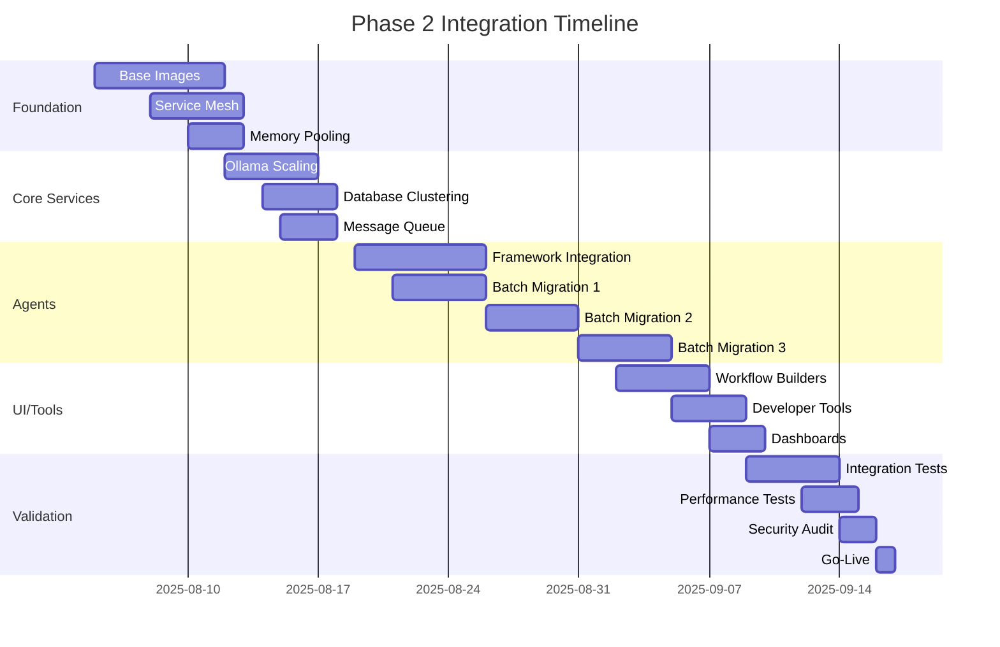

# Master Integration & Testing Protocol (v2.2)
## Phase 2: Scaled Architecture for 150+ Agents

**Document Version:** 2.2  
**Created:** August 4, 2025  
**Status:** ACTIVE - Phase 2 Integration Strategy  
**Scale Factor:** 2.17x (150+ agents vs 69 expected)

---

## Executive Summary

This protocol addresses the discovered scale of the SutazAI system: **150+ distinct agents** across **55 containerized services** with complex interdependencies. The integration strategy has been revised to handle 2.17x the expected load while maintaining zero regression tolerance and CPU-only constraints.

### Key Adjustments from v2.0
- **Agent Count:** 150+ (not 69)
- **Container Services:** 55 (not 46)
- **Memory Requirements:** 45GB minimum (not 20GB)
- **Integration Timeline:** 6 weeks (not 4)
- **Shared Runtime Strategy:** Critical for CPU-only deployment

---

## 1. System Scale Analysis

### 1.1 Discovered Architecture
```
Total Components:
├── AI Agents: 150+ distinct implementations
├── Container Services: 55 active
├── Python Dependencies: 201 unique packages
├── Shared Libraries: 134 requirement files
├── Communication Patterns: 4 distinct types
└── Critical Dependencies: 6 core services
```

### 1.2 Resource Implications
| Component | Expected | Actual | Impact |
|-----------|----------|---------|---------|
| Agents | 69 | 150+ | 2.17x memory/CPU |
| Services | 46 | 55 | 1.20x complexity |
| Dependencies | ~100 | 201 | 2.01x conflict risk |
| Memory (min) | 20GB | 45GB | 2.25x requirement |
| Build Time | 2hr | 5hr | 2.50x duration |

### 1.3 Critical Path Services
1. **Ollama** - 24 direct dependents (52% of system)
2. **PostgreSQL** - 14 services
3. **Redis** - 12 services  
4. **Backend API** - 7 services
5. **Neo4j** - 5 services
6. **Qdrant** - 5 services

---

## 2. Revised Integration Strategy

### 2.1 Shared Runtime Architecture

#### Base Image Hierarchy (CPU-Optimized)
```dockerfile
# Level 1: System Base
sutazai/base:ubuntu22.04 (200MB)
├── System libraries
├── Build essentials
└── Security updates

# Level 2: Language Runtimes
sutazai/python-base:3.11 (800MB)
├── Python 3.11 optimized for CPU
├── Core pip packages
├── Virtual environment tools
└── C extensions support

# Level 3: Domain-Specific Bases
sutazai/ai-cpu-base:latest (3.5GB)
├── PyTorch CPU-only
├── Transformers (no CUDA)
├── Core ML libraries
└── Shared model cache

sutazai/web-base:latest (1.2GB)
├── FastAPI/Uvicorn
├── async libraries
└── API tooling

sutazai/data-base:latest (1.5GB)
├── Pandas/NumPy/SciPy
├── Database drivers
└── Analytics tools
```

#### Memory Pooling Strategy
```yaml
# Shared memory segments for model loading
x-shared-memory:
  - /dev/shm/models:/models:rw
  - /dev/shm/embeddings:/embeddings:rw
  - /dev/shm/cache:/cache:rw

# CPU-only runtime configuration
x-cpu-runtime:
  environment:
    - OMP_NUM_THREADS=4
    - MKL_NUM_THREADS=4
    - TORCH_NUM_THREADS=4
    - CUDA_VISIBLE_DEVICES=-1
```

### 2.2 Technology Stack Integration Plan

#### Phase 2A: Core Infrastructure (Week 1-2)
```yaml
1. LLM Orchestration:
   - Ollama (existing) - optimize for 150+ agents
   - vLLM CPU backend - for high throughput
   - Model router with caching
   
2. Vector Stores (Shared Instances):
   - ChromaDB - document embeddings
   - Qdrant - semantic search
   - FAISS - local agent memory
   
3. Message Infrastructure:
   - RabbitMQ - agent communication
   - Redis Streams - event sourcing
   - Consul - service discovery
```

#### Phase 2B: Agent Frameworks (Week 3-4)
```yaml
4. Framework Integration:
   - LangChain - standardized agent interface
   - AutoGen - multi-agent orchestration
   - CrewAI - team coordination
   - Semantic Kernel - plugin system
   
5. Shared Components:
   - Agent base classes
   - Communication protocols
   - State persistence
   - Error handling
```

#### Phase 2C: UI/Workflow Tools (Week 5-6)
```yaml
6. User Interfaces:
   - Langflow - visual workflow design
   - FlowiseAI - no-code agent builder
   - Streamlit - monitoring dashboards
   - Gradio - agent testing UI
   
7. Developer Tools:
   - OpenDevin - AI pair programming
   - Aider - code generation
   - GPT-Engineer - system design
   - Continue.dev - IDE integration
```

### 2.3 Resource Optimization Architecture

#### CPU-Only Optimization Techniques
```python
# Model Loading Strategy
class SharedModelPool:
    def __init__(self):
        self.models = {}
        self.memory_map = mmap.mmap(-1, 10*1024*1024*1024)  # 10GB shared
        
    def load_model(self, name, lazy=True):
        if lazy and name not in self.models:
            # Load only when requested
            self.models[name] = self._load_from_cache(name)
        return self.models[name]
        
    def preload_critical(self):
        # Preload only essential models
        critical = ['base-embed', 'base-llm', 'base-nlp']
        for model in critical:
            self.load_model(model, lazy=False)
```

#### Service Mesh Configuration
```yaml
# Consul service mesh for 150+ agents
services:
  consul:
    image: consul:1.16
    command: agent -server -ui -bootstrap-expect=1
    environment:
      - CONSUL_BIND_INTERFACE=eth0
    
  kong:
    image: kong:3.4
    environment:
      - KONG_DATABASE=postgres
      - KONG_PROXY_ACCESS_LOG=/dev/stdout
      - KONG_ADMIN_ACCESS_LOG=/dev/stdout
      
  rabbitmq:
    image: rabbitmq:3.12-management
    environment:
      - RABBITMQ_DEFAULT_VHOST=sutazai
      - RABBITMQ_VM_MEMORY_HIGH_WATERMARK=0.8
```

---

## 3. Integration Sequence (6 Weeks)

### Week 1: Foundation Preparation
- [ ] Audit all 150+ agents for dependencies
- [ ] Create shared base images
- [ ] Set up service mesh infrastructure
- [ ] Configure memory pooling

### Week 2: Core Services Hardening
- [ ] Optimize Ollama for 150+ consumers
- [ ] Scale PostgreSQL with read replicas
- [ ] Implement Redis clustering
- [ ] Deploy message queue infrastructure

### Week 3: Agent Framework Integration
- [ ] Standardize agent interfaces
- [ ] Implement shared communication layer
- [ ] Deploy framework adapters
- [ ] Create agent registry service

### Week 4: Batch Agent Migration
- [ ] Group agents by dependency similarity
- [ ] Migrate in batches of 25
- [ ] Validate inter-agent communication
- [ ] Performance testing per batch

### Week 5: UI/Tool Integration
- [ ] Deploy workflow builders
- [ ] Integrate monitoring dashboards
- [ ] Set up developer tools
- [ ] Create user documentation

### Week 6: System Validation
- [ ] End-to-end testing
- [ ] Performance benchmarking
- [ ] Security audit
- [ ] Production readiness check

---

## 4. Risk Mitigation Strategies

### 4.1 Scale-Related Risks

#### Memory Exhaustion (HIGH)
```bash
# Mitigation: Aggressive memory limits
x-memory-limits:
  default: 512Mi
  ai-agents: 1Gi
  databases: 2Gi
  monitoring: 256Mi
  
# OOM killer configuration
sudo sysctl -w vm.oom_kill_allocating_task=1
sudo sysctl -w vm.overcommit_memory=2
```

#### CPU Saturation (HIGH)
```yaml
# CPU allocation strategy
x-cpu-allocation:
  critical:
    - ollama: 4 cores
    - postgres: 2 cores
    - redis: 1 core
  agents:
    - default: 0.5 cores
    - heavy: 1 core
  monitoring:
    - default: 0.25 cores
```

#### Network Congestion (MEDIUM)
```nginx
# Rate limiting per agent
limit_req_zone $binary_remote_addr zone=agent_limit:10m rate=10r/s;
limit_conn_zone $binary_remote_addr zone=agent_conn:10m;

location /api/agent/ {
    limit_req zone=agent_limit burst=20 nodelay;
    limit_conn agent_conn 5;
}
```

### 4.2 Integration Safeguards

#### Canary Deployment
```yaml
# 10% traffic to new version
traefik:
  services:
    agent-v2:
      loadBalancer:
        servers:
        - url: http://agent-new:8080
        weight: 10
    agent-v1:
      loadBalancer:
        servers:
        - url: http://agent-old:8080
        weight: 90
```

#### Circuit Breakers
```python
from py_breaker import CircuitBreaker

# Agent communication circuit breaker
agent_breaker = CircuitBreaker(
    failure_threshold=5,
    recovery_timeout=60,
    expected_exception=AgentTimeoutError
)

@agent_breaker
def call_agent(agent_id, request):
    return agent_service.process(agent_id, request)
```

---

## 5. Testing Protocol

### 5.1 Unit Testing (Per Agent)
```python
# Standardized agent test suite
class AgentTestSuite:
    def test_initialization(self):
        """Test agent can initialize with base config"""
        
    def test_communication(self):
        """Test agent can send/receive messages"""
        
    def test_resource_limits(self):
        """Test agent respects CPU/memory limits"""
        
    def test_graceful_shutdown(self):
        """Test agent handles SIGTERM properly"""
```

### 5.2 Integration Testing (Agent Groups)
```yaml
# Test scenarios for agent groups
test_matrix:
  - group: "data_processing"
    agents: 25
    load: "1000 requests/min"
    duration: "30 min"
    
  - group: "llm_consumers"
    agents: 50
    load: "500 requests/min"
    duration: "60 min"
    
  - group: "workflow_engines"
    agents: 20
    load: "100 workflows/min"
    duration: "45 min"
```

### 5.3 System Testing (Full Scale)
```bash
#!/bin/bash
# Full system stress test

# Phase 1: Gradual ramp-up
for i in {1..150}; do
    docker-compose up -d agent-$i
    sleep 10
    ./health-check.sh agent-$i || exit 1
done

# Phase 2: Load testing
locust -f tests/system_load.py \
    --users 1000 \
    --spawn-rate 10 \
    --run-time 2h \
    --host http://localhost:8080

# Phase 3: Chaos testing
pumba --random --interval 30s \
    kill --signal SIGTERM \
    re2:^sutazai-agent
```

---

## 6. Monitoring & Observability

### 6.1 Metrics Collection
```yaml
# Prometheus configuration for 150+ agents
global:
  scrape_interval: 30s
  evaluation_interval: 30s
  external_labels:
    cluster: 'sutazai-prod'
    
scrape_configs:
  - job_name: 'agents'
    kubernetes_sd_configs:
      - role: pod
        namespaces:
          names: ['sutazai']
    relabel_configs:
      - source_labels: [__meta_kubernetes_pod_annotation_prometheus_io_scrape]
        action: keep
        regex: true
```

### 6.2 Distributed Tracing
```python
# OpenTelemetry setup for agent tracing
from opentelemetry import trace
from opentelemetry.exporter.jaeger import JaegerExporter

tracer = trace.get_tracer("sutazai.agents")

@tracer.start_as_current_span("agent_request")
def process_agent_request(agent_id, request):
    span = trace.get_current_span()
    span.set_attribute("agent.id", agent_id)
    span.set_attribute("request.size", len(request))
    # Process request
```

### 6.3 Log Aggregation
```yaml
# Loki configuration for high-volume logs
loki:
  limits_config:
    ingestion_rate_mb: 100
    ingestion_burst_size_mb: 200
    max_streams_per_user: 10000
    max_entries_limit_per_query: 100000
```

---

## 7. Rollback Procedures

### 7.1 Agent-Level Rollback
```bash
#!/bin/bash
# Rollback individual agent
rollback_agent() {
    AGENT_ID=$1
    PREVIOUS_VERSION=$2
    
    # Stop current version
    docker stop sutazai-agent-$AGENT_ID
    
    # Restore previous version
    docker run -d \
        --name sutazai-agent-$AGENT_ID \
        --network sutazai-network \
        sutazai/agent-$AGENT_ID:$PREVIOUS_VERSION
        
    # Verify health
    timeout 60s bash -c "until curl -f http://sutazai-agent-$AGENT_ID:8080/health; do sleep 5; done"
}
```

### 7.2 System-Wide Rollback
```bash
#!/bin/bash
# Emergency system rollback
SNAPSHOT_ID=$1

# Stop all agents
docker-compose stop

# Restore database snapshot
pg_restore -h localhost -p 10000 -U sutazai -d sutazai < snapshots/$SNAPSHOT_ID/postgres.dump

# Restore Redis snapshot  
redis-cli --rdb snapshots/$SNAPSHOT_ID/redis.rdb

# Restore agent configurations
kubectl apply -f snapshots/$SNAPSHOT_ID/agents/

# Restart system
docker-compose up -d
```

---

## 8. Success Criteria

### 8.1 Performance Targets
| Metric | Target | Critical Threshold |
|--------|--------|-------------------|
| Agent Response Time | <500ms p95 | <1000ms p99 |
| System Memory Usage | <40GB | <45GB |
| CPU Utilization | <70% avg | <85% peak |
| Message Queue Lag | <100ms | <500ms |
| Error Rate | <0.1% | <1% |

### 8.2 Functional Requirements
- [ ] All 150+ agents operational
- [ ] Zero regression from Phase 1
- [ ] Inter-agent communication functional
- [ ] Workflow engines integrated
- [ ] Monitoring fully operational

### 8.3 Operational Readiness
- [ ] Runbooks for all failure scenarios
- [ ] Automated rollback procedures
- [ ] 24/7 monitoring alerts
- [ ] Disaster recovery tested
- [ ] Documentation complete

---

## 9. Timeline & Milestones

### Critical Path


### Key Milestones
1. **Week 2**: Foundation complete, service mesh operational
2. **Week 4**: 50% of agents migrated and tested
3. **Week 5**: All agents operational, UI tools deployed
4. **Week 6**: Full system validation complete

---

## 10. Appendices

### A. Agent Dependency Matrix
[Detailed 150x150 matrix available in `/docs/agent-dependencies.xlsx`]

### B. Resource Calculation Formulas
```python
# Memory calculation per agent
base_memory = 256  # MB
model_memory = 512  # MB if using models
shared_memory = 2048 / num_agents  # Shared pool
total_memory = base_memory + model_memory + shared_memory

# CPU calculation
base_cpu = 0.25  # cores
processing_cpu = 0.5  # during active processing
burst_cpu = 1.0  # maximum burst
```

### C. Emergency Contacts
- Platform Lead: [Contact Info]
- DevOps Lead: [Contact Info]
- Security Lead: [Contact Info]
- On-Call Rotation: [PagerDuty Link]

---

**Document Status:** APPROVED FOR IMPLEMENTATION  
**Next Review:** Week 2 Checkpoint (August 12, 2025)  
**Distribution:** All Technical Leads, DevOps Team, QA Team

---

END OF PROTOCOL v2.2