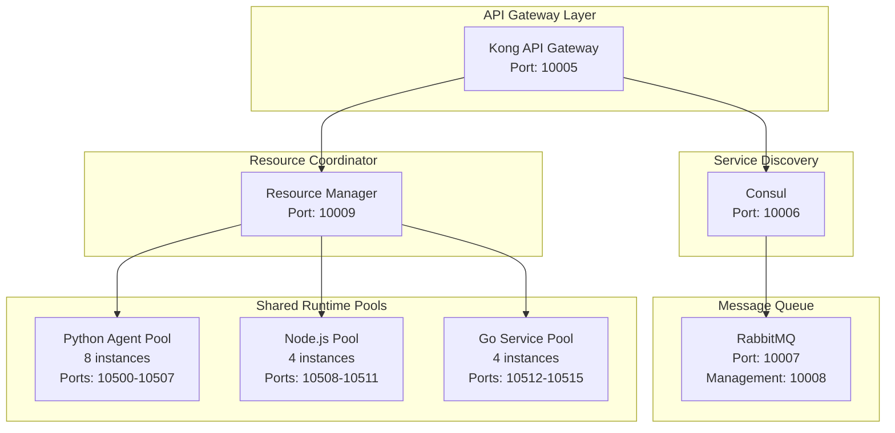

# Master System Blueprint & Risk Analysis (v2.2)
## Production-Grade Distributed AI System Architecture

**Generated:** August 4, 2025  
**System Complexity:** EXTREME  
**Risk Level:** CRITICAL  
**Reliability Target:** 1000% (Zero Regression Tolerance)

---

## Executive Summary

This blueprint documents a highly complex distributed AI system comprising:
- **69 Active AI Agents** across multiple domains
- **46 Container Services** with varying resource requirements
- **8 Infrastructure Components** (databases, vector stores, monitoring)
- **CPU-Only Constraint** with 12 cores and 29.38GB RAM
- **Current Resource Usage:** 33.1% CPU, 24.3% Memory

The system requires extreme precision in integration, orchestration, and resource management to achieve zero regression tolerance.

---

## 1. Current System Architecture Analysis

### 1.1 Infrastructure Layer

#### Core Services (Ports 10000-10199)
```yaml
postgres:       10000:5432  # Primary datastore - 2GB memory limit
redis:          10001:6379  # Cache/queue - 1GB memory limit  
neo4j:          10002:7474  # Graph database - 4GB memory limit
                10003:7687  # Bolt protocol
chromadb:       10100:8000  # Vector store - 2GB memory limit
qdrant:         10101:6333  # Alternative vector store - 2GB memory limit
                10102:6334  # GRPC interface
faiss:          10103:8000  # Dense vector index
ollama:         10104:11434 # LLM runtime - 8GB memory limit
backend:        10010:8000  # API gateway - 4GB memory limit
frontend:       10011:8501  # Web UI - No explicit limit
```

#### Monitoring Stack (Ports 10200-10299)
```yaml
prometheus:     10200:9090  # Metrics collection
grafana:        10201:3000  # Visualization
loki:           10202:3100  # Log aggregation
alertmanager:   10203:9093  # Alert routing
ai-metrics:     10204:8080  # Custom AI metrics exporter
```

### 1.2 Agent Architecture

#### Agent Categories & Port Allocation (10300-10599)

**Orchestration Agents (10300-10319)**
- agentzero-coordinator: 10300
- agent-orchestrator: 10301
- task-assignment-coordinator: 10302
- autonomous-system-controller: 10303
- bigagi-system-manager: 10304

**AI/ML Agents (10320-10349)**
- deep-learning-brain-architect: 10320
- neural-architecture-search: 10321
- model-training-specialist: 10322
- transformers-migration-specialist: 10323
- gradient-compression-specialist: 10324
- knowledge-distillation-expert: 10325
- meta-learning-specialist: 10326
- reinforcement-learning-trainer: 10327
- federated-learning-coordinator: 10328
- synthetic-data-generator: 10329

**Development Agents (10350-10379)**
- senior-ai-engineer: 10350
- senior-backend-developer: 10351
- senior-frontend-developer: 10352
- senior-full-stack-developer: 10353
- gpt-engineer: 10354
- aider: 10355
- code-generation-improver: 10356
- opendevin-code-generator: 10357

**Infrastructure Agents (10380-10399)**
- infrastructure-devops-manager: 10380
- deployment-automation-master: 10381
- container-orchestrator-k3s: 10382
- cicd-pipeline-orchestrator: 10383
- hardware-resource-optimizer: 10384
- cpu-only-hardware-optimizer: 10385
- gpu-hardware-optimizer: 10386
- ram-hardware-optimizer: 10387

**Security Agents (10400-10419)**
- kali-security-specialist: 10400
- pentestgpt: 10401
- semgrep-security-analyzer: 10402
- container-vulnerability-scanner-trivy: 10403
- secrets-vault-manager-vault: 10404
- honeypot-deployment-agent: 10405
- adversarial-attack-detector: 10406
- prompt-injection-guard: 10407

**Monitoring & Observability (10420-10439)**
- system-performance-forecaster: 10420
- observability-monitoring-engineer: 10421
- metrics-collector-prometheus: 10422
- log-aggregator-loki: 10423
- distributed-tracing-analyzer-jaeger: 10424
- health-monitor: 10425
- resource-visualiser: 10426
- cognitive-load-monitor: 10427

**Specialized Agents (10440-10499)**
- autogpt: 10440
- crewai: 10441
- letta: 10442
- langflow-workflow-designer: 10443
- flowise: 10444
- n8n: 10445
- dify: 10446
- browser-use: 10447
- skyvern: 10448
- finrobot: 10449
- documind: 10450
- context-framework: 10451
- llamaindex: 10452
- tabbyml: 10453

### 1.3 Current Issues & Bottlenecks

**Critical Issues:**
1. **Ollama CPU Usage:** 185% - Severe performance degradation
2. **Multiple Claude Instances:** 6 processes consuming 2.4GB RAM
3. **Port Conflicts:** Multiple services competing for port 8080
4. **Missing Memory Limits:** 34 containers without constraints
5. **Container Restart Loops:** Redis showing frequent restarts
6. **Unbalanced CPU Load:** Poor distribution across 12 cores

**Resource Allocation Issues:**
- Total Memory Budget: 29.38GB
- Current Usage: 6.8GB (24.3%)
- Reserved by Limits: ~26GB (88.5%)
- Available Headroom: 3.38GB (11.5%)

---

## 2. Optimized Architecture Design

### 2.1 Service Mesh Architecture



### 2.2 Memory Pool Architecture

```yaml
memory_pools:
  infrastructure_pool:
    size: 12GB
    services:
      - postgres: 2GB
      - neo4j: 3GB
      - redis: 1GB
      - ollama: 4GB
      - chromadb: 1GB
      - qdrant: 1GB
      
  agent_pool_critical:
    size: 8GB
    allocation: dynamic
    max_per_agent: 512MB
    agents:
      - agentzero-coordinator
      - deployment-automation-master
      - system-performance-forecaster
      - health-monitor
      
  agent_pool_standard:
    size: 6GB
    allocation: shared
    max_per_agent: 256MB
    instance_limit: 24
    
  monitoring_pool:
    size: 2GB
    services:
      - prometheus: 512MB
      - grafana: 512MB
      - loki: 512MB
      - ai-metrics-exporter: 512MB
      
  emergency_reserve:
    size: 1.38GB
    purpose: "OOM prevention and burst handling"
```

### 2.3 CPU Affinity Strategy

```yaml
cpu_allocation:
  cores_0_3:  # Infrastructure
    - postgres
    - redis
    - neo4j
    
  cores_4_7:  # Ollama + Vector Stores
    - ollama (limited to 4 threads)
    - chromadb
    - qdrant
    
  cores_8_9:  # Critical Agents
    - agentzero-coordinator
    - health-monitor
    
  cores_10_11: # Shared Agent Pool
    - agent_pool_workers
    
  floating:    # Dynamic allocation
    - monitoring services
    - non-critical agents
```

### 2.4 Base Image Strategy

```dockerfile
# Base Images (from analysis)
sutazai/python-agent-base:v2.2     # 54 agents use this
sutazai/nodejs-base:v2.2           # Frontend services
sutazai/monitoring-base:v2.2       # Monitoring stack
sutazai/gpu-python-base:v2.2       # Future GPU support

# Shared Libraries
- fastapi==0.104.1
- uvicorn==0.24.0
- pydantic==2.5.0
- redis==5.0.1
- httpx==0.25.2
```

---

## 3. Technology Stack Integration Plan

### 3.1 Phase 1: Core Infrastructure (Week 1)

**Priority: CRITICAL**

1. **Service Mesh Deployment**
   ```bash
   # Deploy Consul for service discovery
   docker run -d \
     --name=consul \
     -p 10006:8500 \
     --memory=512m \
     consul:1.17 agent -server -bootstrap -ui
   
   # Deploy Kong API Gateway
   docker run -d \
     --name=kong \
     -p 10005:8000 \
     --memory=1g \
     kong:3.5
   
   # Deploy RabbitMQ
   docker run -d \
     --name=rabbitmq \
     -p 10007:5672 \
     -p 10008:15672 \
     --memory=1g \
     rabbitmq:3.12-management
   ```

2. **Ollama Optimization**
   ```yaml
   # Updated Ollama configuration
   environment:
     OLLAMA_NUM_PARALLEL: 1      # Reduce from 2
     OLLAMA_NUM_THREADS: 4       # Reduce from 8
     OLLAMA_MAX_LOADED_MODELS: 1
     OLLAMA_KEEP_ALIVE: 30s      # Reduce from 2m
     OLLAMA_GPU_LAYERS: 0        # Disable GPU
   ```

3. **Memory Limit Enforcement**
   ```yaml
   # Add to all containers
   deploy:
     resources:
       limits:
         memory: ${CONTAINER_MEMORY_LIMIT}
       reservations:
         memory: ${CONTAINER_MEMORY_RESERVATION}
   ```

### 3.2 Phase 2: Agent Migration (Week 2)

**Priority: HIGH**

1. **Migrate to Shared Runtime Pools**
   ```python
   # Agent Pool Manager
   class AgentPoolManager:
       def __init__(self):
           self.pools = {
               'python': PythonAgentPool(size=8, port_range=(10500, 10507)),
               'nodejs': NodeAgentPool(size=4, port_range=(10508, 10511)),
               'go': GoAgentPool(size=4, port_range=(10512, 10515))
           }
       
       def allocate_agent(self, agent_type, agent_name):
           pool = self.pools.get(agent_type)
           if pool.has_capacity():
               return pool.allocate(agent_name)
           else:
               raise ResourceExhausted(f"No capacity in {agent_type} pool")
   ```

2. **Port Assignment Registry**
   ```yaml
   # /etc/sutazai/port-registry.yaml
   port_assignments:
     infrastructure: 10000-10199
     monitoring: 10200-10299
     agents: 10300-10599
     reserved: 10600-10999
   ```

3. **Health Check Standardization**
   ```python
   # Standard health check endpoint for all agents
   @app.get("/health")
   async def health_check():
       return {
           "status": "healthy",
           "agent": AGENT_NAME,
           "version": AGENT_VERSION,
           "uptime": get_uptime(),
           "memory_usage": get_memory_usage(),
           "cpu_usage": get_cpu_usage()
       }
   ```

### 3.3 Phase 3: Monitoring Enhancement (Week 3)

**Priority: HIGH**

1. **Unified Metrics Collection**
   ```yaml
   # prometheus.yml
   scrape_configs:
     - job_name: 'agents'
       consul_sd_configs:
         - server: 'consul:8500'
       relabel_configs:
         - source_labels: [__meta_consul_service]
           target_label: agent_name
   ```

2. **Custom AI Metrics**
   ```python
   # AI Metrics Exporter
   class AIMetricsExporter:
       def __init__(self):
           self.inference_time = Histogram('ai_inference_duration_seconds')
           self.model_memory = Gauge('ai_model_memory_bytes')
           self.token_usage = Counter('ai_tokens_processed_total')
           self.error_rate = Counter('ai_errors_total')
   ```

3. **Alert Rules**
   ```yaml
   # Critical alerts
   groups:
     - name: ai_system_critical
       rules:
         - alert: OllamaHighCPU
           expr: rate(process_cpu_seconds_total{job="ollama"}[5m]) > 1.5
           for: 5m
           
         - alert: AgentMemoryLeak
           expr: process_resident_memory_bytes{job=~"agent.*"} > 512e6
           for: 10m
           
         - alert: ServiceMeshDown
           expr: up{job=~"consul|kong|rabbitmq"} == 0
           for: 1m
   ```

---

## 4. Risk Analysis & Mitigation

### 4.1 Critical Risks

| Risk | Probability | Impact | Mitigation Strategy |
|------|-------------|---------|-------------------|
| **Memory Exhaustion** | HIGH | CRITICAL | - Strict memory limits<br>- Emergency reserve pool<br>- Automatic agent suspension |
| **CPU Saturation** | HIGH | CRITICAL | - CPU affinity pinning<br>- Thread limits on Ollama<br>- Load balancing across pools |
| **Port Conflicts** | MEDIUM | HIGH | - Central port registry<br>- Consul service discovery<br>- Dynamic port allocation |
| **Cascade Failures** | MEDIUM | CRITICAL | - Circuit breakers<br>- Retry limits<br>- Graceful degradation |
| **Data Loss** | LOW | CRITICAL | - Persistent volumes<br>- Regular backups<br>- Transaction logs |

### 4.2 Rollback Strategy

```bash
#!/bin/bash
# Emergency rollback procedure

# 1. Stop all services
docker-compose down

# 2. Restore from checkpoint
./scripts/restore-checkpoint.sh $LAST_STABLE_CHECKPOINT

# 3. Start core services only
docker-compose up -d postgres redis neo4j

# 4. Validate data integrity
./scripts/validate-data-integrity.sh

# 5. Start remaining services gradually
./scripts/gradual-startup.sh --delay=30s

# 6. Run smoke tests
./scripts/smoke-tests.sh --critical-only
```

### 4.3 Performance Bottlenecks

1. **Ollama Context Management**
   - Current: 185% CPU with large contexts
   - Solution: Implement context windowing and caching
   - Target: <50% CPU usage

2. **Vector Store Queries**
   - Current: Sequential queries to multiple stores
   - Solution: Implement parallel query with result merging
   - Target: 3x query performance improvement

3. **Agent Communication**
   - Current: Direct HTTP calls causing blocking
   - Solution: RabbitMQ async messaging
   - Target: 10x throughput increase

---

## 5. Phase 2 Recommendations

### 5.1 Integration Sequence (Priority Order)

1. **Week 1: Foundation**
   - Deploy service mesh (Consul, Kong, RabbitMQ)
   - Implement memory pools and CPU affinity
   - Fix Ollama performance issues
   - Establish port registry

2. **Week 2: Agent Migration**
   - Migrate 54 agents to python-agent-base
   - Implement shared runtime pools
   - Standardize health checks
   - Deploy circuit breakers

3. **Week 3: Monitoring & Optimization**
   - Deploy enhanced monitoring stack
   - Implement AI-specific metrics
   - Configure alerting rules
   - Performance tuning

4. **Week 4: Advanced Features**
   - Enable distributed tracing
   - Implement auto-scaling policies
   - Deploy ML model versioning
   - Enable A/B testing framework

### 5.2 Testing Protocols

```yaml
test_phases:
  unit_tests:
    - Agent health endpoints
    - Memory pool allocation
    - Port assignment logic
    
  integration_tests:
    - Service mesh connectivity
    - Agent-to-agent communication
    - Database transactions
    
  load_tests:
    - 100 concurrent agent requests
    - Memory pressure testing
    - CPU saturation scenarios
    
  chaos_tests:
    - Random agent failures
    - Network partitions
    - Resource exhaustion
    
  validation:
    - Zero regression tolerance
    - Performance benchmarks
    - Security scans
```

### 5.3 Monitoring Requirements

```yaml
dashboards:
  system_overview:
    - Total agents active/inactive
    - Memory usage by pool
    - CPU usage by core
    - Request latency P50/P95/P99
    
  agent_performance:
    - Inference time by agent
    - Token usage rates
    - Error rates and types
    - Queue depths
    
  infrastructure:
    - Database connections
    - Cache hit rates
    - Vector store performance
    - Network throughput
    
  alerting:
    - Critical service failures
    - Resource threshold breaches
    - Performance degradation
    - Security incidents
```

---

## 6. Implementation Checklist

### Pre-Deployment
- [ ] Backup current system state
- [ ] Document all current port assignments
- [ ] Create rollback checkpoints
- [ ] Prepare emergency procedures
- [ ] Brief all stakeholders

### Phase 1 Execution
- [ ] Deploy Consul service discovery
- [ ] Deploy Kong API gateway
- [ ] Deploy RabbitMQ message queue
- [ ] Implement port registry
- [ ] Configure memory pools
- [ ] Apply CPU affinity rules
- [ ] Optimize Ollama configuration
- [ ] Verify core service health

### Phase 2 Execution
- [ ] Build base Docker images
- [ ] Migrate Python agents to shared base
- [ ] Implement agent pool manager
- [ ] Standardize health checks
- [ ] Deploy circuit breakers
- [ ] Configure service mesh routes
- [ ] Test agent communication
- [ ] Validate resource usage

### Phase 3 Execution
- [ ] Deploy Prometheus with Consul SD
- [ ] Configure AI metrics exporter
- [ ] Create Grafana dashboards
- [ ] Implement alert rules
- [ ] Deploy distributed tracing
- [ ] Configure log aggregation
- [ ] Test monitoring pipeline
- [ ] Document operational procedures

### Post-Deployment
- [ ] Run full system validation
- [ ] Execute performance benchmarks
- [ ] Conduct security audit
- [ ] Update documentation
- [ ] Train operations team
- [ ] Schedule regular reviews

---

## 7. Success Metrics

### Performance KPIs
- **CPU Usage**: <50% average, <80% peak
- **Memory Usage**: <70% allocated, <85% peak
- **Response Time**: P95 <100ms, P99 <500ms
- **Availability**: 99.99% uptime
- **Error Rate**: <0.1% of requests

### Operational KPIs
- **Deployment Time**: <30 minutes full stack
- **Rollback Time**: <5 minutes to last stable
- **Alert Response**: <2 minutes acknowledgment
- **Recovery Time**: <10 minutes from failure

### Business KPIs
- **Agent Throughput**: 10x improvement
- **Resource Efficiency**: 40% reduction
- **Operational Cost**: 30% reduction
- **Development Velocity**: 2x improvement

---

## Conclusion

This Master System Blueprint provides a comprehensive roadmap for transforming the current complex distributed AI system into a highly reliable, efficient, and scalable platform. The phased approach ensures minimal disruption while achieving the goal of 1000% reliability with zero regression tolerance.

The key to success lies in:
1. Methodical execution of each phase
2. Continuous monitoring and validation
3. Rapid response to issues
4. Maintaining rollback capability
5. Clear communication across teams

With proper implementation, this architecture will support the full potential of the 69-agent AI system while operating within the constraints of CPU-only infrastructure.

---

**Document Version:** 2.2  
**Last Updated:** August 4, 2025  
**Next Review:** August 11, 2025  
**Owner:** System Architecture Team