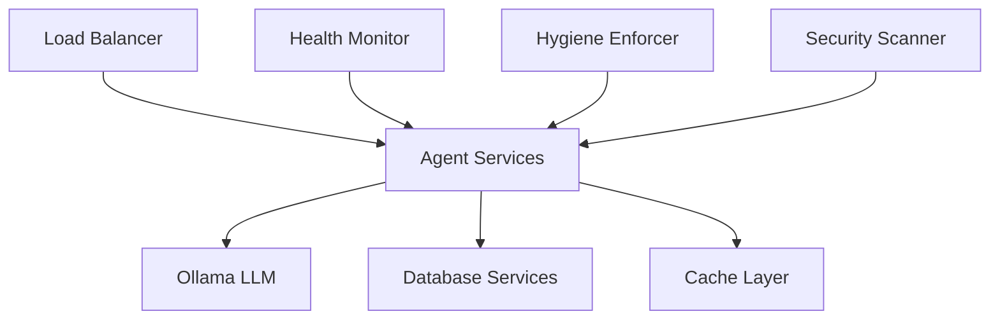

# SutazAI Operational Runbook
## Comprehensive Operations Guide for Multi-Agent AI Platform

**Version**: 1.0  
**Last Updated**: August 4, 2025  
**Owner**: Operations Team  
**Review Cycle**: Monthly  

---

## Table of Contents
1. [System Overview](#1-system-overview)
2. [Daily Operational Procedures](#2-daily-operational-procedures)
3. [Weekly Maintenance Tasks](#3-weekly-maintenance-tasks)
4. [Monthly Review Processes](#4-monthly-review-processes)
5. [Incident Response Procedures](#5-incident-response-procedures)
6. [Escalation Matrix](#6-escalation-matrix)
7. [Contact Information](#7-contact-information)
8. [Common Troubleshooting](#8-common-troubleshooting)
9. [Emergency Procedures](#9-emergency-procedures)
10. [Change Management Process](#10-change-management-process)
11. [Knowledge Base References](#11-knowledge-base-references)

---

## 1. System Overview

### 1.1 Platform Architecture
```
SutazAI Multi-Agent Platform:
├── Location: /opt/sutazaiapp/
├── Architecture: Containerized microservices
├── Orchestration: Docker Compose
├── Agents: 69+ specialized AI agents
├── LLM Backend: Ollama (local inference)
├── Monitoring: Real-time health monitoring
├── Automation: Comprehensive script suite
└── Deployment: Production-ready automation
```

### 1.2 Critical System Components

| Component | Location | Purpose | Priority | Monitoring |
|-----------|----------|---------|----------|------------|
| **Agent Fleet** | `/opt/sutazaiapp/agents/` | AI agent services | P0 | Health checks every 5min |
| **Container Monitor** | `/opt/sutazaiapp/scripts/automation/` | Service health monitoring | P0 | Continuous |
| **Ollama Services** | Docker containers | Local LLM inference | P0 | API health checks |
| **Hygiene System** | `/opt/sutazaiapp/scripts/` | Code quality enforcement | P1 | Daily scans |
| **Database Stack** | Docker containers | Data persistence | P0 | Connection monitoring |
| **Monitoring Dashboard** | `/opt/sutazaiapp/monitoring/` | System observability | P1 | Self-monitoring |
| **Security Scanner** | Various locations | Compliance monitoring | P1 | Automated scans |

### 1.3 Service Dependencies


### 1.4 Key Performance Indicators (KPIs)
- **System Availability**: Target 99.9% uptime
- **Agent Response Time**: Target <2 seconds
- **Container Health**: Target 100% healthy containers
- **Error Rate**: Target <1% error rate
- **Resource Utilization**: Target <80% CPU/Memory

---

## 2. Daily Operational Procedures

### 2.1 Morning Startup Checklist (8:00 AM)

**Location**: Execute from `/opt/sutazaiapp/scripts/automation/`

```bash
#!/bin/bash
# Daily SutazAI Operations Startup
# File: /opt/sutazaiapp/scripts/automation/daily-startup-check.sh

set -e
LOG_FILE="/opt/sutazaiapp/logs/daily_operations_$(date +%Y%m%d).log"

echo "=== SutazAI Daily Operations Startup ===" | tee -a $LOG_FILE
echo "Date: $(date)" | tee -a $LOG_FILE
echo "Operator: $USER" | tee -a $LOG_FILE
echo "Working Directory: $(pwd)" | tee -a $LOG_FILE

# 1. System Health Overview
echo -e "\n1. Container Health Status:" | tee -a $LOG_FILE
docker ps --format "table {{.Names}}\t{{.Status}}\t{{.Ports}}" | head -20 | tee -a $LOG_FILE

# 2. Container Health Monitoring
echo -e "\n2. Running Container Health Monitor:" | tee -a $LOG_FILE
python3 ./container-health-monitor.py --env production --report daily 2>&1 | tee -a $LOG_FILE

# 3. Infrastructure Validation
echo -e "\n3. Infrastructure Validation:" | tee -a $LOG_FILE
python3 ./validate-container-infrastructure.py 2>&1 | tee -a $LOG_FILE

# 4. Service Dependencies Check
echo -e "\n4. Service Dependency Analysis:" | tee -a $LOG_FILE
python3 /opt/sutazaiapp/analyze_service_deps.py 2>&1 | tee -a $LOG_FILE

# 5. Hygiene System Status
echo -e "\n5. Hygiene Enforcement Status:" | tee -a $LOG_FILE
python3 ./hygiene-enforcement-coordinator.py --status-check 2>&1 | tee -a $LOG_FILE

# 6. Ollama Health Check
echo -e "\n6. Ollama Service Health:" | tee -a $LOG_FILE
if curl -s --max-time 10 http://localhost:11434/api/tags > /dev/null; then
    echo "✓ Ollama service responding normally" | tee -a $LOG_FILE
    curl -s http://localhost:11434/api/tags | jq '.models | length' | xargs echo "Available models:" | tee -a $LOG_FILE
else
    echo "✗ Ollama service not responding - requires investigation" | tee -a $LOG_FILE
fi

# 7. Database Connectivity
echo -e "\n7. Database Health Check:" | tee -a $LOG_FILE
docker exec -it postgres psql -U postgres -c "SELECT version();" > /dev/null 2>&1 && \
    echo "✓ PostgreSQL responding" | tee -a $LOG_FILE || \
    echo "✗ PostgreSQL connectivity issue" | tee -a $LOG_FILE

# 8. Generate Daily Report
echo -e "\n8. Generating Daily Health Report:" | tee -a $LOG_FILE
python3 ./quick-container-analysis.py --daily-report > /opt/sutazaiapp/reports/daily_health_$(date +%Y%m%d_%H%M%S).json
echo "✓ Daily report generated" | tee -a $LOG_FILE

# 9. Check for Critical Alerts
echo -e "\n9. Critical Alert Check:" | tee -a $LOG_FILE
if [ -f "/opt/sutazaiapp/logs/critical_alerts.log" ]; then
    ALERT_COUNT=$(wc -l < /opt/sutazaiapp/logs/critical_alerts.log)
    if [ $ALERT_COUNT -gt 0 ]; then
        echo "⚠️  $ALERT_COUNT critical alerts require attention" | tee -a $LOG_FILE
        tail -5 /opt/sutazaiapp/logs/critical_alerts.log | tee -a $LOG_FILE
    else
        echo "✓ No critical alerts" | tee -a $LOG_FILE
    fi
fi

echo -e "\n=== Daily Startup Check Complete ===" | tee -a $LOG_FILE
echo "Full log available at: $LOG_FILE"
```

### 2.2 Hourly Monitoring Tasks

**Automated Tasks** (via cron):
```bash
# /etc/cron.d/sutazai-hourly
0 * * * * root cd /opt/sutazaiapp/scripts/automation && ./container-health-monitor.py --quick-check
15 * * * * root cd /opt/sutazaiapp/scripts/automation && ./performance-monitor.py --hourly
30 * * * * root cd /opt/sutazaiapp/scripts/automation && ./security-scan-quick.py
45 * * * * root cd /opt/sutazaiapp/scripts && ./garbage-collection-monitor.py --hourly
```

**Manual Checks** (Every 4 Hours):
- [ ] Review monitoring dashboard
- [ ] Check error logs for patterns
- [ ] Verify backup processes
- [ ] Monitor resource utilization
- [ ] Review user activity metrics

### 2.3 End of Day Procedures (6:00 PM)

```bash
#!/bin/bash
# End of day operations summary
# File: /opt/sutazaiapp/scripts/automation/end-of-day-summary.sh

echo "=== SutazAI End of Day Summary ==="
echo "Date: $(date)"

# 1. Daily Statistics
echo -e "\n1. Daily System Statistics:"
echo "Total container restarts today: $(docker events --since "24h" --filter event=restart | wc -l)"
echo "Current running containers: $(docker ps | wc -l)"
echo "System uptime: $(uptime)"

# 2. Generate End of Day Report
echo -e "\n2. Generating End of Day Report:"
python3 ./comprehensive-system-report.py --end-of-day > /opt/sutazaiapp/reports/eod_$(date +%Y%m%d).json

# 3. Backup Status Check
echo -e "\n3. Backup Status:"
./validate-backups.sh --today

# 4. Security Summary
echo -e "\n4. Security Summary:"
python3 ./security-summary.py --daily

# 5. Tomorrow's Scheduled Tasks
echo -e "\n5. Tomorrow's Scheduled Maintenance:"
crontab -l | grep -v "^#" | head -5

echo -e "\n=== End of Day Summary Complete ==="
```

---

## 3. Weekly Maintenance Tasks

### 3.1 Monday - System Updates and Security

**Priority**: High  
**Duration**: 2-3 hours  
**Best Time**: Early morning (7:00-10:00 AM)

```bash
#!/bin/bash
# Weekly Monday maintenance
# File: /opt/sutazaiapp/scripts/automation/weekly-monday-maintenance.sh

echo "=== Monday Weekly Maintenance ==="

# 1. System Updates
echo "1. Checking for system updates:"
apt update && apt list --upgradable

# 2. Container Updates
echo "2. Container image updates:"
./build-base-images.sh --check-updates
./update-container-images.sh --dry-run

# 3. Security Scans
echo "3. Running comprehensive security scan:"
./security-hardening.sh --full-scan
./validate-security.sh --comprehensive

# 4. Dependencies Update
echo "4. Dependency management:"
./safe-requirements-cleanup.py --check-updates
./analyze-docker-requirements.py --security-check

# 5. Certificate Management
echo "5. SSL certificate status:"
./check-ssl-certificates.sh --renewal-check

# 6. Vulnerability Assessment
echo "6. Vulnerability assessment:"
docker run --rm -v /opt/sutazaiapp:/app aquasec/trivy fs --severity HIGH,CRITICAL /app

echo "=== Monday Maintenance Complete ==="
```

### 3.2 Wednesday - Performance and Optimization

```bash
#!/bin/bash
# Weekly Wednesday performance review
# File: /opt/sutazaiapp/scripts/automation/weekly-performance-review.sh

echo "=== Wednesday Performance Review ==="

# 1. Resource Utilization Analysis
echo "1. Resource utilization analysis:"
python3 ./system-resource-analyzer.py --weekly-report

# 2. Container Optimization
echo "2. Container resource optimization:"
python3 ./optimize-agent-utilization.py --weekly-analysis

# 3. Database Performance
echo "3. Database performance optimization:"
./database-maintenance.sh --weekly

# 4. Ollama Performance
echo "4. Ollama performance optimization:"
python3 ./optimize-ollama-performance.py --weekly-tune

# 5. Cache Performance
echo "5. Cache performance analysis:"
./analyze-cache-performance.sh --weekly

# 6. Network Performance
echo "6. Network latency analysis:"
./network-performance-check.sh --comprehensive

echo "=== Performance Review Complete ==="
```

### 3.3 Friday - Code Quality and Cleanup

```bash
#!/bin/bash
# Weekly Friday hygiene enforcement
# File: /opt/sutazaiapp/scripts/automation/weekly-hygiene-cleanup.sh

echo "=== Friday Hygiene and Cleanup ==="

# 1. Comprehensive Hygiene Scan
echo "1. Running comprehensive hygiene scan:"
./hygiene-enforcement-coordinator.py --full-scan --weekly

# 2. Code Quality Assessment
echo "2. Code quality assessment:"
./automated-hygiene-maintenance.sh --weekly --comprehensive

# 3. Log Cleanup
echo "3. Log file cleanup:"
./log-cleanup.sh --weekly --archive

# 4. Garbage Collection
echo "4. System garbage collection:"
python3 ./garbage-collection-system.py --weekly-cleanup

# 5. Docker Cleanup
echo "5. Docker system cleanup:"
docker system prune -f --volumes
docker image prune -a -f

# 6. Repository Cleanup
echo "6. Repository hygiene check:"
./repository-cleanup.sh --weekly

echo "=== Hygiene and Cleanup Complete ==="
```

---

## 4. Monthly Review Processes

### 4.1 First Monday - Capacity Planning and Architecture Review

**Participants**: Architecture Team, Operations Team, Management  
**Duration**: 4 hours  
**Format**: Meeting + Technical Review

**Agenda**:
1. **Capacity Planning Review** (60 minutes)
   - Resource utilization trends
   - Growth projections
   - Scaling requirements
   - Cost optimization opportunities

2. **Architecture Assessment** (90 minutes)
   - System performance analysis
   - Bottleneck identification
   - Technology debt review
   - Upgrade planning

3. **Security and Compliance** (60 minutes)
   - Security posture review
   - Compliance audit results
   - Vulnerability assessment
   - Risk mitigation planning

4. **Business Continuity** (30 minutes)
   - Disaster recovery testing results
   - Backup validation
   - Incident response effectiveness

**Deliverables**:
- Monthly capacity planning report
- Architecture improvement roadmap
- Security remediation plan
- Budget projections

### 4.2 Third Monday - Performance and Optimization Review

```bash
#!/bin/bash
# Monthly performance comprehensive review
# File: /opt/sutazaiapp/scripts/automation/monthly-performance-review.sh

echo "=== Monthly Performance Review ==="

# 1. Generate Monthly Metrics
echo "1. Generating monthly performance metrics:"
python3 ./performance-analysis.py --monthly --comprehensive > \
    /opt/sutazaiapp/reports/monthly_performance_$(date +%Y%m).json

# 2. Agent Performance Analysis
echo "2. Agent performance analysis:"
python3 ./agent-performance-analyzer.py --monthly-deep-dive

# 3. Resource Optimization Report
echo "3. Resource optimization recommendations:"
python3 ./resource-optimization-planner.py --monthly

# 4. Cost Analysis
echo "4. Monthly cost analysis:"
./cost-analysis.sh --monthly --trends

# 5. Benchmark Comparison
echo "5. Performance benchmark comparison:"
./performance-benchmark.sh --monthly --historical

echo "=== Monthly Performance Review Complete ==="
```

### 4.3 Monthly Business Review Preparation

**KPIs to Prepare**:
- System uptime and availability
- Agent performance metrics
- Cost per transaction/request
- Security incident summary
- User satisfaction scores
- Technical debt metrics

---

## 5. Incident Response Procedures

### 5.1 Severity Classification

| Severity | Impact | Response Time | Escalation | Communication |
|----------|--------|---------------|------------|---------------|
| **P0 - Critical** | System down, data loss | 15 minutes | Immediate | All stakeholders + executives |
| **P1 - High** | Major functionality impaired | 1 hour | 30 minutes | Tech leads + management |
| **P2 - Medium** | Minor functionality affected | 4 hours | 2 hours | Team leads |
| **P3 - Low** | Cosmetic or enhancement | Next business day | N/A | Ticket system only |

### 5.2 Incident Response Team Structure

**Incident Commander**: Senior Operations Engineer  
**Technical Lead**: Senior Developer/Architect  
**Communications Lead**: Product Manager  
**Subject Matter Experts**: As needed based on incident type

### 5.3 Incident Response Playbooks

#### 5.3.1 Container Service Down (P1)

```bash
#!/bin/bash
# Incident Playbook: Container Service Down
# Severity: P1 - High
# Target Resolution: 15 minutes

SERVICE_NAME=$1
INCIDENT_ID=$2

echo "=== Container Service Down Incident Response ==="
echo "Service: $SERVICE_NAME"
echo "Incident ID: $INCIDENT_ID"
echo "Started: $(date)"

# Step 1: Immediate Assessment
echo "Step 1: Service status assessment"
docker ps -f name=$SERVICE_NAME
docker logs $SERVICE_NAME --tail=50

# Step 2: Quick Restart Attempt
echo "Step 2: Attempting service restart"
docker restart $SERVICE_NAME
sleep 30

# Step 3: Verify Recovery
echo "Step 3: Verifying service recovery"
if docker ps -f name=$SERVICE_NAME | grep -q "Up"; then
    echo "✓ Service recovered successfully"
    ./update-incident.sh --id=$INCIDENT_ID --status="Resolved" --action="Container restart"
else
    echo "✗ Restart failed - escalating"
    # Step 4: Advanced Diagnostics
    echo "Step 4: Advanced diagnostics"
    docker inspect $SERVICE_NAME
    docker system df
    docker system events --since 1h --filter container=$SERVICE_NAME
    
    # Step 5: Failover if Available
    echo "Step 5: Checking failover options"
    ./failover-service.sh $SERVICE_NAME
    
    # Step 6: Escalate
    ./escalate-incident.sh --id=$INCIDENT_ID --level=P0
fi

echo "=== Incident Response Complete ==="
```

#### 5.3.2 High Error Rate (P0/P1)

```python
#!/usr/bin/env python3
# Incident Playbook: High Error Rate Response
# File: /opt/sutazaiapp/scripts/automation/high-error-rate-response.py

import asyncio
import json
import logging
from datetime import datetime, timedelta
import subprocess

class HighErrorRateHandler:
    def __init__(self, service_name, error_rate, incident_id):
        self.service_name = service_name
        self.error_rate = float(error_rate)
        self.incident_id = incident_id
        self.logger = logging.getLogger(__name__)
        
    async def handle_incident(self):
        """Main incident handling workflow"""
        print(f"=== High Error Rate Incident Handler ===")
        print(f"Service: {self.service_name}")
        print(f"Error Rate: {self.error_rate}%")
        print(f"Incident ID: {self.incident_id}")
        print(f"Started: {datetime.now()}")
        
        # Step 1: Immediate Circuit Breaker if Critical
        if self.error_rate > 50:
            print("CRITICAL: Activating circuit breaker")
            await self.activate_circuit_breaker()
        
        # Step 2: Error Pattern Analysis
        print("Step 2: Analyzing error patterns")
        error_analysis = await self.analyze_error_patterns()
        
        # Step 3: Root Cause Determination
        print("Step 3: Determining root cause")
        root_cause = await self.determine_root_cause(error_analysis)
        
        # Step 4: Apply Remediation
        print(f"Step 4: Applying remediation for {root_cause['type']}")
        await self.apply_remediation(root_cause)
        
        # Step 5: Monitor Recovery
        print("Step 5: Monitoring recovery")
        recovery_successful = await self.monitor_recovery()
        
        # Step 6: Generate Incident Report
        print("Step 6: Generating incident report")
        await self.generate_incident_report(root_cause, recovery_successful)
        
        return recovery_successful
    
    async def activate_circuit_breaker(self):
        """Activate circuit breaker to prevent cascade failures"""
        cmd = f"./activate-circuit-breaker.sh {self.service_name}"
        result = subprocess.run(cmd, shell=True, capture_output=True, text=True)
        return result.returncode == 0
    
    async def analyze_error_patterns(self):
        """Analyze recent error patterns"""
        # Get recent logs
        cmd = f"docker logs {self.service_name} --since 10m | grep -i error | tail -100"
        result = subprocess.run(cmd, shell=True, capture_output=True, text=True)
        
        error_logs = result.stdout.split('\n')
        
        # Pattern analysis
        patterns = {
            'timeout': sum(1 for log in error_logs if 'timeout' in log.lower()),
            'memory': sum(1 for log in error_logs if 'memory' in log.lower() or 'oom' in log.lower()),
            'connection': sum(1 for log in error_logs if 'connection' in log.lower()),
            'dependency': sum(1 for log in error_logs if 'dependency' in log.lower() or 'service unavailable' in log.lower())
        }
        
        return patterns
    
    async def determine_root_cause(self, error_analysis):
        """Determine the most likely root cause"""
        max_pattern = max(error_analysis, key=error_analysis.get)
        
        return {
            'type': max_pattern,
            'count': error_analysis[max_pattern],
            'confidence': error_analysis[max_pattern] / sum(error_analysis.values()) if sum(error_analysis.values()) > 0 else 0
        }
    
    async def apply_remediation(self, root_cause):
        """Apply appropriate remediation based on root cause"""
        remediation_commands = {
            'timeout': f"docker update --cpus=2.0 --memory=4g {self.service_name} && docker restart {self.service_name}",
            'memory': f"docker update --memory=8g {self.service_name} && docker restart {self.service_name}",
            'connection': f"./restart-dependencies.sh {self.service_name}",
            'dependency': f"./check-and-restart-dependencies.sh {self.service_name}"
        }
        
        cmd = remediation_commands.get(root_cause['type'], f"docker restart {self.service_name}")
        result = subprocess.run(cmd, shell=True, capture_output=True, text=True)
        
        return result.returncode == 0
    
    async def monitor_recovery(self, duration_minutes=15):
        """Monitor service recovery"""
        start_time = datetime.now()
        
        while (datetime.now() - start_time).seconds < duration_minutes * 60:
            # Check error rate
            cmd = f"./check-error-rate.sh {self.service_name}"
            result = subprocess.run(cmd, shell=True, capture_output=True, text=True)
            
            try:
                current_error_rate = float(result.stdout.strip())
                if current_error_rate < 5.0:  # Less than 5% error rate
                    print(f"✓ Recovery successful: Error rate now {current_error_rate}%")
                    return True
            except ValueError:
                pass
            
            await asyncio.sleep(30)  # Check every 30 seconds
        
        print(f"✗ Recovery not achieved within {duration_minutes} minutes")
        return False
    
    async def generate_incident_report(self, root_cause, recovery_successful):
        """Generate detailed incident report"""
        report = {
            'incident_id': self.incident_id,
            'service': self.service_name,
            'initial_error_rate': self.error_rate,
            'root_cause': root_cause,
            'recovery_successful': recovery_successful,
            'timestamp': datetime.now().isoformat(),
            'actions_taken': [
                'Error pattern analysis',
                f"Remediation for {root_cause['type']}",
                'Recovery monitoring'
            ]
        }
        
        report_file = f"/opt/sutazaiapp/reports/incident_{self.incident_id}_{datetime.now().strftime('%Y%m%d_%H%M%S')}.json"
        with open(report_file, 'w') as f:
            json.dump(report, f, indent=2)
        
        print(f"Incident report saved: {report_file}")

if __name__ == "__main__":
    import sys
    if len(sys.argv) != 4:
        print("Usage: python3 high-error-rate-response.py <service_name> <error_rate> <incident_id>")
        sys.exit(1)
    
    service_name = sys.argv[1]
    error_rate = sys.argv[2]
    incident_id = sys.argv[3]
    
    handler = HighErrorRateHandler(service_name, error_rate, incident_id)
    asyncio.run(handler.handle_incident())
```

#### 5.3.3 Ollama Service Failure (P1)

```bash
#!/bin/bash
# Incident Playbook: Ollama Service Failure
# Severity: P1 - High (affects AI inference)

echo "=== Ollama Service Failure Response ==="

# Step 1: Check Ollama Status
echo "Step 1: Checking Ollama service status"
curl -s --max-time 5 http://localhost:11434/api/tags > /dev/null
OLLAMA_STATUS=$?

if [ $OLLAMA_STATUS -eq 0 ]; then
    echo "✓ Ollama API responding"
    # Check model availability
    MODEL_COUNT=$(curl -s http://localhost:11434/api/tags | jq '.models | length')
    echo "Available models: $MODEL_COUNT"
    
    if [ "$MODEL_COUNT" -eq "0" ]; then
        echo "⚠️  No models available - pulling required models"
        ./setup-ollama-models.sh
    fi
else
    echo "✗ Ollama API not responding"
    
    # Step 2: Check Docker Container
    echo "Step 2: Checking Ollama container"
    docker ps -f name=ollama
    
    # Step 3: Restart Ollama Service
    echo "Step 3: Restarting Ollama service"
    docker restart ollama
    sleep 30
    
    # Step 4: Verify Recovery
    echo "Step 4: Verifying Ollama recovery"
    for i in {1..12}; do  # Try for 2 minutes
        if curl -s --max-time 5 http://localhost:11434/api/tags > /dev/null; then
            echo "✓ Ollama service recovered"
            break
        else
            echo "Attempt $i/12: Ollama still not responding"
            sleep 10
        fi
    done
    
    # Step 5: Emergency Fallback
    if ! curl -s --max-time 5 http://localhost:11434/api/tags > /dev/null; then
        echo "⚠️  Ollama service failed to recover - activating fallback"
        ./activate-ollama-fallback.sh
    fi
fi

echo "=== Ollama Service Response Complete ==="
```

### 5.4 Communication Templates

#### 5.4.1 Initial Incident Notification

```markdown
**🚨 INCIDENT ALERT - SutazAI Platform**

**Incident ID**: INC-2025-{ID}  
**Severity**: {P0/P1/P2}  
**Status**: Investigating  
**Start Time**: {TIMESTAMP} UTC  
**Services Affected**: {SERVICE_LIST}

**Current Impact**:
- {IMPACT_DESCRIPTION}
- Estimated users affected: {USER_COUNT}
- Business functions impacted: {BUSINESS_IMPACT}

**Current Actions**:
- Incident response team activated
- Root cause investigation in progress
- {IMMEDIATE_ACTIONS_TAKEN}

**Next Update**: In 15 minutes or when status changes

**Incident Commander**: {NAME}  
**Technical Lead**: {NAME}  
**War Room**: {SLACK_CHANNEL/BRIDGE_NUMBER}
```

#### 5.4.2 Resolution Notification

```markdown
**✅ INCIDENT RESOLVED - SutazAI Platform**

**Incident ID**: INC-2025-{ID}  
**Status**: RESOLVED  
**Resolution Time**: {TIMESTAMP} UTC  
**Total Duration**: {DURATION}

**Root Cause**: {ROOT_CAUSE_SUMMARY}

**Resolution Actions Taken**:
- {ACTION_1}
- {ACTION_2}
- {ACTION_3}

**Prevention Measures**:
- {PREVENTION_1}
- {PREVENTION_2}

**Post-Incident Actions**:
- [ ] Full post-mortem within 24 hours
- [ ] Update runbooks based on learnings
- [ ] Implement additional monitoring

**Incident Commander**: {NAME}
```

---

## 6. Escalation Matrix

### 6.1 Technical Escalation Path

```
Level 1: Operations Team
├── Initial incident response
├── Standard troubleshooting procedures
├── Service restarts and basic fixes
└── Time limit: 30 minutes for P1, 15 minutes for P0

Level 2: Senior Engineering Team
├── Complex technical analysis
├── Code-level debugging
├── Infrastructure modifications
├── Database interventions
└── Time limit: 1 hour for P1, 30 minutes for P0

Level 3: Architecture & Leadership Team
├── System architecture decisions
├── Major infrastructure changes
├── Resource allocation decisions
├── External vendor coordination
└── Time limit: 2 hours for P1, 1 hour for P0

Level 4: Executive Team
├── Business impact decisions
├── Customer communication
├── Legal/compliance issues
├── Public relations management
└── Immediate for P0, 4 hours for P1
```

### 6.2 Decision Authority Matrix

| Decision Type | Operations | Senior Eng | Architecture | Executive |
|---------------|------------|------------|--------------|-----------|
| Service Restart | ✅ | ✅ | ✅ | ✅ |
| Container Scale Up | ✅ | ✅ | ✅ | ✅ |
| Resource Reallocation | ❌ | ✅ | ✅ | ✅ |
| Emergency Deployment | ❌ | ✅ | ✅ | ✅ |
| System Architecture Change | ❌ | ❌ | ✅ | ✅ |
| Customer Communication | ❌ | ❌ | ❌ | ✅ |
| Legal/Compliance Decisions | ❌ | ❌ | ❌ | ✅ |

### 6.3 Escalation Triggers

**Automatic Escalation Triggers**:
- P0 incident not resolved in 15 minutes
- P1 incident not resolved in 1 hour
- System-wide outage detected
- Security breach indicators
- Data loss suspected
- Multiple services failing simultaneously

**Manual Escalation Criteria**:
- Root cause unknown after initial investigation
- Resolution requires architectural changes
- Customer data potentially compromised
- External vendor intervention needed
- Legal or compliance implications identified

---

## 7. Contact Information

### 7.1 Primary Contacts

#### Operations Team
- **Primary On-Call**: +1-555-OPS-ONCALL
- **Secondary On-Call**: +1-555-OPS-BACKUP
- **Operations Manager**: ops-manager@sutazai.com / +1-555-OPS-MGR
- **Team Slack**: #ops-team
- **Emergency Hotline**: +1-555-EMERGENCY

#### Engineering Team
- **Senior Backend Engineer**: backend-lead@sutazai.com / +1-555-BACKEND
- **Senior Frontend Engineer**: frontend-lead@sutazai.com / +1-555-FRONTEND
- **DevOps Engineer**: devops@sutazai.com / +1-555-DEVOPS
- **AI/ML Specialist**: ai-lead@sutazai.com / +1-555-AI-LEAD
- **Team Slack**: #engineering

#### Architecture & Leadership
- **System Architect**: architect@sutazai.com / +1-555-ARCHITECT
- **Technical Director**: tech-director@sutazai.com / +1-555-TECH-DIR
- **VP Engineering**: vp-eng@sutazai.com / +1-555-VP-ENG
- **CTO**: cto@sutazai.com / +1-555-CTO

#### Security Team
- **Security Engineer**: security@sutazai.com / +1-555-SECURITY
- **Compliance Officer**: compliance@sutazai.com / +1-555-COMPLIANCE
- **Security Incident Response**: security-incident@sutazai.com
- **Team Slack**: #security

### 7.2 External Vendors & Support

#### Cloud Infrastructure
- **Primary Cloud Provider**: 
  - Support: +1-800-CLOUD-SUPPORT
  - Account Manager: account-mgr@cloudprovider.com
  - Emergency: +1-800-CLOUD-EMERGENCY
  - Account ID: SUTAZAI-PROD-001

#### Monitoring & Observability
- **Monitoring Vendor**:
  - Support: support@monitoring-vendor.com
  - Emergency: +1-888-MONITOR-911
  - Account: sutazai-enterprise

#### Security Services
- **Security Vendor**:
  - SOC: +1-800-SECURITY-SOC
  - Incident Response: ir@security-vendor.com
  - Account Manager: +1-800-SEC-ACCT

### 7.3 Communication Channels

#### Slack Channels
- **#incidents** - Active incident coordination
- **#alerts** - Automated system alerts
- **#ops-team** - Operations team coordination
- **#engineering** - Engineering team discussions
- **#war-room** - Emergency coordination (activated during P0 incidents)
- **#status-updates** - Public status communications

#### Email Lists
- **incidents@sutazai.com** - Incident notifications
- **ops-alerts@sutazai.com** - Operational alerts
- **leadership@sutazai.com** - Executive notifications
- **all-hands@sutazai.com** - Company-wide communications

#### Emergency Communication
- **PagerDuty**: SUTAZAI-PROD service
- **SMS Alerts**: Configured for P0/P1 incidents
- **Phone Tree**: Automated calling for critical incidents

---

## 8. Common Troubleshooting

### 8.1 Container Issues

#### Container Won't Start
```bash
# Diagnostic sequence for container startup issues
CONTAINER_NAME=$1

echo "=== Container Startup Troubleshooting: $CONTAINER_NAME ==="

# 1. Check container existence and state
echo "1. Container status:"
docker ps -a -f name=$CONTAINER_NAME

# 2. Check recent logs
echo "2. Recent container logs:"
docker logs $CONTAINER_NAME --tail=50

# 3. Check resource constraints
echo "3. System resource status:"
docker system df
docker stats --no-stream

# 4. Check port conflicts
echo "4. Port availability check:"
PORTS=$(docker port $CONTAINER_NAME 2>/dev/null || echo "No ports mapped")
echo "Container ports: $PORTS"

# 5. Check image availability
echo "5. Image status:"
IMAGE=$(docker inspect $CONTAINER_NAME --format='{{.Config.Image}}' 2>/dev/null)
docker images | grep $IMAGE

# 6. Check dependencies
echo "6. Dependency check:"
docker network ls
docker volume ls

# Common fixes
echo -e "\n=== Common Fixes ==="
echo "# Restart container:"
echo "docker restart $CONTAINER_NAME"
echo ""
echo "# Remove and recreate:"
echo "docker rm -f $CONTAINER_NAME"
echo "docker-compose up -d $CONTAINER_NAME"
echo ""
echo "# Check and fix permissions:"
echo "docker exec -it $CONTAINER_NAME ls -la /app"
echo ""
echo "# Resource allocation:"
echo "docker update --cpus=2.0 --memory=4g $CONTAINER_NAME"
```

#### High Resource Usage
```bash
#!/bin/bash
# Container resource troubleshooting
# File: /opt/sutazaiapp/scripts/troubleshooting/container-resource-debug.sh

echo "=== Container Resource Usage Troubleshooting ==="

# 1. Top resource consumers
echo "1. Top resource consuming containers:"
docker stats --no-stream | sort -k3 -nr | head -10

# 2. System overview
echo -e "\n2. System resource overview:"
echo "CPU Usage: $(top -bn1 | grep "Cpu(s)" | awk '{print $2}' | cut -d'%' -f1)%"
echo "Memory Usage: $(free -m | awk 'NR==2{printf "%.2f%%", $3*100/$2}')"
echo "Disk Usage: $(df -h / | awk 'NR==2{print $5}')"

# 3. Container-specific analysis
echo -e "\n3. Container resource analysis:"
for container in $(docker ps --format "{{.Names}}"); do
    STATS=$(docker stats $container --no-stream --format "{{.CPUPerc}}\t{{.MemUsage}}")
    echo "Container: $container - CPU: $(echo $STATS | cut -f1) - Memory: $(echo $STATS | cut -f2)"
done

# 4. Process analysis within containers
echo -e "\n4. Process analysis (top CPU containers):"
HIGH_CPU_CONTAINERS=$(docker stats --no-stream | awk 'NR>1 {print $1 "\t" $3}' | sort -k2 -nr | head -3 | cut -f1)
for container in $HIGH_CPU_CONTAINERS; do
    echo "Top processes in $container:"
    docker exec $container ps aux --sort=-%cpu | head -5 2>/dev/null || echo "Cannot access container $container"
done

# 5. Optimization recommendations
echo -e "\n5. Optimization recommendations:"
echo "# For high CPU usage:"
echo "docker update --cpus=1.5 <container_name>  # Limit CPU"
echo ""
echo "# For high memory usage:"
echo "docker update --memory=2g <container_name>   # Limit memory"
echo ""
echo "# Resource monitoring:"
echo "docker stats --format 'table {{.Container}}\t{{.CPUPerc}}\t{{.MemUsage}}'"
```

### 8.2 Ollama Service Issues

#### Ollama Not Responding
```bash
#!/bin/bash
# Ollama service troubleshooting
# File: /opt/sutazaiapp/scripts/troubleshooting/ollama-debug.sh

echo "=== Ollama Service Troubleshooting ==="

# 1. Basic connectivity test
echo "1. Testing Ollama API connectivity:"
if curl -s --max-time 10 http://localhost:11434/api/tags > /dev/null; then
    echo "✓ Ollama API is responding"
    MODELS=$(curl -s http://localhost:11434/api/tags | jq '.models | length')
    echo "Available models: $MODELS"
else
    echo "✗ Ollama API not responding"
    
    # 2. Container status check
    echo -e "\n2. Ollama container status:"
    docker ps -f name=ollama
    docker logs ollama --tail=20
    
    # 3. Resource check
    echo -e "\n3. Resource availability:"
    echo "Available RAM: $(free -h | awk 'NR==2{print $7}')"
    echo "Available Disk: $(df -h /opt/sutazaiapp | awk 'NR==2{print $4}')"
    
    # 4. Port check
    echo -e "\n4. Port availability:"
    netstat -tulpn | grep :11434 || echo "Port 11434 not bound"
    
    # 5. Restart attempt
    echo -e "\n5. Attempting Ollama restart:"
    docker restart ollama
    
    # 6. Wait and verify
    echo "Waiting 30 seconds for service to start..."
    sleep 30
    
    if curl -s --max-time 10 http://localhost:11434/api/tags > /dev/null; then
        echo "✓ Ollama service recovered after restart"
    else
        echo "✗ Ollama service still not responding"
        echo "Manual intervention required"
    fi
fi

# 7. Model management
echo -e "\n7. Model management check:"
AVAILABLE_MODELS=$(curl -s http://localhost:11434/api/tags | jq -r '.models[]?.name // empty' | head -5)
if [ -z "$AVAILABLE_MODELS" ]; then
    echo "⚠️  No models available - may need to pull models"
    echo "Run: ./setup-ollama-models.sh"
else
    echo "Available models:"
    echo "$AVAILABLE_MODELS"
fi

# 8. Performance test
echo -e "\n8. Performance test:"
curl -s -X POST http://localhost:11434/api/generate \
    -H "Content-Type: application/json" \
    -d '{
        "model": "tinyllama",
        "prompt": "Hello",
        "stream": false
    }' | jq '.response // "No response"' 2>/dev/null || echo "Performance test failed"

echo -e "\n=== Ollama Troubleshooting Complete ==="
```

### 8.3 Agent Communication Issues

```python
#!/usr/bin/env python3
# Agent communication troubleshooting
# File: /opt/sutazaiapp/scripts/troubleshooting/agent-communication-debug.py

import requests
import json
import docker
import sys
from datetime import datetime

class AgentCommunicationDebugger:
    def __init__(self):
        self.docker_client = docker.from_env()
        
    def debug_agent_communication(self, agent_name):
        """Debug communication issues with a specific agent"""
        print(f"=== Agent Communication Debug: {agent_name} ===")
        
        # 1. Container status
        print("1. Container status check:")
        try:
            container = self.docker_client.containers.get(agent_name)
            print(f"Status: {container.status}")
            print(f"Health: {container.attrs.get('State', {}).get('Health', {}).get('Status', 'No health check')}")
        except docker.errors.NotFound:
            print(f"✗ Container {agent_name} not found")
            return False
        
        # 2. Network connectivity
        print("\n2. Network connectivity check:")
        networks = container.attrs['NetworkSettings']['Networks']
        for network_name, network_info in networks.items():
            print(f"Network: {network_name}, IP: {network_info['IPAddress']}")
        
        # 3. Port accessibility
        print("\n3. Port accessibility check:")
        ports = container.attrs['NetworkSettings']['Ports']
        if ports:
            for container_port, host_bindings in ports.items():
                if host_bindings:
                    host_port = host_bindings[0]['HostPort']
                    print(f"Port mapping: {container_port} -> {host_port}")
                    
                    # Test HTTP connectivity
                    try:
                        response = requests.get(f"http://localhost:{host_port}/health", timeout=5)
                        print(f"✓ HTTP health check: {response.status_code}")
                    except requests.exceptions.RequestException as e:
                        print(f"✗ HTTP health check failed: {e}")
        else:
            print("No port mappings found")
        
        # 4. Log analysis
        print("\n4. Recent log analysis:")
        logs = container.logs(tail=20).decode('utf-8')
        error_lines = [line for line in logs.split('\n') if 'ERROR' in line.upper()]
        if error_lines:
            print("Recent errors:")
            for error in error_lines[-5:]:  # Last 5 errors
                print(f"  {error}")
        else:
            print("No recent errors found")
        
        # 5. Resource utilization
        print("\n5. Resource utilization:")
        stats = container.stats(stream=False)
        cpu_percent = self.calculate_cpu_percent(stats)
        memory_usage = stats['memory_stats']['usage'] / (1024 * 1024)  # MB
        memory_limit = stats['memory_stats']['limit'] / (1024 * 1024)  # MB
        
        print(f"CPU Usage: {cpu_percent:.2f}%")
        print(f"Memory Usage: {memory_usage:.2f}MB / {memory_limit:.2f}MB")
        
        # 6. Dependencies check
        print("\n6. Dependencies check:")
        self.check_dependencies(agent_name)
        
        return True
    
    def calculate_cpu_percent(self, stats):
        """Calculate CPU percentage from Docker stats"""
        cpu_delta = stats['cpu_stats']['cpu_usage']['total_usage'] - \
                   stats['precpu_stats']['cpu_usage']['total_usage']
        system_delta = stats['cpu_stats']['system_cpu_usage'] - \
                      stats['precpu_stats']['system_cpu_usage']
        
        if system_delta > 0:
            return (cpu_delta / system_delta) * len(stats['cpu_stats']['cpu_usage']['percpu_usage']) * 100
        return 0.0
    
    def check_dependencies(self, agent_name):
        """Check if agent dependencies are available"""
        common_dependencies = {
            'postgres': 5432,
            'redis': 6379,
            'ollama': 11434
        }
        
        for service, port in common_dependencies.items():
            try:
                response = requests.get(f"http://localhost:{port}/", timeout=2)
                print(f"✓ {service} accessible")
            except requests.exceptions.RequestException:
                # Check if container exists
                try:
                    dep_container = self.docker_client.containers.get(service)
                    print(f"⚠️  {service} container exists but not responding on port {port}")
                except docker.errors.NotFound:
                    print(f"✗ {service} container not found")
    
    def generate_recommendations(self, agent_name):
        """Generate troubleshooting recommendations"""
        print(f"\n=== Recommendations for {agent_name} ===")
        print("1. Restart the agent container:")
        print(f"   docker restart {agent_name}")
        print()
        print("2. Check agent logs in detail:")
        print(f"   docker logs -f {agent_name}")
        print()
        print("3. Verify network connectivity:")
        print(f"   docker exec -it {agent_name} ping -c 3 ollama")
        print()
        print("4. Test agent health endpoint manually:")
        print(f"   curl -v http://localhost:{{port}}/health")
        print()
        print("5. Check resource constraints:")
        print(f"   docker update --cpus=2.0 --memory=4g {agent_name}")

if __name__ == "__main__":
    if len(sys.argv) != 2:
        print("Usage: python3 agent-communication-debug.py <agent_name>")
        sys.exit(1)
    
    agent_name = sys.argv[1]
    debugger = AgentCommunicationDebugger()
    
    if debugger.debug_agent_communication(agent_name):
        debugger.generate_recommendations(agent_name)
```

### 8.4 Database Issues

```bash
#!/bin/bash
# Database troubleshooting guide
# File: /opt/sutazaiapp/scripts/troubleshooting/database-debug.sh

echo "=== Database Troubleshooting ==="

# 1. Connection test
echo "1. Database connection test:"
if docker exec postgres psql -U postgres -c "SELECT version();" > /dev/null 2>&1; then
    echo "✓ PostgreSQL connection successful"
    
    # Get basic info
    DB_VERSION=$(docker exec postgres psql -U postgres -t -c "SELECT version();" | head -1)
    echo "Version: $DB_VERSION"
    
    CONNECTIONS=$(docker exec postgres psql -U postgres -t -c "SELECT count(*) FROM pg_stat_activity;")
    echo "Active connections: $CONNECTIONS"
    
else
    echo "✗ PostgreSQL connection failed"
    
    # Check container status
    echo -e "\n2. Container status:"
    docker ps -f name=postgres
    docker logs postgres --tail=10
    
    # Check if container needs restart
    echo -e "\n3. Attempting database restart:"
    docker restart postgres
    sleep 10
    
    # Retest connection
    if docker exec postgres psql -U postgres -c "SELECT 1;" > /dev/null 2>&1; then
        echo "✓ Database recovered after restart"
    else
        echo "✗ Database still not accessible - manual intervention required"
    fi
fi

# 4. Performance checks
echo -e "\n4. Database performance analysis:"

# Long running queries
echo "Long running queries (>30 seconds):"
docker exec postgres psql -U postgres -c "
SELECT 
    pid, 
    now() - pg_stat_activity.query_start AS duration, 
    query 
FROM pg_stat_activity 
WHERE (now() - pg_stat_activity.query_start) > interval '30 seconds';"

# Lock analysis
echo -e "\nActive locks:"
docker exec postgres psql -U postgres -c "
SELECT 
    t.schemaname,
    t.tablename,
    l.locktype,
    l.mode,
    l.granted,
    a.usename,
    a.query,
    a.query_start
FROM pg_locks l
JOIN pg_stat_all_tables t ON l.relation = t.relid
JOIN pg_stat_activity a ON l.pid = a.pid
WHERE NOT l.granted;"

# Database size
echo -e "\nDatabase sizes:"
docker exec postgres psql -U postgres -c "
SELECT 
    datname,
    pg_size_pretty(pg_database_size(datname)) as size
FROM pg_database 
ORDER BY pg_database_size(datname) DESC;"

# 5. Maintenance recommendations
echo -e "\n5. Maintenance recommendations:"
echo "# Update table statistics:"
echo "docker exec postgres psql -U postgres -c 'ANALYZE;'"
echo ""
echo "# Check for bloated tables:"
echo "docker exec postgres psql -U postgres -c 'VACUUM ANALYZE;'"
echo ""
echo "# Monitor connections:"
echo "docker exec postgres psql -U postgres -c 'SELECT * FROM pg_stat_activity;'"

echo -e "\n=== Database Troubleshooting Complete ==="
```

### 8.5 Quick Debug Command Reference

```bash
# Container Management
docker ps -a                                    # All containers
docker logs <container> --tail=50              # Recent logs
docker exec -it <container> /bin/bash          # Container shell
docker stats --no-stream                       # Resource usage
docker system df                               # Disk usage

# Network Debugging
docker network ls                              # List networks
docker network inspect bridge                 # Network details
netstat -tulpn | grep <port>                 # Port usage
curl -v http://localhost:<port>/health        # Health check

# Resource Monitoring
htop                                          # System processes
iotop                                         # I/O monitoring  
docker stats                                 # Container resources
df -h                                        # Disk space
free -h                                      # Memory usage

# Service Health
curl -s http://localhost:11434/api/tags      # Ollama health
docker exec postgres psql -U postgres -c "SELECT 1;" # DB health
redis-cli ping                               # Redis health

# Log Analysis
tail -f /opt/sutazaiapp/logs/*.log          # System logs
docker logs -f <container>                   # Container logs
journalctl -u docker -f                     # Docker service logs
grep -i error /opt/sutazaiapp/logs/*.log    # Error search

# Performance Analysis
docker exec <container> ps aux --sort=-%cpu  # Top processes
docker exec <container> free -h              # Memory in container
curl -s http://localhost:9090/metrics       # Prometheus metrics
```

---

## 9. Emergency Procedures

### 9.1 System-Wide Emergency Response

#### Complete System Failure

```bash
#!/bin/bash
# Emergency response for complete system failure
# File: /opt/sutazaiapp/scripts/emergency/complete-system-recovery.sh

set -e

echo "🚨 EMERGENCY: Complete System Recovery Initiated"
echo "Timestamp: $(date)"
echo "Operator: $USER"

# Create emergency log
EMERGENCY_LOG="/opt/sutazaiapp/logs/emergency_recovery_$(date +%Y%m%d_%H%M%S).log"
exec > >(tee -a $EMERGENCY_LOG) 2>&1

# Step 1: System Assessment
echo "=== Step 1: System Damage Assessment ==="
echo "Checking system state..."

# Check Docker daemon
if ! docker info > /dev/null 2>&1; then
    echo "❌ Docker daemon not responding - attempting restart"
    systemctl restart docker
    sleep 30
fi

# Check disk space
DISK_USAGE=$(df / | awk 'NR==2{print $5}' | sed 's/%//')
if [ $DISK_USAGE -gt 90 ]; then
    echo "⚠️  Critical disk usage: ${DISK_USAGE}%"
    # Emergency cleanup
    docker system prune -f --volumes
    find /opt/sutazaiapp/logs -name "*.log" -mtime +7 -delete
fi

# Check memory
MEM_AVAILABLE=$(free -m | awk 'NR==2{print $7}')
if [ $MEM_AVAILABLE -lt 1000 ]; then
    echo "⚠️  Low memory: ${MEM_AVAILABLE}MB available"
fi

# Step 2: Critical Services Recovery
echo "=== Step 2: Critical Services Recovery ==="

# Stop all services first
echo "Stopping all services..."
cd /opt/sutazaiapp
docker-compose down --remove-orphans

# Start core infrastructure first
echo "Starting core infrastructure..."
docker-compose up -d postgres redis ollama

# Wait for core services
echo "Waiting for core services to be ready..."
for i in {1..30}; do
    if docker exec postgres psql -U postgres -c "SELECT 1;" > /dev/null 2>&1 && \
       docker exec redis redis-cli ping > /dev/null 2>&1 && \
       curl -s http://localhost:11434/api/tags > /dev/null 2>&1; then
        echo "✓ Core services ready"
        break
    fi
    echo "Waiting for core services... ($i/30)"
    sleep 10
done

# Start critical agents
echo "Starting critical agents..."
CRITICAL_AGENTS="autogpt crewai agent-orchestrator ai-system-validator"
for agent in $CRITICAL_AGENTS; do
    if [ -d "agents/$agent" ]; then
        echo "Starting $agent..."
        docker-compose up -d $agent
    fi
done

# Step 3: System Validation
echo "=== Step 3: System Validation ==="
cd /opt/sutazaiapp/scripts/automation

# Run health checks
python3 ./container-health-monitor.py --emergency-check
python3 ./validate-container-infrastructure.py

# Step 4: Gradual Service Restoration
echo "=== Step 4: Gradual Service Restoration ==="

# Start remaining services in batches
cd /opt/sutazaiapp
BATCH_SIZE=5
REMAINING_SERVICES=$(docker-compose config --services | grep -v -E "(postgres|redis|ollama|$CRITICAL_AGENTS)")

echo "Starting remaining services in batches of $BATCH_SIZE..."
for service in $REMAINING_SERVICES; do
    docker-compose up -d $service
    
    # Check every batch
    BATCH_COUNT=$((BATCH_COUNT + 1))
    if [ $((BATCH_COUNT % BATCH_SIZE)) -eq 0 ]; then
        echo "Batch completed, waiting for stabilization..."
        sleep 30
        
        # Quick health check
        RUNNING_CONTAINERS=$(docker ps | wc -l)
        echo "Running containers: $RUNNING_CONTAINERS"
    fi
done

# Step 5: Final Validation
echo "=== Step 5: Final System Validation ==="
cd /opt/sutazaiapp/scripts/automation

# Comprehensive health check
python3 ./comprehensive-system-health-check.py --post-recovery

# Generate recovery report
echo "=== Recovery Complete ==="
echo "Recovery log: $EMERGENCY_LOG"
echo "System status: $(docker ps | wc -l) containers running"
echo "Time completed: $(date)"

# Send notifications
echo "Sending recovery notifications..."
./send-emergency-notification.sh "System recovery completed" "success"
```

#### Data Corruption Emergency

```bash
#!/bin/bash
# Emergency response for data corruption
# File: /opt/sutazaiapp/scripts/emergency/data-corruption-response.sh

echo "🚨 EMERGENCY: Data Corruption Response"
echo "Timestamp: $(date)"

# Immediate actions
echo "=== Immediate Response ==="

# 1. Stop all write operations
echo "1. Stopping write operations..."
docker-compose exec postgres psql -U postgres -c "
ALTER DATABASE sutazai CONNECTION LIMIT 0;
SELECT pg_terminate_backend(pid) FROM pg_stat_activity WHERE datname = 'sutazai' AND pid <> pg_backend_pid();"

# 2. Create snapshot
echo "2. Creating emergency snapshot..."
docker exec postgres pg_dump -U postgres sutazai > /opt/sutazaiapp/backups/emergency_$(date +%Y%m%d_%H%M%S).sql

# 3. Assess corruption extent
echo "3. Assessing corruption extent..."
docker exec postgres psql -U postgres sutazai -c "
SELECT schemaname, tablename, attname, n_distinct, correlation 
FROM pg_stats 
WHERE schemaname NOT IN ('information_schema', 'pg_catalog')
ORDER BY schemaname, tablename;"

# 4. Data integrity check
echo "4. Running data integrity checks..."
docker exec postgres psql -U postgres sutazai -c "
DO \$\$
DECLARE
    rec RECORD;
BEGIN
    FOR rec IN SELECT tablename FROM pg_tables WHERE schemaname = 'public'
    LOOP
        BEGIN
            EXECUTE 'SELECT count(*) FROM ' || rec.tablename;
            RAISE NOTICE 'Table % accessible', rec.tablename;
        EXCEPTION WHEN OTHERS THEN
            RAISE WARNING 'Table % corrupted: %', rec.tablename, SQLERRM;
        END;
    END LOOP;
END;
\$\$;"

echo "=== Data Corruption Assessment Complete ==="
echo "Next steps: Review assessment and initiate recovery from backup"
```

### 9.2 Security Breach Emergency

```bash
#!/bin/bash
# Emergency security breach response
# File: /opt/sutazaiapp/scripts/emergency/security-breach-response.sh

echo "🛡️ EMERGENCY: Security Breach Response"
echo "Timestamp: $(date)"

INCIDENT_ID="SEC-$(date +%Y%m%d-%H%M%S)"
LOCKDOWN_LOG="/opt/sutazaiapp/logs/security_lockdown_$INCIDENT_ID.log"

exec > >(tee -a $LOCKDOWN_LOG) 2>&1

echo "Incident ID: $INCIDENT_ID"

# Phase 1: Immediate Containment
echo "=== Phase 1: Immediate Containment ==="

# 1. Block external traffic
echo "1. Blocking external traffic..."
iptables -I INPUT -j DROP
iptables -I INPUT -i lo -j ACCEPT
iptables -I INPUT -s 10.0.0.0/8 -j ACCEPT
iptables -I INPUT -s 172.16.0.0/12 -j ACCEPT
iptables -I INPUT -s 192.168.0.0/16 -j ACCEPT

# 2. Isolate compromised containers (if identified)
if [ ! -z "$1" ]; then
    COMPROMISED_CONTAINER=$1
    echo "2. Isolating compromised container: $COMPROMISED_CONTAINER"
    docker network disconnect bridge $COMPROMISED_CONTAINER
    docker exec $COMPROMISED_CONTAINER iptables -P INPUT DROP
    docker exec $COMPROMISED_CONTAINER iptables -P OUTPUT DROP
fi

# 3. Enable comprehensive logging
echo "3. Enabling comprehensive security logging..."
auditctl -e 1
auditctl -w /opt/sutazaiapp -p wa -k sutazai_access

# Phase 2: Evidence Collection
echo "=== Phase 2: Evidence Collection ==="

# 1. System state capture
echo "1. Capturing system state..."
ps aux > /opt/sutazaiapp/forensics/processes_$INCIDENT_ID.txt
netstat -tulpn > /opt/sutazaiapp/forensics/network_$INCIDENT_ID.txt
docker ps -a > /opt/sutazaiapp/forensics/containers_$INCIDENT_ID.txt

# 2. Log collection
echo "2. Collecting security logs..."
mkdir -p /opt/sutazaiapp/forensics/$INCIDENT_ID
cp -r /opt/sutazaiapp/logs/* /opt/sutazaiapp/forensics/$INCIDENT_ID/
journalctl --since "1 hour ago" > /opt/sutazaiapp/forensics/$INCIDENT_ID/system.log

# 3. Memory dump (if needed)
echo "3. Creating memory dumps for critical containers..."
for container in $(docker ps --format "{{.Names}}" | head -5); do
    docker exec $container cat /proc/meminfo > /opt/sutazaiapp/forensics/$INCIDENT_ID/${container}_meminfo.txt
done

# Phase 3: Threat Analysis
echo "=== Phase 3: Threat Analysis ==="

# 1. Analyze recent activities
echo "1. Analyzing recent suspicious activities..."
grep -r "FAILED\|UNAUTHORIZED\|BREACH" /opt/sutazaiapp/logs/ > /opt/sutazaiapp/forensics/$INCIDENT_ID/suspicious_activities.txt

# 2. Check for indicators of compromise
echo "2. Checking for indicators of compromise..."
find /opt/sutazaiapp -name "*.sh" -mtime -1 -exec ls -la {} \; > /opt/sutazaiapp/forensics/$INCIDENT_ID/recent_scripts.txt

# Phase 4: Notifications
echo "=== Phase 4: Emergency Notifications ==="

# Send security alert
cat << EOF > /tmp/security_alert_$INCIDENT_ID.txt
🚨 SECURITY INCIDENT ALERT

Incident ID: $INCIDENT_ID
Time: $(date)
System: SutazAI Production
Status: CONTAINMENT ACTIVE

Immediate actions taken:
- External traffic blocked
- Comprehensive logging enabled
- Evidence collection initiated
- System isolated

Next steps:
- Forensic analysis in progress
- Incident response team activated
- Recovery planning initiated

Contact: security@sutazai.com
EOF

# Send to incident response team
./send-security-alert.sh $INCIDENT_ID

echo "=== Security Breach Response Phase 1 Complete ==="
echo "Incident ID: $INCIDENT_ID"
echo "Lockdown log: $LOCKDOWN_LOG"
echo "Forensics directory: /opt/sutazaiapp/forensics/$INCIDENT_ID"
```

### 9.3 Emergency Rollback Procedures

```bash
#!/bin/bash
# Emergency rollback to last known good state
# File: /opt/sutazaiapp/scripts/emergency/emergency-rollback.sh

ROLLBACK_TARGET=${1:-"last-stable"}
EMERGENCY_LOG="/opt/sutazaiapp/logs/emergency_rollback_$(date +%Y%m%d_%H%M%S).log"

echo "🔄 EMERGENCY ROLLBACK INITIATED"
echo "Target: $ROLLBACK_TARGET"
echo "Timestamp: $(date)"

exec > >(tee -a $EMERGENCY_LOG) 2>&1

# Step 1: Pre-rollback backup
echo "=== Step 1: Emergency Backup of Current State ==="
./create-emergency-backup.sh "pre-rollback-$(date +%Y%m%d_%H%M%S)"

# Step 2: Identify rollback target
echo "=== Step 2: Identifying Rollback Target ==="
cd /opt/sutazaiapp

if [ "$ROLLBACK_TARGET" = "last-stable" ]; then
    # Find last stable commit
    STABLE_COMMIT=$(git log --oneline --grep="stable\|production" | head -1 | cut -d' ' -f1)
    echo "Last stable commit: $STABLE_COMMIT"
else
    STABLE_COMMIT=$ROLLBACK_TARGET
fi

# Step 3: System shutdown
echo "=== Step 3: Graceful System Shutdown ==="
docker-compose down --timeout 30

# Step 4: Code rollback
echo "=== Step 4: Code Rollback ==="
git stash push -m "Emergency stash before rollback"
git checkout $STABLE_COMMIT
git log -1 --oneline

# Step 5: Configuration restoration
echo "=== Step 5: Configuration Restoration ==="
if [ -f "/opt/sutazaiapp/backups/config_backup_stable.tar.gz" ]; then
    tar -xzf /opt/sutazaiapp/backups/config_backup_stable.tar.gz -C /opt/sutazaiapp/
fi

# Step 6: Database rollback (if needed)
echo "=== Step 6: Database State Verification ==="
docker-compose up -d postgres
sleep 20

# Check if database rollback is needed
DB_VERSION=$(docker exec postgres psql -U postgres -t -c "SELECT version FROM schema_version ORDER BY installed_on DESC LIMIT 1;" 2>/dev/null || echo "unknown")
echo "Current database version: $DB_VERSION"

# Step 7: Service restoration
echo "=== Step 7: Service Restoration ==="
docker-compose up -d

# Wait for services
echo "Waiting for services to stabilize..."
sleep 60

# Step 8: Validation
echo "=== Step 8: Rollback Validation ==="
cd /opt/sutazaiapp/scripts/automation
python3 ./validate-container-infrastructure.py
python3 ./container-health-monitor.py --post-rollback-check

echo "=== Emergency Rollback Complete ==="
echo "Rollback log: $EMERGENCY_LOG"
echo "System rolled back to: $STABLE_COMMIT"
```

### 9.4 Emergency Contact Procedures

```bash
#!/bin/bash
# Emergency notification system
# File: /opt/sutazaiapp/scripts/emergency/emergency-notifications.sh

EMERGENCY_TYPE=$1
SEVERITY=$2
MESSAGE=$3

echo "📢 EMERGENCY NOTIFICATION SYSTEM"
echo "Type: $EMERGENCY_TYPE"
echo "Severity: $SEVERITY"
echo "Message: $MESSAGE"

# Determine notification scope based on severity
case $SEVERITY in
    "P0"|"CRITICAL")
        NOTIFICATION_LEVEL="all-hands"
        ;;
    "P1"|"HIGH")
        NOTIFICATION_LEVEL="tech-leads"
        ;;
    *)
        NOTIFICATION_LEVEL="ops-team"
        ;;
esac

# Send Slack notifications
if [ "$NOTIFICATION_LEVEL" = "all-hands" ]; then
    # Send to all critical channels
    curl -X POST -H 'Content-type: application/json' \
        --data "{\"text\":\"🚨 CRITICAL INCIDENT: $MESSAGE\"}" \
        $SLACK_WEBHOOK_CRITICAL
    
    curl -X POST -H 'Content-type: application/json' \
        --data "{\"text\":\"🚨 CRITICAL INCIDENT: $MESSAGE\"}" \
        $SLACK_WEBHOOK_EXECUTIVES
fi

# Send SMS alerts for P0 incidents
if [ "$SEVERITY" = "P0" ]; then
    # SMS to on-call team
    ./send-sms.sh "+15550100" "SUTAZAI P0 INCIDENT: $MESSAGE"
    ./send-sms.sh "+15550101" "SUTAZAI P0 INCIDENT: $MESSAGE"
fi

# Email notifications
cat << EOF | mail -s "SutazAI Emergency: $EMERGENCY_TYPE" incidents@sutazai.com
SUTAZAI EMERGENCY NOTIFICATION

Type: $EMERGENCY_TYPE
Severity: $SEVERITY
Time: $(date)
Message: $MESSAGE

System Status: $(docker ps | wc -l) containers running
Incident Log: /opt/sutazaiapp/logs/incidents.log

This is an automated emergency notification.
EOF

echo "Emergency notifications sent to $NOTIFICATION_LEVEL"
```

---

## 10. Change Management Process

### 10.1 Change Categories and Approval Matrix

| Change Type | Risk Level | Approval Required | Testing Required | Rollback Plan |
|-------------|------------|------------------|------------------|---------------|
| **Emergency Fix** | High | Post-deployment | Smoke test | Immediate |
| **Critical Patch** | Medium | Tech Lead | Full test suite | 24 hours |
| **Feature Update** | Medium | Product + Tech | Comprehensive | 1 week |
| **Infrastructure** | High | Architecture Team | Load test | Immediate |
| **Security Update** | Critical | Security + CTO | Security scan | Immediate |
| **Configuration** | Low | Ops Team | Config validation | Same day |

### 10.2 Change Request Process

#### Standard Change Request Template

```yaml
# Change Request Template
# File: /opt/sutazaiapp/templates/change-request.yaml

change_request:
  id: "CR-2025-{NUMBER}"
  title: "{Brief description of change}"
  type: "{emergency|critical|standard|maintenance}"
  priority: "{P0|P1|P2|P3}"
  
  requester:
    name: "{Full Name}"
    team: "{Team Name}"
    email: "{email@sutazai.com}"
    date: "{YYYY-MM-DD}"
  
  change_details:
    description: |
      {Detailed description of what will be changed}
    
    business_justification: |
      {Why this change is needed}
    
    systems_affected:
      - "{System/Service 1}"
      - "{System/Service 2}"
    
    risk_assessment:
      level: "{Low|Medium|High|Critical}"
      potential_impacts:
        - "{Impact 1}"
        - "{Impact 2}"
      mitigation_strategies:
        - "{Mitigation 1}"
        - "{Mitigation 2}"
  
  implementation:
    scheduled_date: "{YYYY-MM-DD HH:MM UTC}"
    estimated_duration: "{X hours/minutes}"
    maintenance_window: "{Yes/No}"
    
    prerequisites:
      - "{Prerequisite 1}"
      - "{Prerequisite 2}"
    
    implementation_steps:
      - step: 1
        action: "{Action description}"
        command: "{Command if applicable}"
        validation: "{How to verify success}"
      - step: 2
        action: "{Action description}"
        command: "{Command if applicable}"
        validation: "{How to verify success}"
  
  testing:
    test_plan: |
      {Description of testing approach}
    
    test_environment: "{dev|staging|production}"
    test_cases:
      - "{Test case 1}"
      - "{Test case 2}"
    
    acceptance_criteria:
      - "{Criteria 1}"
      - "{Criteria 2}"
  
  rollback:
    rollback_plan: |
      {Detailed rollback procedure}
    
    rollback_time: "{Estimated time to rollback}"
    rollback_validation:
      - "{Validation step 1}"
      - "{Validation step 2}"
  
  approvals:
    technical_lead:
      name: ""
      date: ""
      approved: false
    
    security_review: # if applicable
      name: ""
      date: ""
      approved: false
    
    business_owner: # if applicable
      name: ""
      date: ""
      approved: false
```

### 10.3 Pre-Change Validation

```bash
#!/bin/bash
# Pre-change validation script
# File: /opt/sutazaiapp/scripts/change-management/pre-change-validation.sh

CHANGE_ID=$1
CHANGE_TYPE=$2

echo "=== Pre-Change Validation: $CHANGE_ID ==="
echo "Change Type: $CHANGE_TYPE"
echo "Validation Date: $(date)"

# Create validation log
VALIDATION_LOG="/opt/sutazaiapp/logs/change_validation_${CHANGE_ID}_$(date +%Y%m%d_%H%M%S).log"
exec > >(tee -a $VALIDATION_LOG) 2>&1

# 1. System Health Check
echo "1. Current System Health Check:"
cd /opt/sutazaiapp/scripts/automation
python3 ./container-health-monitor.py --pre-change-check
python3 ./validate-container-infrastructure.py

# 2. Backup Verification
echo -e "\n2. Backup Status Verification:"
./validate-backups.sh --recent

# 3. Resource Availability
echo -e "\n3. Resource Availability Check:"
echo "CPU Usage: $(top -bn1 | grep "Cpu(s)" | awk '{print $2}' | cut -d'%' -f1)%"
echo "Memory Usage: $(free -m | awk 'NR==2{printf "%.2f%%", $3*100/$2}')"
echo "Disk Usage: $(df -h / | awk 'NR==2{print $5}')"

# 4. Dependency Check
echo -e "\n4. Service Dependency Check:"
python3 /opt/sutazaiapp/analyze_service_deps.py

# 5. Security Status
echo -e "\n5. Security Status Check:"
if [ "$CHANGE_TYPE" = "security" ] || [ "$CHANGE_TYPE" = "infrastructure" ]; then
    ./security-pre-change-scan.sh
fi

# 6. Performance Baseline
echo -e "\n6. Performance Baseline Capture:"
python3 ./performance-baseline-capture.py --pre-change --change-id=$CHANGE_ID

# 7. Configuration Backup
echo -e "\n7. Configuration Backup:"
./backup-current-config.sh --change-id=$CHANGE_ID

echo -e "\n=== Pre-Change Validation Complete ==="
echo "Validation Log: $VALIDATION_LOG"

# Validation Summary
VALIDATION_PASS=true

# Check critical criteria
CONTAINER_HEALTH=$(docker ps | wc -l)
if [ $CONTAINER_HEALTH -lt 10 ]; then
    echo "⚠️  Warning: Low container count ($CONTAINER_HEALTH)"
    VALIDATION_PASS=false
fi

CPU_USAGE=$(top -bn1 | grep "Cpu(s)" | awk '{print $2}' | cut -d'%' -f1 | cut -d'.' -f1)
if [ $CPU_USAGE -gt 80 ]; then
    echo "⚠️  Warning: High CPU usage ($CPU_USAGE%)"
    VALIDATION_PASS=false
fi

if [ "$VALIDATION_PASS" = true ]; then
    echo "✅ Pre-change validation PASSED"
    exit 0
else
    echo "❌ Pre-change validation FAILED"
    echo "Review warnings before proceeding with change"
    exit 1
fi
```

### 10.4 Change Implementation

```bash
#!/bin/bash
# Change implementation framework
# File: /opt/sutazaiapp/scripts/change-management/implement-change.sh

CHANGE_ID=$1
CHANGE_TYPE=$2
DRY_RUN=${3:-false}

echo "=== Change Implementation: $CHANGE_ID ==="
echo "Type: $CHANGE_TYPE"
echo "Dry Run: $DRY_RUN"
echo "Implementation Time: $(date)"

IMPLEMENTATION_LOG="/opt/sutazaiapp/logs/change_implementation_${CHANGE_ID}_$(date +%Y%m%d_%H%M%S).log"
exec > >(tee -a $IMPLEMENTATION_LOG) 2>&1

# Load change details
if [ -f "/opt/sutazaiapp/changes/${CHANGE_ID}.yaml" ]; then
    echo "Loading change details from ${CHANGE_ID}.yaml"
else
    echo "❌ Change file not found: ${CHANGE_ID}.yaml"
    exit 1
fi

# Implementation phases
echo "=== Phase 1: Pre-Implementation Setup ==="

# Create rollback point
echo "Creating rollback point..."
./create-rollback-point.sh $CHANGE_ID

# Start change window
echo "Starting change window..."
if [ "$DRY_RUN" = "false" ]; then
    ./start-change-window.sh $CHANGE_ID
fi

echo "=== Phase 2: Change Execution ==="

# Execute change based on type
case $CHANGE_TYPE in
    "container-update")
        ./implement-container-update.sh $CHANGE_ID $DRY_RUN
        ;;
    "configuration")
        ./implement-configuration-change.sh $CHANGE_ID $DRY_RUN
        ;;
    "security-patch")
        ./implement-security-patch.sh $CHANGE_ID $DRY_RUN
        ;;
    "infrastructure")
        ./implement-infrastructure-change.sh $CHANGE_ID $DRY_RUN
        ;;
    *)
        echo "❌ Unknown change type: $CHANGE_TYPE"
        exit 1
        ;;
esac

IMPLEMENTATION_STATUS=$?

echo "=== Phase 3: Post-Implementation Validation ==="

if [ $IMPLEMENTATION_STATUS -eq 0 ]; then
    echo "✅ Implementation successful, running validation..."
    ./post-change-validation.sh $CHANGE_ID
    VALIDATION_STATUS=$?
    
    if [ $VALIDATION_STATUS -eq 0 ]; then
        echo "✅ Change implementation and validation successful"
        
        # End change window
        if [ "$DRY_RUN" = "false" ]; then
            ./end-change-window.sh $CHANGE_ID "success"
        fi
        
        # Update change record
        ./update-change-record.sh $CHANGE_ID "completed" "success"
        
    else
        echo "❌ Post-implementation validation failed"
        echo "Initiating rollback procedure..."
        ./rollback-change.sh $CHANGE_ID
        exit 1
    fi
else
    echo "❌ Implementation failed"
    echo "Initiating rollback procedure..."
    ./rollback-change.sh $CHANGE_ID
    exit 1
fi

echo "=== Change Implementation Complete ==="
echo "Implementation Log: $IMPLEMENTATION_LOG"
```

### 10.5 Post-Change Validation

```bash
#!/bin/bash
# Post-change validation
# File: /opt/sutazaiapp/scripts/change-management/post-change-validation.sh

CHANGE_ID=$1

echo "=== Post-Change Validation: $CHANGE_ID ==="
echo "Validation Time: $(date)"

VALIDATION_LOG="/opt/sutazaiapp/logs/post_change_validation_${CHANGE_ID}_$(date +%Y%m%d_%H%M%S).log"
exec > >(tee -a $VALIDATION_LOG) 2>&1

# 1. System Health Validation
echo "1. System Health Validation:"
cd /opt/sutazaiapp/scripts/automation

# Container health
python3 ./container-health-monitor.py --post-change-check
CONTAINER_HEALTH=$?

# Infrastructure validation
python3 ./validate-container-infrastructure.py
INFRASTRUCTURE_HEALTH=$?

# 2. Service Functionality Test
echo -e "\n2. Service Functionality Tests:"

# Test critical endpoints
CRITICAL_SERVICES="ollama postgres redis"
SERVICE_TESTS_PASSED=0
SERVICE_TESTS_TOTAL=0

for service in $CRITICAL_SERVICES; do
    SERVICE_TESTS_TOTAL=$((SERVICE_TESTS_TOTAL + 1))
    echo "Testing $service..."
    
    case $service in
        "ollama")
            if curl -s --max-time 10 http://localhost:11434/api/tags > /dev/null; then
                echo "✅ Ollama service responding"
                SERVICE_TESTS_PASSED=$((SERVICE_TESTS_PASSED + 1))
            else
                echo "❌ Ollama service not responding"
            fi
            ;;
        "postgres")
            if docker exec postgres psql -U postgres -c "SELECT 1;" > /dev/null 2>&1; then
                echo "✅ PostgreSQL service responding"
                SERVICE_TESTS_PASSED=$((SERVICE_TESTS_PASSED + 1))
            else
                echo "❌ PostgreSQL service not responding"
            fi
            ;;
        "redis")
            if docker exec redis redis-cli ping > /dev/null 2>&1; then
                echo "✅ Redis service responding"
                SERVICE_TESTS_PASSED=$((SERVICE_TESTS_PASSED + 1))
            else
                echo "❌ Redis service not responding"
            fi
            ;;
    esac
done

# 3. Performance Validation
echo -e "\n3. Performance Validation:"

# Compare with baseline
python3 ./performance-comparison.py --change-id=$CHANGE_ID --post-change
PERFORMANCE_STATUS=$?

# 4. Security Validation
echo -e "\n4. Security Validation:"
./security-post-change-check.sh $CHANGE_ID
SECURITY_STATUS=$?

# 5. Configuration Validation
echo -e "\n5. Configuration Validation:"
./validate-configuration.sh --post-change
CONFIG_STATUS=$?

# Validation Summary
echo -e "\n=== Validation Summary ==="
echo "Container Health: $([ $CONTAINER_HEALTH -eq 0 ] && echo "✅ PASS" || echo "❌ FAIL")"
echo "Infrastructure Health: $([ $INFRASTRUCTURE_HEALTH -eq 0 ] && echo "✅ PASS" || echo "❌ FAIL")"
echo "Service Tests: $SERVICE_TESTS_PASSED/$SERVICE_TESTS_TOTAL passed"
echo "Performance: $([ $PERFORMANCE_STATUS -eq 0 ] && echo "✅ PASS" || echo "❌ FAIL")"
echo "Security: $([ $SECURITY_STATUS -eq 0 ] && echo "✅ PASS" || echo "❌ FAIL")"
echo "Configuration: $([ $CONFIG_STATUS -eq 0 ] && echo "✅ PASS" || echo "❌ FAIL")"

# Overall validation result
if [ $CONTAINER_HEALTH -eq 0 ] && 
   [ $INFRASTRUCTURE_HEALTH -eq 0 ] && 
   [ $SERVICE_TESTS_PASSED -eq $SERVICE_TESTS_TOTAL ] && 
   [ $PERFORMANCE_STATUS -eq 0 ] && 
   [ $SECURITY_STATUS -eq 0 ] && 
   [ $CONFIG_STATUS -eq 0 ]; then
    
    echo -e "\n✅ POST-CHANGE VALIDATION PASSED"
    echo "All validation criteria met successfully"
    exit 0
else
    echo -e "\n❌ POST-CHANGE VALIDATION FAILED"
    echo "One or more validation criteria failed"
    echo "Review individual test results above"
    exit 1
fi
```

---

## 11. Knowledge Base References

### 11.1 Documentation Structure

```
/opt/sutazaiapp/docs/
├── overview.md                    # System overview and architecture
├── setup/
│   ├── local-development.md      # Local development setup
│   ├── production-deployment.md   # Production deployment guide
│   └── environment-config.md     # Environment configuration
├── operations/
│   ├── daily-procedures.md       # Daily operational procedures
│   ├── monitoring-guide.md       # Monitoring and alerting guide
│   └── troubleshooting.md        # Troubleshooting procedures
├── architecture/
│   ├── system-design.md          # System architecture overview
│   ├── service-dependencies.md   # Service dependency mapping
│   └── data-flow.md             # Data flow diagrams
├── security/
│   ├── security-procedures.md    # Security policies and procedures
│   ├── incident-response.md      # Security incident response
│   └── compliance.md            # Compliance requirements
└── reference/
    ├── api-documentation.md      # API reference
    ├── configuration.md          # Configuration reference
    └── commands.md              # Command reference
```

### 11.2 Key Script Locations

**Automation Scripts**:
```
/opt/sutazaiapp/scripts/automation/
├── container-health-monitor.py          # Primary health monitoring
├── validate-container-infrastructure.py # Infrastructure validation
├── hygiene-enforcement-coordinator.py   # Code hygiene enforcement
├── quick-container-analysis.py          # Quick system analysis
├── performance-monitor.py               # Performance monitoring
└── comprehensive-system-report.py       # Comprehensive reporting
```

**Emergency Scripts**:
```
/opt/sutazaiapp/scripts/emergency/
├── complete-system-recovery.sh          # Complete system recovery
├── data-corruption-response.sh          # Data corruption response
├── security-breach-response.sh          # Security breach response
├── emergency-rollback.sh                # Emergency rollback
└── emergency-notifications.sh           # Emergency notifications
```

**Troubleshooting Scripts**:
```
/opt/sutazaiapp/scripts/troubleshooting/
├── container-resource-debug.sh          # Container resource debugging
├── ollama-debug.sh                      # Ollama service debugging
├── agent-communication-debug.py         # Agent communication debugging
├── database-debug.sh                    # Database troubleshooting
└── network-debug.sh                     # Network troubleshooting
```

### 11.3 Configuration Files

**Primary Configuration**:
```
/opt/sutazaiapp/
├── docker-compose.yml                   # Main service orchestration
├── docker-compose.production.yml        # Production overrides
├── .env                                 # Environment variables
└── config/
    ├── agent_framework.json             # Agent framework config
    ├── ollama.yaml                      # Ollama configuration
    ├── services.yaml                    # Service configuration
    └── monitoring.yaml                  # Monitoring configuration
```

**Agent Configurations**:
```
/opt/sutazaiapp/agents/configs/
├── {agent-name}_universal.json          # Universal agent configs
├── {agent-name}_ollama.json             # Ollama-specific configs
└── {agent-name}.modelfile               # Model configurations
```

### 11.4 Log Locations

**System Logs**:
```
/opt/sutazaiapp/logs/
├── daily_operations_YYYYMMDD.log        # Daily operations logs
├── container_health_YYYYMMDD.log        # Container health logs
├── deployment_YYYYMMDD_HHMMSS.log       # Deployment logs
├── emergency_YYYYMMDD_HHMMSS.log        # Emergency response logs
├── incidents.log                        # Incident tracking
└── security.log                         # Security events
```

**Application Logs**:
```
Docker container logs accessible via:
docker logs <container_name>
docker-compose logs <service_name>
```

### 11.5 Report Locations

**Automated Reports**:
```
/opt/sutazaiapp/reports/
├── daily_health_YYYYMMDD_HHMMSS.json    # Daily health reports
├── weekly_performance_YYYYMMDD.json      # Weekly performance analysis
├── monthly_capacity_YYYYMM.json          # Monthly capacity planning
├── incident_INC-ID_YYYYMMDD.json         # Incident reports
└── security_scan_YYYYMMDD.json           # Security scan results
```

**Compliance Reports**:
```
/opt/sutazaiapp/compliance-reports/
├── latest.json                           # Latest compliance status
├── production_readiness_YYYYMMDD.json    # Production readiness
└── system_state.db                       # System state database
```

### 11.6 Backup Locations

**Automated Backups**:
```
/opt/sutazaiapp/backups/
├── daily/                               # Daily backups
├── weekly/                              # Weekly backups
├── emergency/                           # Emergency backups
└── rollback-points/                     # Change rollback points
```

### 11.7 Training Resources

**New Operations Team Member Checklist**:
1. ✅ Review this operational runbook thoroughly
2. ✅ Complete SutazAI architecture overview training
3. ✅ Shadow experienced operator for 1 week minimum
4. ✅ Complete hands-on troubleshooting scenarios
5. ✅ Pass incident response simulation exercise
6. ✅ Complete security procedures training
7. ✅ Demonstrate proficiency with all automation scripts
8. ✅ Pass operational knowledge assessment (80% minimum)

**Ongoing Training Requirements**:
- Monthly technical update sessions
- Quarterly disaster recovery drills
- Semi-annual security training refresh
- Annual compliance training update

**Certification Maintenance**:
- Docker containerization best practices
- Linux system administration
- Python scripting for automation
- Database administration basics
- Security incident response

### 11.8 External Resources

**Vendor Documentation**:
- Docker Documentation: https://docs.docker.com/
- Ollama Documentation: https://ollama.ai/docs
- PostgreSQL Documentation: https://www.postgresql.org/docs/
- Redis Documentation: https://redis.io/documentation

**Best Practices**:
- Site Reliability Engineering (SRE) practices
- ITIL service management framework
- DevOps automation principles
- Security incident response frameworks

**Community Resources**:
- Docker Community Forums
- PostgreSQL Community
- Python automation communities
- SRE and operations communities

---

## Appendices

### Appendix A: Quick Reference Card

**Print this section and keep at workstation**

```
SutazAI Operations Quick Reference
================================

EMERGENCY CONTACTS
Operations Hotline: +1-555-OPS-ONCALL
Emergency Escalation: +1-555-EMERGENCY
Security Incident: security-incident@sutazai.com

CRITICAL DIRECTORIES
System Root: /opt/sutazaiapp/
Scripts: /opt/sutazaiapp/scripts/automation/
Logs: /opt/sutazaiapp/logs/
Emergency: /opt/sutazaiapp/scripts/emergency/

DAILY COMMANDS
Health Check: ./container-health-monitor.py --env production
Infrastructure Check: ./validate-container-infrastructure.py
System Status: docker ps --format "table {{.Names}}\t{{.Status}}"

EMERGENCY COMMANDS
System Recovery: ./complete-system-recovery.sh
Security Lockdown: ./security-breach-response.sh
Emergency Rollback: ./emergency-rollback.sh
```

### Appendix B: Incident Severity Examples

**P0 - Critical Examples**:
- Complete system outage
- Data corruption or loss
- Security breach with data exposure
- Multiple core services failing

**P1 - High Examples**:
- Major feature unavailable
- Significant performance degradation
- Single core service failure
- Authentication system issues

**P2 - Medium Examples**:
- Minor feature problems
- Non-critical service degradation
- Monitoring alert thresholds exceeded
- Configuration drift detected

**P3 - Low Examples**:
- Documentation updates needed
- Minor UI inconsistencies
- Performance optimization opportunities
- Routine maintenance requirements

### Appendix C: Change Windows

**Regular Maintenance Windows**:
- **Weekly**: Tuesdays, 2:00-4:00 AM local time
- **Monthly**: First Sunday, 12:00-6:00 AM local time
- **Quarterly**: Planned 3 months in advance

**Emergency Change Criteria**:
- Security vulnerability (CVE 7.0+)
- Data corruption risk
- Service availability impact
- Legal/compliance requirement

---

**Document Control**:
- **Version**: 1.0
- **Last Updated**: August 4, 2025
- **Next Review**: September 4, 2025
- **Owner**: Operations Team
- **Approved By**: Technical Director

*This operational runbook is a living document and must be updated regularly based on operational experience, system changes, and lessons learned from incidents.*