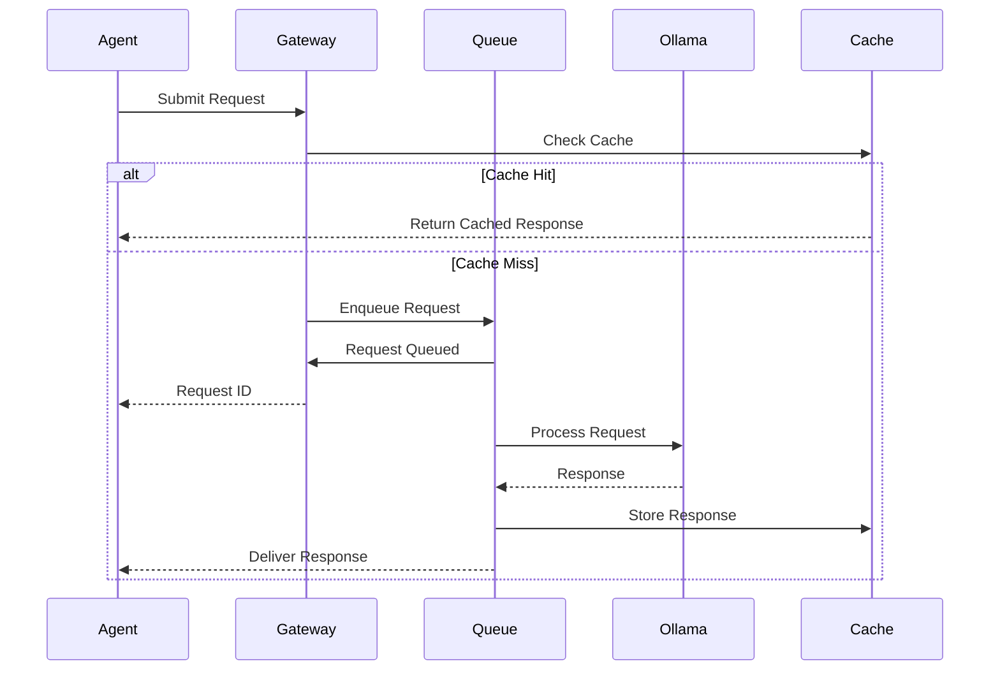
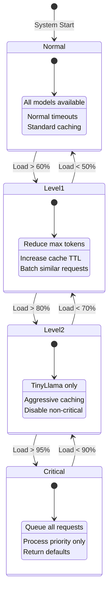

# Agent Communication Patterns for Distributed Ollama System

## Overview

This document defines communication patterns for 131 AI agents interacting with a resource-constrained Ollama service. These patterns ensure reliable, efficient, and fault-tolerant communication while preventing system overload.

## Communication Patterns

### 1. Request-Reply with Timeout Pattern

```python
class RequestReplyPattern:
    """
    Basic request-reply with configurable timeout and retries
    """
    def __init__(self, timeout: float = 30.0, max_retries: int = 3):
        self.timeout = timeout
        self.max_retries = max_retries
        self.backoff = ExponentialBackoff(base=2, max_delay=30)
        
    async def execute(self, agent_id: str, request: OllamaRequest) -> OllamaResponse:
        attempt = 0
        last_error = None
        
        while attempt < self.max_retries:
            try:
                return await asyncio.wait_for(
                    self._send_request(agent_id, request),
                    timeout=self.timeout
                )
            except asyncio.TimeoutError:
                logger.warning(f"Timeout for agent {agent_id}, attempt {attempt + 1}")
                last_error = TimeoutError("Request timed out")
            except Exception as e:
                logger.error(f"Error for agent {agent_id}: {e}")
                last_error = e
                
            attempt += 1
            if attempt < self.max_retries:
                delay = self.backoff.get_delay(attempt)
                await asyncio.sleep(delay)
                
        raise CommunicationError(f"Failed after {self.max_retries} attempts", last_error)
```

### 2. Pub-Sub Pattern for Agent Coordination

```python
class AgentPubSubPattern:
    """
    Publish-Subscribe pattern for inter-agent communication
    """
    def __init__(self, redis_client: Redis):
        self.redis = redis_client
        self.subscribers = defaultdict(list)
        self.message_handlers = {}
        
    async def publish(self, channel: str, message: dict):
        """Publish message to a channel"""
        await self.redis.publish(
            channel,
            json.dumps({
                'timestamp': time.time(),
                'message': message,
                'publisher': os.environ.get('AGENT_ID')
            })
        )
        
    async def subscribe(self, channel: str, handler: Callable):
        """Subscribe to a channel with a message handler"""
        pubsub = self.redis.pubsub()
        await pubsub.subscribe(channel)
        
        async for message in pubsub.listen():
            if message['type'] == 'message':
                data = json.loads(message['data'])
                await handler(data)
                
    # Example channels:
    # - ollama:capacity:update - Ollama capacity changes
    # - agent:priority:change - Agent priority updates  
    # - system:degradation:level - System degradation notifications
```

### 3. Message Queue Pattern with Priority

```python
class PriorityQueuePattern:
    """
    Priority-based message queue for Ollama requests
    """
    def __init__(self, redis_client: Redis):
        self.redis = redis_client
        self.queue_prefix = "ollama:queue"
        
    async def enqueue(self, request: OllamaRequest, priority: int = 5):
        """Add request to priority queue (1=highest, 10=lowest)"""
        queue_key = f"{self.queue_prefix}:p{priority}"
        
        message = {
            'id': str(uuid.uuid4()),
            'request': request.dict(),
            'enqueued_at': time.time(),
            'agent_id': os.environ.get('AGENT_ID'),
            'priority': priority
        }
        
        await self.redis.lpush(queue_key, json.dumps(message))
        
    async def dequeue(self) -> Optional[dict]:
        """Get highest priority request"""
        # Check queues in priority order
        for priority in range(1, 11):
            queue_key = f"{self.queue_prefix}:p{priority}"
            message = await self.redis.rpop(queue_key)
            if message:
                return json.loads(message)
        return None
```

### 4. Circuit Breaker Pattern

```python
class CircuitBreakerPattern:
    """
    Prevents cascading failures in agent communication
    """
    def __init__(self, failure_threshold: int = 5, recovery_timeout: int = 60):
        self.failure_threshold = failure_threshold
        self.recovery_timeout = recovery_timeout
        self.failure_count = 0
        self.last_failure_time = None
        self.state = CircuitState.CLOSED
        self._lock = asyncio.Lock()
        
    async def call(self, fn: Callable, *args, **kwargs):
        async with self._lock:
            if self.state == CircuitState.OPEN:
                if self._should_attempt_reset():
                    self.state = CircuitState.HALF_OPEN
                else:
                    raise CircuitOpenError("Circuit breaker is OPEN")
                    
        try:
            result = await fn(*args, **kwargs)
            await self._on_success()
            return result
        except Exception as e:
            await self._on_failure()
            raise
            
    async def _on_success(self):
        async with self._lock:
            self.failure_count = 0
            self.state = CircuitState.CLOSED
            
    async def _on_failure(self):
        async with self._lock:
            self.failure_count += 1
            self.last_failure_time = time.time()
            
            if self.failure_count >= self.failure_threshold:
                self.state = CircuitState.OPEN
                logger.warning(f"Circuit breaker opened after {self.failure_count} failures")
```

### 5. Saga Pattern for Distributed Transactions

```python
class SagaPattern:
    """
    Manages distributed transactions across multiple agents
    """
    def __init__(self):
        self.steps = []
        self.compensations = []
        self.state = SagaState.PENDING
        
    def add_step(self, forward_fn: Callable, compensate_fn: Callable):
        """Add a step with its compensation function"""
        self.steps.append(forward_fn)
        self.compensations.append(compensate_fn)
        
    async def execute(self) -> SagaResult:
        """Execute all steps, compensating on failure"""
        completed_steps = []
        
        try:
            for i, step in enumerate(self.steps):
                result = await step()
                completed_steps.append((i, result))
                
            self.state = SagaState.COMPLETED
            return SagaResult(success=True, results=completed_steps)
            
        except Exception as e:
            logger.error(f"Saga failed at step {len(completed_steps)}: {e}")
            
            # Compensate in reverse order
            for i in range(len(completed_steps) - 1, -1, -1):
                try:
                    await self.compensations[i](completed_steps[i][1])
                except Exception as comp_error:
                    logger.error(f"Compensation failed for step {i}: {comp_error}")
                    
            self.state = SagaState.COMPENSATED
            return SagaResult(success=False, error=e)
```

### 6. Event Sourcing Pattern

```python
class EventSourcingPattern:
    """
    Track all agent-Ollama interactions as events
    """
    def __init__(self, event_store: Redis):
        self.event_store = event_store
        self.event_stream_key = "ollama:events"
        
    async def append_event(self, event_type: str, data: dict):
        """Append event to the event stream"""
        event = {
            'id': str(uuid.uuid4()),
            'type': event_type,
            'timestamp': time.time(),
            'agent_id': os.environ.get('AGENT_ID'),
            'data': data
        }
        
        await self.event_store.xadd(
            self.event_stream_key,
            event,
            maxlen=100000  # Keep last 100k events
        )
        
    async def replay_events(self, from_timestamp: float = 0) -> List[dict]:
        """Replay events from a specific timestamp"""
        events = await self.event_store.xrange(
            self.event_stream_key,
            min=f"{int(from_timestamp * 1000)}-0"
        )
        return [self._parse_event(e) for e in events]
```

### 7. Bulkhead Pattern for Resource Isolation

```python
class BulkheadPattern:
    """
    Isolate resources to prevent total system failure
    """
    def __init__(self):
        self.bulkheads = {
            'opus_agents': asyncio.Semaphore(10),
            'sonnet_agents': asyncio.Semaphore(20),
            'critical_ops': asyncio.Semaphore(5),
            'batch_ops': asyncio.Semaphore(15)
        }
        
    async def execute_in_bulkhead(self, bulkhead_name: str, fn: Callable):
        """Execute function within a bulkhead"""
        if bulkhead_name not in self.bulkheads:
            raise ValueError(f"Unknown bulkhead: {bulkhead_name}")
            
        bulkhead = self.bulkheads[bulkhead_name]
        
        try:
            async with bulkhead:
                return await fn()
        except Exception as e:
            logger.error(f"Error in bulkhead {bulkhead_name}: {e}")
            raise
```

### 8. Backpressure Pattern

```python
class BackpressurePattern:
    """
    Handle system overload by applying backpressure
    """
    def __init__(self, max_queue_size: int = 1000):
        self.max_queue_size = max_queue_size
        self.queue = asyncio.Queue(maxsize=max_queue_size)
        self.dropped_count = 0
        
    async def submit(self, request: OllamaRequest) -> bool:
        """Submit request with backpressure handling"""
        try:
            # Try to add without blocking
            self.queue.put_nowait(request)
            return True
        except asyncio.QueueFull:
            # Queue is full, apply backpressure
            self.dropped_count += 1
            
            # Notify agent to slow down
            await self._notify_backpressure()
            
            # Drop low-priority requests
            if request.priority > 7:
                logger.warning(f"Dropping low-priority request due to backpressure")
                return False
                
            # For high-priority, wait with timeout
            try:
                await asyncio.wait_for(
                    self.queue.put(request),
                    timeout=5.0
                )
                return True
            except asyncio.TimeoutError:
                logger.error(f"Failed to enqueue high-priority request")
                return False
```

## Communication Flows

### 1. Standard Request Flow



### 2. Degraded Mode Flow



### 3. Multi-Agent Coordination Flow

```python
class MultiAgentCoordinator:
    """
    Coordinates multiple agents for complex tasks
    """
    def __init__(self):
        self.registry = ConsulRegistry()
        self.message_bus = RedisMessageBus()
        
    async def coordinate_task(self, task: ComplexTask) -> TaskResult:
        # 1. Discover available agents
        agents = await self.registry.discover_agents(
            capabilities=task.required_capabilities
        )
        
        # 2. Create execution plan
        plan = self._create_execution_plan(task, agents)
        
        # 3. Execute with coordination
        saga = SagaPattern()
        
        for step in plan.steps:
            saga.add_step(
                forward_fn=partial(self._execute_step, step),
                compensate_fn=partial(self._compensate_step, step)
            )
            
        # 4. Execute and handle failures
        result = await saga.execute()
        
        # 5. Aggregate results
        if result.success:
            return self._aggregate_results(result.results)
        else:
            return TaskResult(success=False, error=result.error)
```

## Best Practices

### 1. Request Optimization

```python
# DO: Batch similar requests
requests = [req1, req2, req3]  # Similar prompts
batched = batch_requests(requests)
response = await ollama_client.process_batch(batched)

# DON'T: Send many small requests
for req in requests:
    response = await ollama_client.process(req)  # Inefficient
```

### 2. Error Handling

```python
# DO: Implement proper error handling with context
try:
    response = await ollama_client.generate(prompt)
except OllamaOverloadError:
    # Try with simpler model
    response = await ollama_client.generate(prompt, model="tinyllama")
except OllamaTimeoutError:
    # Return cached or default response
    response = await cache.get_default(prompt_type)
    
# DON'T: Let errors propagate without handling
response = await ollama_client.generate(prompt)  # May crash agent
```

### 3. Resource Awareness

```python
# DO: Check resource availability
if await resource_monitor.is_degraded():
    request.max_tokens = 512  # Reduce resource usage
    request.temperature = 0.5  # Faster generation
    
# DON'T: Always use maximum resources
request.max_tokens = 4096  # May cause OOM
```

## Monitoring Integration

### Key Metrics to Track

```yaml
Communication Metrics:
  - request_latency_ms: Histogram
  - queue_depth: Gauge
  - circuit_breaker_state: Enum
  - cache_hit_rate: Counter
  - dropped_requests: Counter
  - retry_count: Counter
  
Pattern-Specific Metrics:
  - saga_completion_rate: Gauge
  - bulkhead_saturation: Gauge
  - backpressure_events: Counter
  - coordination_failures: Counter
```

### Alerting Rules

```yaml
Alerts:
  - name: HighRequestLatency
    condition: avg(request_latency_ms) > 5000
    severity: warning
    
  - name: CircuitBreakerOpen
    condition: circuit_breaker_state == "OPEN"
    severity: critical
    
  - name: QueueSaturation
    condition: queue_depth > 0.8 * max_queue_size
    severity: warning
    
  - name: ExcessiveRetries
    condition: rate(retry_count) > 10/min
    severity: warning
```

## Security Considerations

### 1. Message Validation

```python
class MessageValidator:
    """Validate all inter-agent messages"""
    
    @staticmethod
    async def validate_request(request: dict) -> bool:
        # Check required fields
        required = ['agent_id', 'request_id', 'timestamp', 'signature']
        if not all(field in request for field in required):
            return False
            
        # Verify signature
        if not await verify_agent_signature(request):
            return False
            
        # Check timestamp freshness (prevent replay)
        if abs(time.time() - request['timestamp']) > 300:  # 5 min window
            return False
            
        return True
```

### 2. Rate Limiting per Agent

```python
class AgentRateLimiter:
    """Enforce rate limits per agent type"""
    
    def __init__(self):
        self.limits = {
            'opus': RateLimit(10, 60),      # 10 req/min
            'sonnet': RateLimit(20, 60),    # 20 req/min
            'system': RateLimit(50, 60)     # 50 req/min
        }
```

## Conclusion

These communication patterns provide a robust foundation for 131 AI agents to interact efficiently with a resource-constrained Ollama service. The patterns emphasize:

1. **Reliability**: Multiple retry and fallback mechanisms
2. **Efficiency**: Request batching and caching
3. **Resilience**: Circuit breakers and bulkheads
4. **Scalability**: Queue-based decoupling
5. **Observability**: Comprehensive monitoring and tracing

Each pattern can be combined with others to create sophisticated communication flows that handle the complexity of distributed AI agent systems.