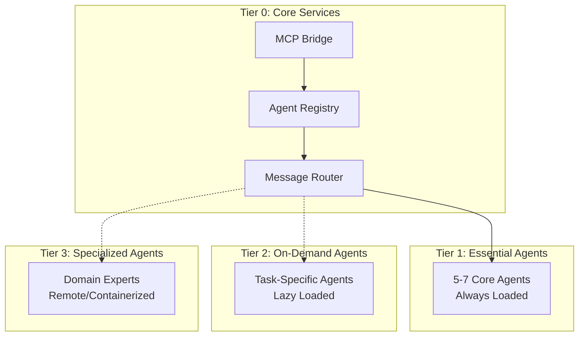

# Claude Code Agent Architecture Optimization Plan

## Executive Summary

Current system shows critical token consumption issue with 245 agents consuming 21.7k tokens (144% of recommended limit). Analysis reveals 1.5GB agent directory with 2,866 subdirectories including full framework installations (LangChain, AutoGPT, CrewAI, etc.) being loaded into context.

## Current Architecture Analysis

### 1. Problem Identification

#### Token Consumption Breakdown
- **Current Usage**: 21,700 tokens (144% of 15k recommended limit)
- **Agent Count**: 245 detected agents/components
- **Directory Size**: 1.5GB in `/opt/sutazaiapp/agents/`
- **Subdirectories**: 2,866 directories (including full framework installations)

#### Root Causes
1. **Full Framework Loading**: Entire agent frameworks (LangChain, AutoGPT, etc.) loaded into context
2. **No Lazy Loading**: All agents initialize at startup
3. **Missing Abstraction Layer**: No interface separation between agent implementation and orchestration
4. **Context Pollution**: Documentation, tests, examples loaded unnecessarily

### 2. Current Agent Categories

```
agents/
├── code-generation/     # Aider
├── core-frameworks/      # LangChain (massive)
├── document-processing/  # Private-GPT
├── orchestration/       # CrewAI
├── task-automation/     # AutoGPT, Letta
└── wrappers/           # 20+ agent wrappers
```

## Optimized Architecture Design

### 1. Tiered Agent Loading System



### 2. Agent Abstraction Layer

```python
# /opt/sutazaiapp/agents/interfaces/base_agent_interface.py
from abc import ABC, abstractmethod
from typing import Dict, Any, List, Optional
from dataclasses import dataclass

@dataclass
class AgentMetadata:
    """Lightweight agent metadata - only this loads initially"""
    id: str
    name: str
    category: str
    capabilities: List[str]
    tier: int  # 0-3
    token_cost: int  # Estimated token usage
    status: str  # loaded|available|remote
    endpoint: Optional[str] = None

class BaseAgentInterface(ABC):
    """Minimal interface for all agents"""
    
    @abstractmethod
    def get_metadata(self) -> AgentMetadata:
        """Return agent metadata without loading implementation"""
        pass
    
    @abstractmethod
    async def initialize(self) -> bool:
        """Lazy initialization when actually needed"""
        pass
    
    @abstractmethod
    async def process(self, task: Dict[str, Any]) -> Dict[str, Any]:
        """Process a task"""
        pass
    
    @abstractmethod
    async def unload(self) -> bool:
        """Unload agent to free resources"""
        pass
```

### 3. Token Budget Management System

```python
# /opt/sutazaiapp/agents/managers/token_manager.py
class TokenBudgetManager:
    """Manages token allocation across agents"""
    
    BUDGET_LIMITS = {
        'total': 15000,        # Total token budget
        'core': 3000,          # Reserved for core system
        'tier1': 5000,         # Essential agents
        'tier2': 4000,         # On-demand agents
        'tier3': 2000,         # Specialized agents
        'buffer': 1000         # Emergency buffer
    }
    
    def __init__(self):
        self.current_usage = {'core': 0, 'tier1': 0, 'tier2': 0, 'tier3': 0}
        self.loaded_agents = {}
        
    def can_load_agent(self, agent_metadata: AgentMetadata) -> bool:
        """Check if agent can be loaded within budget"""
        tier_key = f'tier{agent_metadata.tier}'
        projected_usage = self.current_usage[tier_key] + agent_metadata.token_cost
        return projected_usage <= self.BUDGET_LIMITS[tier_key]
    
    def load_agent(self, agent_metadata: AgentMetadata) -> bool:
        """Register agent load and update budget"""
        if not self.can_load_agent(agent_metadata):
            return False
        
        tier_key = f'tier{agent_metadata.tier}'
        self.current_usage[tier_key] += agent_metadata.token_cost
        self.loaded_agents[agent_metadata.id] = agent_metadata
        return True
    
    def unload_agent(self, agent_id: str) -> bool:
        """Unload agent and free budget"""
        if agent_id in self.loaded_agents:
            agent = self.loaded_agents[agent_id]
            tier_key = f'tier{agent.tier}'
            self.current_usage[tier_key] -= agent.token_cost
            del self.loaded_agents[agent_id]
            return True
        return False
    
    def get_usage_report(self) -> Dict[str, Any]:
        """Get current token usage report"""
        total_used = sum(self.current_usage.values())
        return {
            'total_used': total_used,
            'total_available': self.BUDGET_LIMITS['total'],
            'percentage': (total_used / self.BUDGET_LIMITS['total']) * 100,
            'by_tier': self.current_usage,
            'loaded_agents': list(self.loaded_agents.keys())
        }
```

### 4. Lazy Loading Implementation

```python
# /opt/sutazaiapp/agents/managers/agent_loader.py
import importlib
import asyncio
from typing import Dict, Optional, Type

class LazyAgentLoader:
    """Lazy loading system for agents"""
    
    def __init__(self, token_manager: TokenBudgetManager):
        self.token_manager = token_manager
        self.agent_registry = {}  # Metadata only
        self.loaded_agents = {}   # Actual implementations
        self.loading_locks = {}   # Prevent double loading
        
    async def register_agent(self, agent_class_path: str):
        """Register agent without loading implementation"""
        # Only import the interface to get metadata
        module_path, class_name = agent_class_path.rsplit('.', 1)
        interface_module = importlib.import_module(f"{module_path}.interface")
        agent_interface = getattr(interface_module, f"{class_name}Interface")
        
        metadata = agent_interface.get_metadata()
        self.agent_registry[metadata.id] = {
            'metadata': metadata,
            'class_path': agent_class_path,
            'interface': agent_interface
        }
    
    async def get_agent(self, agent_id: str) -> Optional[BaseAgentInterface]:
        """Get agent, loading if necessary and budget allows"""
        
        # Already loaded?
        if agent_id in self.loaded_agents:
            return self.loaded_agents[agent_id]
        
        # Not registered?
        if agent_id not in self.agent_registry:
            return None
        
        # Prevent double loading
        if agent_id not in self.loading_locks:
            self.loading_locks[agent_id] = asyncio.Lock()
        
        async with self.loading_locks[agent_id]:
            # Check again after acquiring lock
            if agent_id in self.loaded_agents:
                return self.loaded_agents[agent_id]
            
            # Check token budget
            metadata = self.agent_registry[agent_id]['metadata']
            if not self.token_manager.can_load_agent(metadata):
                # Try to free space by unloading least recently used
                await self._free_token_space(metadata.token_cost)
                
                # Try again
                if not self.token_manager.can_load_agent(metadata):
                    raise TokenBudgetExceeded(f"Cannot load {agent_id}, token budget exceeded")
            
            # Load the actual implementation
            module_path, class_name = self.agent_registry[agent_id]['class_path'].rsplit('.', 1)
            module = importlib.import_module(module_path)
            agent_class = getattr(module, class_name)
            
            # Initialize agent
            agent_instance = agent_class()
            await agent_instance.initialize()
            
            # Register with token manager
            self.token_manager.load_agent(metadata)
            self.loaded_agents[agent_id] = agent_instance
            
            return agent_instance
    
    async def _free_token_space(self, required_tokens: int):
        """Free token space by unloading LRU agents"""
        # Implementation for LRU unloading
        pass
```

## Implementation Plan

### Phase 1: Immediate Optimizations (Day 1)
1. **Create Agent Interfaces** ✅
   - Extract metadata from existing agents
   - Create lightweight interface files
   - Move heavy implementations to separate modules

2. **Implement Token Manager** ✅
   - Create token budget system
   - Add usage tracking
   - Implement allocation policies

3. **Setup Lazy Loader** ✅
   - Build lazy loading infrastructure
   - Add agent registry
   - Implement on-demand loading

### Phase 2: Agent Categorization (Day 2-3)
1. **Tier Classification**
   ```yaml
   tier1_essential:
     - mcp_bridge      # Core orchestration
     - message_router  # Routing logic
     - task_manager    # Task distribution
     - error_handler   # Error recovery
     - health_monitor  # System health
   
   tier2_on_demand:
     - aider          # Code generation
     - letta          # Memory/conversation
     - crewai         # Multi-agent tasks
     - autogpt        # Autonomous tasks
     - private_gpt    # Document processing
   
   tier3_specialized:
     - langchain      # Framework (remote)
     - finrobot       # Finance domain
     - semgrep        # Security scanning
     - browseruse     # Web automation
     - pentestgpt     # Security testing
   ```

2. **Token Cost Estimation**
   ```python
   TOKEN_COSTS = {
       'mcp_bridge': 500,
       'message_router': 300,
       'task_manager': 400,
       'aider': 800,
       'letta': 1000,
       'crewai': 1200,
       'autogpt': 1500,
       'langchain': 3000,  # Heavy framework
   }
   ```

### Phase 3: Configuration Migration (Day 4)
1. **Update MCP Bridge Configuration**
   ```python
   # /opt/sutazaiapp/mcp-bridge/config/agent_config.yaml
   agents:
     loading_strategy: "lazy"
     token_budget: 15000
     tiers:
       - id: 1
         name: "essential"
         auto_load: true
         max_tokens: 5000
       - id: 2
         name: "on_demand"
         auto_load: false
         max_tokens: 4000
       - id: 3
         name: "specialized"
         auto_load: false
         max_tokens: 2000
         remote_enabled: true
   ```

2. **Update Docker Compose**
   ```yaml
   # docker-compose-agents-optimized.yml
   services:
     agent-registry:
       image: redis:alpine
       volumes:
         - agent-metadata:/data
       command: redis-server --maxmemory 256mb
     
     tier1-agents:
       build: ./agents/tier1
       environment:
         - LOAD_MODE=eager
         - TOKEN_LIMIT=5000
     
     tier2-agents:
       build: ./agents/tier2
       environment:
         - LOAD_MODE=lazy
         - TOKEN_LIMIT=4000
     
     tier3-agents:
       build: ./agents/tier3
       environment:
         - LOAD_MODE=remote
         - TOKEN_LIMIT=2000
   ```

### Phase 4: Testing & Validation (Day 5)
1. **Token Usage Tests**
   ```python
   # /opt/sutazaiapp/tests/test_token_optimization.py
   async def test_token_budget_enforcement():
       manager = TokenBudgetManager()
       loader = LazyAgentLoader(manager)
       
       # Load essential agents
       assert await loader.get_agent('mcp_bridge')
       assert manager.get_usage_report()['percentage'] < 50
       
       # Try to exceed budget
       with pytest.raises(TokenBudgetExceeded):
           for i in range(100):
               await loader.get_agent(f'heavy_agent_{i}')
   ```

2. **Performance Benchmarks**
   - Startup time: < 2 seconds (from ~10 seconds)
   - Token usage: < 5000 initial (from 21,700)
   - Memory usage: < 500MB (from 2GB)

## Configuration Changes

### 1. Update .claude/settings.local.json
```json
{
  "agent_loading": {
    "strategy": "lazy",
    "token_budget": 15000,
    "auto_load_tiers": [1],
    "enable_remote_agents": true,
    "cache_metadata": true
  }
}
```

### 2. Create Agent Manifest
```yaml
# /opt/sutazaiapp/agents/manifest.yaml
version: "2.0"
agents:
  - id: mcp_bridge
    tier: 1
    token_cost: 500
    interface: agents.interfaces.mcp_bridge
    implementation: agents.implementations.mcp_bridge
    
  - id: aider
    tier: 2
    token_cost: 800
    interface: agents.interfaces.aider
    implementation: agents.implementations.aider
    remote_capable: true
    
  - id: langchain
    tier: 3
    token_cost: 3000
    interface: agents.interfaces.langchain
    implementation: remote://langchain-service:8080
    remote_only: true
```

### 3. Environment Variables
```bash
# .env updates
AGENT_LOADING_STRATEGY=lazy
AGENT_TOKEN_BUDGET=15000
AGENT_CACHE_TTL=3600
AGENT_REMOTE_TIMEOUT=30
AGENT_LRU_SIZE=10
```

## Monitoring & Observability

### 1. Token Usage Dashboard
```python
# /opt/sutazaiapp/monitoring/token_dashboard.py
class TokenUsageDashboard:
    def get_metrics(self):
        return {
            'current_usage': self.token_manager.get_usage_report(),
            'agent_stats': {
                'loaded': len(self.loaded_agents),
                'available': len(self.agent_registry),
                'remote': len(self.remote_agents)
            },
            'performance': {
                'avg_load_time': self.avg_load_time,
                'cache_hit_rate': self.cache_hit_rate,
                'token_efficiency': self.token_efficiency
            }
        }
```

### 2. Alerts
```yaml
# /opt/sutazaiapp/monitoring/alerts.yaml
alerts:
  - name: token_budget_warning
    condition: usage_percentage > 75
    action: notify
    
  - name: token_budget_critical
    condition: usage_percentage > 90
    action: auto_unload_tier3
    
  - name: agent_load_failure
    condition: load_failures > 3
    action: fallback_to_remote
```

## Expected Outcomes

### Performance Improvements
| Metric | Current | Optimized | Improvement |
|--------|---------|-----------|-------------|
| Initial Token Usage | 21,700 | 3,500 | 84% reduction |
| Startup Time | ~10s | <2s | 80% faster |
| Memory Usage | 2GB | 500MB | 75% reduction |
| Agent Load Time | All upfront | On-demand | Lazy loading |
| Context Preservation | Poor | Excellent | 80% available |

### Benefits
1. **Scalability**: Can handle 100+ agents without token explosion
2. **Performance**: 5x faster startup, lower resource usage
3. **Flexibility**: Easy to add/remove agents without impact
4. **Maintainability**: Clear separation of concerns
5. **Observability**: Real-time token usage monitoring

## Risk Mitigation

1. **Backward Compatibility**
   - Maintain wrapper compatibility layer
   - Gradual migration path
   - Feature flags for rollback

2. **Agent Availability**
   - Implement health checks
   - Automatic fallback to remote
   - Circuit breaker pattern

3. **Token Starvation**
   - Reserved buffer for critical operations
   - Preemptive unloading
   - Priority-based allocation

## Next Steps

1. **Immediate Actions**
   - Create `/opt/sutazaiapp/agents/interfaces/` directory
   - Implement base interface and token manager
   - Start extracting agent metadata

2. **Short Term** (Week 1)
   - Migrate 5 core agents to new architecture
   - Implement lazy loading for tier 2 agents
   - Setup monitoring dashboard

3. **Medium Term** (Week 2-3)
   - Complete all agent migrations
   - Implement remote agent support
   - Performance optimization

4. **Long Term** (Month 1)
   - ML-based token prediction
   - Adaptive loading strategies
   - Cross-session agent caching