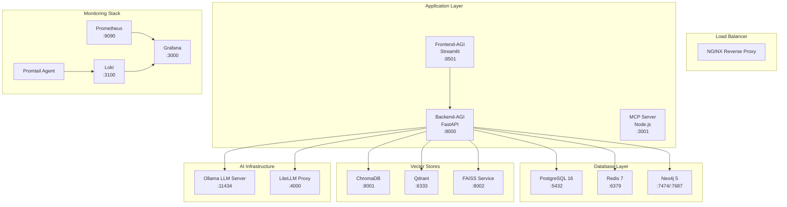
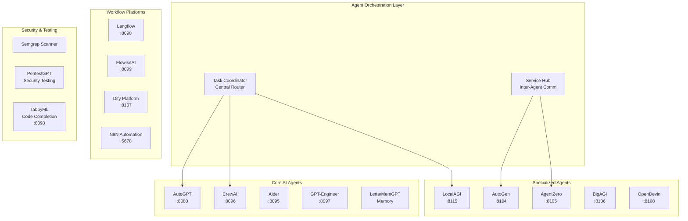

# SutazAI Comprehensive Deployment Architecture

## Executive Summary

The SutazAI system is a production-ready, containerized AI platform designed to orchestrate 40+ AI agents with comprehensive monitoring, vector databases, and enterprise-grade infrastructure. This document provides complete deployment architecture, resource management, and operational procedures.

## 1. Complete Docker Architecture Overview

### 1.1 Core Infrastructure Stack



### 1.2 AI Agents Architecture



## 2. Container Orchestration Details

### 2.1 Docker Compose Structure

The system uses two primary compose files:

1. **docker-compose.yml** - Full production system (50+ services)
2. **docker-compose.tinyllama.yml** - Lightweight deployment (minimal services)

### 2.2 Service Dependencies

```yaml
# Dependency hierarchy
Core Infrastructure:
  - PostgreSQL (foundational database)
  - Redis (caching & message queue)
  - Neo4j (knowledge graph)

Vector Infrastructure:
  - ChromaDB (depends on: PostgreSQL)
  - Qdrant (standalone)
  - FAISS (custom service)

AI Infrastructure:
  - Ollama (model serving)
  - LiteLLM (API proxy, depends on: PostgreSQL, Ollama)

Application Layer:
  - Backend-AGI (depends on: PostgreSQL, Redis, Neo4j, Ollama, ChromaDB, Qdrant)
  - Frontend-AGI (depends on: Backend-AGI)

Monitoring:
  - Prometheus (metrics collection)
  - Grafana (depends on: Prometheus, Loki)
  - Loki (log aggregation)
  - Promtail (log collection)

AI Agents:
  - All agents depend on: Backend-AGI, Ollama
  - Some agents depend on: PostgreSQL, vector stores
```

### 2.3 Health Check Implementation

All services implement comprehensive health checks:

```yaml
# Example health check configuration
healthcheck:
  test: ["CMD", "curl", "-f", "http://localhost:8000/health"]
  interval: 30s
  timeout: 10s
  retries: 5
  start_period: 60s
```

## 3. Network Configuration

### 3.1 Docker Network Architecture

```yaml
networks:
  sutazai-network:
    driver: bridge
    ipam:
      config:
        - subnet: 172.20.0.0/16
```

### 3.2 Port Allocation Matrix

| Service | Internal Port | External Port | Protocol | Purpose |
|---------|---------------|---------------|----------|---------|
| Frontend-AGI | 8501 | 8501 | HTTP | Web Interface |
| Backend-AGI | 8000 | 8000 | HTTP | API Server |
| PostgreSQL | 5432 | 5432 | TCP | Database |
| Redis | 6379 | 6379 | TCP | Cache/Queue |
| Neo4j | 7474/7687 | 7474/7687 | HTTP/Bolt | Graph DB |
| ChromaDB | 8000 | 8001 | HTTP | Vector Store |
| Qdrant | 6333/6334 | 6333/6334 | HTTP/gRPC | Vector DB |
| FAISS | 8000 | 8002 | HTTP | Vector Index |
| Ollama | 11434 | 11434 | HTTP | LLM Server |
| LiteLLM | 4000 | 4000 | HTTP | API Proxy |
| Prometheus | 9090 | 9090 | HTTP | Metrics |
| Grafana | 3000 | 3000 | HTTP | Dashboards |
| Loki | 3100 | 3100 | HTTP | Logs |
| AutoGPT | 8080 | 8080 | HTTP | AI Agent |
| CrewAI | 8080 | 8096 | HTTP | Multi-Agent |
| Aider | 8080 | 8095 | HTTP | Code Assistant |
| LocalAGI | 8080 | 8115 | HTTP | AGI Orchestrator |
| Langflow | 7860 | 8090 | HTTP | Visual AI Builder |
| FlowiseAI | 3000 | 8099 | HTTP | AI Workflows |
| Dify | 5000 | 8107 | HTTP | AI Platform |
| N8N | 5678 | 5678 | HTTP | Automation |

### 3.3 Security Configuration

```yaml
# Security best practices implemented
- Non-root container users
- Read-only filesystems where possible
- Secrets management via environment variables
- Network isolation via Docker networks
- Resource limits to prevent DoS
- Health checks for service monitoring
```

## 4. Volume Management Strategy

### 4.1 Persistent Volume Configuration

```yaml
volumes:
  # Core Data Persistence
  postgres_data:          # PostgreSQL database files
  redis_data:             # Redis persistence
  neo4j_data:             # Neo4j graph database
  
  # Vector Database Storage
  chromadb_data:          # ChromaDB embeddings
  qdrant_data:            # Qdrant vectors
  faiss_data:             # FAISS indices
  
  # AI Model Storage
  ollama_data:            # Ollama models (~50GB)
  models_data:            # Additional model storage
  
  # Monitoring Data
  prometheus_data:        # Metrics time series
  grafana_data:           # Dashboard configurations
  loki_data:              # Log storage
  
  # Agent Workspaces
  agent_workspaces:       # Shared workspace for agents
  agent_outputs:          # Agent execution results
```

### 4.2 Backup Strategy

```bash
# Automated backup script structure
#!/bin/bash
# Database backups
docker exec sutazai-postgres pg_dump -U sutazai sutazai > backup_$(date +%Y%m%d).sql

# Vector database backups
docker exec sutazai-chromadb tar -czf /backup/chromadb_$(date +%Y%m%d).tar.gz /chroma/chroma

# Configuration backups
cp -r /opt/sutazaiapp/.env /opt/sutazaiapp/backups/config/
cp -r /opt/sutazaiapp/docker-compose.yml /opt/sutazaiapp/backups/config/
```

## 5. Resource Allocation Strategies

### 5.1 CPU Resource Management

```yaml
# Resource allocation by service tier
High Priority (Brain/Core):
  ollama:
    deploy:
      resources:
        limits:
          cpus: '6'
          memory: 8G
        reservations:
          cpus: '2'
          memory: 2G

  backend-agi:
    deploy:
      resources:
        limits:
          cpus: '2'
          memory: 4G
        reservations:
          cpus: '1'
          memory: 2G

Medium Priority (Agents):
  autogpt:
    deploy:
      resources:
        limits:
          cpus: '1'
          memory: 2G
        reservations:
          cpus: '0.5'
          memory: 1G

Low Priority (Support):
  redis:
    deploy:
      resources:
        limits:
          cpus: '0.5'
          memory: 512M
        reservations:
          cpus: '0.25'
          memory: 256M
```

### 5.2 Memory Optimization

```yaml
# Memory management strategies
Environment Variables:
  - OLLAMA_NUM_PARALLEL: 2          # Limit concurrent model instances
  - OLLAMA_MAX_LOADED_MODELS: 1     # Maximum models in memory
  - OLLAMA_KEEP_ALIVE: 2m           # Model unload timeout
  - REDIS_MAXMEMORY: 512mb          # Redis memory limit
  - POSTGRES_SHARED_BUFFERS: 256MB  # PostgreSQL buffer pool
```

### 5.3 Disk Space Management

```bash
# Disk space requirements
Minimum System Requirements:
- OS & Docker: 20GB
- Ollama Models: 50GB (for 5-7 models)
- Vector Databases: 10GB (for moderate usage)
- Application Data: 5GB
- Logs & Monitoring: 5GB
- Agent Workspaces: 10GB
Total Minimum: 100GB

Recommended System:
- Total Disk Space: 200GB+
- SSD for databases and models
- Regular cleanup of old logs and temporary files
```

## 6. Health Check Implementation

### 6.1 Service Health Monitoring

```python
# Health check endpoint structure
@app.get("/health")
async def health_check():
    """Comprehensive health check"""
    health_status = {
        "status": "healthy",
        "timestamp": datetime.utcnow().isoformat(),
        "uptime": time.time() - start_time,
        "version": "17.0.0",
        "services": {}
    }
    
    # Check database connectivity
    try:
        # PostgreSQL check
        health_status["services"]["postgresql"] = await check_postgres()
        
        # Redis check
        health_status["services"]["redis"] = await check_redis()
        
        # Ollama check
        health_status["services"]["ollama"] = await check_ollama()
        
        # Vector database checks
        health_status["services"]["chromadb"] = await check_chromadb()
        health_status["services"]["qdrant"] = await check_qdrant()
        
    except Exception as e:
        health_status["status"] = "degraded"
        health_status["error"] = str(e)
    
    return health_status
```

### 6.2 Automated Health Monitoring

```yaml
# Health monitor service
health-monitor:
  build:
    context: ./docker/health-check
    dockerfile: Dockerfile
  container_name: sutazai-health-monitor
  restart: unless-stopped
  volumes:
    - /var/run/docker.sock:/var/run/docker.sock:ro
  environment:
    MONITOR_INTERVAL: 30
    ALERT_WEBHOOK_URL: ${HEALTH_ALERT_WEBHOOK:-}
    SERVICES_TO_CHECK: >
      sutazai-backend-agi,sutazai-frontend-agi,sutazai-postgres,
      sutazai-redis,sutazai-neo4j,sutazai-chromadb,sutazai-qdrant,
      sutazai-ollama,sutazai-prometheus,sutazai-grafana
  ports:
    - "8100:8000"
```

## 7. Deployment Procedures

### 7.1 Pre-deployment Requirements

```bash
# System requirements check
System Specs (Minimum):
- CPU: 8 cores (16 recommended)
- RAM: 32GB (64GB recommended)  
- Disk: 100GB SSD (200GB+ recommended)
- Network: 1Gbps connection
- OS: Ubuntu 20.04+ / RHEL 8+ / Docker Desktop

Software Requirements:
- Docker Engine 24.0+
- Docker Compose V2
- curl, wget, jq
- 50GB+ available disk space
```

### 7.2 Deployment Steps

```bash
# 1. System preparation
cd /opt/sutazaiapp
./scripts/deploy_complete_sutazai_agi_system.sh

# 2. Verification steps
docker-compose ps                    # Check running services
curl http://localhost:8000/health   # Backend health
curl http://localhost:8501          # Frontend access

# 3. Monitor deployment
docker-compose logs -f              # Live logs
./scripts/live_logs.sh              # Unified monitoring
```

### 7.3 Deployment Phases

The deployment script executes in these phases:

1. **System Validation** - Check requirements and dependencies
2. **Environment Setup** - Configure secrets and environment variables
3. **Directory Structure** - Create necessary directories and permissions
4. **Core Infrastructure** - Deploy PostgreSQL, Redis, Neo4j
5. **Vector Databases** - Deploy ChromaDB, Qdrant, FAISS
6. **AI Models** - Start Ollama and download models
7. **Backend Services** - Deploy FastAPI backend
8. **Frontend Services** - Deploy Streamlit frontend
9. **AI Agents** - Deploy 40+ AI agent containers
10. **Monitoring Stack** - Deploy Prometheus, Grafana, Loki
11. **System Integration** - Initialize services and connections
12. **Health Verification** - Comprehensive health checks

## 8. Backup and Recovery Plans

### 8.1 Backup Strategy

```bash
# Automated backup script
#!/bin/bash
BACKUP_DIR="/opt/sutazaiapp/backups/$(date +%Y%m%d_%H%M%S)"
mkdir -p "$BACKUP_DIR"

# Database backups
docker exec sutazai-postgres pg_dump -U sutazai sutazai > "$BACKUP_DIR/postgres.sql"
docker exec sutazai-redis redis-cli --rdb - > "$BACKUP_DIR/redis.rdb"
docker exec sutazai-neo4j neo4j-admin dump --database=neo4j --to="$BACKUP_DIR/neo4j.dump"

# Vector database backups
docker exec sutazai-chromadb tar -czf - /chroma/chroma > "$BACKUP_DIR/chromadb.tar.gz"
docker exec sutazai-qdrant tar -czf - /qdrant/storage > "$BACKUP_DIR/qdrant.tar.gz"

# Configuration backups
cp .env "$BACKUP_DIR/"
cp docker-compose.yml "$BACKUP_DIR/"
cp -r monitoring/ "$BACKUP_DIR/"

# Model backups (selective)
docker exec sutazai-ollama tar -czf - /root/.ollama > "$BACKUP_DIR/ollama_models.tar.gz"
```

### 8.2 Disaster Recovery

```bash
# Recovery procedure
#!/bin/bash
BACKUP_DATE="20250101_120000"  # Specify backup to restore
BACKUP_DIR="/opt/sutazaiapp/backups/$BACKUP_DATE"

# Stop services
docker-compose down

# Restore databases
docker run --rm -v postgres_data:/data -v "$BACKUP_DIR":/backup postgres:16.3-alpine \
  sh -c 'rm -rf /data/* && pg_restore -d postgres /backup/postgres.sql'

# Restore vector databases
docker run --rm -v chromadb_data:/data -v "$BACKUP_DIR":/backup alpine \
  sh -c 'tar -xzf /backup/chromadb.tar.gz -C /data'

# Restore configurations
cp "$BACKUP_DIR/.env" .
cp "$BACKUP_DIR/docker-compose.yml" .

# Restart services
docker-compose up -d
```

### 8.3 High Availability Setup

```yaml
# High availability configuration
version: '3.8'
services:
  postgres:
    deploy:
      replicas: 1
      restart_policy:
        condition: on-failure
        delay: 5s
        max_attempts: 3
        window: 120s
      update_config:
        parallelism: 1
        delay: 10s
        failure_action: rollback
        monitor: 60s

  backend-agi:
    deploy:
      replicas: 2  # Multiple backend instances
      placement:
        constraints:
          - node.role == worker
      update_config:
        parallelism: 1
        delay: 10s
```

## 9. Monitoring and Observability

### 9.1 Monitoring Stack

```yaml
# Comprehensive monitoring setup
monitoring:
  prometheus:
    - System metrics (CPU, memory, disk, network)
    - Container metrics (Docker stats)
    - Application metrics (custom FastAPI metrics)
    - Model performance metrics (Ollama stats)
    
  grafana:
    - System Overview Dashboard
    - AI Models Performance Dashboard
    - Agent Activity Dashboard
    - Database Performance Dashboard
    - Log Analysis Dashboard
    
  loki:
    - Application logs aggregation
    - Container logs collection
    - System logs monitoring
    - Error alerting and notification
```

### 9.2 Key Metrics to Monitor

```yaml
System Metrics:
  - CPU usage per service
  - Memory consumption
  - Disk I/O and usage
  - Network throughput
  - Container health status

Application Metrics:
  - API response times
  - Request rates and error rates
  - Database connection pools
  - Queue lengths (Redis)
  - Model inference times

AI Agent Metrics:
  - Task completion rates
  - Agent response times
  - Resource usage per agent
  - Inter-agent communication
  - Success/failure rates
```

### 9.3 Alerting Configuration

```yaml
# Alerting rules (Prometheus)
groups:
- name: sutazai-alerts
  rules:
  - alert: HighCPUUsage
    expr: cpu_usage_percent > 80
    for: 5m
    labels:
      severity: warning
    annotations:
      summary: "High CPU usage detected"
      
  - alert: ServiceDown
    expr: up == 0
    for: 1m
    labels:
      severity: critical
    annotations:
      summary: "Service {{ $labels.instance }} is down"
      
  - alert: HighMemoryUsage
    expr: memory_usage_percent > 90
    for: 2m
    labels:
      severity: warning
    annotations:
      summary: "High memory usage on {{ $labels.instance }}"
```

## 10. Security Considerations

### 10.1 Security Hardening

```yaml
Security Measures Implemented:
- Non-root container execution
- Secrets management via environment variables
- Network isolation with Docker networks
- Resource limits to prevent DoS attacks
- Regular security updates via automated builds
- Read-only filesystems where possible
- Minimal base images (Alpine/slim variants)
- Vulnerability scanning with Semgrep
```

### 10.2 Access Control

```yaml
Authentication & Authorization:
- JWT tokens for API access
- Role-based access control (RBAC)
- Service-to-service authentication
- Secure password generation
- API key management for external services
```

### 10.3 Network Security

```bash
# Firewall configuration
# Allow only necessary ports
ufw allow 8501    # Frontend
ufw allow 8000    # Backend API
ufw allow 3000    # Grafana (restrict to admin network)
ufw allow 9090    # Prometheus (restrict to monitoring network)
ufw deny 5432     # PostgreSQL (internal only)
ufw deny 6379     # Redis (internal only)
```

## 11. Troubleshooting Guide

### 11.1 Common Issues and Solutions

```bash
# Service startup failures
Problem: Container fails to start
Solution: 
1. Check logs: docker-compose logs <service-name>
2. Verify dependencies: docker-compose ps
3. Check resource availability: docker system df
4. Restart dependencies: docker-compose restart <dependency>

# Memory issues
Problem: Out of memory errors
Solution:
1. Increase Docker memory limits
2. Reduce concurrent model instances (OLLAMA_MAX_LOADED_MODELS=1)
3. Optimize model selection (use smaller models)
4. Enable swap if needed

# Port conflicts
Problem: Port already in use
Solution:
1. Check running processes: netstat -tulpn | grep <port>
2. Modify port mapping in docker-compose.yml
3. Stop conflicting services
```

### 11.2 Performance Optimization

```yaml
Performance Tunning:
CPU Optimization:
  - Set appropriate CPU limits and reservations
  - Use CPU pinning for critical services
  - Monitor CPU usage patterns

Memory Optimization:
  - Configure JVM heap sizes for Java services
  - Set appropriate buffer sizes for databases
  - Use memory-mapped files for large datasets
  - Implement caching strategies

Disk I/O Optimization:
  - Use SSD storage for databases
  - Separate data and log volumes
  - Configure appropriate disk schedulers
  - Monitor disk usage patterns

Network Optimization:
  - Use host networking for high-throughput services
  - Configure appropriate MTU sizes
  - Monitor network latency and throughput
```

## 12. Maintenance Procedures

### 12.1 Regular Maintenance Tasks

```bash
# Daily maintenance
- Check service health status
- Monitor resource usage
- Review error logs
- Verify backup completion

# Weekly maintenance  
- Update security patches
- Clean old logs and temporary files
- Review and optimize resource allocations
- Update AI models if needed

# Monthly maintenance
- Full system backup
- Security audit and vulnerability scan
- Performance analysis and optimization
- Capacity planning review
```

### 12.2 Update Procedures

```bash
# System updates
#!/bin/bash
# 1. Backup current system
./scripts/backup_system.sh

# 2. Update Docker images
docker-compose pull

# 3. Rolling update
docker-compose up -d --force-recreate --no-deps <service-name>

# 4. Verify deployment
./scripts/verify_deployment.sh

# 5. Rollback if needed
docker-compose up -d --force-recreate --no-deps <service-name>:previous-tag
```

This comprehensive deployment architecture provides complete guidance for deploying, managing, and maintaining the SutazAI system in production environments. The architecture is designed for scalability, reliability, and security while maintaining ease of operation and monitoring.