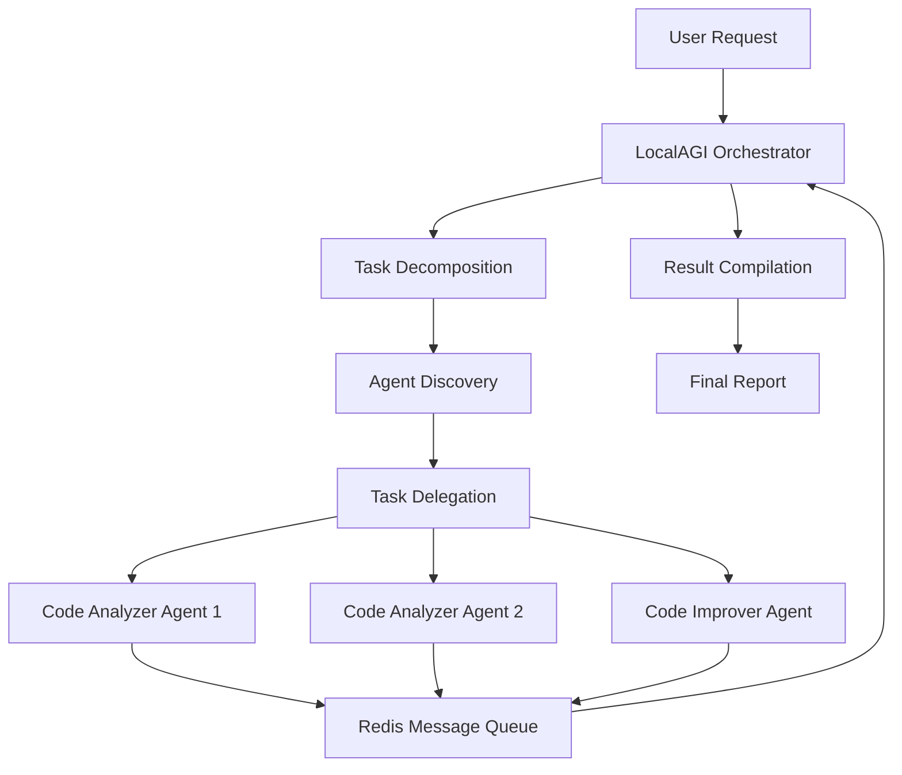

# SutazAI Autonomous Multi-Agent Demonstration

## 🚀 Overview

This demonstration showcases the power of the SutazAI system's autonomous multi-agent orchestration capabilities using LocalAGI. The demo illustrates how AI agents can work together autonomously to solve complex problems through:

- **Multi-agent task delegation** - LocalAGI orchestrator intelligently delegates tasks to specialized agents
- **Redis-based communication** - Agents communicate asynchronously through Redis message queues
- **Local Ollama model integration** - All AI inference runs locally using Ollama models
- **Autonomous workflow execution** - Agents make autonomous decisions about task execution
- **Real-time monitoring** - Live monitoring of agent status and communication

## 🎯 Demonstration Features

### Core Capabilities Demonstrated

1. **LocalAGI Orchestration**
   - Intelligent task decomposition
   - Agent capability discovery
   - Workflow coordination
   - Result compilation

2. **Specialized Agent Types**
   - **Code Analyzer Agents**: Security, performance, and quality analysis
   - **Code Improver Agents**: Refactoring and optimization suggestions
   - **Orchestrator Agent**: Workflow management and coordination

3. **Autonomous Behaviors**
   - Self-organizing task distribution
   - Adaptive workflow execution
   - Intelligent error handling
   - Dynamic agent discovery

4. **Real-world Application**
   - Code vulnerability detection
   - Performance optimization analysis
   - Code quality improvements
   - Automated refactoring suggestions

## 🛠 Quick Start

### Prerequisites

- Docker and Docker Compose running
- SutazAI system deployed (Redis, Ollama)
- Python 3.8+ available

### Run the Demo

```bash
# Simple demo run
./demos/run_demo.sh

# Monitor agents in action
./demos/run_demo.sh --task monitor

# Use more agents for complex workflows
./demos/run_demo.sh --agents 5

# Analyze a specific code file
./demos/run_demo.sh --code-file backend/app/main.py
```

### Command Options

```bash
./demos/run_demo.sh [options]

Options:
  --task TASK        Demo task to run (analyze|monitor) [default: analyze]
  --agents N         Number of agents to create [default: 3]
  --code-file FILE   Path to code file to analyze
  --help             Show help message
```

## 🏗 Architecture

### Agent Communication Flow



### Agent Types and Responsibilities

#### LocalAGI Orchestrator Agent
- **Capabilities**: orchestration, task_delegation, workflow_management
- **Responsibilities**:
  - Discover available agents and their capabilities
  - Decompose complex tasks into subtasks
  - Delegate tasks to appropriate specialized agents
  - Coordinate workflow execution
  - Compile final results and reports

#### Code Analyzer Agent
- **Capabilities**: code_analysis, security_scanning, complexity_analysis
- **Responsibilities**:
  - Security vulnerability detection
  - Performance bottleneck identification
  - Code quality assessment
  - Complexity analysis

#### Code Improver Agent
- **Capabilities**: code_improvement, refactoring, optimization
- **Responsibilities**:
  - Generate improved code versions
  - Provide refactoring suggestions
  - Optimize performance-critical sections
  - Apply best practices

### Communication Protocol

Agents communicate using structured messages through Redis:

```python
{
    "id": "uuid",
    "agent_id": "sender_agent_id",
    "task_id": "task_uuid",
    "message_type": "task_request|task_result|coordination",
    "content": {task_data},
    "target_agent": "recipient_agent_id",
    "timestamp": "iso_timestamp"
}
```

## 📊 Demo Scenarios

### Scenario 1: Code Analysis Workflow

1. **Input**: Code with security and performance issues
2. **Process**:
   - Orchestrator receives analysis request
   - Discovers available analyzer agents
   - Delegates security, performance, and quality analysis
   - Waits for analysis results
   - Delegates improvement task to improver agent
   - Compiles comprehensive report
3. **Output**: Detailed analysis with improvement recommendations

### Scenario 2: Real-time Agent Monitoring

1. **Input**: Monitoring request
2. **Process**:
   - Displays live agent status table
   - Shows agent communication in real-time
   - Monitors task execution progress
   - Updates agent health and activity
3. **Output**: Live dashboard of agent ecosystem

## 🔧 Technical Implementation

### Key Components

#### Redis Communication Layer
```python
# Message sending
self.redis_client.lpush(target_queue, message_data)

# Message receiving
message_data = self.redis_client.rpop(self.message_queue)

# Agent registration
self.redis_client.hset(f"agent:{agent_id}", mapping=agent_data)
```

#### Ollama Integration
```python
async def call_ollama(self, model: str, prompt: str) -> str:
    response = await client.post(
        f"{self.ollama_url}/api/generate",
        json={
            "model": model,
            "prompt": prompt,
            "stream": False
        }
    )
    return response.json().get("response")
```

#### Autonomous Task Orchestration
```python
async def orchestrate_workflow(self, task_data):
    # 1. Discover agents
    agents = await self.discover_agents()
    
    # 2. Delegate subtasks
    for subtask in decomposed_tasks:
        suitable_agent = self.find_capable_agent(subtask, agents)
        await self.delegate_task(subtask, suitable_agent)
    
    # 3. Wait for results
    results = await self.wait_for_results(task_ids)
    
    # 4. Compile final report
    return await self.compile_report(results)
```

## 📈 Expected Outputs

### Analysis Report Structure
```json
{
    "workflow_id": "demo_12345",
    "orchestrator": "localagi_orchestrator",
    "agents_involved": 3,
    "analysis_results": [
        {
            "task_id": "security_analysis",
            "agent_id": "analyzer_1",
            "result": {
                "vulnerabilities": ["SQL injection", "Command injection"],
                "risk_level": "High",
                "recommendations": ["Use parameterized queries", "Sanitize inputs"]
            }
        }
    ],
    "improvement_results": [
        {
            "task_id": "code_improvement",
            "agent_id": "improver_1",
            "result": {
                "improved_code": "def secure_function(user_input)...",
                "changes_made": ["Added input validation", "Fixed SQL injection"],
                "benefits": ["Improved security", "Better performance"]
            }
        }
    ],
    "final_report": "Comprehensive LocalAGI analysis and recommendations...",
    "status": "completed"
}
```

## 🎛 Monitoring and Debugging

### Agent Status Monitoring
The demo provides real-time monitoring of:
- Agent registration and discovery
- Task delegation patterns
- Message queue activity
- Agent health and responsiveness
- Workflow execution progress

### Debug Information
Enable detailed logging by setting:
```bash
export LOG_LEVEL=DEBUG
./demos/run_demo.sh
```

## 🚧 Extending the Demo

### Adding New Agent Types

1. Create new agent class inheriting from `BaseAgent`
2. Define capabilities in `self.capabilities`
3. Implement `process_task()` method
4. Register agent type in demo manager

### Custom Workflows

1. Extend `LocalAGIOrchestratorAgent` with new orchestration methods
2. Define task decomposition logic
3. Implement result compilation strategies

### Integration Points

The demo can be extended to integrate with:
- GitHub repositories for real code analysis
- CI/CD pipelines for automated code review
- Code quality dashboards
- Security scanning tools

## 🔒 Security Considerations

- All AI inference runs locally through Ollama
- No code or data sent to external services
- Agent communication secured through Redis
- Task isolation and error handling
- Resource usage monitoring and limits

## 📝 Next Steps

After running the demo, consider:

1. **Scaling**: Deploy more specialized agent types
2. **Integration**: Connect to real codebases and workflows
3. **Customization**: Adapt agents for specific use cases
4. **Production**: Implement robust error handling and monitoring
5. **Enhancement**: Add more sophisticated AI models and capabilities

---

This demonstration showcases just a fraction of the SutazAI system's capabilities. The autonomous multi-agent architecture can be extended to handle virtually any complex workflow requiring intelligent coordination and specialized expertise.