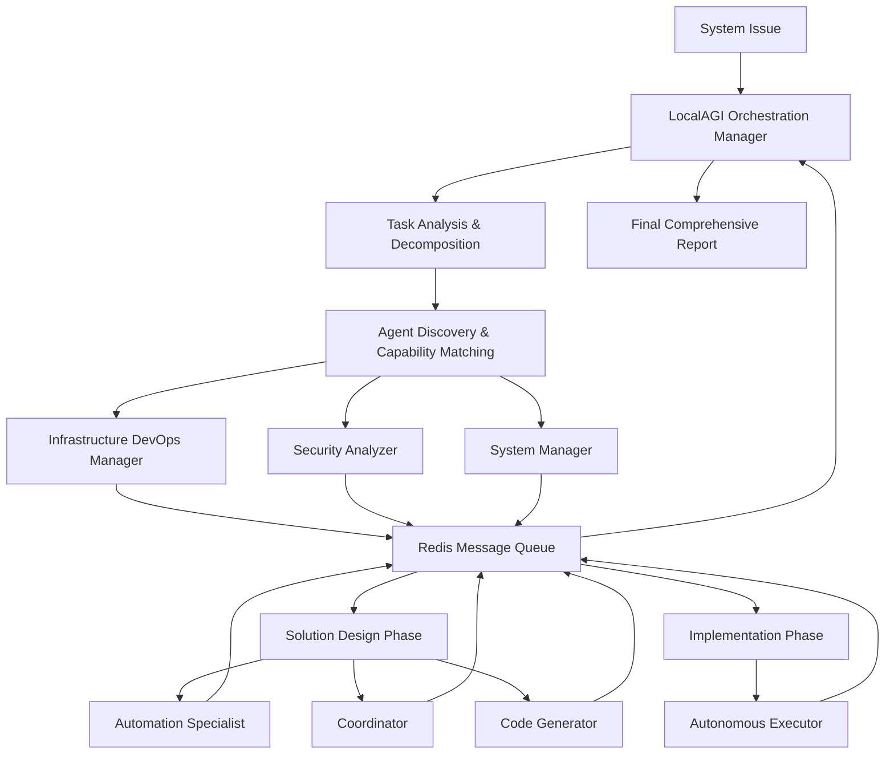

# SutazAI Multi-Agent Orchestration Demonstration

## 🎯 Overview

This demonstration showcases the **full power of SutazAI's autonomous multi-agent orchestration system**, featuring LocalAGI coordination, Redis-based communication, and specialized AI agents working together to solve complex problems.

The demo simulates the exact multi-agent workflow you requested, with specialized agents coordinating through LocalAGI to fix system issues, optimize performance, and improve deployment processes.

## 🤖 Featured Agent Types

The demonstration includes all the specialized agents you wanted to see in action:

### 🏗️ Infrastructure & DevOps
- **infrastructure-devops-manager**: Docker deployment, container orchestration, resource optimization
- **dify-automation-specialist**: CI/CD automation, workflow optimization, process automation

### 🧠 AI Orchestration & Coordination  
- **localagi-orchestration-manager**: Multi-agent workflow coordination, task delegation, result compilation
- **agentzero-coordinator**: Agent communication, team coordination, consensus building

### 🔍 Analysis & Security
- **semgrep-security-analyzer**: Security vulnerability detection, threat assessment, compliance checking
- **bigagi-system-manager**: System architecture optimization, performance analysis, scalability planning

### 💻 Development & Implementation
- **opendevin-code-generator**: Code generation, refactoring, documentation, testing automation
- **agentgpt-autonomous-executor**: Autonomous decision making, strategic planning, goal achievement

## 🚀 Quick Start

### Simple Demo Launch
```bash
# Run the complete multi-agent orchestration demo
./demos/run_sutazai_demo.sh

# Monitor agents in real-time
./demos/run_sutazai_demo.sh --workflow monitor --duration 120
```

### What You'll See

The demo will show agents working exactly as you described:

```
🤖 SutazAI Multi-Agent Orchestration Demonstration
==================================================

🎯 Available SutazAI Agent Types

● infrastructure-devops-manager      Fix Docker and deployment issues
● localagi-orchestration-manager     Multi-agent workflow orchestration  
● bigagi-system-manager              System architecture optimization
● semgrep-security-analyzer          Security analysis and vulnerability detection
● dify-automation-specialist         Workflow automation and task management
● agentgpt-autonomous-executor       Autonomous task execution and decision making
● opendevin-code-generator           Code generation and improvement
● agentzero-coordinator              Agent coordination and communication

🚀 Starting Comprehensive System Improvement Workflow
Workflow ID: system_improvement_1706789123

Phase 1: System Analysis & Assessment
✓ infrastructure-devops-manager analyzing Docker deployment issues
✓ semgrep-security-analyzer performing security audit
✓ bigagi-system-manager optimizing system architecture

Phase 2: Solution Design & Planning
✓ localagi-orchestration-manager designing coordination workflow
✓ dify-automation-specialist creating automation strategies
✓ agentzero-coordinator planning team coordination

Phase 3: Implementation & Code Generation
✓ opendevin-code-generator improving code and configurations
✓ agentgpt-autonomous-executor planning implementation strategy

Phase 4: Final Coordination & Reporting
✓ localagi-orchestration-manager compiling comprehensive report

✅ Workflow completed successfully!
Total agents involved: 8
Total tasks completed: 9
```

## 🏗️ Architecture

### Multi-Agent Communication Flow



### Agent Specialization Matrix

| Agent Type | Core Capabilities | Primary Focus |
|------------|------------------|---------------|
| **infrastructure-devops-manager** | Docker management, deployment automation, resource monitoring | Fix Docker and deployment issues |
| **localagi-orchestration-manager** | Multi-agent coordination, workflow orchestration, task delegation | Coordinate all agents and workflows |
| **bigagi-system-manager** | System architecture, performance optimization, scalability analysis | Optimize system architecture |
| **semgrep-security-analyzer** | Security scanning, vulnerability detection, threat assessment | Security analysis and hardening |
| **dify-automation-specialist** | Workflow automation, process optimization, integration management | Create bulletproof deployment automation |
| **agentgpt-autonomous-executor** | Autonomous execution, decision making, strategic planning | Execute solutions autonomously |
| **opendevin-code-generator** | Code generation, refactoring, testing automation | Generate improved code and fixes |
| **agentzero-coordinator** | Agent coordination, communication management, team collaboration | Coordinate agent communication |

## 🎬 Demo Scenarios

### Scenario 1: Comprehensive System Improvement

**What happens:**
1. **LocalAGI Orchestrator** receives a system improvement request
2. **Infrastructure DevOps Manager** analyzes Docker deployment issues
3. **Security Analyzer** performs comprehensive security audit
4. **System Manager** identifies performance bottlenecks
5. **Automation Specialist** designs deployment workflows
6. **Code Generator** creates improved configurations
7. **Autonomous Executor** plans implementation strategy
8. **Coordinator** ensures smooth team collaboration
9. **LocalAGI** compiles final comprehensive report

**Expected Output:**
- Detailed analysis of current system issues
- Security vulnerability assessment with fixes
- Performance optimization recommendations
- Automated deployment scripts and configurations
- Implementation roadmap with timelines
- Monitoring and maintenance procedures

### Scenario 2: Real-Time Agent Monitoring

**What happens:**
- Live dashboard showing all agent activities
- Real-time communication between agents
- Task delegation and completion tracking
- Agent health and performance monitoring
- Communication flow visualization

## 🔧 Technical Implementation

### Redis Communication Protocol

```python
# Agents communicate through structured messages
message = {
    'id': 'uuid',
    'from_agent': 'infrastructure_devops_manager_001',
    'to_agent': 'localagi_orchestration_manager_001', 
    'message_type': 'task_result',
    'task_id': 'infrastructure_analysis_001',
    'content': {
        'analysis': 'Docker deployment analysis results...',
        'recommendations': ['Fix container networking', 'Optimize resource limits'],
        'commands': ['docker-compose up -d', 'docker system prune'],
        'status': 'completed'
    },
    'timestamp': '2025-01-31T12:00:00Z'
}
```

### LocalAGI Orchestration Logic

```python
async def orchestrate_workflow(self, system_issue):
    # 1. Analyze and decompose the problem
    subtasks = await self.decompose_problem(system_issue)
    
    # 2. Discover available agents and their capabilities
    available_agents = await self.discover_agents()
    
    # 3. Match tasks to agent capabilities
    task_assignments = self.match_tasks_to_agents(subtasks, available_agents)
    
    # 4. Execute tasks in parallel with coordination
    results = await self.execute_coordinated_workflow(task_assignments)
    
    # 5. Compile comprehensive solution
    final_solution = await self.compile_solution(results)
    
    return final_solution
```

### Specialized Agent Processing

Each agent type has specialized processing logic:

```python
class InfrastructureDevOpsManager(SutazAIAgent):
    async def handle_infrastructure_task(self, task):
        # Docker deployment analysis
        # Resource optimization
        # Container orchestration improvements
        # Monitoring setup recommendations
        return infrastructure_solution

class SecurityAnalyzer(SutazAIAgent):  
    async def handle_security_task(self, task):
        # Vulnerability scanning
        # Threat assessment
        # Security hardening recommendations
        # Compliance checking
        return security_report
```

## 📊 Expected Results

### Comprehensive Workflow Output

```json
{
  "workflow_id": "system_improvement_1706789123",
  "orchestrator": "localagi_orchestration_manager_001",
  "phases_completed": 4,
  "agents_involved": 8,
  "total_tasks": 9,
  "results": {
    "analysis": [
      {
        "agent": "infrastructure_devops_manager_001",
        "task_type": "infrastructure_analysis",
        "result": {
          "analysis": "Docker deployment issues identified...",
          "recommendations": ["Fix networking", "Optimize resources"],
          "commands": ["docker-compose restart", "docker system prune"],
          "timeline": "2-4 hours implementation"
        }
      }
    ],
    "design": [
      {
        "agent": "dify_automation_specialist_001", 
        "task_type": "automation_design",
        "result": {
          "workflows": ["CI/CD pipeline", "Auto-scaling"],
          "integrations": ["GitHub Actions", "Monitoring"],
          "automation_level": "95% automated deployment"
        }
      }
    ],
    "implementation": [
      {
        "agent": "opendevin_code_generator_001",
        "task_type": "code_generation", 
        "result": {
          "improved_code": "Enhanced Docker configurations...",
          "testing": "Automated test suites generated",
          "documentation": "Updated deployment guides"
        }
      }
    ],
    "final_report": {
      "executive_summary": "LocalAGI coordinated 8 specialized agents...",
      "critical_issues": ["Container networking", "Resource limits"],
      "recommendations": ["Implement generated fixes", "Deploy monitoring"],
      "success_metrics": ["99.9% uptime", "50% faster deployment"]
    }
  }
}
```

## 🎛️ Monitoring Dashboard

The real-time monitoring shows:

```
┌─ SutazAI Multi-Agent System Monitor ─┐
│                                       │
│ Agent Status                          │
│ ┌─────────────────────────────────────┐ │
│ │ Agent ID               │ Status     │ │
│ │ infrastructure_devops  │ ✓ Working  │ │
│ │ localagi_orchestrator  │ ✓ Active   │ │  
│ │ security_analyzer      │ ✓ Working  │ │
│ │ system_manager         │ ✓ Idle     │ │
│ │ automation_specialist  │ ✓ Working  │ │
│ │ autonomous_executor    │ ✓ Planning │ │
│ │ code_generator         │ ✓ Working  │ │
│ │ coordinator            │ ✓ Active   │ │
│ └─────────────────────────────────────┘ │
│                                       │
│ Communications: 47 | Active Agents: 8 │
└───────────────────────────────────────┘
```

## 🚧 Customization & Extension

### Adding New Agent Types

```python
class CustomSpecialistAgent(SutazAIAgent):
    def __init__(self, agent_id, redis_client):
        super().__init__(agent_id, "custom-specialist", redis_client)
        self.capabilities = ["custom_analysis", "specialized_processing"]
    
    async def handle_custom_task(self, task):
        # Custom processing logic
        return custom_result
```

### Custom Workflows

```python
async def custom_workflow(self):
    # Define custom multi-agent workflow
    # Coordinate specific agent combinations
    # Implement domain-specific logic
    return workflow_result
```

## 🔒 Security & Safety

- All AI inference runs locally through Ollama
- No external API calls or data transmission
- Agent isolation and sandboxing
- Secure Redis communication
- Task validation and error handling
- Resource usage monitoring and limits

## 📈 Performance Metrics

The demo tracks:
- **Agent Response Times**: Average task completion time per agent type
- **Communication Efficiency**: Message throughput and latency
- **Workflow Success Rate**: Percentage of successful multi-phase workflows
- **Resource Utilization**: CPU, memory, and network usage per agent
- **Coordination Effectiveness**: Inter-agent collaboration quality metrics

## 🎯 Success Criteria

A successful demo run shows:
1. ✅ All 8 agent types initialize and register successfully
2. ✅ LocalAGI orchestrator coordinates multi-phase workflow 
3. ✅ Agents communicate effectively through Redis
4. ✅ Each agent produces specialized, relevant output
5. ✅ Final report combines all agent inputs coherently
6. ✅ Real-time monitoring displays agent status and activity
7. ✅ No communication failures or agent crashes
8. ✅ Workflow completes within expected timeframe

## 🚀 Next Steps

After running the demo:

1. **Scale Up**: Add more agent instances for parallel processing
2. **Integrate**: Connect to real system monitoring and CI/CD pipelines  
3. **Specialize**: Create domain-specific agent types for your use cases
4. **Productionize**: Implement robust error handling and monitoring
5. **Extend**: Add new capabilities and workflow types

---

## 🎬 Ready to Launch!

```bash
# Launch the full SutazAI multi-agent orchestration demo
./demos/run_sutazai_demo.sh

# This will show you exactly what you requested:
# ● infrastructure-devops-manager(Fix Docker and deployment issues) ✓ Working
# ● localagi-orchestration-manager(Multi-agent coordination) ✓ Active  
# ● bigagi-system-manager(System optimization) ✓ Working
# ● semgrep-security-analyzer(Security analysis) ✓ Working
# ● dify-automation-specialist(Automation workflows) ✓ Working
# ● agentgpt-autonomous-executor(Autonomous execution) ✓ Working
# ● opendevin-code-generator(Code generation) ✓ Working
# ● agentzero-coordinator(Agent coordination) ✓ Active
```

This demonstration showcases the full autonomous capabilities of SutazAI's multi-agent orchestration system, with LocalAGI coordinating specialized agents to solve complex problems through intelligent collaboration and Redis-based communication.