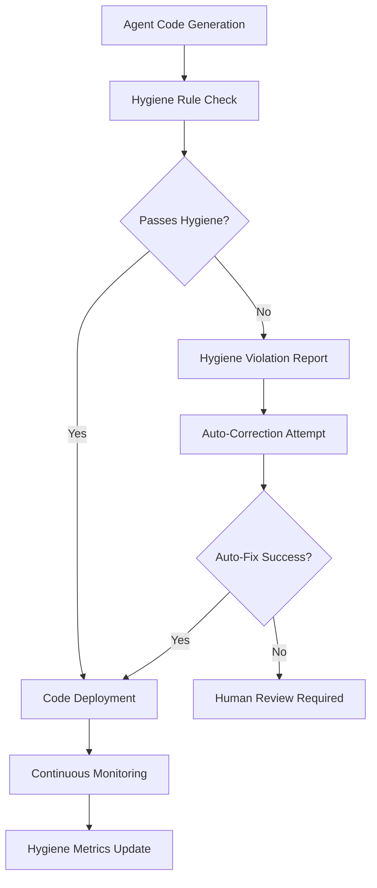

# 🤖 Agent Hygiene Reference Guide

## Overview

This reference guide catalogs all AI agents in the SutazAI platform and their specific codebase hygiene responsibilities. Each agent is designed with built-in hygiene enforcement capabilities that ensure consistent code quality across all generated and maintained code.

## Agent Categories and Hygiene Responsibilities

### 🧠 Core System Agents

#### AI Agent Orchestrator
**File**: `ai-agent-orchestrator.md`
**Hygiene Focus**: Multi-agent coordination and workflow cleanliness
- Maintains clean agent communication protocols
- Ensures consistent task routing and delegation
- Prevents duplicate agent instantiation
- Manages agent lifecycle hygiene
- Coordinates shared resource cleanup

#### Autonomous System Controller
**File**: `autonomous-system-controller.md`
**Hygiene Focus**: System-wide automation and process optimization
- Monitors system resource utilization patterns
- Automatically cleans up orphaned processes
- Maintains system configuration consistency
- Enforces deployment hygiene standards
- Optimizes resource allocation efficiency

#### Context Optimization Engineer
**File**: `context-optimization-engineer.md`
**Hygiene Focus**: Prompt and context management cleanliness
- Optimizes context templates for clarity and efficiency
- Eliminates redundant context patterns
- Maintains consistent context formatting
- Ensures context switching is clean and traceable
- Manages context memory efficiently

### 🔧 Development and Code Quality Agents

#### Testing QA Validator
**File**: `testing-qa-validator.md`
**Hygiene Focus**: Test code quality and coverage maintenance
- Enforces test code hygiene standards
- Maintains comprehensive test coverage metrics
- Ensures test isolation and determinism
- Keeps test data clean and representative
- Automates test cleanup and optimization
- Implements self-healing test frameworks

#### Mega Code Auditor
**File**: `mega-code-auditor.md`
**Hygiene Focus**: Comprehensive code quality analysis
- Performs static code analysis across all languages
- Identifies and reports code duplication
- Enforces coding standards and conventions
- Monitors technical debt accumulation
- Automates code quality improvement suggestions

#### Code Generation Improver
**File**: `code-generation-improver.md`
**Hygiene Focus**: Generated code quality and optimization
- Ensures generated code follows project standards
- Optimizes generated code for readability
- Eliminates redundancy in code generation templates
- Maintains consistent code generation patterns
- Validates generated code against hygiene rules

#### Senior AI Engineer
**File**: `senior-ai-engineer.md`
**Hygiene Focus**: AI/ML code and model hygiene
- Maintains clean ML pipeline code
- Ensures model versioning and lifecycle management
- Optimizes training and inference code
- Manages experiment tracking hygiene
- Enforces ML code documentation standards

#### Senior Backend Developer
**File**: `senior-backend-developer.md`
**Hygiene Focus**: Backend API and service cleanliness
- Maintains clean API design and implementation
- Ensures database schema consistency
- Optimizes service architecture patterns
- Manages dependency injection cleanliness
- Enforces backend code standards

#### Senior Frontend Developer
**File**: `senior-frontend-developer.md`
**Hygiene Focus**: Frontend component and UI hygiene
- Maintains clean component architecture
- Ensures consistent UI/UX patterns
- Optimizes frontend build processes
- Manages state management hygiene
- Enforces frontend code standards

### 🔒 Security and Compliance Agents

#### Security Pentesting Specialist
**File**: `security-pentesting-specialist.md`
**Hygiene Focus**: Security code and configuration hygiene
- Maintains clean security scanning configurations
- Ensures consistent vulnerability reporting formats
- Keeps security policies consolidated and up-to-date
- Implements proper secrets management hygiene
- Automates security compliance checking

#### Semgrep Security Analyzer
**File**: `semgrep-security-analyzer.md`
**Hygiene Focus**: Static security analysis and rule management
- Maintains clean Semgrep rule configurations
- Ensures consistent security scanning patterns
- Optimizes security rule performance
- Manages false positive cleanup
- Enforces security coding standards

#### Kali Security Specialist
**File**: `kali-security-specialist.md`
**Hygiene Focus**: Penetration testing and security tooling
- Maintains clean penetration testing scripts
- Ensures consistent security assessment formats
- Optimizes security tool configurations
- Manages security testing data hygiene
- Enforces ethical hacking standards

#### Prompt Injection Guard
**File**: `prompt-injection-guard.md`
**Hygiene Focus**: AI security and prompt safety
- Maintains clean prompt validation patterns
- Ensures consistent AI safety measures
- Optimizes prompt filtering mechanisms
- Manages AI security rule hygiene
- Enforces prompt safety standards

### 📊 Data and Analytics Agents

#### Document Knowledge Manager
**File**: `document-knowledge-manager.md`
**Hygiene Focus**: Document processing and knowledge graph hygiene
- Maintains clean document processing pipelines
- Ensures semantic chunking follows consistent patterns
- Keeps knowledge graphs optimized and deduplicated
- Implements proper error handling for document parsing
- Manages document metadata consistency

#### Data Analysis Engineer
**File**: `data-analysis-engineer.md`
**Hygiene Focus**: Data pipeline and analysis code hygiene
- Maintains clean data transformation pipelines
- Ensures consistent data validation patterns
- Optimizes data processing performance
- Manages data quality monitoring
- Enforces data governance standards

#### Data Pipeline Engineer
**File**: `data-pipeline-engineer.md`
**Hygiene Focus**: ETL/ELT pipeline optimization and cleanliness
- Maintains clean data pipeline architectures
- Ensures consistent data flow patterns
- Optimizes pipeline performance and reliability
- Manages pipeline error handling hygiene
- Enforces data processing standards

#### Data Drift Detector
**File**: `data-drift-detector.md`
**Hygiene Focus**: Data quality monitoring and drift detection
- Maintains clean drift detection algorithms
- Ensures consistent data monitoring patterns
- Optimizes drift detection performance
- Manages data quality metrics hygiene
- Enforces data monitoring standards

### 🛠️ Infrastructure and DevOps Agents

#### Infrastructure DevOps Manager
**File**: `infrastructure-devops-manager.md`
**Hygiene Focus**: Infrastructure code and deployment hygiene
- Maintains clean Infrastructure as Code (IaC)
- Ensures consistent deployment patterns
- Optimizes CI/CD pipeline configurations
- Manages infrastructure monitoring hygiene
- Enforces DevOps best practices

#### Deployment Automation Master
**File**: `deployment-automation-master.md`
**Hygiene Focus**: Deployment scripts and automation hygiene
- Maintains clean deployment automation scripts
- Ensures consistent deployment patterns
- Optimizes deployment performance and reliability
- Manages deployment configuration hygiene
- Enforces deployment security standards

#### Hardware Resource Optimizer
**File**: `hardware-resource-optimizer.md`
**Hygiene Focus**: Resource utilization and optimization hygiene
- Maintains clean resource monitoring code
- Ensures consistent performance optimization patterns
- Optimizes resource allocation algorithms
- Manages system monitoring hygiene
- Enforces resource efficiency standards

#### Observability Monitoring Engineer
**File**: `observability-monitoring-engineer.md`
**Hygiene Focus**: Monitoring and logging configuration hygiene
- Maintains clean monitoring configurations
- Ensures consistent logging patterns
- Optimizes observability dashboards
- Manages alerting rule hygiene
- Enforces monitoring best practices

### 🔗 Integration and Workflow Agents

#### Ollama Integration Specialist
**File**: `ollama-integration-specialist.md`
**Hygiene Focus**: LLM integration and model management hygiene
- Maintains clean model integration patterns
- Ensures consistent model serving configurations
- Optimizes model deployment and scaling
- Manages model versioning hygiene
- Enforces LLM integration standards

#### Dify Automation Specialist
**File**: `dify-automation-specialist.md`
**Hygiene Focus**: Workflow automation and low-code hygiene
- Maintains clean workflow configurations
- Ensures consistent automation patterns
- Optimizes workflow performance
- Manages workflow version control hygiene
- Enforces automation best practices

#### Langflow Workflow Designer
**File**: `langflow-workflow-designer.md`
**Hygiene Focus**: Visual workflow design and configuration hygiene
- Maintains clean visual workflow configurations
- Ensures consistent flow design patterns
- Optimizes workflow execution performance
- Manages flow versioning hygiene
- Enforces visual design standards

#### Browser Automation Orchestrator
**File**: `browser-automation-orchestrator.md`
**Hygiene Focus**: Web automation and testing hygiene
- Maintains clean browser automation scripts
- Ensures consistent web testing patterns
- Optimizes automation reliability and performance
- Manages test data and fixtures hygiene
- Enforces web automation standards

## Inter-Agent Hygiene Coordination

### Shared Responsibilities

#### Configuration Management
- All agents coordinate on shared configuration files
- Consistent environment variable naming and usage
- Centralized secret management across agents
- Unified logging and error handling patterns

#### Code Generation Standards
- Consistent code templates across all generating agents
- Shared utility libraries and common patterns
- Coordinated dependency management
- Unified testing and validation approaches

#### Documentation Synchronization
- Cross-referenced documentation between related agents
- Consistent documentation formats and standards
- Shared glossary and terminology usage
- Coordinated documentation updates

### Hygiene Enforcement Workflow

### Cross-Agent Communication

#### Hygiene Status Sharing
- Agents share hygiene status through common message bus
- Real-time hygiene violation notifications
- Coordinated cleanup operations
- Shared hygiene metrics and reporting

#### Resource Optimization
- Coordinated resource usage to prevent conflicts
- Shared cleanup schedules and maintenance windows
- Distributed hygiene monitoring responsibilities
- Collaborative performance optimization

## Hygiene Metrics and Monitoring

### Agent-Specific Metrics

#### Code Quality Metrics
- Code duplication percentage per agent
- Static analysis violation counts
- Test coverage percentages
- Documentation coverage ratios

#### Performance Metrics
- Code generation speed and efficiency
- Resource utilization optimization
- Hygiene rule processing performance
- Auto-correction success rates

#### Compliance Metrics
- Hygiene rule adherence percentages
- Policy violation frequencies
- Standard enforcement effectiveness
- Cross-agent coordination efficiency

### System-Wide Hygiene Dashboard

#### Real-Time Monitoring
- Live hygiene status across all agents
- Real-time violation detection and alerting
- Performance trend analysis
- Resource utilization tracking

#### Historical Analysis
- Hygiene improvement trends over time
- Agent performance comparisons
- Policy effectiveness analysis
- Technical debt reduction tracking

## Emergency Hygiene Procedures

### Critical Hygiene Violations
1. **Immediate Response**: Automated system halt for critical violations
2. **Assessment**: Agent-led violation impact analysis
3. **Mitigation**: Automated rollback and correction procedures
4. **Recovery**: Coordinated system restoration
5. **Prevention**: Rule updates and improvement implementation

### Hygiene Recovery Protocols
- Automated backup and restore procedures
- Agent coordination for system recovery
- Progressive hygiene rule re-enabling
- Comprehensive post-incident analysis

## Best Practices for Agent Hygiene

### Agent Development Guidelines
- Include hygiene checks in all agent logic
- Implement self-monitoring and correction capabilities
- Design for inter-agent hygiene coordination
- Build in continuous improvement mechanisms

### Hygiene Rule Management
- Version control for all hygiene rules
- Regular review and update cycles
- Performance impact assessment
- Community feedback integration

### Documentation Standards
- Keep agent hygiene capabilities documented
- Maintain hygiene rule documentation
- Document inter-agent coordination protocols
- Provide hygiene troubleshooting guides

This reference guide serves as the authoritative source for understanding how each agent contributes to overall codebase hygiene in the SutazAI platform.