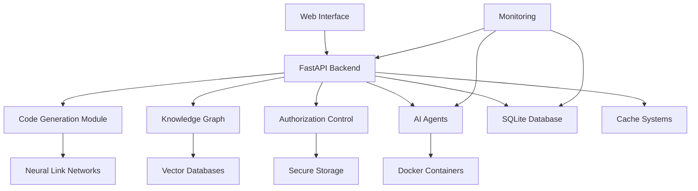

# SutazAI Architecture Guide

## System Overview

SutazAI is built on a modular, scalable architecture designed for enterprise-grade AI operations. The system consists of four main layers:

## 1. Core AI Components

### Code Generation Module (CGM)
- **Location**: `sutazai/core/cgm.py`
- **Purpose**: Self-improving code generation with neural networks
- **Features**:
  - Multiple generation strategies
  - Meta-learning capabilities
  - Quality assessment and improvement
  - Safety constraints and validation

### Knowledge Graph (KG)
- **Location**: `sutazai/core/kg.py`  
- **Purpose**: Centralized knowledge repository
- **Features**:
  - Semantic search and retrieval
  - Pattern recognition
  - Cross-referencing capabilities
  - Access control and analytics

### Authorization Control Module (ACM)
- **Location**: `sutazai/core/acm.py`
- **Purpose**: Security and access management
- **Features**:
  - Hardcoded authorization for authorized users
  - Secure shutdown capabilities
  - Comprehensive audit logging
  - Tamper detection

### Neural Link Networks (NLN)
- **Location**: `sutazai/nln/`
- **Purpose**: Advanced neural modeling
- **Components**:
  - Neural Nodes (`neural_node.py`)
  - Neural Links (`neural_link.py`) 
  - Neural Synapses (`neural_synapse.py`)

## 2. AI Agents Layer

### Autonomous Agents
- **AutoGPT**: Autonomous task execution
- **LocalAGI**: General intelligence operations
- **TabbyML**: Code completion and assistance
- **Custom Agents**: Specialized domain workers

### Agent Orchestration
- Docker-based containerization
- Inter-agent communication
- Resource sharing and coordination
- Load balancing and scaling

## 3. Infrastructure Layer

### Backend Services
- **FastAPI Application**: High-performance API server
- **Model Management**: Local AI model handling
- **Vector Databases**: ChromaDB and FAISS integration
- **Storage Systems**: Optimized data management

### Frontend Interfaces
- **Streamlit Web UI**: Interactive user interface
- **REST API**: Programmatic access
- **WebSocket**: Real-time communication
- **Monitoring Dashboard**: System oversight

## 4. Data Layer

### Storage Systems
- **SQLite Database**: Primary data storage
- **Vector Databases**: Semantic search capabilities
- **File Storage**: Document and media handling
- **Cache Systems**: Performance optimization

### Data Processing
- **Compression**: Space-efficient storage
- **Deduplication**: Eliminate redundancy
- **Backup Systems**: Data protection
- **Monitoring**: Usage and performance tracking

## Component Interactions



## Security Architecture

### Multi-Layer Security
1. **Application Layer**: Input validation, authentication
2. **Service Layer**: Authorization, audit logging
3. **Data Layer**: Encryption, tamper detection
4. **Infrastructure Layer**: Container isolation, network security

### Access Control Flow
```
User Request -> Authentication -> Authorization -> Resource Access -> Audit Log
```

## Performance Optimization

### CPU and Memory Management
- Resource pools and lifecycle management
- Garbage collection optimization
- Memory usage monitoring
- CPU scheduling optimization

### Async Processing
- Concurrent request handling
- Non-blocking I/O operations
- Task queue management
- Connection pooling

### Caching Strategy
- Multi-tier caching (Memory -> Redis -> Disk)
- Intelligent cache eviction
- Compression for cache entries
- Performance monitoring

## Scalability Design

### Horizontal Scaling
- Docker container orchestration
- Load balancing across instances
- Database sharding capabilities
- Microservice architecture

### Vertical Scaling
- Resource optimization
- Performance tuning
- Hardware utilization
- Memory management

## Monitoring and Observability

### Metrics Collection
- System performance metrics
- Application-level metrics
- Business metrics
- Custom metrics

### Logging Strategy
- Structured logging
- Log aggregation
- Error tracking
- Audit trails

### Health Monitoring
- Service health checks
- Database connectivity
- External dependencies
- Resource utilization

## Development Guidelines

### Code Organization
```
sutazaiapp/
├── sutazai/           # Core AI components
├── backend/           # API and services
├── frontend/          # Web interfaces
├── agents/            # AI agents
├── tests/             # Test suites
├── docs/              # Documentation
└── scripts/           # Utility scripts
```

### Design Principles
1. **Modularity**: Independent, reusable components
2. **Scalability**: Horizontal and vertical scaling
3. **Security**: Defense in depth
4. **Performance**: Optimized for speed and efficiency
5. **Maintainability**: Clean, documented code

## Deployment Architecture

### Local Deployment
- Single-machine deployment
- Docker Compose orchestration
- Local model storage
- SQLite database

### Production Deployment
- Multi-server deployment
- Kubernetes orchestration
- Distributed storage
- PostgreSQL database

## Future Enhancements

### Planned Features
- Advanced neural architectures
- Distributed computing support
- Enhanced security features
- Performance optimizations

### Technology Roadmap
- Integration with emerging AI models
- Advanced monitoring capabilities
- Enhanced user interfaces
- Extended API functionality
