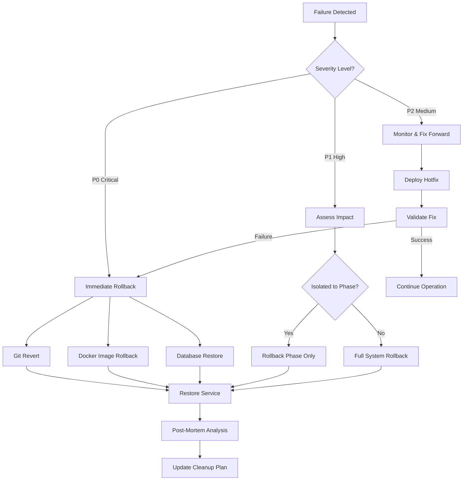

# DEPENDENCY GRAPH AND RISK ASSESSMENT

**Generated:** August 9, 2025  
**System Architect:** Agent 1 (Master Coordinator)  
**Purpose:** Visual dependency mapping and comprehensive risk analysis for 200-agent cleanup operation

## CRITICAL PATH DEPENDENCY GRAPH

```mermaid
graph TD
    %% Phase 1: Emergency Stabilization
    P1_Start[Phase 1 Start] --> P1_Container[Fix Container Health]
    P1_Container --> P1_Schema[Database Schema]
    P1_Schema --> P1_API[API Restoration]
    P1_API --> P1_Complete{Phase 1 Complete}
    
    %% Phase 2: Security Lockdown
    P1_Complete --> P2_Start[Phase 2 Start]
    P2_Start --> P2_Secrets[Credential Rotation]
    P2_Secrets --> P2_Container_Sec[Container Security]
    P2_Container_Sec --> P2_RBAC[Access Control]
    P2_RBAC --> P2_Complete{Phase 2 Complete}
    
    %% Phase 3: Documentation (Parallel)
    P1_Complete --> P3_Start[Phase 3 Start]
    P3_Start --> P3_Markdown[Organize Markdown]
    P3_Markdown --> P3_Scripts[Organize Scripts]
    P3_Scripts --> P3_Changelog[Update Changelog]
    P3_Changelog --> P3_Complete{Phase 3 Complete}
    
    %% Phase 4: Code Quality
    P2_Complete --> P4_Start[Phase 4 Start]
    P1_Complete --> P4_Start
    P4_Start --> P4_Fantasy[Remove conceptual]
    P4_Fantasy --> P4_Imports[Clean Imports]
    P4_Imports --> P4_Lint[Linting]
    P4_Lint --> P4_Tests[Testing]
    P4_Tests --> P4_Complete{Phase 4 Complete}
    
    %% Phase 5: Service Alignment
    P4_Complete --> P5_Start[Phase 5 Start]
    P2_Complete --> P5_Start
    P5_Start --> P5_Audit[Service Audit]
    P5_Audit --> P5_Agents[Agent Implementation]
    P5_Agents --> P5_Mesh[Service Mesh]
    P5_Mesh --> P5_Complete{Phase 5 Complete}
    
    %% Phase 6: Monitoring (Parallel)
    P1_Complete --> P6_Start[Phase 6 Start]
    P6_Start --> P6_Metrics[Metrics Setup]
    P6_Metrics --> P6_Logs[Log Aggregation]
    P6_Logs --> P6_Observability[Observability]
    P6_Observability --> P6_Complete{Phase 6 Complete}
    
    %% Phase 7: Performance
    P5_Complete --> P7_Start[Phase 7 Start]
    P7_Start --> P7_Analysis[Performance Analysis]
    P7_Analysis --> P7_Optimize[Optimization]
    P7_Optimize --> P7_Resources[Resource Tuning]
    P7_Resources --> P7_Complete{Phase 7 Complete}
    
    %% Phase 8: Final Validation
    P3_Complete --> P8_Start[Phase 8 Start]
    P4_Complete --> P8_Start
    P5_Complete --> P8_Start
    P6_Complete --> P8_Start
    P7_Complete --> P8_Start
    P8_Start --> P8_Validate[Rule Validation]
    P8_Validate --> P8_System[System Testing]
    P8_System --> P8_Release[Release Prep]
    P8_Release --> P8_Complete{Mission Complete}
    
    %% Critical Path Highlighting
    style P1_Container fill:#ff6b6b
    style P2_Secrets fill:#ff6b6b
    style P4_Fantasy fill:#ff6b6b
    style P5_Agents fill:#ff6b6b
    style P8_Validate fill:#ff6b6b
```



## TASK DEPENDENCY MATRIX

| Phase | Depends On | Blocks | Can Run Parallel With | Critical Path |
|-------|------------|--------|----------------------|---------------|
| **Phase 1** | None | P2, P4, P5, P8 | None | YES |
| **Phase 2** | P1 | P4, P5 | P3, P6 | YES |
| **Phase 3** | P1 | P8 | P2, P4, P6 | NO |
| **Phase 4** | P1, P2 | P5, P8 | P3 (after P2) | YES |
| **Phase 5** | P1, P2, P4 | P7, P8 | P6 | YES |
| **Phase 6** | P1 | P8 | P2, P3, P4 | NO |
| **Phase 7** | P5 | P8 | P6 | NO |
| **Phase 8** | ALL | None | None | YES |

## RISK ASSESSMENT MATRIX

### Critical Risks (P0)

| Risk ID | Description | Probability | Impact | Mitigation Strategy | Owner |
|---------|-------------|-------------|---------|-------------------|--------|
| **R001** | Container restart loop cascades to other services | HIGH | CRITICAL | Isolate container fixes, test in staging first | Agent 2-3 |
| **R002** | Credential rotation breaks authentication | HIGH | CRITICAL | Gradual rotation, maintain rollback credentials | Agent 26-35 |
| **R003** | Database schema changes cause data loss | MEDIUM | CRITICAL | Full backup before changes, transaction-based updates | Agent 6-15 |
| **R004** | API changes break frontend | HIGH | HIGH | Version API endpoints, maintain backwards compatibility | Agent 16-25 |
| **R005** | Security fixes break functionality | MEDIUM | CRITICAL | Comprehensive testing, phased rollout | Agent 36-45 |

### High Risks (P1)

| Risk ID | Description | Probability | Impact | Mitigation Strategy | Owner |
|---------|-------------|-------------|---------|-------------------|--------|
| **R006** | Script reorganization breaks automation | HIGH | HIGH | Create symlinks for legacy paths | Agent 61-70 |
| **R007** | Import cleanup breaks dependencies | HIGH | MEDIUM | Incremental cleanup, continuous testing | Agent 86-100 |
| **R008** | Service removal affects hidden dependencies | MEDIUM | HIGH | Comprehensive dependency mapping first | Agent 126-135 |
| **R009** | Performance optimization causes instability | LOW | HIGH | A/B testing, gradual rollout | Agent 171-185 |
| **R010** | Documentation changes lose critical info | MEDIUM | MEDIUM | Archive all original docs before moving | Agent 51-60 |

### Medium Risks (P2)

| Risk ID | Description | Probability | Impact | Mitigation Strategy | Owner |
|---------|-------------|-------------|---------|-------------------|--------|
| **R011** | Agent conflicts over shared resources | HIGH | MEDIUM | Resource locking, coordination protocol | Agent 1 |
| **R012** | Git merge conflicts from parallel work | HIGH | LOW | Frequent rebasing, clear file ownership | All Agents |
| **R013** | Monitoring overhead affects performance | LOW | MEDIUM | Sampling strategies, async collection | Agent 151-170 |
| **R014** | Test coverage goals delay deployment | MEDIUM | LOW | Prioritize critical path testing | Agent 116-125 |
| **R015** | conceptual removal breaks existing features | LOW | MEDIUM | Careful analysis before removal | Agent 76-85 |

## ROLLBACK DECISION TREE



## RISK MITIGATION PROTOCOLS

### Pre-Phase Checklist
```yaml
before_phase_start:
  - Create git branch for phase
  - Backup all databases
  - Snapshot Docker volumes  
  - Document current state
  - Run health checks
  - Verify rollback scripts
  - Allocate emergency resources
  - Notify stakeholders
```

### During Phase Monitoring
```yaml
continuous_monitoring:
  - Real-time health checks every 60s
  - Resource usage tracking
  - Error rate monitoring
  - Performance baselines
  - Agent conflict detection
  - Dependency validation
  - Security scanning
  - User impact assessment
```

### Failure Response Protocol
```yaml
on_failure:
  P0_Critical:
    - Stop all agent operations
    - Initiate immediate rollback
    - Alert all stakeholders
    - Begin incident response
    - Document failure details
    
  P1_High:
    - Pause affected phase
    - Assess blast radius
    - Attempt isolated fix
    - Escalate if spreading
    - Consider partial rollback
    
  P2_Medium:
    - Log issue details
    - Continue operations
    - Schedule fix window
    - Monitor for escalation
    - Update risk register
```

## CONFLICT RESOLUTION MATRIX

### Resource Conflicts
| Resource | Potential Conflicts | Resolution Strategy | Arbitrator |
|----------|-------------------|-------------------|------------|
| Git Repo | Merge conflicts | Rebase strategy, clear ownership | Agent 1 |
| Database | Lock contention | Transaction isolation, queuing | Agent 6-10 |
| Docker | Port conflicts | Port registry management | Agent 2-5 |
| Files | Simultaneous edits | File locking protocol | Phase Lead |
| Memory | Resource exhaustion | Resource quotas, scheduling | Agent 181-185 |

### Agent Conflicts
```yaml
conflict_types:
  task_overlap:
    detection: Duplicate task claims
    resolution: First claim wins
    escalation: Phase coordinator
    
  dependency_blocking:
    detection: Waiting on same resource
    resolution: Priority-based scheduling
    escalation: Agent 1
    
  contradictory_changes:
    detection: Opposing modifications
    resolution: Rule-based precedence
    escalation: Human intervention
```

## BACKUP AND RECOVERY STRATEGIES

### Backup Schedule
```bash
# Continuous backups during operation
*/15 * * * * /opt/sutazaiapp/scripts/backup/incremental_backup.sh
0 */4 * * * /opt/sutazaiapp/scripts/backup/full_backup.sh

# Pre-phase checkpoint backups
/opt/sutazaiapp/scripts/backup/phase_checkpoint.sh $PHASE_NUMBER
```

### Recovery Time Objectives
| Component | RTO | RPO | Backup Method | Recovery Method |
|-----------|-----|-----|---------------|-----------------|
| Database | 5 min | 15 min | pg_dump + WAL | pg_restore |
| Containers | 2 min | N/A | Image registry | docker pull |
| Configuration | 1 min | 5 min | Git commits | git checkout |
| Volumes | 10 min | 30 min | Volume snapshots | Volume restore |
| Full System | 30 min | 1 hour | Complete backup | Orchestrated restore |

## CONTINGENCY PLANS

### Scenario: Complete System Failure
```yaml
trigger: All services down
response:
  1. Activate disaster recovery site
  2. Restore from last known good state
  3. Replay transaction logs
  4. Validate data integrity
  5. Resume operations in degraded mode
recovery_time: 2-4 hours
data_loss: Maximum 1 hour
```

### Scenario: Data Corruption
```yaml
trigger: Integrity check failures
response:
  1. Isolate corrupted data
  2. Stop write operations
  3. Restore from clean backup
  4. Replay valid transactions
  5. Audit for corruption source
recovery_time: 1-2 hours
data_loss: Since last valid backup
```

### Scenario: Security Breach During Cleanup
```yaml
trigger: Unauthorized access detected
response:
  1. Immediate system isolation
  2. Revoke all credentials
  3. Security audit all changes
  4. Restore to pre-breach state
  5. Implement additional controls
recovery_time: 4-6 hours
data_loss: Rollback to secure state
```

## PHASE INTERDEPENDENCY RISKS

### Critical Dependencies
```yaml
phase_1_failure_impact:
  - Blocks all subsequent phases
  - System remains unstable
  - Cannot proceed with cleanup
  mitigation: Multiple attempt strategies

phase_2_failure_impact:
  - Security vulnerabilities remain
  - Cannot deploy to production
  - Compliance issues persist
  mitigation: Manual security fixes

phase_4_failure_impact:
  - Code quality remains poor
  - Technical debt accumulates
  - Future maintenance harder
  mitigation: Gradual improvement approach

phase_5_failure_impact:
  - Services remain misaligned
  - Resource waste continues
  - Performance issues persist
  mitigation: Selective service enablement
```

## SUCCESS PROBABILITY ANALYSIS

### Phase Success Probabilities
| Phase | Success Probability | Confidence Level | Key Risk Factors |
|-------|-------------------|------------------|------------------|
| Phase 1 | 95% | HIGH | Well-understood fixes |
| Phase 2 | 85% | MEDIUM | Credential complexity |
| Phase 3 | 98% | HIGH | Low-risk reorganization |
| Phase 4 | 80% | MEDIUM | Code interdependencies |
| Phase 5 | 75% | MEDIUM | Service complexity |
| Phase 6 | 90% | HIGH | Mature monitoring tools |
| Phase 7 | 85% | MEDIUM | Performance tuning art |
| Phase 8 | 95% | HIGH | Validation only |

### Overall Mission Success
- **Probability of Complete Success:** 72%
- **Probability of Partial Success:** 95%
- **Probability of Critical Failure:** < 5%

## ESCALATION MATRIX

### Escalation Levels
```yaml
Level_1:
  trigger: Task blocked > 30 minutes
  response: Team lead intervention
  authority: Reassign resources
  
Level_2:
  trigger: Phase blocked > 2 hours
  response: Phase coordinator
  authority: Modify phase plan
  
Level_3:
  trigger: Multiple phases affected
  response: Agent 1 (Master)
  authority: Restructure operation
  
Level_4:
  trigger: Mission at risk
  response: Human intervention
  authority: Abort or continue decision
```

## MONITORING DASHBOARDS

### Real-Time Risk Dashboard
```yaml
url: http://localhost:10201/dashboards/risk-monitor
panels:
  - Active risks by severity
  - Mitigation status
  - Rollback readiness
  - Backup currency
  - Agent conflicts
  - Resource utilization
  - Error rates by phase
  - Success probability trends
```

### Phase Progress Dashboard
```yaml
url: http://localhost:10201/dashboards/phase-progress
panels:
  - Task completion by phase
  - Agent activity heatmap
  - Dependency status
  - Blocker tracking
  - Time to completion estimates
  - Resource consumption
  - Quality metrics
  - Rollback triggers
```

## RISK REGISTER MAINTENANCE

### Update Frequency
- **Real-time:** P0 risks
- **Hourly:** P1 risks  
- **Daily:** P2 risks
- **Per Phase:** Full review

### Risk Log Location
```bash
/opt/sutazaiapp/risk_management/
├── active_risks.json
├── mitigated_risks.json
├── risk_history.log
└── incident_reports/
```

---

**RISK COMMAND CENTER:**
```bash
# Initialize risk monitoring
/opt/sutazaiapp/scripts/risk_management/init_risk_monitor.sh

# Emergency stop (if critical risk materializes)
/opt/sutazaiapp/scripts/emergency_stop_all.sh

# Risk assessment report
/opt/sutazaiapp/scripts/risk_management/generate_risk_report.sh
```

---

END OF DEPENDENCY GRAPH AND RISK ASSESSMENT