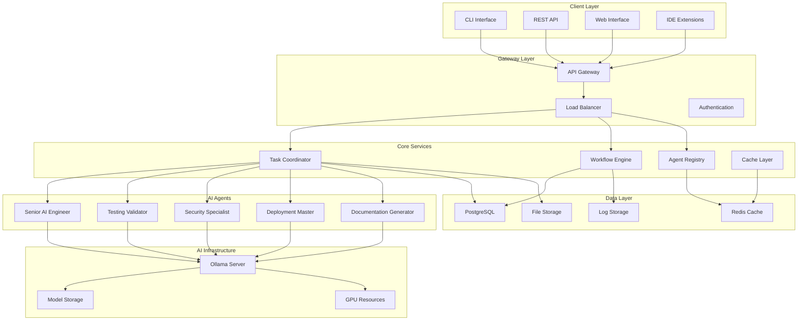

# SutazAI Task Automation System - Product Requirements Document (PRD)
Version 1.0 | Date: August 1, 2025

---

## 1. Executive Summary

### Product Vision
SutazAI is a comprehensive local AI task automation system that empowers developers and teams to automate complex development workflows using specialized AI agents without relying on external APIs or cloud services.

### Business Objectives
- **Reduce Development Time**: 40-60% reduction in manual code review, testing, and deployment tasks
- **Improve Code Quality**: Automated detection and fixing of security, performance, and style issues
- **Lower Operational Costs**: Eliminate external API fees and cloud dependencies
- **Enhance Privacy**: 100% local processing with no data leaving the user's environment
- **Increase Consistency**: Standardized automation processes across development teams

### Success Metrics
- **Deployment Time**: Fully operational within 15 minutes
- **Resource Efficiency**: <8GB RAM usage for full system
- **Task Completion**: 95%+ success rate for automated tasks
- **Time Savings**: 2-5 hours per developer per day
- **Quality Improvement**: 50%+ reduction in production bugs

---

## 2. Problem Statement & Market Need

### Current Development Challenges

#### Pain Points
1. **Manual Code Review Bottlenecks**
   - Senior developers spend 20-30% of time on code reviews
   - Inconsistent review quality and standards
   - Delayed feedback cycles causing development slowdowns

2. **Testing Gaps**
   - Missing test coverage for critical code paths
   - Inconsistent testing practices across teams
   - Time-consuming manual testing processes

3. **Deployment Complexity**
   - Error-prone manual deployment processes
   - Lack of standardized deployment procedures
   - Rollback difficulties and downtime risks

4. **External API Dependencies**
   - High costs for AI-powered development tools ($20-100/month per developer)
   - Data privacy concerns with cloud-based solutions
   - Internet connectivity requirements for development tools

5. **Resource Inefficiency**
   - Duplicate effort across similar tasks
   - Lack of automation for repetitive processes
   - Insufficient tooling for small to medium teams

### Market Opportunity
- **Target Market Size**: 50M+ developers worldwide using automation tools
- **Addressable Market**: Teams seeking local AI solutions (privacy-focused orgs, regulated industries)
- **Growth Rate**: 25% annual growth in AI-powered development tools
- **Competitive Advantage**: Only comprehensive local AI automation platform

---

## 3. Target Users & Use Cases

### Primary Users

#### 1. Individual Developers
**Profile**: Solo developers, freelancers, open-source contributors
- **Needs**: Code quality improvement, automated testing, deployment automation
- **Pain Points**: Limited budget for paid tools, time constraints
- **Success Criteria**: Faster development cycles, improved code quality

#### 2. Small Development Teams (2-10 developers)
**Profile**: Startups, small companies, indie development teams
- **Needs**: Standardized processes, team coordination, consistent quality
- **Pain Points**: Limited senior developer time, inconsistent practices
- **Success Criteria**: Reduced review bottlenecks, improved team velocity

#### 3. Medium Teams (10-50 developers)
**Profile**: Growing companies, established product teams
- **Needs**: Scalable automation, advanced workflows, integration capabilities
- **Pain Points**: Coordination overhead, quality control at scale
- **Success Criteria**: Streamlined processes, predictable delivery

#### 4. Privacy-Sensitive Organizations
**Profile**: Healthcare, finance, government, regulated industries
- **Needs**: Local processing, audit trails, compliance features
- **Pain Points**: Data privacy regulations, security requirements
- **Success Criteria**: Compliance adherence, zero data leakage

### Primary Use Cases

#### 1. Code Quality Automation
```yaml
User Story: "As a developer, I want automated code review so I can catch issues before peer review"
Acceptance Criteria:
  - Scan all Python files in repository
  - Identify security, performance, and style issues
  - Provide specific line-by-line recommendations
  - Generate actionable improvement report
  - Complete analysis within 5 minutes for typical repository
```

#### 2. Security Vulnerability Scanning
```yaml
User Story: "As a security-aware developer, I want automated security scanning"
Acceptance Criteria:
  - Detect common security vulnerabilities (OWASP Top 10)
  - Scan dependencies for known CVEs
  - Check for hardcoded secrets and credentials
  - Provide severity rankings and fix recommendations
  - Generate compliance reports
```

#### 3. Test Generation and Validation
```yaml
User Story: "As a developer, I want automated test generation for better coverage"
Acceptance Criteria:
  - Generate unit tests for uncovered functions
  - Create integration tests for API endpoints
  - Validate existing test quality and coverage
  - Suggest edge cases and error conditions
  - Integrate with existing test frameworks
```

#### 4. Deployment Automation
```yaml
User Story: "As a DevOps engineer, I want automated deployment pipelines"
Acceptance Criteria:
  - Generate Docker configurations
  - Create CI/CD pipeline definitions
  - Automate environment provisioning
  - Handle rollback procedures
  - Provide deployment status monitoring
```

#### 5. Documentation Generation
```yaml
User Story: "As a team lead, I want automated documentation maintenance"
Acceptance Criteria:
  - Generate API documentation from code
  - Create README files and developer guides
  - Update documentation on code changes
  - Maintain architecture diagrams
  - Ensure documentation consistency
```

---

## 4. Product Goals & Success Metrics

### Business Goals

#### Primary Goals
1. **Market Penetration**: 10,000 active installations within 12 months
2. **User Retention**: 80% monthly active user retention
3. **Performance**: <2 minute average task completion time
4. **Quality**: 95% user satisfaction score
5. **Adoption**: 70% of users deploying 5+ agents

### Key Performance Indicators (KPIs)

#### Usage Metrics
- **Daily Active Users (DAU)**: Number of unique users running workflows daily
- **Tasks Executed**: Total automated tasks completed per day/month
- **Success Rate**: Percentage of tasks completed successfully
- **Time to Value**: Time from installation to first successful workflow

#### Quality Metrics
- **Code Quality Improvement**: Reduction in critical issues found in production
- **Test Coverage Increase**: Improvement in automated test coverage
- **Security Issue Reduction**: Decrease in security vulnerabilities
- **Deployment Success Rate**: Percentage of successful automated deployments

#### Performance Metrics
- **System Response Time**: Average API response time
- **Resource Utilization**: CPU/Memory usage efficiency
- **Concurrent Users**: Number of simultaneous active sessions
- **System Uptime**: Availability percentage

#### User Experience Metrics
- **Setup Time**: Time to complete initial system setup
- **Learning Curve**: Time to proficiency for new users
- **Error Recovery**: Time to resolve system issues
- **User Satisfaction**: Net Promoter Score (NPS)

---

## 5. Core Features & Requirements

### 5.1 AI Agent System

#### Multi-Agent Architecture
**Requirement**: Deploy and coordinate 30+ specialized AI agents
- **Agent Types**: Code analysis, testing, security, deployment, documentation
- **Task Routing**: Intelligent assignment of tasks to appropriate agents
- **Load Balancing**: Distribute workload across available resources
- **Error Handling**: Graceful failure and recovery mechanisms

#### Agent Registry
**Requirement**: Centralized agent discovery and management
- **Service Discovery**: Automatic agent registration and health monitoring
- **Capability Mapping**: Agent skill and specialization tracking
- **Version Management**: Agent updates and rollback capabilities
- **Configuration Management**: Centralized agent configuration

### 5.2 Workflow Engine

#### Workflow Definition
**Requirement**: Define and execute complex multi-step workflows
- **YAML/JSON Configuration**: Declarative workflow definitions
- **Visual Designer**: Drag-and-drop workflow creation
- **Conditional Logic**: Branching and decision points in workflows
- **Parallel Execution**: Concurrent task execution capabilities

#### Workflow Execution
**Requirement**: Reliable workflow execution with monitoring
- **Status Tracking**: Real-time workflow progress monitoring
- **Result Storage**: Persistent storage of workflow outputs
- **Retry Logic**: Automatic retry for failed steps
- **Rollback Capabilities**: Revert changes on workflow failure

### 5.3 Code Analysis Engine

#### Static Code Analysis
**Requirement**: Comprehensive code quality analysis
- **Multi-Language Support**: Python, JavaScript, Go, Java support
- **Security Scanning**: OWASP Top 10, CWE detection
- **Performance Analysis**: Performance bottleneck identification
- **Style Checking**: Code style and formatting validation

#### Dynamic Analysis
**Requirement**: Runtime behavior analysis
- **Test Coverage**: Code coverage measurement and reporting
- **Performance Profiling**: Runtime performance analysis
- **Memory Analysis**: Memory leak and usage optimization
- **Dependency Analysis**: Third-party dependency vulnerability scanning

### 5.4 Local AI Model Integration

#### Ollama Integration
**Requirement**: Seamless integration with Ollama model serving
- **Model Management**: Download, update, and switch between models
- **Resource Optimization**: Efficient model loading and memory management
- **Multiple Models**: Support for TinyLlama, Qwen, CodeLlama, and others
- **Fallback Mechanisms**: Graceful degradation when models unavailable

#### Model Selection
**Requirement**: Intelligent model selection for tasks
- **Task-Model Mapping**: Optimal model selection for specific tasks
- **Performance Tuning**: Model parameter optimization for hardware
- **Quality vs Speed**: Configurable trade-offs between quality and speed
- **Model Switching**: Dynamic model switching based on requirements

### 5.5 Development Workflow Integration

#### Version Control Integration
**Requirement**: Deep integration with Git workflows
- **Pre-commit Hooks**: Automated validation before commits
- **Pull Request Analysis**: Automatic PR review and feedback
- **Merge Conflict Resolution**: Intelligent conflict resolution suggestions
- **Branch Analysis**: Compare branches for quality differences

#### IDE Integration
**Requirement**: Integration with popular development environments
- **VS Code Extension**: Native VS Code integration
- **API Endpoints**: RESTful APIs for custom integrations
- **CLI Tools**: Command-line interface for scripting
- **Webhook Support**: Integration with external systems

### 5.6 Deployment & Infrastructure

#### Container Orchestration
**Requirement**: Scalable containerized deployment
- **Docker Compose**: Single-machine deployment configuration
- **Kubernetes**: Multi-node cluster deployment
- **Health Monitoring**: Container health checks and recovery
- **Resource Limits**: CPU and memory resource management

#### Infrastructure as Code
**Requirement**: Automated infrastructure provisioning
- **Terraform Integration**: Infrastructure definition and provisioning
- **Configuration Management**: Ansible/Chef integration
- **Environment Management**: Development, staging, production environments
- **Backup and Recovery**: Automated backup and disaster recovery

---

## 6. System Architecture

### 6.1 High-Level Architecture



### 6.2 Component Architecture

#### Core Components

**Task Coordinator**
- Route tasks to appropriate agents
- Load balancing and resource management
- Task status tracking and reporting
- Error handling and recovery

**Workflow Engine**
- Workflow definition parsing and validation
- Step execution coordination
- State management and persistence
- Result aggregation and reporting

**Agent Registry**
- Service discovery and health monitoring
- Capability registration and matching
- Load balancing and failover
- Configuration management

#### Data Architecture

**Primary Database (PostgreSQL)**
```sql
-- Core tables
- workflows: Workflow definitions and metadata
- executions: Workflow execution history
- tasks: Individual task records
- agents: Agent registration and status
- users: User accounts and permissions
- results: Task and workflow results
```

**Cache Layer (Redis)**
```yaml
# Cache patterns
- agent_status: Real-time agent health status
- workflow_state: Current workflow execution state
- user_sessions: Active user session data
- model_cache: Frequently used model responses
- config_cache: System configuration cache
```

### 6.3 Security Architecture

#### Authentication & Authorization
- **JWT Tokens**: Stateless authentication mechanism
- **Role-Based Access**: User roles and permissions
- **API Keys**: Service-to-service authentication
- **Local Auth**: No external authentication dependencies

#### Data Security
- **Encryption at Rest**: Database and file encryption
- **Encryption in Transit**: TLS for all communications
- **Network Isolation**: Container network segmentation
- **Access Logging**: Comprehensive audit trails

---

## 7. API Specifications

### 7.1 Core API Endpoints

#### Health & Status
```yaml
GET /health:
  description: System health check
  response:
    status: string (healthy|degraded|unhealthy)
    timestamp: string (ISO 8601)
    version: string
    components:
      database: string (healthy|unhealthy)
      cache: string (healthy|unhealthy)
      ollama: string (healthy|unhealthy)
      agents: object
        active: number
        total: number

GET /status:
  description: Detailed system status
  response:
    uptime: number (seconds)
    resource_usage:
      cpu_percent: number
      memory_percent: number
      disk_percent: number
    active_workflows: number
    completed_tasks: number
```

#### Agent Management
```yaml
GET /api/v1/agents:
  description: List all available agents
  response:
    agents: array
      - id: string
        name: string
        capabilities: array[string]
        status: string (active|inactive|error)
        last_seen: string (ISO 8601)
        load: number (0-100)

POST /api/v1/agents/{agent_id}/execute:
  description: Execute task with specific agent
  request:
    task: object
      type: string
      parameters: object
      priority: string (low|medium|high|critical)
  response:
    task_id: string
    status: string (queued|running|completed|failed)
    estimated_duration: number (seconds)

GET /api/v1/agents/{agent_id}/status:
  description: Get agent status and metrics
  response:
    id: string
    status: string
    current_tasks: number
    completed_tasks: number
    error_rate: number
    average_response_time: number
```

#### Workflow Management
```yaml
POST /api/v1/workflows:
  description: Create new workflow
  request:
    name: string
    definition: object
      steps: array
        - name: string
          agent: string
          parameters: object
          depends_on: array[string]
    metadata: object
  response:
    workflow_id: string
    status: string
    created_at: string (ISO 8601)

POST /api/v1/workflows/{workflow_id}/execute:
  description: Execute workflow
  request:
    parameters: object
    priority: string
  response:
    execution_id: string
    status: string (queued|running|completed|failed)
    started_at: string (ISO 8601)

GET /api/v1/workflows/{workflow_id}/executions/{execution_id}:
  description: Get workflow execution status
  response:
    execution_id: string
    workflow_id: string
    status: string
    progress: number (0-100)
    current_step: string
    steps: array
      - name: string
        status: string
        started_at: string (ISO 8601)
        completed_at: string (ISO 8601)
        result: object
```

#### Code Analysis
```yaml
POST /api/v1/analyze/repository:
  description: Analyze entire repository
  request:
    repository_path: string
    analysis_types: array[string] (security|performance|style|complexity)
    options: object
      include_tests: boolean
      exclude_patterns: array[string]
  response:
    analysis_id: string
    status: string
    estimated_duration: number

GET /api/v1/analyze/{analysis_id}/results:
  description: Get analysis results
  response:
    analysis_id: string
    status: string
    results:
      summary:
        total_files: number
        total_issues: number
        critical_issues: number
        high_issues: number
        medium_issues: number
        low_issues: number
      files: array
        - path: string
          issues: array
            - line: number
              type: string
              severity: string
              message: string
              suggestion: string
```

### 7.2 WebSocket API

#### Real-time Updates
```yaml
/ws/workflows/{execution_id}:
  description: Real-time workflow execution updates
  events:
    step_started:
      step_name: string
      started_at: string (ISO 8601)
    step_completed:
      step_name: string
      result: object
      completed_at: string (ISO 8601)
    workflow_completed:
      execution_id: string
      status: string
      completed_at: string (ISO 8601)
      final_result: object

/ws/system/status:
  description: Real-time system status updates
  events:
    agent_status_changed:
      agent_id: string
      status: string
      timestamp: string (ISO 8601)
    resource_alert:
      type: string (cpu|memory|disk)
      usage: number
      threshold: number
      timestamp: string (ISO 8601)
```

### 7.3 Error Handling

#### Standard Error Response
```yaml
error_response:
  error:
    code: string
    message: string
    details: object
    timestamp: string (ISO 8601)
    request_id: string

error_codes:
  - AGENT_UNAVAILABLE: Requested agent is not available
  - WORKFLOW_NOT_FOUND: Workflow ID does not exist
  - INVALID_PARAMETERS: Request parameters are invalid
  - RESOURCE_EXHAUSTED: System resource limits exceeded
  - INTERNAL_ERROR: Internal system error occurred
```

---

## 8. User Experience

### 8.1 Installation Experience

#### System Requirements Check
```bash
# Automated requirement verification
./install.sh --check-requirements

Requirements Check:
✓ Docker 20.0+ installed
✓ Docker Compose 2.0+ installed
✓ 8GB+ RAM available
✓ 10GB+ disk space available
✓ Internet connection for initial setup
○ GPU detected (optional)

System is ready for SutazAI installation.
```

#### One-Command Installation
```bash
# Single command installation
curl -sSL https://get.sutazai.com | bash

# Or manual installation
git clone https://github.com/sutazai/sutazai.git
cd sutazai
./install.sh

Installation Progress:
[████████████████████████████████] 100%
✓ Core services deployed
✓ AI models downloaded
✓ Agents initialized
✓ Health checks passed

SutazAI is ready! Access at: http://localhost:8000
```

#### First-Time Setup Wizard
```yaml
Setup Wizard Steps:
1. Welcome & System Overview
2. Resource Configuration (CPU/Memory allocation)
3. Model Selection (TinyLlama, Qwen, etc.)
4. Agent Configuration (Select agents to deploy)
5. Integration Setup (Git, IDE connections)
6. Test Run (Execute sample workflow)
7. Complete Setup

Estimated Time: 10-15 minutes
```

### 8.2 Daily Usage Experience

#### Command Line Interface
```bash
# Quick task execution
sutazai analyze ./my-project --type security
sutazai test-generate ./src --coverage-target 80
sutazai deploy --environment staging

# Workflow management
sutazai workflow run code-quality-check ./project
sutazai workflow status abc123
sutazai workflow results abc123

# Agent management
sutazai agents list
sutazai agents status senior-ai-engineer
sutazai agents restart testing-validator
```

#### Web Interface
```
Dashboard Layout:
┌─────────────────────────────────────────────────┐
│ SutazAI Dashboard                    [Settings] │
├─────────────────────────────────────────────────┤
│ System Status: ●Healthy  Agents: 8/8 Active    │
├─────────────────────────────────────────────────┤
│ Quick Actions:                                  │
│ [Analyze Code] [Run Tests] [Deploy] [Security]  │
├─────────────────────────────────────────────────┤
│ Recent Workflows:                               │
│ Code Analysis    Completed   2min ago    ✓     │
│ Security Scan    Running     30% done    ●     │
│ Test Generation  Queued      -            ○     │
├─────────────────────────────────────────────────┤
│ Resource Usage:              Agent Activity:    │
│ CPU: ████████░░ 75%         Senior AI: ●Active  │
│ RAM: ██████░░░░ 60%         Tester: ●Active     │
│ GPU: ████░░░░░░ 40%         Security: ○Idle     │
└─────────────────────────────────────────────────┘
```

#### IDE Integration (VS Code)
```json
// SutazAI VS Code Extension Features
{
  "features": [
    "Right-click context menu for file analysis",
    "Real-time code quality indicators",
    "Inline security issue highlighting",
    "Automated test generation shortcuts",
    "Deploy button in status bar",
    "Workflow status notifications"
  ],
  "commands": [
    "SutazAI: Analyze Current File",
    "SutazAI: Generate Tests",
    "SutazAI: Security Scan",
    "SutazAI: Deploy Application",
    "SutazAI: View Dashboard"
  ]
}
```

### 8.3 Error Recovery Experience

#### Graceful Error Handling
```yaml
Error Scenarios:
1. Agent Failure:
   - Automatic retry with exponential backoff
   - Fallback to alternative agents
   - Clear error messages with suggested actions
   
2. Resource Exhaustion:
   - Queue management with priority handling
   - Resource limit warnings
   - Automatic cleanup of old results
   
3. Model Unavailability:
   - Fallback to smaller models
   - Offline mode with cached responses
   - Clear status indicators

Recovery Actions:
- One-click system restart
- Individual agent restart
- Cache cleanup utilities
- Configuration reset options
```

---

## 9. Security & Privacy

### 9.1 Data Privacy

#### Local Processing Guarantee
- **No External APIs**: All AI processing happens locally
- **No Data Transmission**: Code never leaves the local environment
- **No Telemetry**: Optional anonymous usage statistics only
- **Audit Trail**: Complete logging of all data access

#### Data Handling
```yaml
Data Types and Handling:
Source Code:
  - Stored: Temporarily in memory during analysis
  - Processed: Only by local AI agents
  - Retention: Results cached locally, source not stored
  
Credentials:
  - Storage: Environment variables or secure vault
  - Access: Limited to necessary agents only
  - Encryption: At rest and in transit
  
Results:
  - Storage: Local database with encryption
  - Retention: User-configurable (default 30 days)
  - Export: Standard formats (JSON, PDF, CSV)
```

### 9.2 Security Measures

#### Access Control
```yaml
Authentication:
  - Local user accounts (no cloud dependency)
  - JWT tokens for API access
  - Role-based permissions
  - API key management

Authorization:
  - Agent access controls
  - Workflow execution permissions
  - File system access restrictions
  - Network isolation between components

Audit Logging:
  - All API requests logged
  - Agent executions tracked
  - File access monitoring
  - Failed authentication attempts
```

#### Network Security
```yaml
Network Configuration:
Container Isolation:
  - Dedicated Docker network
  - Inter-service communication only
  - No external network access for agents
  
API Security:
  - HTTPS/TLS encryption
  - Rate limiting
  - Request validation
  - CORS configuration
  
Port Management:
  - Minimal exposed ports
  - Firewall configuration guidance
  - VPN integration support
```

### 9.3 Compliance Features

#### Regulatory Compliance
```yaml
GDPR Compliance:
  - Right to data deletion
  - Data portability (export features)
  - Privacy by design architecture
  - Minimal data collection

SOC 2 Ready:
  - Security controls documentation
  - Access logging and monitoring
  - Change management procedures
  - Incident response procedures

HIPAA Considerations:
  - Encryption requirements met
  - Access controls implemented
  - Audit trail capabilities
  - BAA template available
```

---

## 10. Performance Requirements

### 10.1 System Performance

#### Response Time Requirements
```yaml
API Endpoints:
  - Health check: <100ms (p95)
  - Agent list: <500ms (p95)
  - Task submission: <1s (p95)
  - Status queries: <200ms (p95)

Workflow Execution:
  - Small projects (<1000 files): <5 minutes
  - Medium projects (<10000 files): <15 minutes
  - Large projects (>10000 files): <45 minutes

Real-time Features:
  - WebSocket message delivery: <100ms
  - Status updates: <1s delay
  - Dashboard refresh: <2s
```

#### Throughput Requirements
```yaml
Concurrent Operations:
  - Active workflows: 10+ simultaneous
  - API requests: 100+ req/sec
  - Agent tasks: 50+ concurrent
  - WebSocket connections: 100+ active

Scalability Targets:
  - Single machine: 1000+ files analyzed/minute
  - Team size: 50+ developers supported
  - Repository size: 100k+ files supported
  - Historical data: 1 year+ retention
```

### 10.2 Resource Requirements

#### Minimum Requirements
```yaml
Hardware Minimum:
  CPU: 4 cores
  RAM: 8GB
  Storage: 20GB SSD
  Network: 100Mbps (initial setup only)

Software Requirements:
  OS: Linux (Ubuntu 20+), macOS 12+, Windows 10+
  Docker: 20.0+
  Docker Compose: 2.0+
  Python: 3.8+ (for CLI tools)
```

#### Recommended Configuration
```yaml
Hardware Recommended:
  CPU: 8+ cores
  RAM: 16GB+
  Storage: 50GB+ NVMe SSD
  GPU: Optional (RTX 3060+ or equivalent)

Performance Impact:
  Additional CPU cores: Linear scaling for parallel workflows
  More RAM: Better caching, larger model support
  GPU: 2-5x faster AI inference (optional)
  SSD: Faster file I/O and database operations
```

#### Resource Optimization
```yaml
Memory Management:
  - Model sharing between agents
  - Automatic memory cleanup
  - Configurable cache sizes
  - Out-of-memory protection

CPU Optimization:
  - Process pooling for parallel tasks
  - CPU-aware task scheduling
  - Background job processing
  - Load balancing across cores

Storage Optimization:
  - Compressed result storage
  - Automatic log rotation
  - Configurable retention policies
  - Incremental analysis caching
```

---

## 11. Deployment & Operations

### 11.1 Deployment Options

#### Single Machine Deployment
```yaml
Docker Compose Deployment:
  Configuration: docker-compose.tinyllama.yml
  Services:
    - Backend API (FastAPI)
    - PostgreSQL database
    - Redis cache
    - Ollama model server
    - Core AI agents (5)
  
  Resource Allocation:
    - Backend: 1CPU, 2GB RAM
    - Database: 0.5CPU, 1GB RAM
    - Cache: 0.25CPU, 512MB RAM
    - Ollama: 2CPU, 3GB RAM
    - Agents: 0.5CPU, 1GB RAM each

  Commands:
    - Deploy: docker-compose -f docker-compose.tinyllama.yml up -d
    - Scale: docker-compose up --scale senior-ai-engineer=3
    - Monitor: docker-compose logs -f
    - Stop: docker-compose down
```

#### Multi-Node Deployment
```yaml
Kubernetes Deployment:
  Configuration: k8s/production/
  Components:
    - API Gateway (Ingress)
    - Backend services (Deployment)
    - Persistent storage (StatefulSet)
    - Agent workers (DaemonSet)
    - Model serving (Service)
  
  High Availability:
    - Multiple backend replicas
    - Database clustering
    - Redis sentinel
    - Load balancing
    - Auto-scaling policies

  Commands:
    - Deploy: kubectl apply -f k8s/production/
    - Scale: kubectl scale deployment backend --replicas=5
    - Monitor: kubectl get pods -w
    - Update: kubectl rolling-update backend
```

#### Cloud Deployment
```yaml
Cloud-Agnostic Terraform:
  Providers:
    - AWS (EC2, ECS, RDS)
    - Google Cloud (GKE, Cloud SQL)
    - Azure (AKS, PostgreSQL)
    - DigitalOcean (Droplets, Managed DB)
  
  Infrastructure:
    - Compute instances with Docker
    - Managed databases
    - Load balancers
    - Storage volumes
    - Network security groups

  Commands:
    - Plan: terraform plan
    - Deploy: terraform apply
    - Destroy: terraform destroy
```

### 11.2 Configuration Management

#### Environment Configuration
```yaml
Configuration Files:
  - docker-compose.yml: Service definitions
  - .env: Environment variables
  - agents/configs/: Agent-specific settings
  - config/: Database and cache settings

Environment Variables:
  # Core Settings
  SECRET_KEY: Application secret key
  DATABASE_URL: PostgreSQL connection string
  REDIS_URL: Redis connection string
  OLLAMA_BASE_URL: Ollama server endpoint
  
  # Performance Tuning
  MAX_WORKERS: Maximum concurrent workers
  MAX_CONCURRENT_REQUESTS: API rate limiting
  MODEL_NAME: Default AI model to use
  
  # Feature Flags
  ENABLE_GPU: GPU acceleration (true/false)
  ENABLE_MONITORING: Metrics collection
  DEBUG_MODE: Development debugging
```

#### Agent Configuration
```yaml
Agent Configuration Structure:
agents/configs/{agent-name}.json:
  {
    "name": "senior-ai-engineer",
    "capabilities": ["ml_analysis", "model_optimization"],
    "resources": {
      "cpu_limit": "1000m",
      "memory_limit": "2Gi",
      "gpu_required": false
    },
    "parameters": {
      "model_name": "tinyllama:latest",
      "max_context_length": 4096,
      "temperature": 0.7
    },
    "health_check": {
      "endpoint": "/health",
      "interval": "30s",
      "timeout": "10s"
    }
  }
```

### 11.3 Monitoring & Observability

#### Health Monitoring
```yaml
Health Checks:
  System Level:
    - Overall system status
    - Resource utilization
    - Service availability
    - Database connectivity
  
  Agent Level:
    - Agent responsiveness
    - Task success rate
    - Error frequency
    - Response time metrics
  
  Workflow Level:
    - Execution success rate
    - Average completion time
    - Queue depth
    - Failure analysis
```

#### Metrics Collection
```yaml
Prometheus Metrics:
  # System Metrics
  sutazai_system_cpu_usage: CPU utilization percentage
  sutazai_system_memory_usage: Memory utilization
  sutazai_system_disk_usage: Disk space utilization
  
  # Application Metrics
  sutazai_api_requests_total: Total API requests
  sutazai_api_request_duration: Request response time
  sutazai_workflows_total: Total workflows executed
  sutazai_workflows_duration: Workflow execution time
  
  # Agent Metrics
  sutazai_agent_tasks_total: Tasks completed per agent
  sutazai_agent_errors_total: Errors per agent
  sutazai_agent_response_time: Agent response time
```

#### Logging
```yaml
Log Configuration:
  Levels: DEBUG, INFO, WARN, ERROR, FATAL
  Format: JSON structured logging
  Rotation: Daily rotation, 30-day retention
  Destinations: Files, console, syslog
  
  Log Types:
    - Application logs: Backend API activity
    - Agent logs: Individual agent execution
    - Workflow logs: Workflow execution traces
    - Audit logs: Security and access events
    - Error logs: Exception and error details

  Example Log Entry:
  {
    "timestamp": "2025-08-01T10:30:00Z",
    "level": "INFO",
    "component": "workflow-engine",
    "workflow_id": "wf_123456",
    "message": "Workflow completed successfully",
    "duration": 180.5,
    "tasks_completed": 5
  }
```

### 11.4 Backup & Recovery

#### Data Backup Strategy
```yaml
Backup Components:
  Database:
    - Daily full backups
    - Hourly incremental backups
    - Point-in-time recovery capability
    - Cross-region replication (cloud)
  
  Configuration:
    - Agent configurations
    - Workflow definitions
    - User settings
    - Environment variables
  
  Results:
    - Workflow results archive
    - Analysis reports
    - Historical metrics
    - Audit logs

Backup Schedule:
  - Real-time: Critical configuration changes
  - Hourly: Database incremental
  - Daily: Full system backup
  - Weekly: Archive cleanup
  - Monthly: Long-term storage
```

#### Disaster Recovery
```yaml
Recovery Procedures:
  Database Recovery:
    1. Stop all services
    2. Restore database from backup
    3. Verify data integrity
    4. Restart services
    5. Validate system health
  
  Complete System Recovery:
    1. Provision new infrastructure
    2. Deploy application stack
    3. Restore data from backups
    4. Update DNS/networking
    5. Validate full functionality
  
  Recovery Time Objectives:
    - Database restore: <30 minutes
    - Full system recovery: <2 hours
    - Service degradation tolerance: <5 minutes
    - Data loss tolerance: <1 hour
```

---

## 12. Testing & Quality

### 12.1 Testing Strategy

#### Unit Testing
```yaml
Unit Test Coverage:
  Target: 90%+ code coverage
  Scope: All core business logic
  Framework: pytest (Python), Jest (JavaScript)
  
  Test Categories:
    - API endpoint testing
    - Agent logic testing
    - Workflow engine testing
    - Database operations
    - Utility functions

  Automated Execution:
    - Pre-commit hooks
    - CI/CD pipeline integration
    - Nightly regression runs
    - Coverage reporting
```

#### Integration Testing
```yaml
Integration Test Scenarios:
  API Integration:
    - End-to-end workflow execution
    - Agent communication testing
    - Database transaction testing
    - External service mocking
  
  System Integration:
    - Multi-agent coordination
    - Resource sharing and limits
    - Error propagation
    - Performance under load
  
  Infrastructure Integration:
    - Container orchestration
    - Service discovery
    - Network communication
    - Storage persistence
```

#### Performance Testing
```yaml
Performance Test Types:
  Load Testing:
    - Normal operation load simulation
    - Multiple concurrent workflows
    - API endpoint stress testing
    - Database performance testing
  
  Stress Testing:
    - Resource exhaustion scenarios
    - Maximum capacity testing
    - Failure point identification
    - Recovery time measurement
  
  Endurance Testing:
    - Long-running workflow testing
    - Memory leak detection
    - Resource cleanup validation
    - 24/7 operation simulation

Performance Benchmarks:
  - API response time: <1s (p95)
  - Workflow completion: Within SLA
  - Resource utilization: <80% sustained
  - Error rate: <1% of requests
```

### 12.2 Quality Assurance

#### Code Quality Standards
```yaml
Code Quality Metrics:
  Static Analysis:
    - Cyclomatic complexity: <10 per function
    - Code duplication: <5%
    - Technical debt ratio: <5%
    - Security vulnerability: 0 critical
  
  Code Review Requirements:
    - All changes require review
    - Automated checks must pass
    - Documentation updated
    - Tests included for new features
  
  Quality Gates:
    - Unit test pass rate: 100%
    - Integration test pass: 100%
    - Code coverage: >90%
    - Security scan: No critical issues
```

#### Continuous Quality Monitoring
```yaml
Quality Monitoring:
  Automated Checks:
    - Code quality metrics collection
    - Performance regression detection
    - Security vulnerability scanning
    - Dependency update monitoring
  
  Quality Dashboard:
    - Code coverage trends
    - Test execution results
    - Performance metrics
    - Security posture
  
  Alert Mechanisms:
    - Quality regression alerts
    - Performance degradation warnings
    - Security vulnerability notifications
    - Test failure notifications
```

### 12.3 User Acceptance Testing

#### UAT Process
```yaml
UAT Phases:
  Alpha Testing (Internal):
    - Core functionality validation
    - Performance baseline establishment
    - Security testing
    - Documentation review
  
  Beta Testing (External):
    - Real-world usage scenarios
    - User experience validation
    - Performance under varied conditions
    - Feedback collection and integration
  
  Release Candidate:
    - Production environment simulation
    - Full feature regression testing
    - Performance validation
    - Security audit completion

Success Criteria:
  - All critical bugs resolved
  - Performance meets requirements
  - User satisfaction >4.5/5
  - Security audit passed
```

---

## 13. Documentation

### 13.1 User Documentation

#### Getting Started Guide
```yaml
Documentation Structure:
  Quick Start:
    - 5-minute setup guide
    - Basic workflow examples
    - Common troubleshooting
    - First success milestone
  
  Installation Guide:
    - System requirements
    - Step-by-step installation
    - Configuration options
    - Verification procedures
  
  User Guide:
    - Feature overview
    - Workflow creation
    - Agent management
    - Best practices
  
  API Documentation:
    - Endpoint reference
    - Request/response examples
    - Authentication guide
    - SDK documentation
```

#### Tutorial Content
```yaml
Interactive Tutorials:
  Code Analysis Tutorial:
    - Set up sample project
    - Run first analysis
    - Interpret results
    - Apply recommendations
  
  Workflow Creation:
    - Define custom workflow
    - Configure agents
    - Test execution
    - Monitor results
  
  Integration Tutorial:
    - Git integration setup
    - IDE plugin installation
    - CI/CD integration
    - Webhook configuration

Video Content:
  - System overview (5 minutes)
  - Installation walkthrough (10 minutes)
  - Common workflows demo (15 minutes)
  - Advanced features (20 minutes)
```

### 13.2 Developer Documentation

#### Architecture Documentation
```yaml
Technical Documentation:
  System Architecture:
    - Component diagrams
    - Data flow documentation
    - API specifications
    - Database schema
  
  Development Guide:
    - Local development setup
    - Testing procedures
    - Deployment process
    - Contributing guidelines
  
  Agent Development:
    - Agent framework overview
    - Custom agent creation
    - Testing agent logic
    - Integration procedures
```

#### API Reference
```yaml
API Documentation Format:
  Endpoint Documentation:
    - Purpose and usage
    - Request/response schemas
    - Example requests
    - Error responses
    - Rate limiting information
  
  SDK Documentation:
    - Installation instructions
    - Authentication setup
    - Code examples
    - Best practices
  
  Integration Examples:
    - Common integration patterns
    - Sample applications
    - Troubleshooting guides
    - Performance optimization
```

### 13.3 Operational Documentation

#### Operations Manual
```yaml
Operations Documentation:
  Deployment Guide:
    - Infrastructure requirements
    - Deployment procedures
    - Configuration management
    - Scaling guidelines
  
  Monitoring Guide:
    - Metrics overview
    - Alert configuration
    - Dashboard setup
    - Troubleshooting procedures
  
  Maintenance Guide:
    - Regular maintenance tasks
    - Update procedures
    - Backup and recovery
    - Performance optimization
```

#### Troubleshooting Guide
```yaml
Troubleshooting Documentation:
  Common Issues:
    - Installation problems
    - Configuration errors
    - Performance issues
    - Integration failures
  
  Diagnostic Procedures:
    - Log analysis
    - Health check interpretation
    - Performance profiling
    - Network troubleshooting
  
  Resolution Procedures:
    - Step-by-step fixes
    - Recovery procedures
    - Escalation guidelines
    - Contact information
```

---

## 14. Success Criteria

### 14.1 Launch Criteria

#### Technical Readiness
```yaml
Technical Milestones:
  Core Functionality:
    ✓ All 30+ agents deployed and tested
    ✓ Workflow engine operational
    ✓ API endpoints functional
    ✓ Database schema finalized
    ✓ Security measures implemented
  
  Performance Validation:
    ✓ Load testing completed
    ✓ Response time SLAs met
    ✓ Resource usage optimized
    ✓ Scalability demonstrated
    ✓ Reliability targets achieved
  
  Quality Assurance:
    ✓ Test coverage >90%
    ✓ Security audit passed
    ✓ Performance benchmarks met
    ✓ Documentation completed
    ✓ User acceptance testing passed
```

#### Go-to-Market Readiness
```yaml
Market Readiness:
  Documentation:
    ✓ Installation guide complete
    ✓ User documentation ready
    ✓ API reference published
    ✓ Video tutorials created
    ✓ FAQ documentation prepared
  
  Support Infrastructure:
    ✓ Issue tracking system
    ✓ Community forum setup
    ✓ Documentation website
    ✓ Support procedures defined
    ✓ Feedback collection mechanism
  
  Distribution:
    ✓ GitHub repository prepared
    ✓ Docker images published
    ✓ Installation scripts tested
    ✓ Package managers configured
    ✓ Download infrastructure ready
```

### 14.2 Success Metrics (6 Months)

#### Adoption Metrics
```yaml
User Adoption:
  Target: 5,000 installations
  Measurement: Docker pull counts, GitHub stars
  
  Active Users:
  Target: 1,000 monthly active users
  Measurement: API usage analytics
  
  Community Growth:
  Target: 500 GitHub stars, 100 contributors
  Measurement: GitHub activity, forum engagement

Usage Patterns:
  Workflow Executions:
  Target: 10,000 monthly executions
  Measurement: Backend analytics
  
  Average Session Duration:
  Target: 30+ minutes per session
  Measurement: User engagement tracking
```

#### Quality Metrics
```yaml
System Reliability:
  Uptime:
  Target: 99.5% availability
  Measurement: Health check monitoring
  
  Error Rate:
  Target: <1% API error rate
  Measurement: Error tracking and logging
  
  Performance:
  Target: <2s average response time
  Measurement: Performance monitoring

User Satisfaction:
  Net Promoter Score:
  Target: 50+ NPS score
  Measurement: User surveys
  
  Support Tickets:
  Target: <5% of users require support
  Measurement: Support system analytics
  
  Feature Adoption:
  Target: 70% of users use 3+ agents
  Measurement: Usage analytics
```

### 14.3 Long-term Success (12 Months)

#### Market Position
```yaml
Market Leadership:
  Install Base:
  Target: 25,000 installations
  Position: Top 3 local AI automation tools
  
  Developer Mindshare:
  Target: Featured in developer surveys
  Presence: Conference talks, blog mentions
  
  Enterprise Adoption:
  Target: 100+ enterprise users
  Revenue: Potential commercial offerings

Technical Excellence:
  Performance Leadership:
  Target: Fastest local AI automation platform
  Benchmark: Independent performance comparisons
  
  Feature Completeness:
  Target: 50+ specialized agents
  Coverage: Complete development workflow automation
  
  Ecosystem Integration:
  Target: 20+ tool integrations
  Partnerships: IDE, CI/CD, monitoring tools
```

#### Sustainability Metrics
```yaml
Community Health:
  Contributors:
  Target: 200+ active contributors
  Diversity: Global contributor base
  
  Documentation Quality:
  Target: 95% user satisfaction with docs
  Completeness: All features documented
  
  Support Ecosystem:
  Target: Self-sustaining community support
  Coverage: 80% of questions answered by community

Technical Debt:
  Code Quality:
  Target: Maintain >90% code coverage
  Debt Ratio: <5% technical debt
  
  Performance:
  Target: Maintain sub-2s response times
  Scalability: Support 1000+ concurrent users
  
  Security:
  Target: Zero critical vulnerabilities
  Compliance: Security audit every 6 months
```

---

## 15. Roadmap & Future Features

### 15.1 Version 1.0 (Current) - Foundation
**Release Target: August 2025**

#### Core Features (Delivered)
- ✅ 30+ Specialized AI agents
- ✅ Multi-agent workflow orchestration
- ✅ Local Ollama integration (TinyLlama)
- ✅ Code analysis and improvement
- ✅ Security vulnerability scanning
- ✅ Automated test generation
- ✅ Docker-based deployment
- ✅ RESTful API interface
- ✅ Basic web dashboard

### 15.2 Version 1.1 (Q4 2025) - Enhancement
**Release Target: November 2025**

#### Planned Features
```yaml
User Experience Improvements:
  - Visual workflow designer
  - Enhanced web dashboard
  - VS Code extension
  - CLI tool improvements
  - Better error messages

Performance Optimizations:
  - GPU acceleration support
  - Model caching optimization
  - Parallel agent execution
  - Memory usage reduction
  - Faster startup times

Additional Agents:
  - Database optimization agent
  - API documentation generator
  - Performance profiling agent
  - Code refactoring specialist
  - Accessibility testing agent
```

### 15.3 Version 1.2 (Q1 2026) - Integration
**Release Target: February 2026**

#### Integration Focus
```yaml
Development Tool Integration:
  - GitHub Actions integration
  - GitLab CI/CD integration
  - Jenkins plugin
  - Azure DevOps extension
  - Bitbucket integration

IDE Support:
  - IntelliJ IDEA plugin
  - Vim/Neovim integration
  - Sublime Text package
  - Atom extension
  - Emacs mode

Additional Language Support:
  - Java code analysis
  - C++ code analysis  
  - Rust code analysis
  - Go enhanced support
  - TypeScript specialized agents
```

### 15.4 Version 2.0 (Q2 2026) - Intelligence
**Release Target: May 2026**

#### Advanced AI Features
```yaml
Learning Capabilities:
  - Agent learning from feedback
  - Custom model fine-tuning
  - Organization-specific patterns
  - Historical performance optimization
  - Predictive issue detection

Advanced Workflows:
  - Multi-repository analysis
  - Cross-project dependency tracking
  - Architecture decision support
  - Code migration assistance
  - Technical debt management

Enhanced Models:
  - Support for larger models (7B, 13B)
  - Specialized coding models
  - Multi-modal capabilities
  - Custom model training
  - Model ensemble support
```

### 15.5 Version 2.1 (Q3 2026) - Enterprise
**Release Target: August 2026**

#### Enterprise Features
```yaml
Enterprise Capabilities:
  - Role-based access control
  - Audit logging and compliance
  - SSO integration (SAML, OIDC)
  - Policy enforcement engine
  - Custom approval workflows

Scalability Improvements:
  - Kubernetes native deployment
  - Multi-tenant architecture
  - Horizontal scaling support
  - Load balancing optimization
  - High availability setup

Integration Ecosystem:
  - Slack/Teams notifications
  - Jira integration
  - Confluence documentation sync
  - ServiceNow integration
  - Custom webhook support
```

### 15.6 Long-term Vision (2027+)

#### Research Areas
```yaml
Advanced AI Research:
  - Code generation from natural language
  - Automated architecture design
  - Self-healing code systems
  - Intelligent debugging assistance
  - Predictive maintenance

Emerging Technologies:
  - WebAssembly agent deployment
  - Edge computing optimization
  - Advanced computing readiness
  - Blockchain integration possibilities
  - IoT device code analysis

Market Expansion:
  - Mobile development support
  - Game development tools
  - Hardware/embedded systems
  - Machine learning model analysis
  - Data pipeline optimization
```

### 15.7 Community Roadmap

#### Open Source Evolution
```yaml
Community Priorities:
  - Plugin ecosystem development
  - Custom agent marketplace
  - Community-contributed agents
  - Integration template library
  - Best practices sharing

Governance Structure:
  - Technical steering committee
  - Community voting on features
  - Contributor recognition program
  - Documentation improvement program
  - Translation and localization
```

---

## Appendices

### Appendix A: Glossary

**Agent**: A specialized AI component designed to perform specific tasks like code analysis, testing, or deployment.

**Workflow**: A defined sequence of tasks executed by one or more agents to accomplish a complex objective.

**Ollama**: Local AI model serving platform that enables running large language models on local hardware.

**Task Coordinator**: Central component responsible for routing tasks to appropriate agents and managing execution.

**TinyLlama**: A small, efficient language model (637MB) optimized for local execution and development tasks.

### Appendix B: Technical Specifications

#### System Architecture Details
- **Microservices Architecture**: Each agent runs as an independent containerized service
- **Event-Driven Communication**: Agents communicate through message queues and events
- **RESTful API Design**: All interactions follow REST principles with OpenAPI specifications
- **Database Design**: PostgreSQL with optimized schemas for workflow and result storage

#### Performance Benchmarks
- **Startup Time**: Full system operational within 3 minutes
- **Analysis Speed**: 1000+ files per minute on standard hardware
- **Memory Efficiency**: <8GB RAM for full system with 30+ agents
- **CPU Utilization**: Optimal performance on 4+ core systems

### Appendix C: Competitive Analysis

#### Direct Competitors
- **GitHub Copilot**: Cloud-based, subscription model, limited local processing
- **Tabnine**: Hybrid cloud/local, focused on code completion
- **Codiga**: Code analysis platform, cloud-based

#### Competitive Advantages
- **100% Local Processing**: No data leaves user environment
- **Multi-Agent Architecture**: Specialized agents for different tasks
- **No Subscription Fees**: Open source with no ongoing costs
- **Complete Workflow Automation**: End-to-end development process coverage

---

**Document Information**
- Version: 1.0
- Last Updated: August 1, 2025
- Next Review: September 1, 2025
- Owner: SutazAI Product Team
- Classification: Public

---

*This Product Requirements Document represents the current state and future direction of the SutazAI Task Automation System. It serves as a living document that will evolve with user needs and technological advances.*