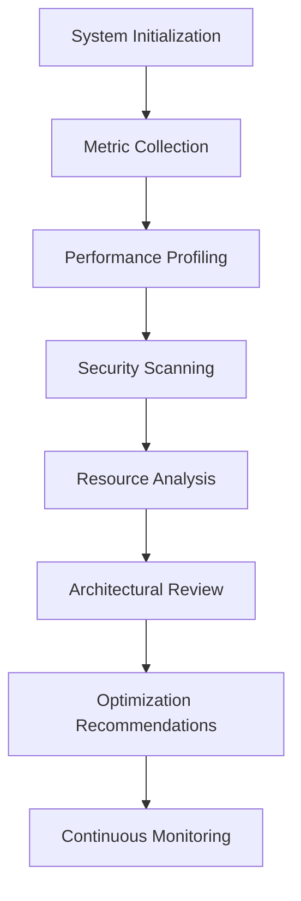

# SutazAI Advanced System Analysis Guide

## Overview
This guide provides a comprehensive methodology for conducting in-depth system analysis, focusing on performance, security, and optimization strategies.

## 1. Analysis Objectives

### 1.1 Primary Goals
- Comprehensive system understanding
- Performance optimization
- Security vulnerability assessment
- Resource efficiency evaluation

### 1.2 Analysis Dimensions
- **Technical Performance**
- **Resource Utilization**
- **Security Posture**
- **Architectural Integrity**
- **Scalability Potential**

## 2. Analytical Methodologies

### 2.1 Performance Analysis Techniques
- **Profiling**
  - CPU usage tracking
  - Memory consumption monitoring
  - I/O performance measurement

- **Benchmarking**
  - Comparative performance testing
  - Baseline establishment
  - Performance trend analysis

### 2.2 Security Analysis Approaches
- **Vulnerability Scanning**
  - Static code analysis
  - Dependency vulnerability checks
  - Runtime security assessment

- **Threat Modeling**
  - Attack surface identification
  - Risk probability evaluation
  - Mitigation strategy development

## 3. System Metrics Collection

### 3.1 Performance Metrics
- Request latency
- Throughput
- Error rates
- Resource consumption
- Response time distribution

### 3.2 Resource Metrics
- CPU utilization
- Memory usage
- Disk I/O
- Network bandwidth
- Process count

## 4. Analytical Tools and Frameworks

### 4.1 Performance Profiling
- `py-spy`
- `cProfile`
- `memory_profiler`
- `line_profiler`

### 4.2 Security Analysis
- `bandit`
- `safety`
- `OpenVAS`
- `OWASP ZAP`

### 4.3 Monitoring and Observability
- Prometheus
- Grafana
- OpenTelemetry
- ELK Stack

## 5. Comprehensive Analysis Workflow



## 6. Analysis Stages

### 6.1 Pre-Analysis Preparation
- System configuration snapshot
- Dependency inventory
- Performance baseline establishment

### 6.2 Analysis Execution
- Systematic data collection
- Multi-dimensional evaluation
- Comparative analysis

### 6.3 Post-Analysis
- Detailed reporting
- Actionable recommendations
- Continuous improvement strategies

## 7. Performance Optimization Strategies

### 7.1 Code-Level Optimizations
- Algorithm efficiency
- Memory management
- Concurrency improvements
- Caching mechanisms

### 7.2 System-Level Optimizations
- Resource allocation tuning
- Process scheduling
- Workload distribution
- Predictive scaling

## 8. Security Enhancement Recommendations

### 8.1 Preventive Measures
- Regular dependency updates
- Least privilege principle
- Multi-factor authentication
- Encryption at rest and in transit

### 8.2 Detection and Response
- Intrusion detection systems
- Anomaly monitoring
- Automated threat response
- Incident recovery protocols

## 9. Scalability Assessment

### 9.1 Horizontal Scaling
- Stateless architecture
- Microservices design
- Load balancing capabilities

### 9.2 Vertical Scaling
- Resource allocation flexibility
- Dynamic scaling mechanisms
- Performance bottleneck identification

## 10. Reporting and Documentation

### 10.1 Analysis Report Components
- Executive summary
- Detailed findings
- Risk assessment
- Recommendations
- Implementation roadmap

### 10.2 Visualization
- Performance graphs
- Resource utilization charts
- Trend analysis diagrams

## 11. Continuous Improvement

### 11.1 Feedback Loop
- Regular system reassessment
- Adaptive optimization
- Emerging technology integration

### 11.2 Knowledge Management
- Centralized findings repository
- Best practice documentation
- Lessons learned compilation

## 12. Advanced Analysis Techniques

### 12.1 Machine Learning Integration
- Predictive performance modeling
- Anomaly detection
- Automated optimization suggestions

### 12.2 Quantum Computing Potential
- Performance simulation
- Complex optimization scenarios
- Future technology readiness

## Conclusion
System analysis is an ongoing, dynamic process requiring continuous attention, sophisticated tools, and a holistic approach to understanding and improving complex technological ecosystems.

## Appendix: Sample Analysis Configuration

```yaml
system_analysis:
  version: 1.0.0
  scope: comprehensive
  frequency: quarterly
  
  performance:
    profiling_depth: advanced
    metrics_collection: detailed
  
  security:
    scan_level: comprehensive
    vulnerability_threshold: low
  
  optimization:
    strategy: adaptive
    machine_learning_enabled: true
```

---

*Last Updated: {{ current_date }}*
*Version: 1.0.0* 