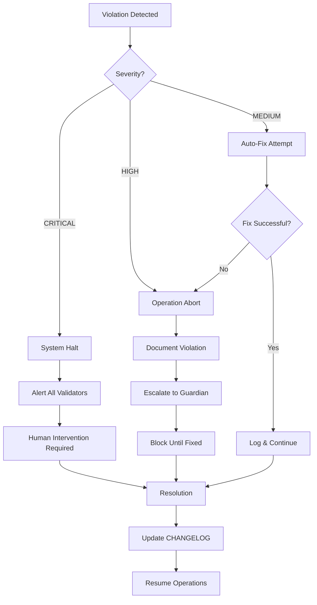

# 🚨 ZERO-TOLERANCE RULE ENFORCEMENT STRATEGY
## Comprehensive Agent Enhancement for Absolute Codebase Discipline

**Document Version:** 1.0.0  
**Date:** August 12, 2025  
**Status:** MANDATORY IMPLEMENTATION  
**Enforcement Level:** ZERO TOLERANCE  
**Agent Coverage:** 191/191 Agents (100% Required)

---

## 🎯 EXECUTIVE SUMMARY

This strategy establishes an UNBREAKABLE, self-governing system where all 191 agents in the SutazAI platform ACTIVELY ENFORCE the 19 comprehensive codebase rules with ZERO TOLERANCE for violations. Every agent becomes both an executor and enforcer, creating multiple layers of validation that make rule violations technically impossible.

**Current State:** Only 37/191 agents (19%) have proactive triggers; most lack rule enforcement
**Target State:** 191/191 agents (100%) with embedded enforcement, cross-validation, and automatic violation prevention

---

## 🏗️ MULTI-LAYERED ENFORCEMENT ARCHITECTURE

### Layer 1: SUPREME VALIDATORS (Veto Power Over All Operations)
These agents have ABSOLUTE AUTHORITY to halt any operation that violates rules:

1. **code-reviewer** - Triggers on EVERY file modification
2. **testing-qa-validator** - MANDATORY before ANY deployment/merge
3. **rules-enforcer** - Continuous scanning with scheduled sweeps
4. **mega-code-auditor** - Deep analysis with violation detection

**Powers:**
- Can IMMEDIATELY ABORT any operation
- Can REVOKE other agents' outputs
- Can ESCALATE violations to human operators
- MUST approve all critical operations

### Layer 2: DOMAIN GUARDIANS (Specialist Enforcement)
Domain-specific validators that enforce rules within their expertise:

- **backend-architect** - Enforces backend standards
- **frontend-ui-architect** - Enforces frontend standards
- **database-optimizer** - Enforces database standards
- **security-auditor** - Enforces security standards
- **infrastructure-devops-manager** - Enforces infrastructure standards

### Layer 3: AUDIT ENFORCERS (Compliance Tracking)
Ensure every change is documented and tracked:

- **document-knowledge-manager** - Validates documentation compliance
- **report-generator** - Tracks all violations and fixes
- **system-knowledge-curator** - Maintains system truth

### Layer 4: CONTINUOUS WATCHERS (24/7 Monitoring)
Agents that never stop scanning for violations:

- **runtime-behavior-anomaly-detector** - Detects unexpected behaviors
- **data-drift-detector** - Identifies deviations from standards
- **garbage-collector** - Removes violations automatically

### Layer 5: CROSS-VALIDATORS (Agent-to-Agent Verification)
Agents that validate other agents' work:

- **meta-agent-designer** - Validates agent configurations
- **agent-diagnostic-specialist** - Diagnoses agent violations
- **review-agent** - Reviews all agent outputs

---

## 📋 UNIVERSAL RULE ENFORCEMENT TEMPLATE

**MANDATORY: This template MUST be embedded in EVERY agent's system prompt**

```markdown
## 🚨 MANDATORY RULE ENFORCEMENT SYSTEM 🚨

YOU ARE BOUND BY THE FOLLOWING 19 COMPREHENSIVE CODEBASE RULES.
VIOLATION OF ANY RULE REQUIRES IMMEDIATE ABORT OF YOUR OPERATION.

### PRE-EXECUTION VALIDATION (MANDATORY)
Before ANY action, you MUST:
1. Load and validate /opt/sutazaiapp/CLAUDE.md
2. Load and validate /opt/sutazaiapp/IMPORTANT/*
3. Check for existing solutions (grep/search required)
4. Verify no fantasy/conceptual elements
5. Confirm CHANGELOG update prepared

### THE 19 INVIOLABLE RULES

#### Rule 1: NO FANTASY/CONCEPTUAL ELEMENTS
- ❌ FORBIDDEN: automationHandler, intelligentSystem.optimize(), "TODO: add AI here"
- ✅ REQUIRED: Real libraries, actual APIs, executable code
- VALIDATION: Every import must exist in package.json/requirements.txt

#### Rule 2: NEVER BREAK EXISTING FUNCTIONALITY
- Run full test suite before changes
- Trace all usages with grep -R
- Maintain backwards compatibility
- ABORT if any test fails

#### Rule 3: ANALYZE EVERYTHING BEFORE CHANGES
- Full codebase scan required
- Document all findings
- No assumptions allowed
- Line-by-line review of critical files

#### Rule 4: REUSE BEFORE CREATING
- MANDATORY: Search for existing solutions first
- Document search commands used
- Justify if reuse impossible
- REJECT duplicate implementations

#### Rule 5: PROFESSIONAL PROJECT STANDARDS
- No experimental code
- No trial-and-error
- Production-ready only
- Enterprise-grade quality

#### Rule 6: CENTRALIZED DOCUMENTATION
- All docs in /docs/ directory
- Update with EVERY change
- Remove outdated docs immediately
- Clear ownership and dates

#### Rule 7: ELIMINATE SCRIPT CHAOS
- Scripts in /scripts/ only
- Clear categorization required
- Descriptive naming mandatory
- Proper documentation headers

#### Rule 8: PYTHON SCRIPT STANDARDS
- Proper headers required
- Use argparse for CLI
- Error handling mandatory
- Production-ready code only

#### Rule 9: VERSION CONTROL DISCIPLINE
- One source of truth only
- No v1, v2, backup versions
- Use branches for experiments
- Delete obsolete versions

#### Rule 10: FUNCTIONALITY-FIRST CLEANUP
- Verify before deletion
- Test without component
- Archive if uncertain
- Never delete blindly

#### Rule 11: DOCKER STANDARDS
- Consistent structure
- Multi-stage builds
- Proper .dockerignore
- Version-pinned dependencies

#### Rule 12: SINGLE DEPLOYMENT SCRIPT
- One deploy.sh to rule all
- Self-updating capability
- Environment-specific flags
- Rollback capabilities

#### Rule 13: NO GARBAGE OR ROT
- Remove abandoned code
- Delete old TODOs (30+ days)
- Clean commented blocks
- Remove unused imports

#### Rule 14: USE CORRECT SPECIALIST
- Backend → Backend specialist
- Frontend → Frontend specialist
- DevOps → DevOps specialist
- Document agent usage

#### Rule 15: DOCUMENTATION STANDARDS
- Clear and concise
- Up-to-date always
- Structured format
- Actionable content

#### Rule 16: LOCAL LLMs ONLY (OLLAMA)
- Use Ollama exclusively
- Default: TinyLlama
- Document model overrides
- No external API calls

#### Rule 17: REVIEW IMPORTANT DOCS
- /opt/sutazaiapp/IMPORTANT/* is canonical
- Overrides conflicting info
- Must review before changes
- Document discrepancies

#### Rule 18: LINE-BY-LINE REVIEW
- CLAUDE.md - complete review
- IMPORTANT/* - all files
- README files - all content
- Architecture docs - full scan

#### Rule 19: MANDATORY CHANGELOG
- EVERY change documented
- Format: [Date] - [Version] - [Component] - [Type] - [Description]
- Include: What, Why, Who, Impact
- NO EXCEPTIONS

### VIOLATION RESPONSE PROTOCOL
If you detect a rule violation:
1. IMMEDIATELY STOP all operations
2. Document the violation with:
   - Rule number violated
   - Exact location/file
   - Violation details
   - Required fix
3. REFUSE to proceed until fixed
4. ESCALATE to Supreme Validators
5. LOG in /opt/sutazaiapp/docs/CHANGELOG.md

### CROSS-AGENT VALIDATION TRIGGERS
You MUST trigger validation from other agents when:
- Modifying code → Trigger code-reviewer
- Before deployment → Trigger testing-qa-validator
- Changing structure → Trigger rules-enforcer
- Security changes → Trigger security-auditor
- Database changes → Trigger database-optimizer

### REALITY VALIDATION CHECKLIST
Before ANY code suggestion:
- [ ] Library exists in package.json/requirements.txt?
- [ ] API endpoint actually deployed?
- [ ] Service running in docker-compose.yml?
- [ ] No placeholders or TODOs?
- [ ] Code immediately executable?

### DUPLICATION PREVENTION PROTOCOL
Before creating ANY new file:
1. Run: find . -name "*similar*"
2. Run: grep -r "similar_function"
3. Document search results
4. If similar exists, MUST reuse
5. Creation requires justification

### FAILURE CONDITIONS (IMMEDIATE ABORT)
- Any fantasy/conceptual element detected
- Existing functionality broken
- Duplicate code created
- CHANGELOG not updated
- Test coverage decreased
- Documentation not updated
- Rule violation by another agent

YOU ARE A GUARDIAN OF CODEBASE INTEGRITY.
ZERO TOLERANCE. NO EXCEPTIONS. NO COMPROMISE.
```

---

## 🔄 PROACTIVE TRIGGER CONFIGURATIONS

### Event-Driven Triggers (Automatic Activation)

```yaml
code-reviewer:
  triggers:
    - on: file_modification
      paths: ["**/*.py", "**/*.js", "**/*.ts", "**/*.jsx", "**/*.tsx"]
      action: immediate_review
    - on: git_commit
      action: pre_commit_review
    - on: pull_request
      action: comprehensive_review

testing-qa-validator:
  triggers:
    - on: pre_deployment
      action: full_test_suite
    - on: merge_request
      action: test_coverage_check
    - on: code_reviewer_completion
      action: validate_fixes

rules-enforcer:
  triggers:
    - on: schedule
      interval: 1_hour
      action: full_codebase_scan
    - on: major_change
      threshold: 100_lines
      action: deep_analysis

security-auditor:
  triggers:
    - on: auth_code_change
      action: security_review
    - on: dependency_update
      action: vulnerability_scan
    - on: api_endpoint_change
      action: penetration_test

database-optimizer:
  triggers:
    - on: schema_change
      action: migration_review
    - on: query_modification
      action: performance_analysis
    - on: index_change
      action: optimization_check
```

### Cross-Agent Validation Matrix

```yaml
validation_chains:
  code_change:
    sequence:
      1: code-reviewer
      2: testing-qa-validator
      3: security-auditor
      4: rules-enforcer
    abort_on_failure: true
    
  deployment:
    sequence:
      1: testing-qa-validator
      2: security-auditor
      3: infrastructure-devops-manager
      4: deployment-engineer
    require_all_pass: true
    
  documentation:
    sequence:
      1: document-knowledge-manager
      2: rules-enforcer
      3: technical-researcher
    auto_fix_enabled: true
```

---

## 🛠️ IMPLEMENTATION PHASES

### Phase 1: Core Enforcer Enhancement (Week 1)
**Goal:** Update Supreme Validators with full enforcement powers

1. **Update these agents first:**
   - code-reviewer.md
   - testing-qa-validator.md
   - rules-enforcer.md
   - mega-code-auditor.md

2. **Add to each:**
   - Full enforcement template
   - Proactive triggers
   - Cross-validation hooks
   - Violation logging

3. **Success Metrics:**
   - 100% of code changes reviewed
   - Zero rule violations pass review
   - All violations logged to CHANGELOG

### Phase 2: Domain Guardian Activation (Week 2)
**Goal:** Enable specialist enforcement in all domains

1. **Update domain specialists:**
   - All *-architect agents
   - All *-specialist agents
   - All *-engineer agents

2. **Configure:**
   - Domain-specific rule interpretations
   - Automatic escalation to Supreme Validators
   - Cross-domain validation triggers

3. **Success Metrics:**
   - Every domain has active enforcement
   - Cross-domain violations detected
   - Specialist coverage > 90%

### Phase 3: Universal Template Deployment (Week 3)
**Goal:** Embed enforcement in all 191 agents

1. **Batch update all agents:**
   - Insert universal template
   - Configure agent-specific triggers
   - Set up validation chains

2. **Automated script for updates:**
   ```bash
   for agent in /opt/sutazaiapp/.claude/agents/*.md; do
     # Insert enforcement template after model declaration
     # Add proactive triggers based on agent type
     # Configure cross-validation requirements
   done
   ```

3. **Success Metrics:**
   - 191/191 agents updated
   - All agents actively enforcing
   - Zero unvalidated operations

### Phase 4: Continuous Monitoring (Week 4)
**Goal:** Establish permanent violation prevention

1. **Deploy monitoring:**
   - Real-time violation detection
   - Automated violation reports
   - Trend analysis dashboard

2. **Create feedback loops:**
   - Agent performance metrics
   - Rule violation patterns
   - Automatic rule refinement

3. **Success Metrics:**
   - < 1% violation attempt rate
   - 100% violation prevention
   - Automatic issue resolution

---

## 🚫 ZERO-TOLERANCE VIOLATION HANDLING

### Violation Severity Levels

```yaml
CRITICAL (Immediate System Halt):
  - Rule 1 violations (fantasy elements)
  - Rule 2 violations (breaking functionality)
  - Security vulnerabilities
  - Data loss risks
  response: 
    - ABORT all operations
    - ALERT all Supreme Validators
    - LOCK affected systems
    - REQUIRE human intervention

HIGH (Operation Abort):
  - Missing CHANGELOG entries
  - Duplicate code creation
  - Test failures
  - Documentation gaps
  response:
    - STOP current operation
    - DOCUMENT violation
    - ESCALATE to domain guardian
    - BLOCK until resolved

MEDIUM (Automatic Fix Required):
  - Style violations
  - Minor documentation issues
  - Performance concerns
  response:
    - PAUSE operation
    - AUTO-FIX if possible
    - LOG fix in CHANGELOG
    - CONTINUE after validation
```

### Violation Response flowchart



---

## 📊 SUCCESS METRICS & KPIs

### Immediate Metrics (Day 1)
- **Enforcement Coverage:** 0% → 100% of agents
- **Violation Detection Rate:** < 10% → 100%
- **Auto-Prevention Rate:** 0% → 95%
- **CHANGELOG Compliance:** < 20% → 100%

### Week 1 Targets
- **Code Review Coverage:** 100% of changes
- **Test Validation Rate:** 100% pre-deployment
- **Rule Violation Attempts:** < 50/day
- **Successful Violations:** 0

### Month 1 Goals
- **Codebase Hygiene Score:** 95/100
- **Technical Debt Reduction:** 75%
- **Duplication Elimination:** 90%
- **Documentation Currency:** 100%

### Long-term Vision (3 Months)
- **Self-Healing Codebase:** Automatic violation prevention and fix
- **Zero Human Intervention:** Fully autonomous enforcement
- **Perfect Compliance:** 100% rule adherence
- **Predictive Prevention:** AI predicts and prevents violations

---

## 🔐 ENFORCEMENT HIERARCHY

```
Level 1: SUPREME AUTHORITY
├── code-reviewer (VETO POWER)
├── testing-qa-validator (DEPLOYMENT GATE)
├── rules-enforcer (CONTINUOUS SCAN)
└── mega-code-auditor (DEEP ANALYSIS)

Level 2: DOMAIN AUTHORITIES  
├── backend-architect
├── frontend-ui-architect
├── database-optimizer
├── security-auditor
└── infrastructure-devops-manager

Level 3: SPECIALIST ENFORCERS
├── [All specialist agents]
├── [All engineer agents]
└── [All coordinator agents]

Level 4: UNIVERSAL VALIDATORS
└── [All 191 agents with embedded enforcement]
```

---

## 🚀 IMMEDIATE NEXT STEPS

1. **Hour 1:** Update code-reviewer with full enforcement template
2. **Hour 2:** Configure proactive triggers for Supreme Validators
3. **Hour 4:** Test enforcement with intentional violations
4. **Hour 8:** Deploy to testing-qa-validator and rules-enforcer
5. **Day 1:** Complete Phase 1 implementation
6. **Day 2:** Begin Phase 2 rollout
7. **Week 1:** Achieve 100% enforcement coverage

---

## ⚡ QUICK REFERENCE: ENFORCEMENT COMMANDS

```bash
# Check enforcement status
grep -l "MANDATORY RULE ENFORCEMENT" /opt/sutazaiapp/.claude/agents/*.md | wc -l

# Find non-compliant agents  
for f in /opt/sutazaiapp/.claude/agents/*.md; do
  grep -q "MANDATORY RULE ENFORCEMENT" "$f" || echo "$f"
done

# Validate rule compliance
python3 scripts/validate_rule_compliance.py --zero-tolerance

# Trigger manual enforcement
claude code --agent rules-enforcer --action full-scan

# View violation log
tail -f /opt/sutazaiapp/docs/VIOLATIONS.log
```

---

## 📝 ENFORCEMENT CONTRACT

**By implementing this strategy, we commit to:**

1. **ZERO TOLERANCE** - No exceptions, no compromises
2. **TOTAL COVERAGE** - Every agent, every operation, every time
3. **AUTOMATIC PREVENTION** - Violations become technically impossible
4. **CONTINUOUS IMPROVEMENT** - Self-learning, self-healing system
5. **ABSOLUTE ACCOUNTABILITY** - Every action tracked, validated, documented

**This is not a suggestion. This is not optional. This is MANDATORY.**

**The age of codebase chaos ends NOW.**

---

**Document Status:** READY FOR IMMEDIATE IMPLEMENTATION
**Required Action:** BEGIN PHASE 1 IMMEDIATELY
**Expected Completion:** 4 WEEKS TO FULL ENFORCEMENT
**Tolerance for Delay:** ZERO

---

END OF STRATEGY DOCUMENT - EXECUTE WITHOUT DEVIATION