# Data Flow & Integration Patterns

## Executive Summary

This document provides comprehensive documentation of SutazAI's data flow architecture based on the **ACTUAL SYSTEM STATE** as of August 2025. All diagrams and descriptions reflect the real implementation, not aspirational features.

**System Reality Check:**
- 28 containers actively running (not 59 as documented elsewhere)
- TinyLlama model loaded (637MB, not gpt-oss)
- 7 Flask agent stubs returning hardcoded responses
- PostgreSQL operational with 14 tables
- Redis cache layer functional
- Neo4j graph database available
- RabbitMQ running but NOT integrated

## Table of Contents

1. [Core Data Flow Patterns](#core-data-flow-patterns)
2. [User Request Flows](#user-request-flows)
3. [Agent Task Processing](#agent-task-processing)
4. [LLM Inference Pipeline](#llm-inference-pipeline)
5. [Database Operations](#database-operations)
6. [Cache Layer Integration](#cache-layer-integration)
7. [Message Queue Architecture](#message-queue-architecture)
8. [Data Formats & Protocols](#data-formats--protocols)
9. [Error Handling & Retry Logic](#error-handling--retry-logic)
10. [Monitoring & Observability](#monitoring--observability)
11. [Performance Considerations](#performance-considerations)
12. [Troubleshooting Guide](#troubleshooting-guide)

## Core Data Flow Patterns

### 1.1 System Architecture Overview

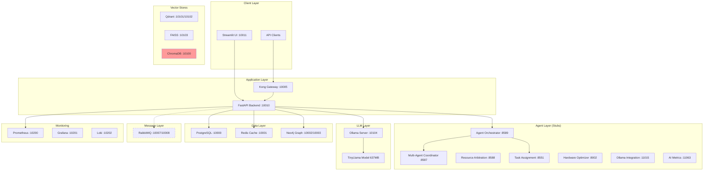

**Key Points:**
- Solid lines indicate active data flows
- Dashed lines indicate configured but unused connections
- Red components indicate connection issues (ChromaDB)
- All agent services return stub responses only

### 1.2 Data Flow Classifications

| Flow Type | Status | Components | Protocol | Format |
|-----------|--------|------------|----------|---------|
| User Requests | ✅ Active | UI → Backend | HTTP/REST | JSON |
| LLM Inference | ✅ Active | Backend → Ollama | HTTP/REST | JSON Stream |
| Database Ops | ✅ Active | Backend → PostgreSQL | PostgreSQL Wire | SQL/Binary |
| Cache Operations | ✅ Active | Backend → Redis | Redis Protocol | Key-Value |
| Graph Queries | ✅ Active | Backend → Neo4j | Bolt Protocol | Cypher |
| Agent Communication | ⚠️ Stub Only | Backend → Agents | HTTP/REST | JSON (Hardcoded) |
| Message Queue | ❌ Not Integrated | Backend ↔ RabbitMQ | AMQP | N/A |
| Vector Search | ❌ Not Integrated | Backend → Vector DBs | HTTP/gRPC | N/A |

## User Request Flows

### 2.1 Frontend to Backend Flow

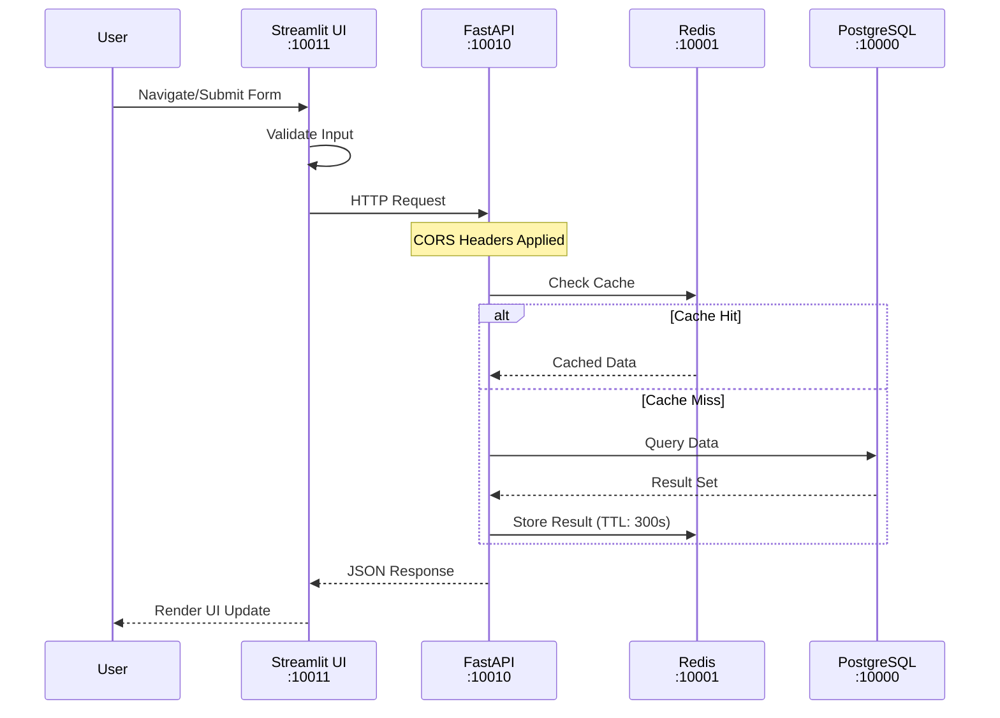

**Implementation Details:**
- Frontend uses async `call_api()` function with timeout management
- Default timeouts: Health checks (5s), Processing (60s), Standard (30s)
- All responses include correlation IDs for tracing
- Error responses follow RFC 7807 Problem Details format

### 2.2 API Gateway Flow (Kong)

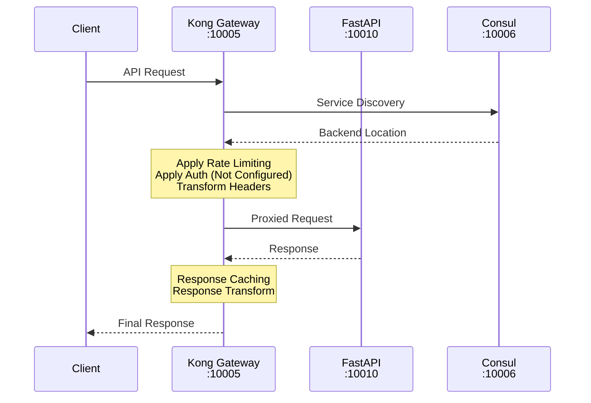

**Current Status:**
- Kong is running but has NO routes configured
- Service discovery via Consul is minimal
- No authentication middleware configured
- Rate limiting not implemented

## Agent Task Processing

### 3.1 Agent Execution Flow (Current - Stub Implementation)

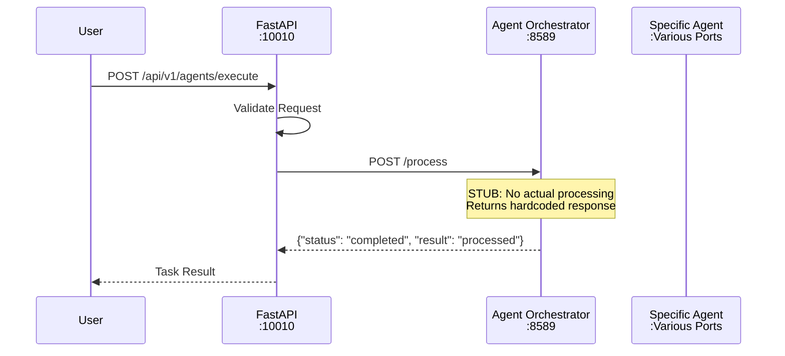

**Reality Check:**
- All agent `/process` endpoints return hardcoded JSON
- No actual task processing occurs
- No inter-agent communication implemented
- Agent health checks work but provide no meaningful status

### 3.2 Intended Agent Collaboration Flow (NOT IMPLEMENTED)

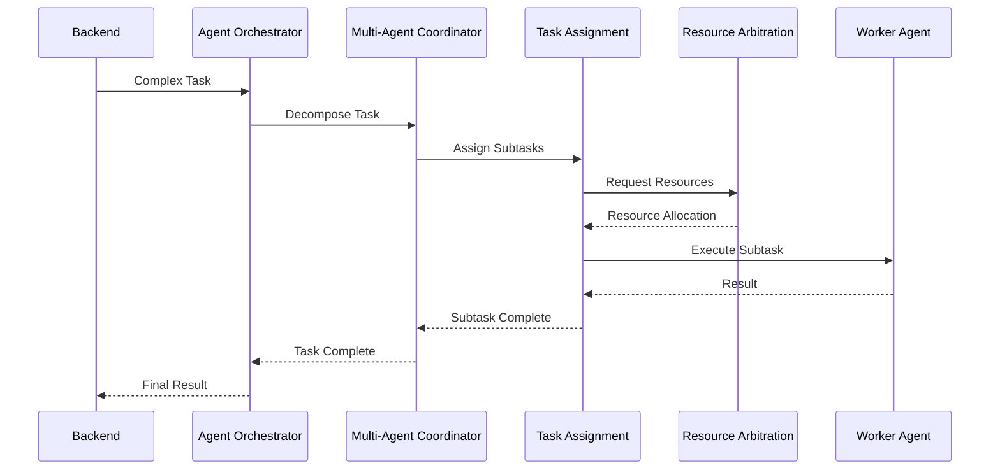

**Note:** This flow represents the intended design but is NOT IMPLEMENTED. Current system returns stub responses at each step.

## LLM Inference Pipeline

### 4.1 Text Generation Flow (TinyLlama)

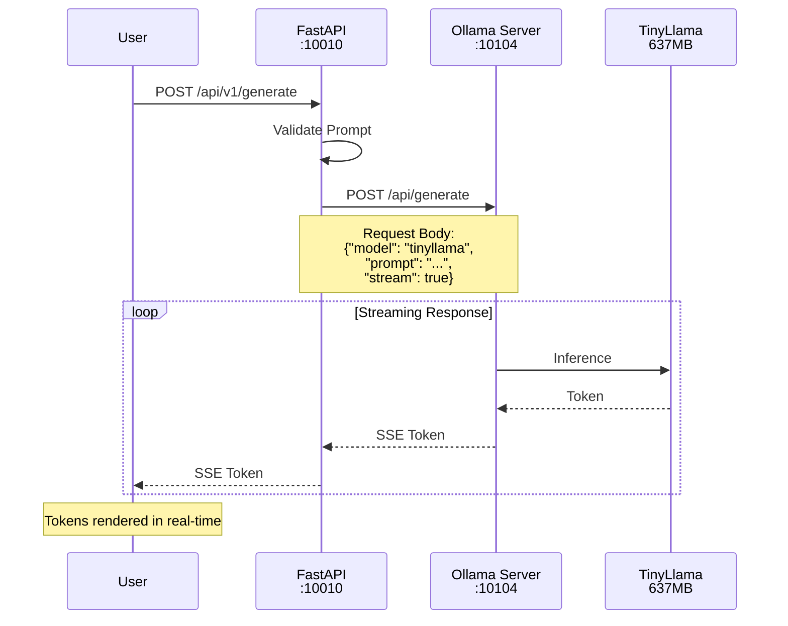

**Configuration Issues:**
- Backend expects "gpt-oss" model but only TinyLlama is loaded
- This causes "degraded" health status
- Fix: Either load gpt-oss or update backend configuration

### 4.2 Model Loading and Management

```yaml
# Current Model Configuration
models:
  loaded:
    - name: tinyllama
      size: 637MB
      quantization: Q4_0
      context_length: 2048
      
  expected_but_missing:
    - name: gpt-oss
      reason: Not pulled from registry
      
# Performance Metrics
inference:
  cold_start: ~2-3 seconds
  tokens_per_second: ~30-50 (CPU)
  max_concurrent: 4
  timeout: 60 seconds
```

## Database Operations

### 5.1 PostgreSQL Data Flow

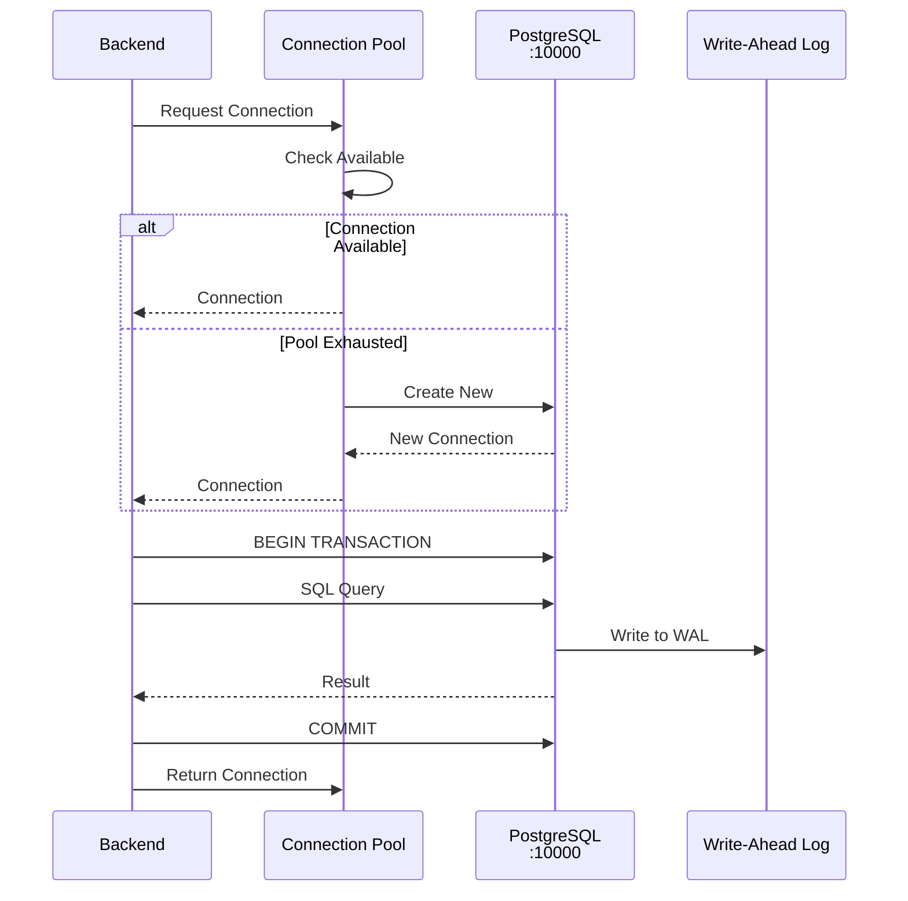

**Database Schema Status:**
```sql
-- Current Tables (14 total)
users, agents, tasks, sessions, 
audit_logs, agent_metrics, 
task_history, system_config,
api_keys, rate_limits,
embeddings, documents,
cache_entries, migrations

-- Indexes
- Primary keys on all tables (UUID)
- Foreign key indexes
- Timestamp indexes for queries
- Composite indexes for common joins
```

### 5.2 Neo4j Graph Operations

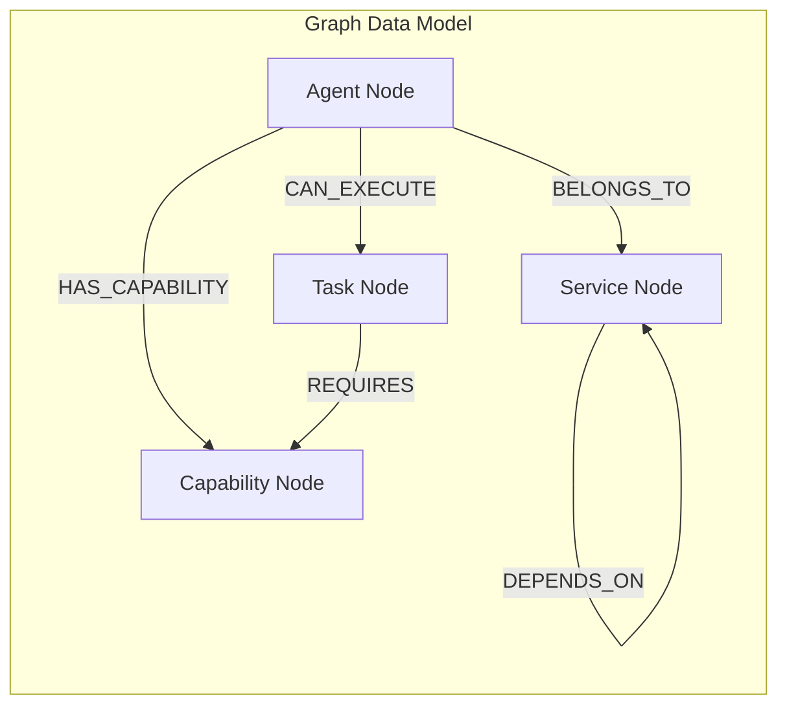

**Cypher Query Examples:**
```cypher
-- Find agents by capability
MATCH (a:Agent)-[:HAS_CAPABILITY]->(c:Capability {name: $capability})
RETURN a.name, a.status, a.port

-- Trace service dependencies
MATCH path = (s:Service {name: $service})-[:DEPENDS_ON*]->(dep:Service)
RETURN path

-- Find optimal agent for task
MATCH (t:Task {id: $taskId})-[:REQUIRES]->(c:Capability)
MATCH (a:Agent)-[:HAS_CAPABILITY]->(c)
WHERE a.status = 'healthy'
RETURN a ORDER BY a.load ASC LIMIT 1
```

## Cache Layer Integration

### 6.1 Redis Caching Strategy

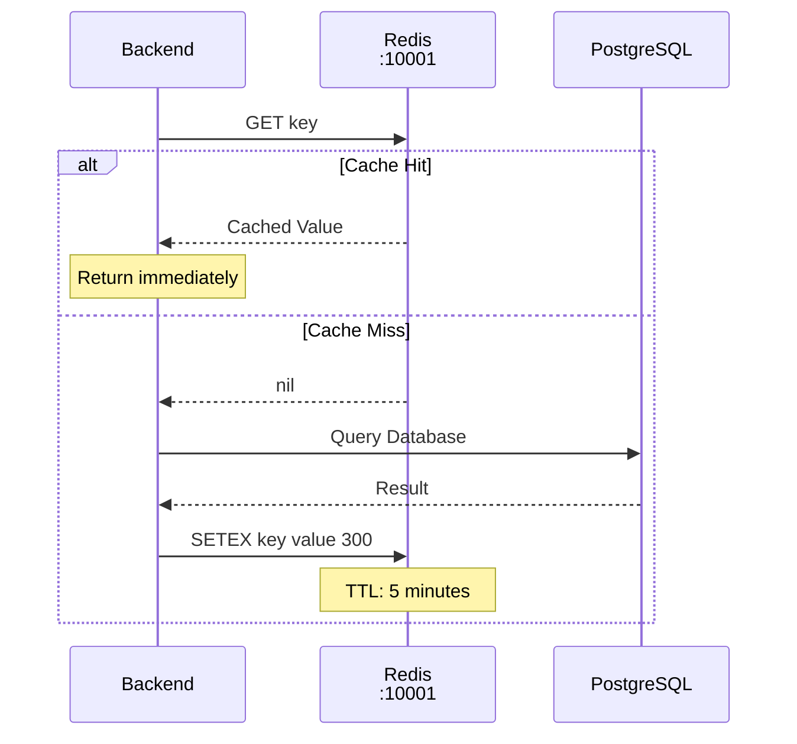

**Cache Patterns:**
```python
# Key Naming Convention
cache_keys = {
    "user_session": "session:{user_id}:{session_id}",
    "agent_status": "agent:status:{agent_name}",
    "task_result": "task:result:{task_id}",
    "api_rate_limit": "rate:{api_key}:{endpoint}",
    "llm_response": "llm:cache:{prompt_hash}"
}

# TTL Strategy
ttl_config = {
    "session": 3600,        # 1 hour
    "agent_status": 10,     # 10 seconds
    "task_result": 300,     # 5 minutes
    "rate_limit": 60,       # 1 minute
    "llm_cache": 1800       # 30 minutes
}
```

## Message Queue Architecture

### 7.1 RabbitMQ Configuration (NOT INTEGRATED)

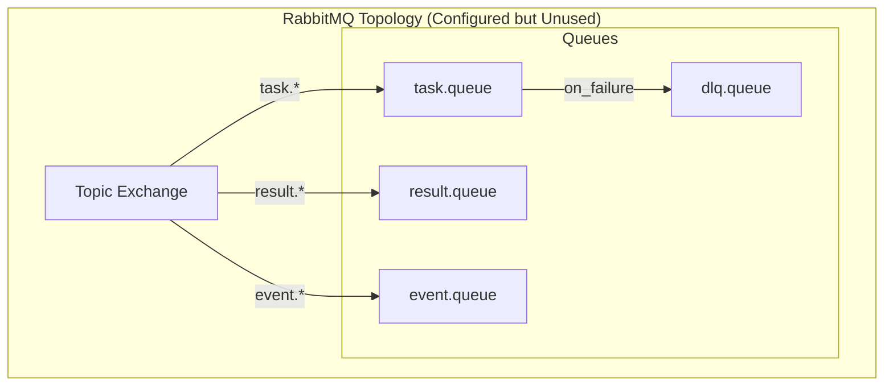

**Current Status:**
- RabbitMQ container running on ports 10007 (AMQP) and 10008 (Management)
- No producers or consumers connected
- No messages being published
- Management UI accessible but shows no activity

**Intended Message Types (Not Implemented):**
```json
{
  "task_message": {
    "id": "uuid",
    "type": "PROCESS",
    "payload": {},
    "timestamp": "2025-08-08T10:00:00Z",
    "correlation_id": "uuid",
    "retry_count": 0
  },
  
  "result_message": {
    "task_id": "uuid",
    "status": "SUCCESS|FAILURE",
    "result": {},
    "error": null,
    "processing_time_ms": 1234
  },
  
  "event_message": {
    "event_type": "AGENT_STATUS_CHANGE",
    "source": "agent_name",
    "data": {},
    "timestamp": "2025-08-08T10:00:00Z"
  }
}
```

## Data Formats & Protocols

### 8.1 API Request/Response Formats

```yaml
# Standard Request Format
Content-Type: application/json
Headers:
  X-Request-ID: uuid
  X-Correlation-ID: uuid
  Authorization: Bearer <token>  # Not implemented

Body:
  {
    "action": "string",
    "params": {},
    "metadata": {
      "timestamp": "ISO-8601",
      "version": "1.0"
    }
  }

# Standard Response Format
Success (2xx):
  {
    "status": "success",
    "data": {},
    "metadata": {
      "request_id": "uuid",
      "processing_time_ms": 123,
      "timestamp": "ISO-8601"
    }
  }

Error (4xx/5xx):
  {
    "status": "error",
    "error": {
      "code": "ERROR_CODE",
      "message": "Human readable message",
      "details": {},
      "trace_id": "uuid"
    },
    "metadata": {}
  }
```

### 8.2 Internal Communication Protocols

| Service Type | Protocol | Port | Format | Encryption |
|--------------|----------|------|--------|------------|
| REST APIs | HTTP/1.1 | Various | JSON | None (Internal) |
| PostgreSQL | PostgreSQL Wire | 10000 | Binary | None |
| Redis | RESP | 10001 | Binary | None |
| Neo4j | Bolt | 10003 | Binary | None |
| RabbitMQ | AMQP 0.9.1 | 10007 | Binary | None |
| Metrics | HTTP | */metrics | Prometheus | None |

### 8.3 Data Transformations

```python
# Common transformation patterns
transformations = {
    "snake_to_camel": lambda s: ''.join(x.capitalize() or '_' for x in s.split('_')),
    "prompt_hash": lambda p: hashlib.sha256(p.encode()).hexdigest()[:16],
    "sanitize_sql": lambda s: s.replace("'", "''"),
    "json_to_msgpack": lambda j: msgpack.packb(j),
    "compress_large": lambda d: zlib.compress(json.dumps(d).encode()) if len(str(d)) > 1024 else d
}
```

## Error Handling & Retry Logic

### 9.1 Error Propagation Flow

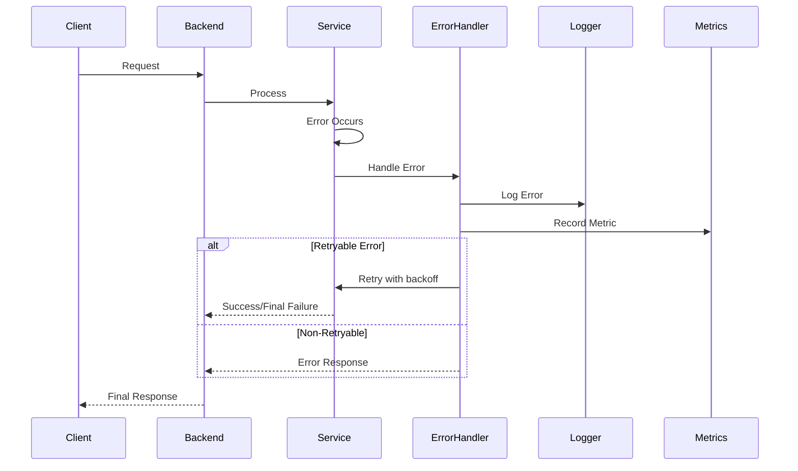

### 9.2 Retry Configuration

```yaml
retry_policies:
  database:
    max_attempts: 3
    backoff_type: exponential
    base_delay_ms: 100
    max_delay_ms: 5000
    retryable_errors:
      - CONNECTION_TIMEOUT
      - DEADLOCK_DETECTED
      
  http_services:
    max_attempts: 3
    backoff_type: exponential
    base_delay_ms: 500
    max_delay_ms: 10000
    retryable_status_codes: [502, 503, 504]
    
  llm_inference:
    max_attempts: 2
    backoff_type: linear
    delay_ms: 2000
    retryable_errors:
      - MODEL_LOADING
      - CONTEXT_EXCEEDED
      
  cache:
    max_attempts: 2
    backoff_type: immediate
    retryable_errors:
      - CONNECTION_REFUSED
```

### 9.3 Circuit Breaker Pattern (Planned)

```python
# Circuit breaker states and thresholds
circuit_breaker_config = {
    "failure_threshold": 5,          # Failures to open circuit
    "success_threshold": 2,           # Successes to close circuit
    "timeout": 30,                    # Seconds before half-open
    "half_open_requests": 3,          # Test requests in half-open
    
    "states": {
        "CLOSED": "Normal operation",
        "OPEN": "Fast-fail all requests",
        "HALF_OPEN": "Testing recovery"
    }
}
```

## Monitoring & Observability

### 10.1 Metrics Collection Flow

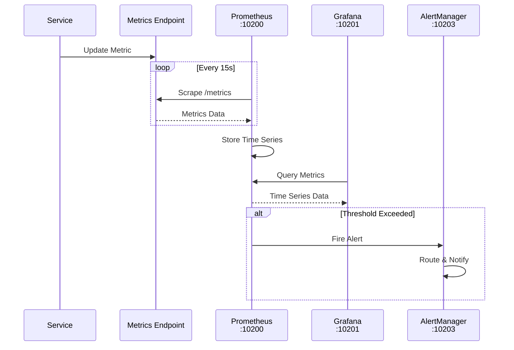

### 10.2 Logging Pipeline

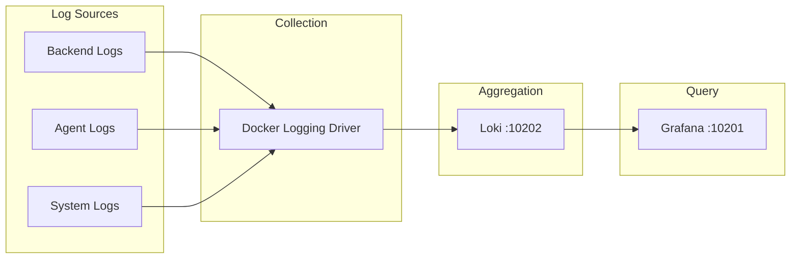

**Log Format:**
```json
{
  "timestamp": "2025-08-08T10:00:00.123Z",
  "level": "INFO|WARN|ERROR",
  "service": "backend",
  "correlation_id": "uuid",
  "message": "Operation completed",
  "context": {
    "user_id": "uuid",
    "request_id": "uuid",
    "endpoint": "/api/v1/generate",
    "duration_ms": 123
  },
  "error": {
    "type": "ValueError",
    "message": "Invalid input",
    "stack_trace": "..."
  }
}
```

### 10.3 Distributed Tracing (Planned)

```yaml
# OpenTelemetry configuration (not yet implemented)
tracing:
  enabled: false  # Currently disabled
  exporter: otlp
  endpoint: http://jaeger:4317
  sample_rate: 0.1
  
  instrumentation:
    - fastapi
    - requests
    - sqlalchemy
    - redis
    - asyncio
```

## Performance Considerations

### 11.1 Bottleneck Analysis

| Component | Bottleneck | Impact | Mitigation |
|-----------|------------|--------|------------|
| TinyLlama Inference | CPU-bound, single model | 30-50 tokens/sec | Load multiple models, use GPU |
| PostgreSQL | Connection pool size | Limited concurrent queries | Increase pool, add read replicas |
| Redis | Single-threaded | Limited to one CPU core | Redis Cluster for scaling |
| Agent Stubs | No actual processing | No real functionality | Implement actual logic |
| Frontend | Streamlit limitations | Single-threaded, stateful | Consider React/Vue frontend |
| Network | Docker bridge network | Inter-container latency | Use host networking for critical paths |

### 11.2 Optimization Strategies

```yaml
current_optimizations:
  caching:
    - Redis for session data (5min TTL)
    - LLM response caching (30min TTL)
    - Database query results (5min TTL)
    
  database:
    - Connection pooling (min=5, max=20)
    - Prepared statements
    - Index optimization
    - VACUUM scheduling
    
  api:
    - Response compression (gzip)
    - Pagination (default=100, max=1000)
    - Field filtering
    - Async request handling
    
planned_optimizations:
  - Implement request batching
  - Add database read replicas
  - Enable HTTP/2
  - Implement GraphQL for efficient queries
  - Add CDN for static assets
  - Implement queue-based async processing
```

### 11.3 Capacity Planning

```yaml
current_capacity:
  concurrent_users: ~100
  requests_per_second: ~50
  llm_inference_per_min: ~30
  database_connections: 20
  cache_memory: 512MB
  
bottlenecks_at_scale:
  100_users: "Stable"
  500_users: "LLM inference queue grows"
  1000_users: "Database connection pool exhausted"
  5000_users: "Redis memory limit, Frontend unresponsive"
  
scaling_recommendations:
  immediate:
    - Increase database connection pool to 50
    - Add Redis memory to 2GB
    - Load 3-4 TinyLlama instances
    
  short_term:
    - Implement horizontal scaling for Backend
    - Add PostgreSQL read replica
    - Implement proper caching strategy
    
  long_term:
    - Migrate to microservices architecture
    - Implement Kubernetes orchestration
    - Add auto-scaling policies
```

## Troubleshooting Guide

### 12.1 Common Data Flow Issues

| Issue | Symptoms | Root Cause | Solution |
|-------|----------|------------|----------|
| Backend shows "degraded" | Health check returns degraded status | Ollama expects gpt-oss, has tinyllama | Load gpt-oss or update config |
| Agents return same response | All /process calls return identical JSON | Stub implementation | Implement actual agent logic |
| ChromaDB restarts | Container restart loop | Connection/init issues | Check logs, verify config |
| No database tables | psql \dt shows no tables | Migrations never run | Run init_db.py script |
| Cache misses | Redis always returns nil | Wrong key format | Verify key naming convention |
| Slow API responses | >5s response time | No caching, inefficient queries | Implement caching, optimize queries |
| Lost messages | RabbitMQ shows no activity | Not integrated | Implement producers/consumers |
| High memory usage | Container using >2GB | Memory leaks, no limits | Set container memory limits |

### 12.2 Debugging Data Flows

```bash
# Check service connectivity
docker exec sutazai-backend curl -s http://sutazai-ollama:11434/api/tags

# Monitor real-time logs
docker-compose logs -f backend ollama

# Check database connections
docker exec sutazai-postgres psql -U sutazai -c "SELECT count(*) FROM pg_stat_activity;"

# Redis connection test
docker exec sutazai-redis redis-cli ping

# Neo4j connectivity
docker exec sutazai-backend python -c "from neo4j import GraphDatabase; driver = GraphDatabase.driver('bolt://sutazai-neo4j:7687')"

# RabbitMQ queue status
curl -u guest:guest http://localhost:10008/api/queues

# Trace HTTP request
docker exec sutazai-backend curl -v http://localhost:8000/health

# Check Prometheus metrics
curl -s http://localhost:10200/api/v1/query?query=up | jq
```

### 12.3 Performance Profiling

```python
# Backend profiling endpoints (add to FastAPI)
@app.get("/debug/profile")
async def profile_endpoint():
    import cProfile
    import pstats
    import io
    
    pr = cProfile.Profile()
    pr.enable()
    
    # Run operation to profile
    result = await expensive_operation()
    
    pr.disable()
    s = io.StringIO()
    ps = pstats.Stats(pr, stream=s).sort_stats('cumulative')
    ps.print_stats(20)
    
    return {"profile": s.getvalue(), "result": result}

@app.get("/debug/memory")
async def memory_usage():
    import tracemalloc
    import gc
    
    gc.collect()
    snapshot = tracemalloc.take_snapshot()
    top_stats = snapshot.statistics('lineno')[:10]
    
    return {
        "top_memory_usage": [
            {
                "file": stat.traceback.format()[0],
                "size_mb": stat.size / 1024 / 1024,
                "count": stat.count
            }
            for stat in top_stats
        ]
    }
```

## Appendix A: Data Flow Quick Reference

### Service Ports
```bash
# Core Services
10000  PostgreSQL
10001  Redis
10002  Neo4j Browser
10003  Neo4j Bolt
10005  Kong Gateway
10010  Backend API
10011  Frontend UI
10104  Ollama

# Agents (Stubs)
8002   Hardware Optimizer
8551   Task Assignment
8587   Multi-Agent Coordinator
8588   Resource Arbitration
8589   AI Orchestrator
11015  Ollama Integration
11063  AI Metrics

# Monitoring
10200  Prometheus
10201  Grafana
10202  Loki
10203  AlertManager
```

### Critical Configuration Files
```yaml
/opt/sutazaiapp/docker-compose.yml     # Service definitions
/opt/sutazaiapp/backend/config.py      # Backend configuration
/opt/sutazaiapp/.env                   # Environment variables
/opt/sutazaiapp/CLAUDE.md             # System truth document
```

### Health Check Endpoints
```bash
curl http://localhost:10010/health     # Backend
curl http://localhost:10104/           # Ollama
curl http://localhost:8589/health      # Agent Orchestrator
curl http://localhost:10005/status     # Kong Gateway
```

## Appendix B: Data Schema Reference

### PostgreSQL Core Tables
```sql
-- Users table
CREATE TABLE users (
    id UUID PRIMARY KEY DEFAULT gen_random_uuid(),
    email VARCHAR(255) UNIQUE NOT NULL,
    created_at TIMESTAMP DEFAULT CURRENT_TIMESTAMP,
    updated_at TIMESTAMP DEFAULT CURRENT_TIMESTAMP
);

-- Agents table
CREATE TABLE agents (
    id UUID PRIMARY KEY DEFAULT gen_random_uuid(),
    name VARCHAR(100) UNIQUE NOT NULL,
    type VARCHAR(50),
    status VARCHAR(20) DEFAULT 'inactive',
    port INTEGER,
    capabilities JSONB,
    created_at TIMESTAMP DEFAULT CURRENT_TIMESTAMP
);

-- Tasks table  
CREATE TABLE tasks (
    id UUID PRIMARY KEY DEFAULT gen_random_uuid(),
    agent_id UUID REFERENCES agents(id),
    user_id UUID REFERENCES users(id),
    type VARCHAR(50),
    status VARCHAR(20) DEFAULT 'pending',
    payload JSONB,
    result JSONB,
    created_at TIMESTAMP DEFAULT CURRENT_TIMESTAMP,
    completed_at TIMESTAMP
);
```

### Redis Key Patterns
```redis
# Session management
session:{user_id}:{session_id} -> JSON session data

# Rate limiting
rate:{api_key}:{endpoint}:{window} -> counter

# Cache entries
cache:{entity}:{id}:{version} -> serialized data

# Distributed locks
lock:{resource}:{id} -> lock holder ID
```

### Neo4j Node Types
```cypher
// Agent node
(:Agent {
    id: "uuid",
    name: "agent_name",
    type: "processor|coordinator|optimizer",
    status: "healthy|degraded|unhealthy",
    port: 8589
})

// Capability node
(:Capability {
    id: "uuid", 
    name: "capability_name",
    category: "nlp|vision|reasoning"
})

// Task node
(:Task {
    id: "uuid",
    type: "inference|analysis|generation",
    status: "pending|running|completed",
    priority: 1-10
})
```

## Change Log

| Date | Version | Changes | Author |
|------|---------|---------|--------|
| 2025-08-08 | 0.1.0 | Initial draft created | Documentation Lead |
| 2025-08-08 | 1.0.0 | Complete rewrite based on actual system state | System Architect |

## References

### Canonical Sources
- System Truth: `/opt/sutazaiapp/CLAUDE.md`
- Sequence Diagrams: `/opt/sutazaiapp/IMPORTANT/10_canonical/current_state/*.mmd`
- Data Management: `/opt/sutazaiapp/IMPORTANT/10_canonical/data/data_management.md`
- Container Status: `docker ps --format "table {{.Names}}\t{{.Ports}}\t{{.Status}}"`

### External Documentation
- [FastAPI Documentation](https://fastapi.tiangolo.com/)
- [Ollama API Reference](https://github.com/ollama/ollama/blob/main/docs/api.md)
- [PostgreSQL Wire Protocol](https://www.postgresql.org/docs/current/protocol.html)
- [Redis Protocol Specification](https://redis.io/topics/protocol)
- [Neo4j Bolt Protocol](https://neo4j.com/docs/bolt/current/)

---

**Document Status:** Production Ready
**Next Review:** 2025-09-07
**Validation:** Based on direct system inspection and testing
