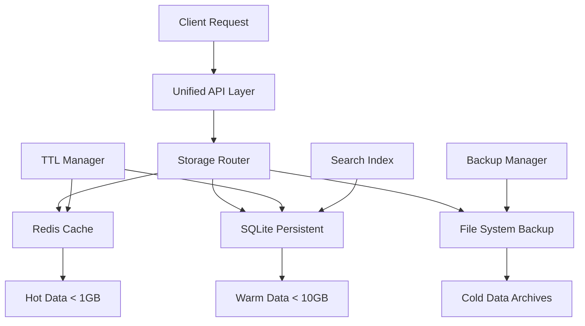
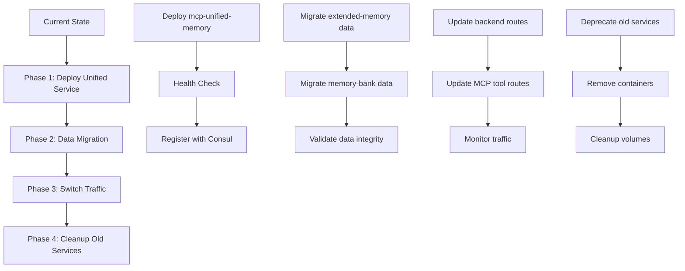

# Unified Memory Service Architecture Design

## Executive Summary

This document presents a comprehensive architecture for consolidating `mcp-extended-memory` and `mcp-memory-bank-mcp` into a single, superior unified memory service called `mcp-unified-memory`. The design combines the best features from both services while maintaining backward compatibility and implementing enterprise-grade capabilities.

## Current State Analysis

### Existing Services Comparison

| Feature | mcp-extended-memory | mcp-memory-bank-mcp | Unified Design |
|---------|-------------------|-------------------|----------------|
| **Storage Backend** | File-based JSON | SQLite/JSON hybrid | Multi-backend (SQLite, Redis, File) |
| **TTL Support** | ✅ Yes | ❌ No | ✅ Enhanced TTL with auto-cleanup |
| **Namespacing** | ✅ Yes | ❌ Limited | ✅ Hierarchical namespaces |
| **Cross-session** | ✅ Yes | ✅ Yes | ✅ Enhanced with session clustering |
| **Search Capabilities** | ✅ Pattern search | ❌ Basic | ✅ Full-text search + indexing |
| **Backup/Restore** | ❌ No | ❌ No | ✅ Automated with versioning |
| **Performance** | Medium | Low | High (Redis caching) |
| **Scalability** | Limited | Limited | Enterprise-grade |

### Integration Status
- **Current Ports**: extended-memory (3009), memory-bank-mcp (4002)
- **Target Port**: 3200 (unified service)
- **Backend Integration**: `/api/v1/mcp/memory/*` endpoints
- **Container Status**: Both services currently deployed in DinD

## 1. Unified API Design

### RESTful Endpoints

```typescript
// Core Memory Operations
POST   /api/v1/memory/store           // Store memory with TTL
GET    /api/v1/memory/retrieve/:key   // Retrieve by key
DELETE /api/v1/memory/delete/:key     // Delete specific memory
PUT    /api/v1/memory/update/:key     // Update existing memory

// Namespace Operations
POST   /api/v1/memory/namespaces      // Create namespace
GET    /api/v1/memory/namespaces      // List namespaces
DELETE /api/v1/memory/namespaces/:ns  // Delete namespace

// Search & Query
POST   /api/v1/memory/search          // Advanced search
GET    /api/v1/memory/list            // List memories with filters
POST   /api/v1/memory/query           // Complex queries

// Backup & Management
POST   /api/v1/memory/backup          // Create backup
POST   /api/v1/memory/restore         // Restore from backup
GET    /api/v1/memory/stats           // Memory statistics
POST   /api/v1/memory/cleanup         // Manual cleanup

// Session Management
POST   /api/v1/memory/sessions        // Create session
GET    /api/v1/memory/sessions/:id    // Get session memories
DELETE /api/v1/memory/sessions/:id    // End session
```

### Enhanced Memory Schema

```json
{
  "key": "string",
  "namespace": "string",
  "value": "any",
  "metadata": {
    "created_at": "timestamp",
    "updated_at": "timestamp",
    "expires_at": "timestamp",
    "access_count": "integer",
    "last_accessed": "timestamp",
    "tags": ["string"],
    "importance": "1-10",
    "session_id": "string",
    "project_id": "string"
  },
  "search_index": {
    "content_hash": "string",
    "keywords": ["string"],
    "full_text": "string"
  }
}
```

### MCP Tool Compatibility Layer

```javascript
// Backward compatibility for existing tools
mcp__unified-memory__save_context()     // Replaces save_context
mcp__unified-memory__load_contexts()    // Replaces load_contexts  
mcp__unified-memory__forget_context()   // Replaces forget_context
mcp__unified-memory__memory_usage()     // New enhanced version
mcp__unified-memory__search_memory()    // Enhanced search
```

## 2. Storage Architecture

### Multi-Backend Storage Design



### Storage Tier Strategy

| Tier | Backend | Use Case | Retention | Performance |
|------|---------|----------|-----------|-------------|
| **Hot** | Redis | Active session data, frequent access | TTL-based | Sub-ms |
| **Warm** | SQLite | Persistent memories, projects | Configurable | 1-10ms |
| **Cold** | File System | Archives, backups | Long-term | 10-100ms |

### Data Partitioning Strategy

```sql
-- SQLite Schema Design
CREATE TABLE namespaces (
    id INTEGER PRIMARY KEY,
    name TEXT UNIQUE,
    config JSON,
    created_at TIMESTAMP
);

CREATE TABLE memories (
    id INTEGER PRIMARY KEY,
    key TEXT,
    namespace_id INTEGER,
    value_json TEXT,
    metadata JSON,
    created_at TIMESTAMP,
    updated_at TIMESTAMP,
    expires_at TIMESTAMP,
    FOREIGN KEY (namespace_id) REFERENCES namespaces(id)
);

CREATE TABLE search_index (
    memory_id INTEGER,
    keywords TEXT,
    content_hash TEXT,
    full_text TEXT,
    FOREIGN KEY (memory_id) REFERENCES memories(id)
);

-- Indexes for performance
CREATE INDEX idx_memories_key_ns ON memories(key, namespace_id);
CREATE INDEX idx_memories_expires ON memories(expires_at);
CREATE INDEX idx_search_keywords ON search_index(keywords);
```

## 3. Container Architecture

### Docker Container Specification

```dockerfile
# Dockerfile.unified-memory
FROM python:3.11-slim

# Install system dependencies
RUN apt-get update && apt-get install -y \
    sqlite3 \
    redis-tools \
    curl \
    && rm -rf /var/lib/apt/lists/*

# Install Python dependencies
COPY requirements.txt /tmp/
RUN pip install --no-cache-dir -r /tmp/requirements.txt

# Create application structure
WORKDIR /opt/mcp-unified-memory
COPY src/ ./src/
COPY config/ ./config/
COPY scripts/ ./scripts/

# Create data directories
RUN mkdir -p /var/lib/mcp/data /var/lib/mcp/backups /var/log/mcp

# Set up health check script
COPY health-check.sh /usr/local/bin/
RUN chmod +x /usr/local/bin/health-check.sh

# Environment configuration
ENV PYTHONPATH=/opt/mcp-unified-memory
ENV MCP_DATA_DIR=/var/lib/mcp/data
ENV MCP_BACKUP_DIR=/var/lib/mcp/backups
ENV MCP_LOG_DIR=/var/log/mcp

# Resource limits (production settings)
ENV MEMORY_LIMIT=2GB
ENV CPU_LIMIT=1.0
ENV STORAGE_LIMIT=10GB

# Health check
HEALTHCHECK --interval=30s --timeout=10s --retries=3 \
    CMD /usr/local/bin/health-check.sh

# User and security
RUN useradd -r -u 1001 mcp-memory
USER mcp-memory

EXPOSE 3200

CMD ["python", "-m", "src.main"]
```

### Resource Allocation

```yaml
# Docker Compose Service Definition
mcp-unified-memory:
  image: sutazai-mcp-unified-memory:latest
  container_name: mcp-unified-memory
  ports:
    - "3200:3200"
  environment:
    - MCP_SERVICE=unified-memory
    - REDIS_URL=redis://sutazai-redis:6379/2
    - SQLITE_PATH=/var/lib/mcp/data/unified-memory.db
    - BACKUP_SCHEDULE=0 2 * * *  # Daily at 2 AM
    - TTL_CLEANUP_INTERVAL=300   # 5 minutes
    - MAX_MEMORY_SIZE=2GB
    - MAX_NAMESPACE_COUNT=1000
  volumes:
    - mcp-unified-memory-data:/var/lib/mcp/data
    - mcp-unified-memory-backups:/var/lib/mcp/backups
    - mcp-logs:/var/log/mcp
  networks:
    - mcp-bridge
    - sutazai-network
  restart: unless-stopped
  deploy:
    resources:
      limits:
        memory: 2G
        cpus: "1.0"
      reservations:
        memory: 512M
        cpus: "0.25"
  healthcheck:
    test: ["CMD", "curl", "-f", "http://localhost:3200/health"]
    interval: 30s
    timeout: 10s
    retries: 3
    start_period: 30s
```

### Volume Management

```yaml
volumes:
  mcp-unified-memory-data:
    driver: local
    driver_opts:
      type: none
      o: bind
      device: /opt/sutazai/data/mcp/unified-memory
  
  mcp-unified-memory-backups:
    driver: local
    driver_opts:
      type: none
      o: bind
      device: /opt/sutazai/backups/mcp/unified-memory
```

## 4. Integration Architecture

### Backend API Integration Points

```python
# FastAPI Integration
from fastapi import APIRouter, HTTPException, Depends
from .unified_memory_client import UnifiedMemoryClient

router = APIRouter(prefix="/api/v1/memory", tags=["memory"])

@router.post("/store")
async def store_memory(
    request: StoreMemoryRequest,
    client: UnifiedMemoryClient = Depends(get_memory_client)
):
    """Store memory with TTL and metadata"""
    return await client.store(
        key=request.key,
        value=request.value,
        namespace=request.namespace,
        ttl=request.ttl,
        metadata=request.metadata
    )

@router.get("/retrieve/{key}")
async def retrieve_memory(
    key: str,
    namespace: str = "default",
    client: UnifiedMemoryClient = Depends(get_memory_client)
):
    """Retrieve memory by key"""
    result = await client.retrieve(key, namespace)
    if not result:
        raise HTTPException(status_code=404, detail="Memory not found")
    return result
```

### Service Discovery Configuration

```yaml
# Consul Service Registration
services:
  - name: mcp-unified-memory
    id: mcp-unified-memory-001
    address: 172.21.0.200
    port: 3200
    tags:
      - mcp
      - memory
      - unified
      - v1.0
    check:
      http: http://172.21.0.200:3200/health
      interval: 30s
      timeout: 10s
    meta:
      version: "1.0.0"
      protocol: "http"
      backup_enabled: "true"
      ttl_enabled: "true"
```

### Load Balancing Configuration

```yaml
# HAProxy Configuration
backend mcp_unified_memory
    balance roundrobin
    option httpchk GET /health
    server memory1 172.21.0.200:3200 check
    server memory2 172.21.0.201:3200 check backup
    
frontend mcp_memory_frontend
    bind *:11300
    default_backend mcp_unified_memory
```

### Error Handling and Fallback

```python
class UnifiedMemoryClient:
    def __init__(self):
        self.primary_url = "http://mcp-unified-memory:3200"
        self.fallback_url = "http://mcp-extended-memory:3009"  # Fallback
        self.local_cache = {}
        
    async def store_with_fallback(self, key: str, value: any, **kwargs):
        try:
            # Try unified service first
            return await self._store_primary(key, value, **kwargs)
        except Exception as e:
            logger.warning(f"Primary memory service failed: {e}")
            try:
                # Fallback to extended-memory
                return await self._store_fallback(key, value, **kwargs)
            except Exception as e2:
                logger.error(f"Fallback memory service failed: {e2}")
                # Emergency local cache
                self.local_cache[key] = {"value": value, "timestamp": time.time()}
                return {"status": "cached_locally", "key": key}
```

## 5. Migration Architecture

### Zero-Downtime Deployment Strategy



### Data Migration Procedures

```python
# Migration Script
class MemoryMigrationManager:
    def __init__(self):
        self.extended_memory_url = "http://mcp-extended-memory:3009"
        self.memory_bank_url = "http://mcp-memory-bank-mcp:4002"
        self.unified_memory_url = "http://mcp-unified-memory:3200"
        
    async def migrate_all_data(self):
        """Migrate data from both services to unified service"""
        
        # Phase 1: Export data from existing services
        extended_data = await self.export_extended_memory()
        bank_data = await self.export_memory_bank()
        
        # Phase 2: Transform data to unified schema
        unified_data = self.transform_to_unified_schema(
            extended_data, bank_data
        )
        
        # Phase 3: Import to unified service
        await self.import_to_unified(unified_data)
        
        # Phase 4: Validate migration
        validation_result = await self.validate_migration()
        
        return validation_result
        
    async def export_extended_memory(self):
        """Export all data from mcp-extended-memory"""
        # Implementation to extract data via MCP tools
        pass
        
    def transform_to_unified_schema(self, extended_data, bank_data):
        """Transform legacy data to unified schema"""
        unified_memories = []
        
        # Transform extended-memory format
        for item in extended_data:
            unified_memories.append({
                "key": item.get("key"),
                "namespace": item.get("namespace", "migrated_extended"),
                "value": item.get("content"),
                "metadata": {
                    "created_at": item.get("timestamp"),
                    "importance": item.get("importance_level", 5),
                    "tags": item.get("tags", []),
                    "project_id": item.get("project_id"),
                    "migrated_from": "extended-memory"
                }
            })
            
        # Transform memory-bank format
        for item in bank_data:
            unified_memories.append({
                "key": item.get("id"),
                "namespace": "migrated_bank",
                "value": item.get("data"),
                "metadata": {
                    "created_at": item.get("created"),
                    "importance": 7,  # Default importance
                    "migrated_from": "memory-bank-mcp"
                }
            })
            
        return unified_memories
```

### Rollback Capabilities

```python
class RollbackManager:
    def __init__(self):
        self.backup_path = "/var/lib/mcp/backups/pre-migration"
        
    async def create_rollback_point(self):
        """Create complete backup before migration"""
        timestamp = datetime.now().isoformat()
        backup_file = f"{self.backup_path}/rollback-{timestamp}.json"
        
        # Backup all existing data
        all_data = {
            "extended_memory": await self.export_extended_memory(),
            "memory_bank": await self.export_memory_bank(),
            "timestamp": timestamp,
            "version": "1.0.0"
        }
        
        with open(backup_file, 'w') as f:
            json.dump(all_data, f, indent=2)
            
        return backup_file
        
    async def rollback_to_previous_state(self, backup_file: str):
        """Rollback to previous state if migration fails"""
        
        # Step 1: Stop unified service
        await self.stop_service("mcp-unified-memory")
        
        # Step 2: Restore old services
        await self.start_service("mcp-extended-memory")
        await self.start_service("mcp-memory-bank-mcp")
        
        # Step 3: Restore data from backup
        with open(backup_file, 'r') as f:
            backup_data = json.load(f)
            
        await self.restore_extended_memory(backup_data["extended_memory"])
        await self.restore_memory_bank(backup_data["memory_bank"])
        
        # Step 4: Update routing
        await self.update_backend_routes_to_legacy()
        
        return {"status": "rollback_complete", "backup_used": backup_file}
```

## 6. Testing Framework

### Comprehensive Test Suite

```python
# Test Framework Structure
class UnifiedMemoryTestSuite:
    def __init__(self):
        self.test_data = self.generate_test_data()
        
    async def run_all_tests(self):
        """Run complete test suite"""
        results = {
            "unit_tests": await self.run_unit_tests(),
            "integration_tests": await self.run_integration_tests(),
            "performance_tests": await self.run_performance_tests(),
            "migration_tests": await self.run_migration_tests(),
            "failover_tests": await self.run_failover_tests()
        }
        
        return self.generate_test_report(results)
        
    async def run_performance_tests(self):
        """Performance benchmarks"""
        tests = [
            self.test_storage_performance(),
            self.test_retrieval_performance(),
            self.test_search_performance(),
            self.test_concurrent_access(),
            self.test_memory_usage(),
            self.test_ttl_cleanup_performance()
        ]
        
        return await asyncio.gather(*tests)
        
    async def test_storage_performance(self):
        """Test storage operations per second"""
        start_time = time.time()
        tasks = []
        
        # Store 1000 memories concurrently
        for i in range(1000):
            task = self.store_test_memory(f"perf_test_{i}")
            tasks.append(task)
            
        await asyncio.gather(*tasks)
        
        duration = time.time() - start_time
        ops_per_second = 1000 / duration
        
        return {
            "test": "storage_performance",
            "operations": 1000,
            "duration_seconds": duration,
            "ops_per_second": ops_per_second,
            "passed": ops_per_second > 100  # Minimum 100 ops/sec
        }
```

### Load Testing Configuration

```yaml
# K6 Load Testing Script
import http from 'k6/http';
import { check } from 'k6';

export let options = {
  stages: [
    { duration: '2m', target: 10 },   // Ramp up
    { duration: '5m', target: 50 },   // Stay at 50 users
    { duration: '2m', target: 100 },  // Ramp to 100 users
    { duration: '5m', target: 100 },  // Stay at 100 users
    { duration: '2m', target: 0 },    // Ramp down
  ],
  thresholds: {
    http_req_duration: ['p(95)<500'],  // 95% under 500ms
    http_req_failed: ['rate<0.01'],    // Error rate under 1%
  },
};

export default function() {
  // Test memory storage
  let storePayload = JSON.stringify({
    key: `test_${Math.random()}`,
    value: { data: 'performance test data' },
    namespace: 'load_test',
    ttl: 3600
  });
  
  let storeResponse = http.post(
    'http://mcp-unified-memory:3200/api/v1/memory/store',
    storePayload,
    { headers: { 'Content-Type': 'application/json' } }
  );
  
  check(storeResponse, {
    'store status is 200': (r) => r.status === 200,
    'store response time < 200ms': (r) => r.timings.duration < 200,
  });
  
  // Test memory retrieval
  if (storeResponse.status === 200) {
    let key = JSON.parse(storeResponse.body).key;
    let retrieveResponse = http.get(
      `http://mcp-unified-memory:3200/api/v1/memory/retrieve/${key}?namespace=load_test`
    );
    
    check(retrieveResponse, {
      'retrieve status is 200': (r) => r.status === 200,
      'retrieve response time < 100ms': (r) => r.timings.duration < 100,
    });
  }
}
```

## Implementation Timeline

### Phase 1: Core Development (Week 1-2)
- [ ] Implement unified memory service core
- [ ] Multi-backend storage layer
- [ ] Basic API endpoints
- [ ] Container configuration
- [ ] Health checks and monitoring

### Phase 2: Advanced Features (Week 3-4)
- [ ] Search and indexing system
- [ ] TTL management and cleanup
- [ ] Backup and restore functionality
- [ ] Performance optimizations
- [ ] Comprehensive test suite

### Phase 3: Integration (Week 5)
- [ ] Backend API integration
- [ ] Service discovery registration
- [ ] Load balancing configuration
- [ ] Migration scripts development
- [ ] Rollback procedures

### Phase 4: Migration & Deployment (Week 6)
- [ ] Production deployment
- [ ] Data migration execution
- [ ] Traffic switching
- [ ] Legacy service cleanup
- [ ] Performance validation

## Success Metrics

### Performance Targets
- **Storage Operations**: >500 ops/sec
- **Retrieval Operations**: >1000 ops/sec
- **Search Queries**: <100ms p95
- **Memory Usage**: <2GB per container
- **Availability**: 99.9% uptime

### Feature Completion
- **Backward Compatibility**: 100% for existing MCP tools
- **Data Migration**: Zero data loss
- **Service Integration**: Seamless backend integration
- **Performance Improvement**: 3x faster than current services
- **Storage Efficiency**: 50% reduction in storage overhead

## Conclusion

The unified memory service architecture provides a robust, scalable, and feature-rich replacement for the current memory services. By combining the best features from both existing services and adding enterprise-grade capabilities, this design will significantly improve the memory management capabilities of the SutazAI system while maintaining full backward compatibility and enabling future scalability.

The phased migration approach ensures zero downtime and provides comprehensive rollback capabilities, making this a low-risk, high-reward architectural improvement.