# Agent Communication Data Flows

This document details the data flow patterns and communication protocols used in the SutazAI agent ecosystem.

## Communication Architecture Overview

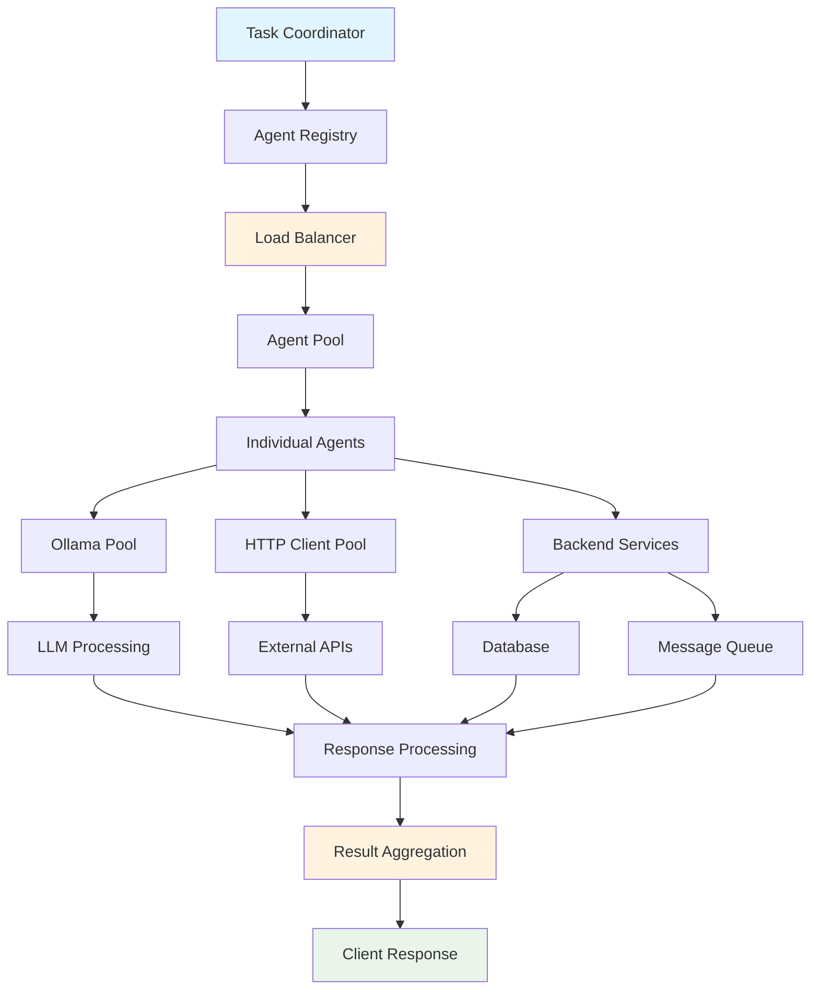

## Core Communication Patterns

### 1. Request-Response Flow

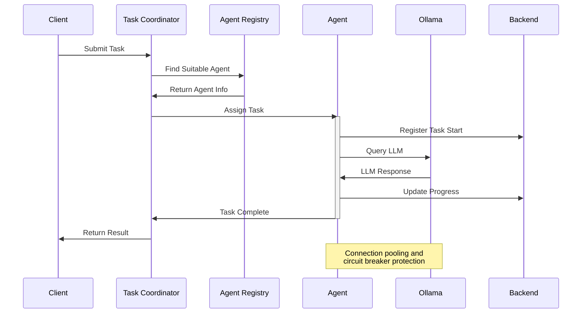

### 2. Multi-Agent Collaboration Flow

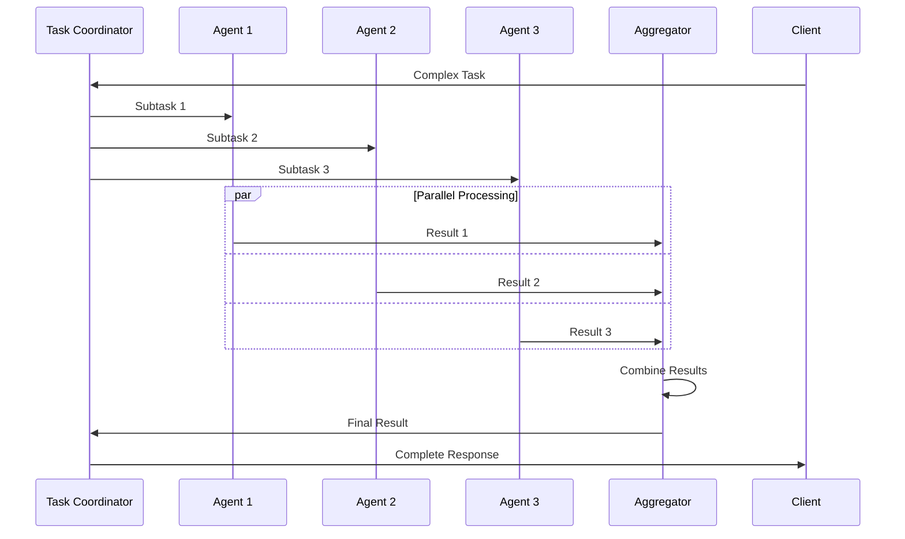

### 3. Streaming Data Flow

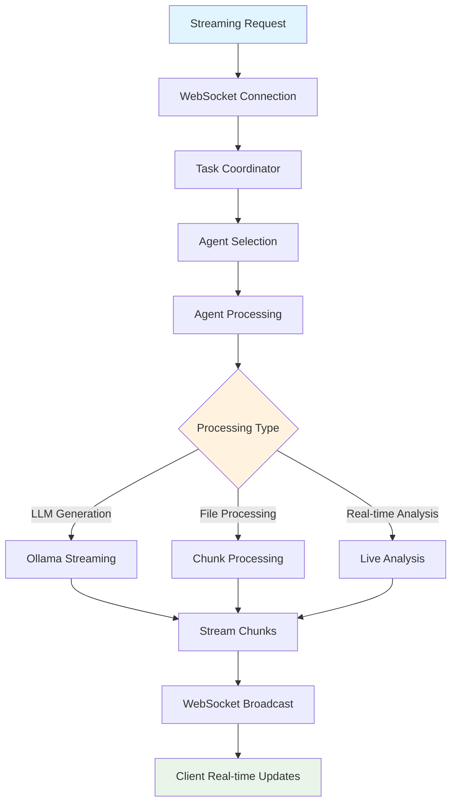

## Data Flow Protocols

### HTTP API Communication

```json
{
  "request_pattern": {
    "method": "POST",
    "endpoint": "/api/v1/agents/execute",
    "headers": {
      "Content-Type": "application/json",
      "Authorization": "Bearer <token>",
      "X-Request-ID": "<uuid>",
      "X-Agent-Preference": "<agent_name>"
    },
    "body": {
      "task_type": "string",
      "content": "object",
      "priority": "enum[low,medium,high,critical]",
      "timeout": "integer",
      "metadata": {
        "source": "string",
        "user_id": "string",
        "session_id": "string"
      }
    }
  },
  "response_pattern": {
    "status": "integer",
    "data": {
      "task_id": "string",
      "result": "object",
      "agent_info": {
        "name": "string",
        "version": "string",
        "processing_time": "float"
      },
      "metadata": {
        "timestamp": "iso8601",
        "model_used": "string",
        "tokens_used": "integer"
      }
    },
    "error": "object|null"
  }
}
```

### WebSocket Communication

```json
{
  "connection_init": {
    "type": "connection_init",
    "payload": {
      "token": "jwt_token",
      "client_id": "unique_id"
    }
  },
  "task_stream": {
    "type": "start",
    "id": "operation_id",
    "payload": {
      "task_type": "streaming_analysis",
      "input": "data_to_process"
    }
  },
  "progress_update": {
    "type": "data",
    "id": "operation_id", 
    "payload": {
      "progress": 0.45,
      "current_step": "processing_chunk_3",
      "partial_result": "intermediate_data",
      "agent": "processing_agent_name"
    }
  },
  "completion": {
    "type": "complete",
    "id": "operation_id",
    "payload": {
      "final_result": "complete_output",
      "summary": "processing_summary"
    }
  }
}
```

### Agent-to-Agent Communication

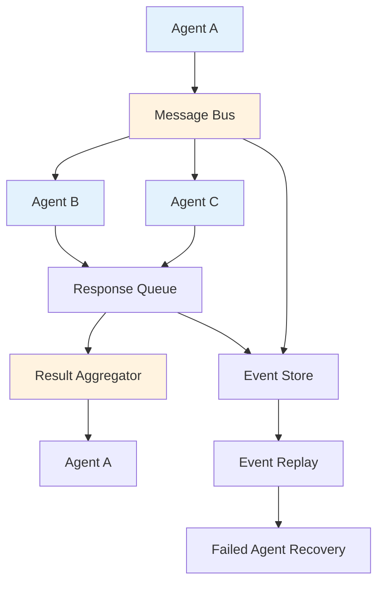

## Data Transformation Patterns

### 1. Input Preprocessing

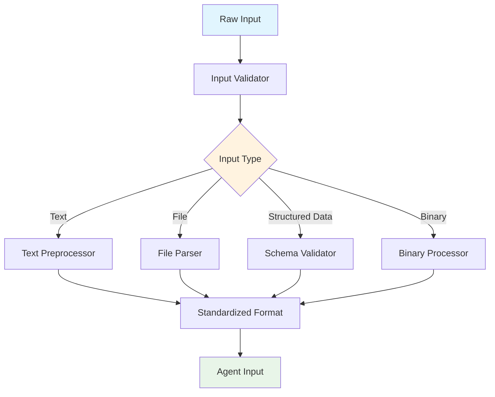

### 2. Result Aggregation

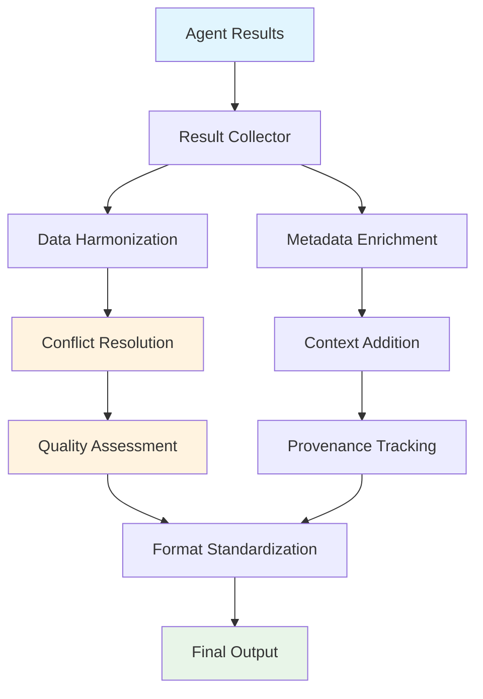

### 3. Error Propagation

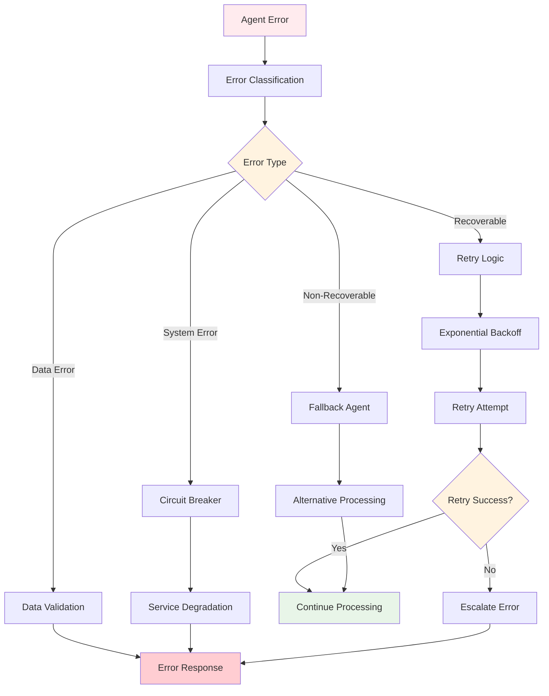

## Connection Pooling and Resource Management

### Ollama Connection Pool

```python
class OllamaConnectionPool:
    """
    Manages Ollama connections with pooling and circuit breaker
    """
    def __init__(self, base_url: str, max_connections: int = 10):
        self.base_url = base_url
        self.max_connections = max_connections
        self.available_connections = asyncio.Queue(max_connections)
        self.active_connections = set()
        self.circuit_breaker = CircuitBreaker()
        
    async def acquire_connection(self):
        """Acquire a connection from the pool"""
        try:
            connection = await asyncio.wait_for(
                self.available_connections.get(), 
                timeout=30.0
            )
            self.active_connections.add(connection)
            return connection
        except asyncio.TimeoutError:
            raise ConnectionPoolExhausted()
    
    async def release_connection(self, connection):
        """Return connection to the pool"""
        if connection in self.active_connections:
            self.active_connections.remove(connection)
            await self.available_connections.put(connection)
```

### HTTP Client Pool

```python
class HTTPClientPool:
    """
    Manages HTTP clients with proper resource cleanup
    """
    def __init__(self, max_clients: int = 5):
        self.max_clients = max_clients
        self.clients = []
        self.semaphore = asyncio.Semaphore(max_clients)
        
    async def get_client(self) -> httpx.AsyncClient:
        """Get an HTTP client from the pool"""
        async with self.semaphore:
            if not self.clients:
                client = httpx.AsyncClient(
                    timeout=httpx.Timeout(30.0),
                    limits=httpx.Limits(
                        max_connections=10,
                        max_keepalive_connections=5
                    )
                )
                return client
            return self.clients.pop()
    
    async def return_client(self, client: httpx.AsyncClient):
        """Return client to pool"""
        if len(self.clients) < self.max_clients:
            self.clients.append(client)
        else:
            await client.aclose()
```

## Message Queue Integration

### Task Queue Pattern

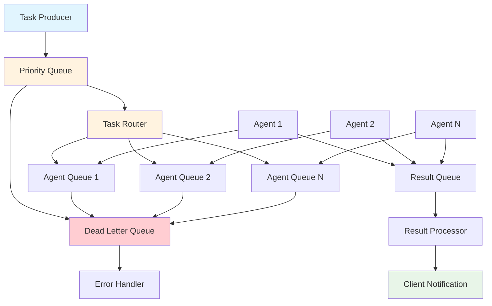

### Event-Driven Architecture

```python
class EventBus:
    """
    Event-driven communication between agents
    """
    def __init__(self):
        self.subscribers = defaultdict(list)
        self.event_store = []
        
    async def publish(self, event_type: str, data: dict):
        """Publish event to all subscribers"""
        event = {
            "type": event_type,
            "data": data,
            "timestamp": datetime.utcnow(),
            "id": str(uuid.uuid4())
        }
        
        self.event_store.append(event)
        
        # Notify subscribers
        for callback in self.subscribers[event_type]:
            try:
                await callback(event)
            except Exception as e:
                logger.error(f"Event callback failed: {e}")
    
    def subscribe(self, event_type: str, callback: Callable):
        """Subscribe to event type"""
        self.subscribers[event_type].append(callback)
```

## Performance Monitoring

### Metrics Collection

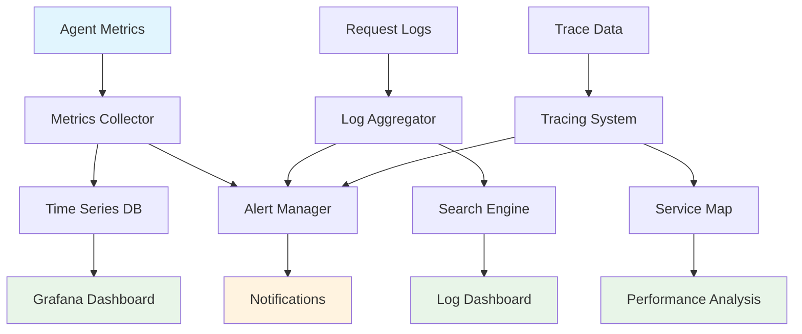

### Data Flow Metrics

```json
{
  "agent_metrics": {
    "request_rate": "requests/second",
    "response_time_p95": "milliseconds",
    "error_rate": "percentage",
    "active_connections": "count",
    "queue_depth": "count"
  },
  "system_metrics": {
    "cpu_usage": "percentage",
    "memory_usage": "bytes",
    "network_io": "bytes/second",
    "disk_io": "bytes/second"
  },
  "business_metrics": {
    "tasks_completed": "count",
    "user_satisfaction": "score",
    "cost_per_task": "currency",
    "uptime": "percentage"
  }
}
```

## Security Considerations

### Secure Communication

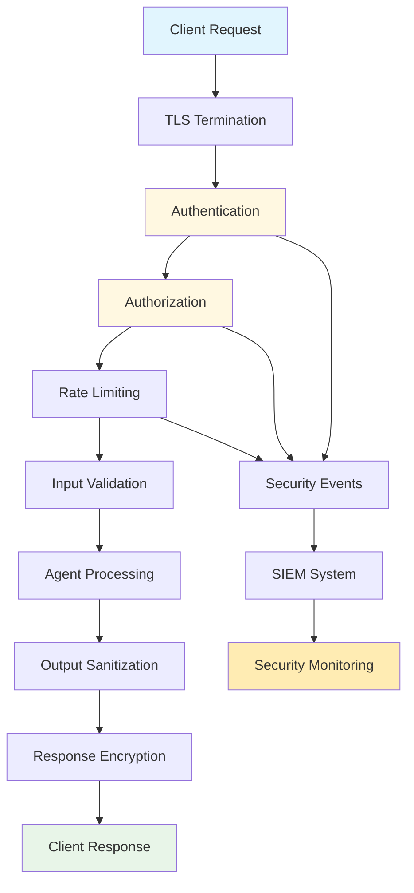

This communication architecture ensures reliable, scalable, and secure data flow throughout the SutazAI agent ecosystem while maintaining high performance and fault tolerance.