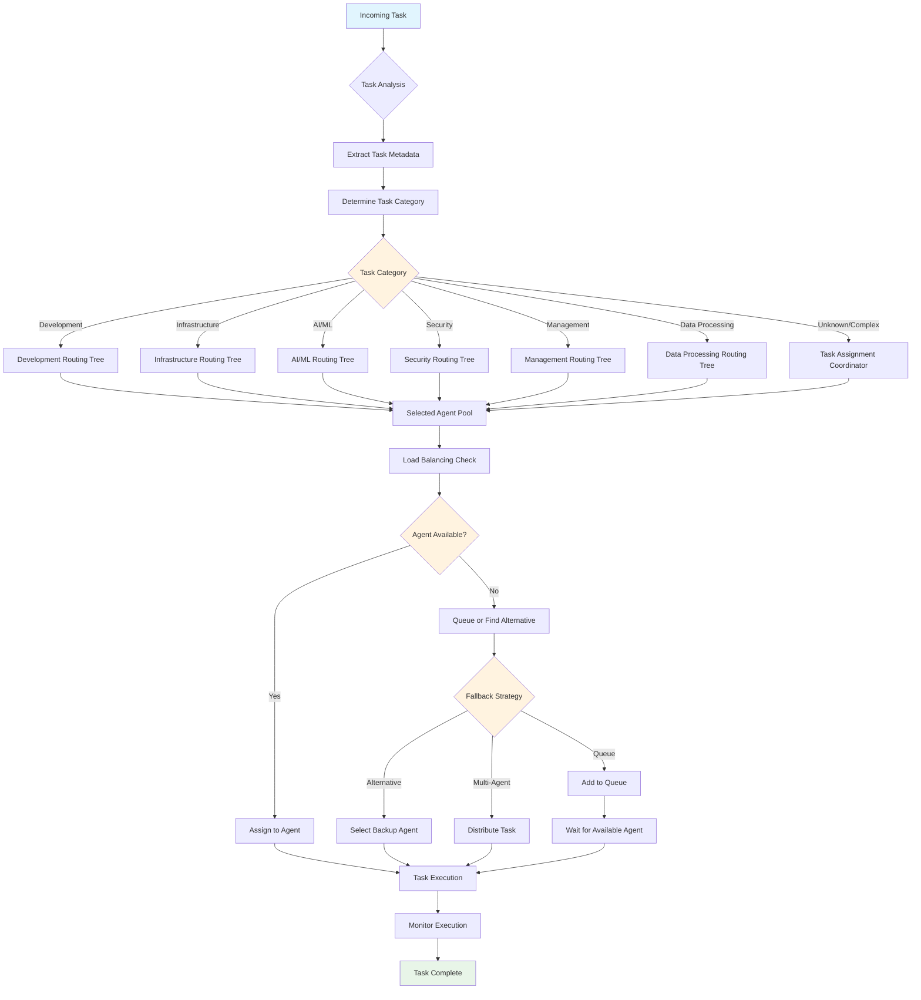
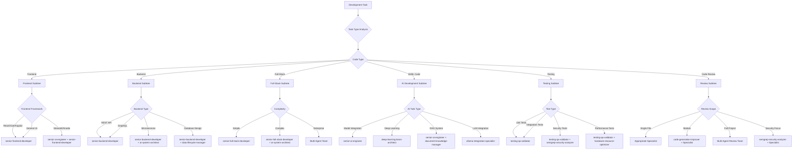
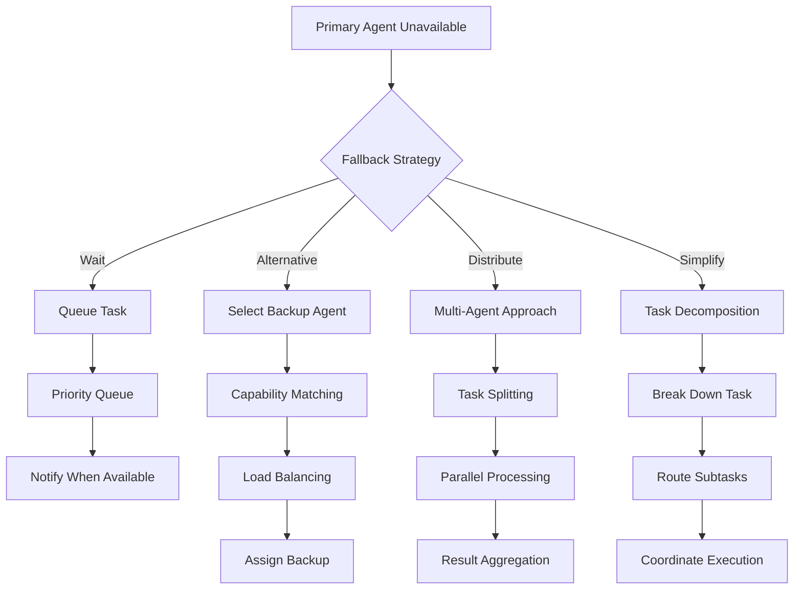
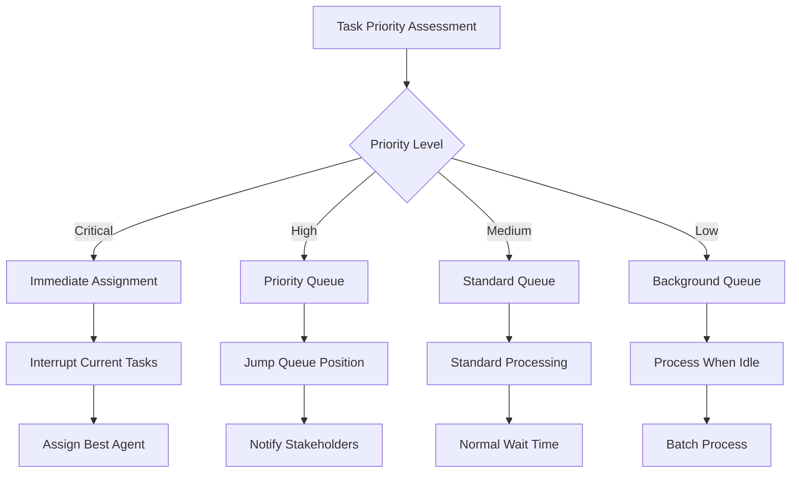
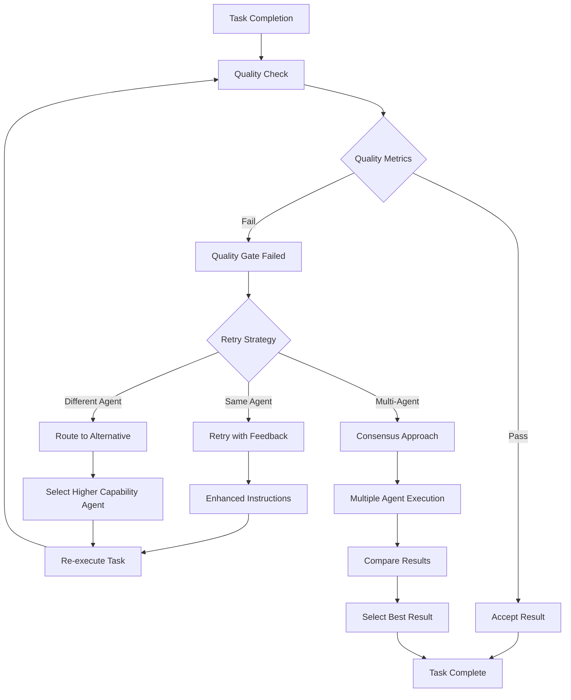

# Task Routing Decision Tree

This document provides comprehensive decision trees for routing tasks to the most appropriate agents in the SutazAI ecosystem.

## Master Task Routing Algorithm



## Development Task Routing



## Infrastructure Task Routing

```mermaid
graph TD
    A[Infrastructure Task] --> B{Infrastructure Category}
    
    B -->|Container| C[Container Routing]
    B -->|Deployment| D[Deployment Routing]
    B -->|Monitoring| E[Monitoring Routing]
    B -->|Security| F[Security Routing]
    B -->|Network| G[Network Routing]
    
    C --> C1{Container Task}
    C1 -->|Build/Deploy| C2[infrastructure-devops-manager]
    C1 -->|Orchestration| C3[container-orchestrator-k3s]
    C1 -->|Security Scan| C4[container-vulnerability-scanner-trivy]
    C1 -->|Performance| C5[hardware-resource-optimizer]
    
    D --> D1{Deployment Type}
    D1 -->|Application| D2[deployment-automation-master]
    D1 -->|Infrastructure| D3[infrastructure-devops-manager]
    D1 -->|AI Model| D4[deployment-automation-master + ollama-integration-specialist]
    D1 -->|Database| D5[infrastructure-devops-manager + data-lifecycle-manager]
    
    E --> E1{Monitoring Type}
    E1 -->|Metrics| E2[metrics-collector-prometheus]
    E1 -->|Logs| E3[log-aggregator-loki]
    E1 -->|Dashboards| E4[observability-dashboard-manager-grafana]
    E1 -->|Alerts| E5[automated-incident-responder]
    E1 -->|Tracing| E6[distributed-tracing-analyzer-jaeger]
    
    F --> F1{Security Level}
    F1 -->|Basic Hardening| F2[infrastructure-devops-manager]
    F1 -->|Penetration Testing| F3[security-pentesting-specialist]
    F1 -->|Compliance Audit| F4[kali-security-specialist]
    F1 -->|Secrets Management| F5[secrets-vault-manager-vault]
    
    G --> G1{Network Task}
    G1 -->|Configuration| G2[infrastructure-devops-manager]
    G1 -->|Security| G3[security-pentesting-specialist]
    G1 -->|Performance| G4[hardware-resource-optimizer]
    G1 -->|Monitoring| G5[automated-incident-responder]
```



## AI/ML Task Routing

```mermaid
graph TD
    A[AI/ML Task] --> B{AI Category}
    
    B -->|Model Development| C[Model Development Tree]
    B -->|Model Deployment| D[Model Deployment Tree]  
    B -->|Data Processing| E[Data Processing Tree]
    B -->|Model Operations| F[MLOps Tree]
    B -->|Research| G[Research Tree]
    
    C --> C1{Model Type}
    C1 -->|Deep Learning| C2[deep-learning-brain-architect]
    C1 -->|Traditional ML| C3[senior-ai-engineer]
    C1 -->|Neural Architecture| C4[neural-architecture-search]
    C1 -->|Optimization| C5[evolution-strategy-trainer]
    C1 -->|Quantum ML| C6[quantum-ai-researcher]
    
    D --> D1{Deployment Target}
    D1 -->|Local/Ollama| D2[ollama-integration-specialist]
    D1 -->|Edge Device| D3[edge-inference-proxy]
    D1 -->|Cloud| D4[deployment-automation-master + senior-ai-engineer]
    D1 -->|Production Scale| D5[infrastructure-devops-manager + senior-ai-engineer]
    
    E --> E1{Data Task}
    E1 -->|ETL Pipeline| E2[data-lifecycle-manager]
    E1 -->|Data Validation| E3[data-drift-detector]
    E1 -->|Privacy Processing| E4[private-data-analyst]
    E1 -->|Version Control| E5[data-version-controller-dvc]
    
    F --> F1{MLOps Task}
    F1 -->|Experiment Tracking| F2[ml-experiment-tracker-mlflow]
    F1 -->|Model Monitoring| F3[runtime-behavior-anomaly-detector]
    F1 -->|Performance Analysis| F4[hardware-resource-optimizer]
    F1 -->|A/B Testing| F5[experiment-tracker]
    
    G --> G1{Research Type}
    G1 -->|Algorithm Development| G2[quantum-ai-researcher]
    G1 -->|Architecture Search| G3[neural-architecture-search]
    G1 -->|Optimization| G4[genetic-algorithm-tuner]
    G1 -->|Benchmarking| G5[senior-ai-engineer]
```



## Agent Selection Criteria

### Primary Selection Factors

1. **Task Type Match** (Weight: 40%)
   - Direct capability alignment
   - Specialized domain knowledge
   - Tool and framework expertise

2. **Current Load** (Weight: 25%)
   - Active task count
   - Queue length
   - Response time history

3. **Historical Performance** (Weight: 20%)
   - Success rate for similar tasks
   - Average completion time
   - Quality metrics

4. **Resource Availability** (Weight: 15%)
   - Hardware requirements
   - Memory usage
   - Connection pool status

### Fallback Strategies



## Load Balancing Algorithm

```python
def select_agent(task_type: str, available_agents: List[Agent]) -> Agent:
    """
    Agent selection algorithm with load balancing
    """
    # Filter agents by capability
    capable_agents = [a for a in available_agents 
                     if can_handle_task(a, task_type)]
    
    if not capable_agents:
        return get_fallback_agent(task_type)
    
    # Score each agent
    scored_agents = []
    for agent in capable_agents:
        score = calculate_agent_score(agent, task_type)
        scored_agents.append((agent, score))
    
    # Sort by score (higher is better)
    scored_agents.sort(key=lambda x: x[1], reverse=True)
    
    # Select from top 3 agents with some randomization
    # to avoid overloading the single best agent
    top_agents = scored_agents[:3]
    weights = [score for _, score in top_agents]
    selected_agent = weighted_random_choice(top_agents, weights)
    
    return selected_agent[0]

def calculate_agent_score(agent: Agent, task_type: str) -> float:
    """
    Calculate agent suitability score
    """
    base_score = agent.capability_match(task_type) * 0.4
    load_score = (1.0 - agent.current_load_ratio()) * 0.25
    performance_score = agent.historical_performance(task_type) * 0.2
    availability_score = agent.resource_availability() * 0.15
    
    return base_score + load_score + performance_score + availability_score
```

## Task Priority Handling



## Quality Assurance Gates



## Performance Monitoring

The task routing system continuously monitors and adjusts based on:

- **Agent Performance Metrics**: Success rates, response times, quality scores
- **System Load**: CPU, memory, and network utilization
- **Task Patterns**: Common task types and their optimal routing
- **User Feedback**: Quality ratings and revision requests

This decision tree system ensures optimal task distribution while maintaining high quality and system reliability.