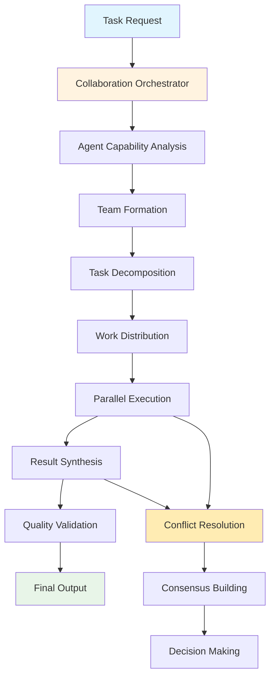
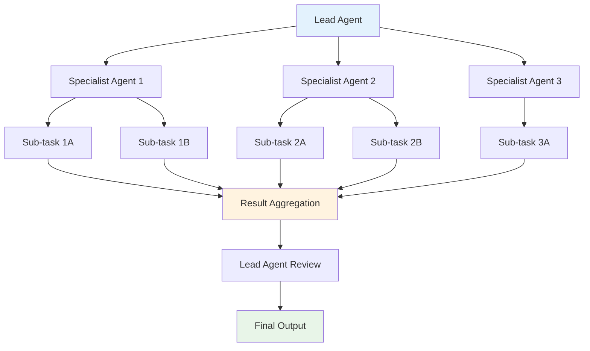
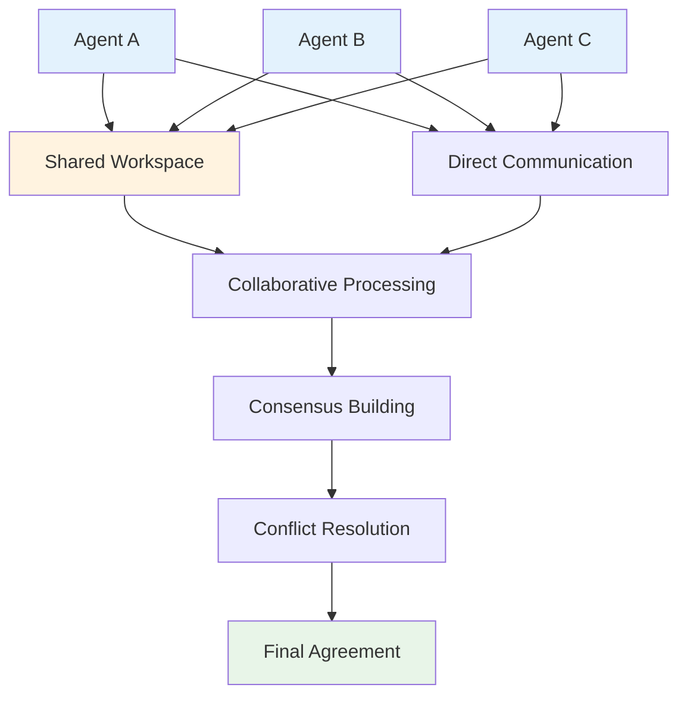
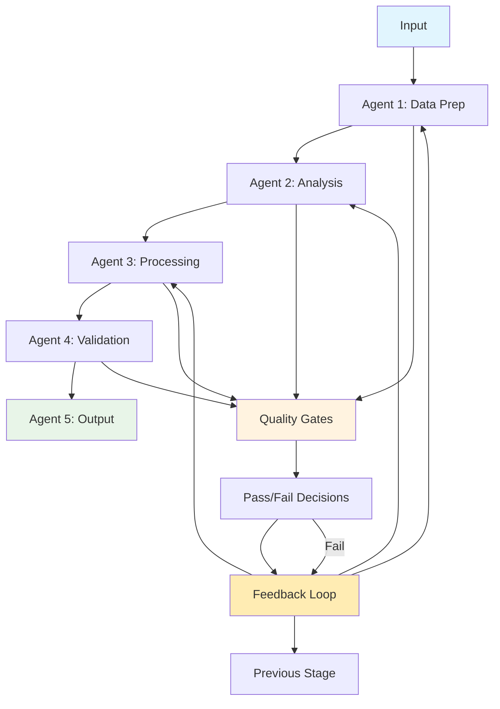
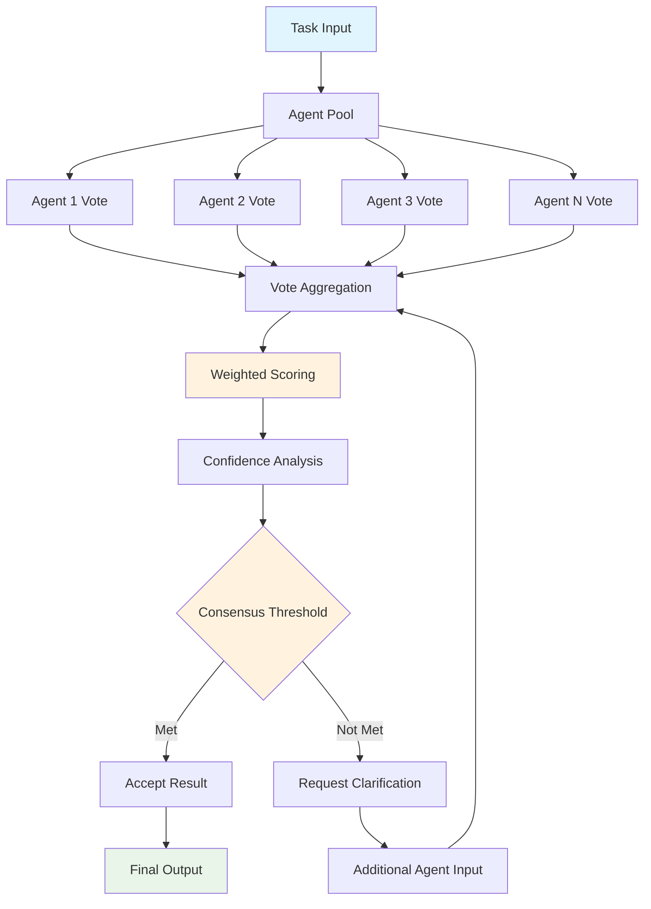
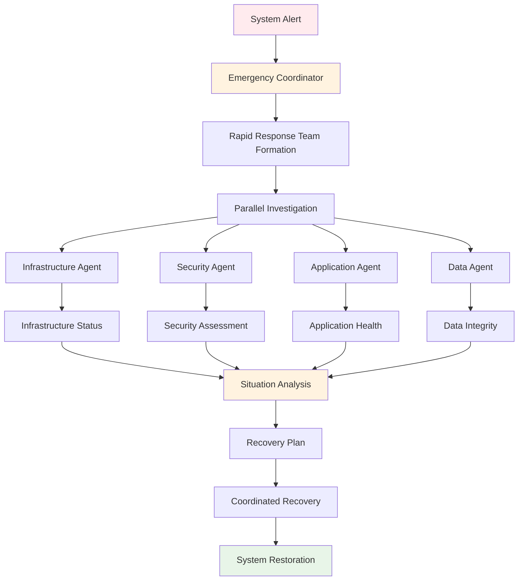

# Agent Collaboration Patterns

This document provides comprehensive patterns for multi-agent collaboration within the SutazAI ecosystem, showcasing how different agents work together to accomplish complex tasks.

## Collaboration Architecture Overview



## Core Collaboration Patterns

### 1. Hierarchical Collaboration Pattern



**Example: Full-Stack Development Project**

```python
class FullStackCollaborationPattern:
    """
    Hierarchical collaboration for full-stack development
    """
    
    def __init__(self):
        self.lead_agent = "ai-system-architect"
        self.specialists = {
            "backend": "senior-backend-developer",
            "frontend": "senior-frontend-developer", 
            "database": "data-lifecycle-manager",
            "security": "semgrep-security-analyzer",
            "testing": "testing-qa-validator"
        }
    
    async def execute_fullstack_project(self, requirements: dict):
        """Execute full-stack project with hierarchical collaboration"""
        
        # Phase 1: Architecture planning by lead agent
        architecture = await self._plan_architecture(requirements)
        
        # Phase 2: Distribute work to specialists
        tasks = self._decompose_architecture(architecture)
        specialist_results = await self._execute_specialist_tasks(tasks)
        
        # Phase 3: Integration and validation
        integration = await self._integrate_components(specialist_results)
        
        # Phase 4: Final review and optimization
        final_result = await self._final_review(integration)
        
        return final_result
    
    async def _plan_architecture(self, requirements: dict):
        """Lead agent plans overall architecture"""
        task = {
            "type": "architecture_design",
            "requirements": requirements,
            "constraints": {
                "scalability": "high",
                "security": "enterprise",
                "performance": "optimized"
            }
        }
        
        return await self._delegate_to_agent(self.lead_agent, task)
    
    async def _execute_specialist_tasks(self, tasks: dict):
        """Execute tasks in parallel by specialist agents"""
        results = {}
        
        # Execute all specialist tasks in parallel
        specialist_tasks = []
        for domain, task_spec in tasks.items():
            agent_name = self.specialists[domain]
            specialist_tasks.append(
                self._execute_specialist_task(agent_name, domain, task_spec)
            )
        
        # Wait for all tasks to complete
        completed_tasks = await asyncio.gather(*specialist_tasks, return_exceptions=True)
        
        # Process results and handle any failures
        for i, (domain, _) in enumerate(tasks.items()):
            result = completed_tasks[i]
            if isinstance(result, Exception):
                # Handle specialist failure
                results[domain] = await self._handle_specialist_failure(domain, result)
            else:
                results[domain] = result
        
        return results
```

### 2. Peer-to-Peer Collaboration Pattern



**Example: Code Review Collaboration**

```python
class PeerReviewCollaborationPattern:
    """
    Peer-to-peer collaboration for code review
    """
    
    def __init__(self):
        self.review_agents = [
            "senior-backend-developer",
            "code-generation-improver", 
            "semgrep-security-analyzer",
            "testing-qa-validator"
        ]
        self.consensus_threshold = 0.75  # 75% agreement required
    
    async def collaborative_code_review(self, code_submission: dict):
        """Conduct collaborative code review with peer agents"""
        
        # Phase 1: Independent reviews
        individual_reviews = await self._conduct_individual_reviews(code_submission)
        
        # Phase 2: Share and discuss findings
        discussion_results = await self._facilitate_discussion(individual_reviews)
        
        # Phase 3: Build consensus
        consensus = await self._build_consensus(discussion_results)
        
        # Phase 4: Generate final recommendation
        final_review = await self._generate_final_review(consensus, individual_reviews)
        
        return final_review
    
    async def _conduct_individual_reviews(self, code_submission: dict):
        """Each agent conducts independent review"""
        review_tasks = []
        
        for agent_name in self.review_agents:
            task = {
                "type": "code_review",
                "code": code_submission["code"],
                "context": code_submission["context"],
                "focus_areas": self._get_agent_focus_areas(agent_name)
            }
            review_tasks.append(
                self._get_agent_review(agent_name, task)
            )
        
        reviews = await asyncio.gather(*review_tasks)
        
        return {
            agent: review for agent, review in zip(self.review_agents, reviews)
        }
    
    async def _facilitate_discussion(self, individual_reviews: dict):
        """Facilitate discussion between agents about findings"""
        # Identify conflicting opinions
        conflicts = self._identify_conflicts(individual_reviews)
        
        discussion_results = {}
        
        for conflict in conflicts:
            # Create discussion thread for each conflict
            discussion = await self._create_discussion_thread(
                conflict, 
                individual_reviews
            )
            
            # Allow agents to respond to each other
            responses = await self._collect_agent_responses(discussion)
            
            discussion_results[conflict["issue"]] = {
                "original_positions": conflict["positions"],
                "discussion": discussion,
                "responses": responses
            }
        
        return discussion_results
    
    async def _build_consensus(self, discussion_results: dict):
        """Build consensus from discussion results"""
        consensus_items = {}
        
        for issue, discussion in discussion_results.items():
            # Analyze agent positions after discussion
            final_positions = self._analyze_final_positions(discussion)
            
            # Calculate consensus strength
            consensus_strength = self._calculate_consensus_strength(final_positions)
            
            if consensus_strength >= self.consensus_threshold:
                consensus_items[issue] = {
                    "consensus_reached": True,
                    "agreed_position": self._get_majority_position(final_positions),
                    "strength": consensus_strength
                }
            else:
                # Escalate to human review or use fallback decision
                consensus_items[issue] = {
                    "consensus_reached": False,
                    "requires_human_input": True,
                    "positions": final_positions
                }
        
        return consensus_items
```

### 3. Pipeline Collaboration Pattern



**Example: AI Model Deployment Pipeline**

```python
class ModelDeploymentPipeline:
    """
    Pipeline collaboration for AI model deployment
    """
    
    def __init__(self):
        self.pipeline_stages = [
            {"agent": "data-lifecycle-manager", "stage": "data_preparation"},
            {"agent": "senior-ai-engineer", "stage": "model_training"},
            {"agent": "testing-qa-validator", "stage": "model_validation"},
            {"agent": "container-vulnerability-scanner-trivy", "stage": "security_scan"},
            {"agent": "deployment-automation-master", "stage": "deployment"},
            {"agent": "observability-dashboard-manager-grafana", "stage": "monitoring_setup"}
        ]
        self.quality_gates = {
            "data_preparation": {"min_quality_score": 0.85},
            "model_training": {"min_accuracy": 0.90, "max_loss": 0.1},
            "model_validation": {"min_test_coverage": 0.95},
            "security_scan": {"max_vulnerabilities": 0},
            "deployment": {"health_check_success": True}
        }
    
    async def deploy_model_pipeline(self, model_spec: dict):
        """Execute model deployment through pipeline collaboration"""
        
        pipeline_state = {
            "current_stage": 0,
            "results": {},
            "quality_metrics": {},
            "retry_count": {}
        }
        
        while pipeline_state["current_stage"] < len(self.pipeline_stages):
            stage_info = self.pipeline_stages[pipeline_state["current_stage"]]
            stage_name = stage_info["stage"]
            agent_name = stage_info["agent"]
            
            try:
                # Execute current stage
                stage_result = await self._execute_pipeline_stage(
                    agent_name, 
                    stage_name, 
                    model_spec,
                    pipeline_state["results"]
                )
                
                # Validate stage result
                validation_result = await self._validate_stage_result(
                    stage_name,
                    stage_result
                )
                
                if validation_result["passed"]:
                    # Stage passed, continue to next
                    pipeline_state["results"][stage_name] = stage_result
                    pipeline_state["quality_metrics"][stage_name] = validation_result["metrics"]
                    pipeline_state["current_stage"] += 1
                    pipeline_state["retry_count"][stage_name] = 0
                else:
                    # Stage failed, handle failure
                    await self._handle_stage_failure(
                        stage_name,
                        validation_result,
                        pipeline_state
                    )
                    
            except Exception as e:
                await self._handle_stage_exception(
                    stage_name,
                    e,
                    pipeline_state
                )
        
        return {
            "status": "completed",
            "results": pipeline_state["results"],
            "quality_metrics": pipeline_state["quality_metrics"]
        }
    
    async def _execute_pipeline_stage(self, agent_name: str, stage_name: str, 
                                    model_spec: dict, previous_results: dict):
        """Execute a single pipeline stage"""
        
        task = {
            "type": stage_name,
            "model_spec": model_spec,
            "previous_results": previous_results,
            "quality_requirements": self.quality_gates.get(stage_name, {})
        }
        
        return await self._delegate_to_agent(agent_name, task)
    
    async def _validate_stage_result(self, stage_name: str, stage_result: dict):
        """Validate stage result against quality gates"""
        
        quality_gates = self.quality_gates.get(stage_name, {})
        validation_results = {"passed": True, "metrics": {}, "failures": []}
        
        for metric, threshold in quality_gates.items():
            actual_value = stage_result.get("metrics", {}).get(metric)
            
            if actual_value is None:
                validation_results["passed"] = False
                validation_results["failures"].append(f"Missing metric: {metric}")
                continue
            
            # Check threshold based on metric type
            if isinstance(threshold, (int, float)):
                if metric.startswith("min_") and actual_value < threshold:
                    validation_results["passed"] = False
                    validation_results["failures"].append(
                        f"{metric}: {actual_value} < {threshold}"
                    )
                elif metric.startswith("max_") and actual_value > threshold:
                    validation_results["passed"] = False
                    validation_results["failures"].append(
                        f"{metric}: {actual_value} > {threshold}"
                    )
            elif isinstance(threshold, bool):
                if actual_value != threshold:
                    validation_results["passed"] = False
                    validation_results["failures"].append(
                        f"{metric}: {actual_value} != {threshold}"
                    )
            
            validation_results["metrics"][metric] = actual_value
        
        return validation_results
```

### 4. Democratic Collaboration Pattern



**Example: Multi-Agent Decision Making**

```python
class DemocraticCollaborationPattern:
    """
    Democratic collaboration for complex decision making
    """
    
    def __init__(self):
        self.voting_agents = {
            "senior-ai-engineer": {"weight": 1.2, "expertise": ["ai", "ml", "algorithms"]},
            "senior-backend-developer": {"weight": 1.1, "expertise": ["api", "database", "architecture"]},
            "senior-frontend-developer": {"weight": 1.1, "expertise": ["ui", "ux", "frontend"]},
            "security-pentesting-specialist": {"weight": 1.3, "expertise": ["security", "compliance"]},
            "infrastructure-devops-manager": {"weight": 1.2, "expertise": ["infrastructure", "deployment"]},
            "ai-product-manager": {"weight": 1.0, "expertise": ["requirements", "strategy"]}
        }
        self.consensus_threshold = 0.7
    
    async def democratic_decision_making(self, decision_request: dict):
        """Make decision through democratic agent collaboration"""
        
        # Phase 1: Initial voting round
        votes = await self._conduct_voting_round(decision_request)
        
        # Phase 2: Analyze vote distribution
        vote_analysis = self._analyze_vote_distribution(votes)
        
        # Phase 3: Check if consensus reached
        if vote_analysis["consensus_strength"] >= self.consensus_threshold:
            return self._finalize_decision(vote_analysis, votes)
        
        # Phase 4: Facilitate discussion for non-consensus items
        discussion = await self._facilitate_agent_discussion(votes, vote_analysis)
        
        # Phase 5: Second voting round after discussion
        final_votes = await self._conduct_final_voting_round(
            decision_request, 
            discussion
        )
        
        # Phase 6: Final decision
        final_analysis = self._analyze_vote_distribution(final_votes)
        return self._finalize_decision(final_analysis, final_votes)
    
    async def _conduct_voting_round(self, decision_request: dict):
        """Conduct voting round with all agents"""
        voting_tasks = []
        
        for agent_name, agent_info in self.voting_agents.items():
            # Filter decision aspects by agent expertise
            relevant_aspects = self._filter_by_expertise(
                decision_request["aspects"],
                agent_info["expertise"]
            )
            
            if relevant_aspects:  # Only ask agents about their expertise areas
                task = {
                    "type": "decision_vote",
                    "decision_context": decision_request["context"],
                    "options": decision_request["options"],
                    "aspects_to_evaluate": relevant_aspects,
                    "voting_criteria": decision_request.get("criteria", {})
                }
                
                voting_tasks.append(
                    self._get_agent_vote(agent_name, task)
                )
        
        vote_results = await asyncio.gather(*voting_tasks)
        
        # Combine votes with agent metadata
        votes = {}
        for i, agent_name in enumerate(self.voting_agents.keys()):
            if i < len(vote_results):
                votes[agent_name] = {
                    "vote": vote_results[i],
                    "weight": self.voting_agents[agent_name]["weight"],
                    "expertise": self.voting_agents[agent_name]["expertise"]
                }
        
        return votes
    
    def _analyze_vote_distribution(self, votes: dict):
        """Analyze vote distribution and calculate consensus strength"""
        
        # Aggregate weighted votes by option
        option_scores = {}
        total_weight = 0
        
        for agent_name, vote_data in votes.items():
            vote = vote_data["vote"]
            weight = vote_data["weight"]
            
            for option, score in vote["option_scores"].items():
                if option not in option_scores:
                    option_scores[option] = 0
                option_scores[option] += score * weight
            
            total_weight += weight
        
        # Normalize scores
        normalized_scores = {
            option: score / total_weight 
            for option, score in option_scores.items()
        }
        
        # Find winning option and calculate consensus strength
        winning_option = max(normalized_scores, key=normalized_scores.get)
        winning_score = normalized_scores[winning_option]
        
        # Calculate consensus strength (how much agreement there is)
        score_variance = np.var(list(normalized_scores.values()))
        consensus_strength = winning_score * (1 - score_variance)
        
        return {
            "winning_option": winning_option,
            "winning_score": winning_score,
            "all_scores": normalized_scores,
            "consensus_strength": consensus_strength,
            "requires_discussion": consensus_strength < self.consensus_threshold
        }
```

## Advanced Collaboration Scenarios

### 1. Crisis Response Collaboration



### 2. Continuous Learning Collaboration

```python
class ContinuousLearningCollaboration:
    """
    Agents collaborate to continuously improve system performance
    """
    
    def __init__(self):
        self.learning_agents = [
            "runtime-behavior-anomaly-detector",
            "hardware-resource-optimizer", 
            "senior-ai-engineer",
            "data-drift-detector"
        ]
    
    async def continuous_improvement_cycle(self):
        """Run continuous improvement cycle"""
        
        while True:
            # Phase 1: Collect performance data
            performance_data = await self._collect_performance_metrics()
            
            # Phase 2: Identify improvement opportunities
            opportunities = await self._identify_improvements(performance_data)
            
            # Phase 3: Collaborate on solutions
            solutions = await self._collaborate_on_solutions(opportunities)
            
            # Phase 4: Implement improvements
            implementation_results = await self._implement_improvements(solutions)
            
            # Phase 5: Measure impact
            impact_analysis = await self._measure_improvement_impact(implementation_results)
            
            # Phase 6: Share learnings
            await self._share_learnings_across_agents(impact_analysis)
            
            # Wait before next cycle
            await asyncio.sleep(3600)  # 1 hour cycle
```

This comprehensive collaboration pattern documentation demonstrates how SutazAI's agents can work together effectively using various collaboration models, from hierarchical structures to democratic decision-making processes, ensuring optimal task completion through intelligent cooperation.