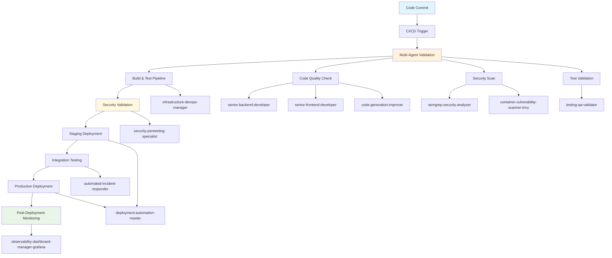
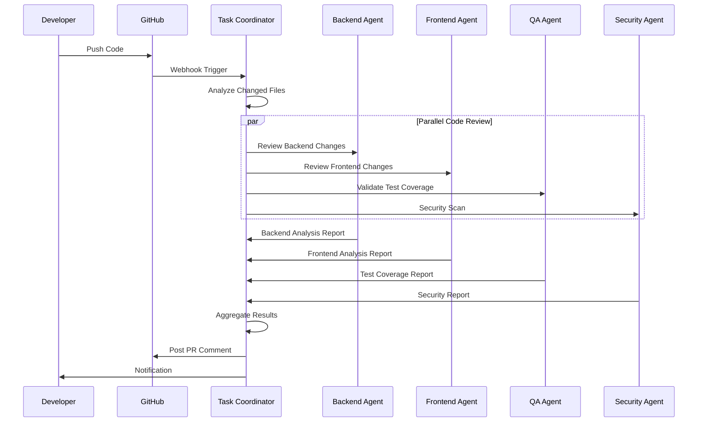
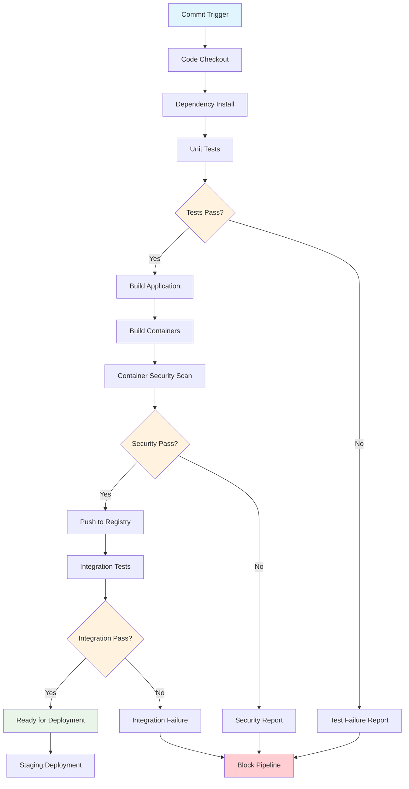
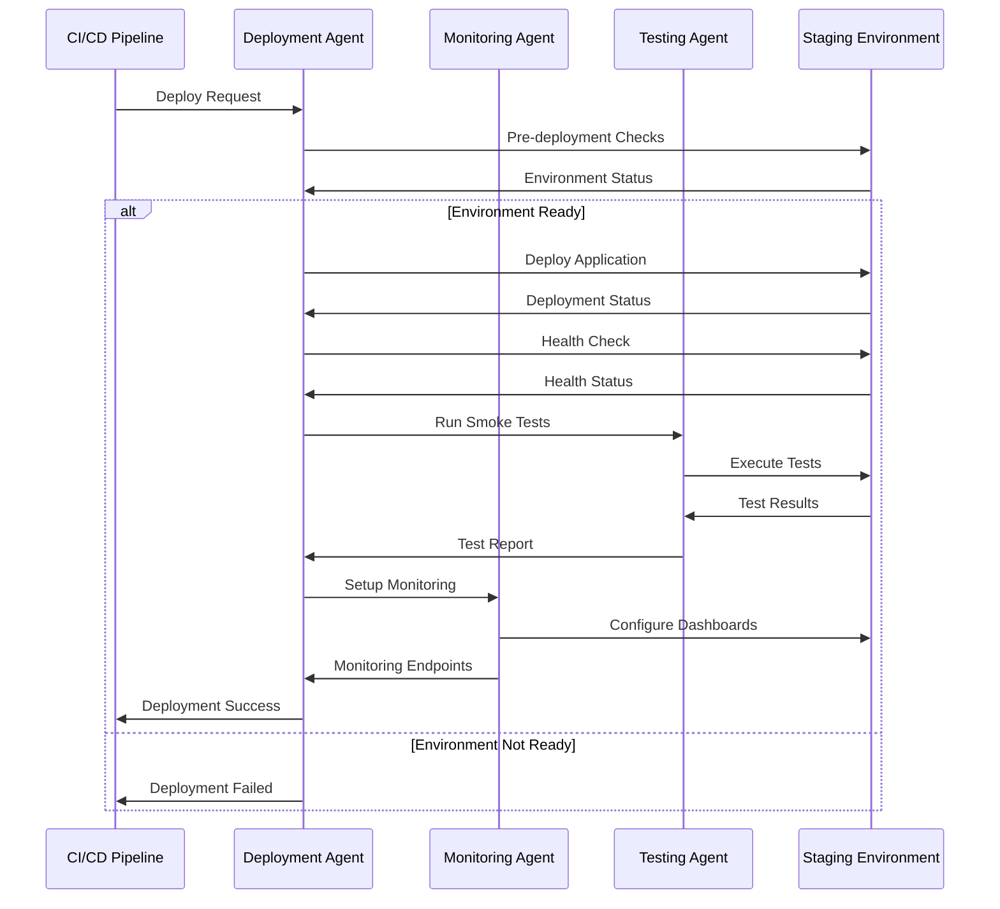
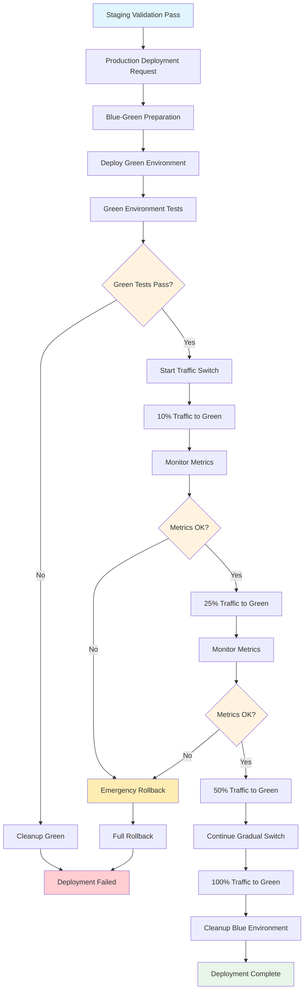

# Complete System Deployment Workflow

This document provides a comprehensive workflow example for deploying applications using SutazAI's agent ecosystem, from code commit to production monitoring.

## Deployment Workflow Overview



## Phase 1: Pre-Deployment Validation

### Code Quality Assessment



#### LangFlow Template: Code Quality Workflow

```json
{
  "name": "Code Quality Assessment",
  "description": "Multi-agent code quality validation workflow",
  "nodes": [
    {
      "id": "code_input",
      "type": "webhook",
      "data": {
        "endpoint": "/webhook/code-review",
        "method": "POST",
        "authentication": "github_token"
      }
    },
    {
      "id": "file_analyzer",
      "type": "function",
      "data": {
        "function": "analyze_changed_files",
        "inputs": ["files", "diff"]
      }
    },
    {
      "id": "agent_router",
      "type": "conditional",
      "data": {
        "conditions": [
          {
            "if": "has_backend_files",
            "then": "backend_review",
            "agents": ["senior-backend-developer"]
          },
          {
            "if": "has_frontend_files", 
            "then": "frontend_review",
            "agents": ["senior-frontend-developer"]
          },
          {
            "if": "has_test_files",
            "then": "test_review",
            "agents": ["testing-qa-validator"]
          }
        ]
      }
    },
    {
      "id": "security_scan",
      "type": "agent",
      "data": {
        "agent": "semgrep-security-analyzer",
        "task": "comprehensive_security_scan",
        "parallel": true
      }
    },
    {
      "id": "result_aggregator",
      "type": "function",
      "data": {
        "function": "aggregate_review_results",
        "weight_factors": {
          "security": 0.4,
          "code_quality": 0.3,
          "test_coverage": 0.2,
          "performance": 0.1
        }
      }
    },
    {
      "id": "quality_gate",
      "type": "conditional",
      "data": {
        "conditions": [
          {"metric": "overall_score", "operator": ">=", "value": 7.5},
          {"metric": "security_score", "operator": ">=", "value": 8.0},
          {"metric": "test_coverage", "operator": ">=", "value": 80}
        ],
        "pass_action": "approve_deployment",
        "fail_action": "block_deployment"
      }
    },
    {
      "id": "github_integration",
      "type": "external_api",
      "data": {
        "service": "github",
        "action": "create_pr_review",
        "authentication": "github_app"
      }
    }
  ],
  "edges": [
    {"from": "code_input", "to": "file_analyzer"},
    {"from": "file_analyzer", "to": "agent_router"},
    {"from": "file_analyzer", "to": "security_scan"},
    {"from": "agent_router", "to": "result_aggregator"},
    {"from": "security_scan", "to": "result_aggregator"},
    {"from": "result_aggregator", "to": "quality_gate"},
    {"from": "quality_gate", "to": "github_integration"}
  ]
}
```

## Phase 2: Build and Test Pipeline

### Automated Build Process

```python
class BuildPipelineAgent:
    """
    Orchestrates the build and test pipeline
    """
    
    def __init__(self):
        self.infrastructure_agent = "infrastructure-devops-manager"
        self.test_agent = "testing-qa-validator"
        self.security_agent = "container-vulnerability-scanner-trivy"
    
    async def execute_build_pipeline(self, commit_info: dict):
        """Execute complete build pipeline"""
        
        # Step 1: Build application
        build_result = await self._execute_build(commit_info)
        if not build_result["success"]:
            return {"status": "failed", "stage": "build", "details": build_result}
        
        # Step 2: Run unit tests
        test_result = await self._run_unit_tests(commit_info)
        if not test_result["success"]:
            return {"status": "failed", "stage": "unit_tests", "details": test_result}
        
        # Step 3: Build containers
        container_result = await self._build_containers(commit_info)
        if not container_result["success"]:
            return {"status": "failed", "stage": "container_build", "details": container_result}
        
        # Step 4: Security scan containers
        security_result = await self._scan_containers(container_result["images"])
        if not security_result["passed"]:
            return {"status": "failed", "stage": "security_scan", "details": security_result}
        
        # Step 5: Integration tests
        integration_result = await self._run_integration_tests(container_result["images"])
        if not integration_result["success"]:
            return {"status": "failed", "stage": "integration_tests", "details": integration_result}
        
        return {
            "status": "success",
            "artifacts": {
                "images": container_result["images"],
                "test_reports": test_result["reports"],
                "security_report": security_result["report"]
            }
        }
    
    async def _execute_build(self, commit_info: dict):
        """Execute application build"""
        task = {
            "type": "build_application",
            "repository": commit_info["repository"],
            "commit": commit_info["commit_sha"],
            "branch": commit_info["branch"]
        }
        
        return await self._delegate_to_agent(self.infrastructure_agent, task)
    
    async def _run_unit_tests(self, commit_info: dict):
        """Run comprehensive unit tests"""
        task = {
            "type": "run_unit_tests", 
            "repository": commit_info["repository"],
            "test_config": {
                "coverage_threshold": 80,
                "parallel_execution": True,
                "generate_reports": True
            }
        }
        
        return await self._delegate_to_agent(self.test_agent, task)
    
    async def _build_containers(self, commit_info: dict):
        """Build container images"""
        task = {
            "type": "build_containers",
            "dockerfiles": ["Dockerfile", "docker/Dockerfile.worker"],
            "registry": os.getenv("DOCKER_REGISTRY"),
            "tags": [
                commit_info["commit_sha"][:8],
                f"{commit_info['branch']}-latest"
            ]
        }
        
        return await self._delegate_to_agent(self.infrastructure_agent, task)
    
    async def _scan_containers(self, images: list):
        """Scan containers for vulnerabilities"""
        task = {
            "type": "vulnerability_scan",
            "images": images,
            "severity_threshold": "HIGH",
            "fail_on_critical": True
        }
        
        return await self._delegate_to_agent(self.security_agent, task)
```

### Build Pipeline Workflow Diagram



## Phase 3: Staging Deployment

### Staging Environment Workflow

```python
class StagingDeploymentAgent:
    """
    Manages staging environment deployments
    """
    
    def __init__(self):
        self.deployment_agent = "deployment-automation-master"
        self.monitoring_agent = "observability-dashboard-manager-grafana"
        self.testing_agent = "testing-qa-validator"
    
    async def deploy_to_staging(self, artifacts: dict):
        """Deploy application to staging environment"""
        
        # Step 1: Pre-deployment checks
        pre_check = await self._pre_deployment_checks()
        if not pre_check["ready"]:
            return {"status": "failed", "reason": "pre_deployment_checks", "details": pre_check}
        
        # Step 2: Deploy application
        deployment = await self._execute_staging_deployment(artifacts)
        if not deployment["success"]:
            return {"status": "failed", "reason": "deployment_failed", "details": deployment}
        
        # Step 3: Health checks
        health_check = await self._verify_deployment_health(deployment["endpoints"])
        if not health_check["healthy"]:
            await self._rollback_deployment(deployment["deployment_id"])
            return {"status": "failed", "reason": "health_check_failed", "details": health_check}
        
        # Step 4: Smoke tests
        smoke_tests = await self._run_smoke_tests(deployment["endpoints"])
        if not smoke_tests["passed"]:
            await self._rollback_deployment(deployment["deployment_id"])
            return {"status": "failed", "reason": "smoke_tests_failed", "details": smoke_tests}
        
        # Step 5: Setup monitoring
        monitoring = await self._setup_monitoring(deployment)
        
        return {
            "status": "success",
            "deployment_id": deployment["deployment_id"],
            "endpoints": deployment["endpoints"],
            "monitoring_urls": monitoring["dashboards"]
        }
    
    async def _pre_deployment_checks(self):
        """Verify staging environment is ready"""
        checks = {
            "database_connectivity": await self._check_database(),
            "external_services": await self._check_external_services(),
            "resource_availability": await self._check_resources(),
            "previous_deployment_status": await self._check_previous_deployment()
        }
        
        all_passed = all(check["status"] == "ok" for check in checks.values())
        
        return {
            "ready": all_passed,
            "checks": checks,
            "timestamp": datetime.utcnow().isoformat()
        }
    
    async def _execute_staging_deployment(self, artifacts: dict):
        """Execute the actual deployment"""
        task = {
            "type": "deploy_application",
            "environment": "staging",
            "images": artifacts["images"],
            "configuration": {
                "replicas": 2,
                "resources": {
                    "cpu": "500m",
                    "memory": "1Gi"
                },
                "health_check": {
                    "path": "/health",
                    "timeout": 30
                }
            }
        }
        
        return await self._delegate_to_agent(self.deployment_agent, task)
```

### Staging Validation Workflow



## Phase 4: Production Deployment

### Blue-Green Deployment Strategy

```python
class ProductionDeploymentAgent:
    """
    Manages production deployments with blue-green strategy
    """
    
    def __init__(self):
        self.deployment_agent = "deployment-automation-master"
        self.monitoring_agent = "automated-incident-responder"
        self.infrastructure_agent = "infrastructure-devops-manager"
    
    async def deploy_to_production(self, staging_validation: dict):
        """Execute production deployment with blue-green strategy"""
        
        # Step 1: Validate staging results
        if not self._validate_staging_results(staging_validation):
            return {"status": "aborted", "reason": "staging_validation_failed"}
        
        # Step 2: Prepare blue-green deployment
        deployment_plan = await self._prepare_blue_green_deployment()
        
        # Step 3: Deploy to green environment
        green_deployment = await self._deploy_green_environment(deployment_plan)
        if not green_deployment["success"]:
            return {"status": "failed", "stage": "green_deployment", "details": green_deployment}
        
        # Step 4: Validate green environment
        green_validation = await self._validate_green_environment(green_deployment)
        if not green_validation["passed"]:
            await self._cleanup_green_environment(green_deployment["deployment_id"])
            return {"status": "failed", "stage": "green_validation", "details": green_validation}
        
        # Step 5: Gradual traffic switch
        traffic_switch = await self._gradual_traffic_switch(deployment_plan, green_deployment)
        if not traffic_switch["success"]:
            await self._emergency_rollback(deployment_plan)
            return {"status": "failed", "stage": "traffic_switch", "details": traffic_switch}
        
        # Step 6: Monitor post-deployment
        monitoring = await self._post_deployment_monitoring(green_deployment)
        
        # Step 7: Cleanup old blue environment
        await self._cleanup_blue_environment(deployment_plan["blue_deployment_id"])
        
        return {
            "status": "success",
            "deployment_id": green_deployment["deployment_id"],
            "endpoints": green_deployment["endpoints"],
            "monitoring": monitoring["dashboards"],
            "rollback_available": True
        }
    
    async def _gradual_traffic_switch(self, deployment_plan: dict, green_deployment: dict):
        """Gradually switch traffic from blue to green"""
        traffic_percentages = [10, 25, 50, 75, 100]
        
        for percentage in traffic_percentages:
            # Update load balancer
            switch_result = await self._update_traffic_split(
                blue_weight=100 - percentage,
                green_weight=percentage,
                deployment_plan=deployment_plan
            )
            
            if not switch_result["success"]:
                return {"success": False, "failed_at_percentage": percentage, "error": switch_result}
            
            # Wait and monitor
            await asyncio.sleep(300)  # 5 minutes between switches
            
            # Check error rates and performance
            metrics = await self._check_deployment_metrics(green_deployment["deployment_id"])
            if not self._metrics_within_thresholds(metrics):
                return {
                    "success": False,
                    "failed_at_percentage": percentage,
                    "metrics": metrics,
                    "reason": "metrics_threshold_exceeded"
                }
        
        return {"success": True, "final_traffic_percentage": 100}
```

### Production Deployment Workflow



## Phase 5: Post-Deployment Monitoring

### Comprehensive Monitoring Setup

```python
class PostDeploymentMonitoringAgent:
    """
    Sets up comprehensive monitoring for deployed applications
    """
    
    def __init__(self):
        self.monitoring_agent = "observability-dashboard-manager-grafana"
        self.alerting_agent = "automated-incident-responder"
        self.metrics_agent = "metrics-collector-prometheus"
    
    async def setup_monitoring(self, deployment_info: dict):
        """Setup comprehensive monitoring for deployment"""
        
        # Step 1: Configure metrics collection
        metrics_config = await self._setup_metrics_collection(deployment_info)
        
        # Step 2: Create monitoring dashboards
        dashboards = await self._create_monitoring_dashboards(deployment_info, metrics_config)
        
        # Step 3: Setup alerting rules
        alerts = await self._configure_alerting_rules(deployment_info)
        
        # Step 4: Setup log aggregation
        logging_config = await self._setup_log_aggregation(deployment_info)
        
        # Step 5: Configure synthetic monitoring
        synthetic_monitors = await self._setup_synthetic_monitoring(deployment_info)
        
        return {
            "metrics": metrics_config,
            "dashboards": dashboards,
            "alerts": alerts,
            "logging": logging_config,
            "synthetic_monitoring": synthetic_monitors
        }
    
    async def _create_monitoring_dashboards(self, deployment_info: dict, metrics_config: dict):
        """Create Grafana dashboards for the deployment"""
        dashboard_configs = [
            {
                "name": f"{deployment_info['service_name']}-overview",
                "panels": [
                    {"type": "stat", "metric": "http_requests_per_second"},
                    {"type": "graph", "metric": "response_time_percentiles"},
                    {"type": "stat", "metric": "error_rate"},
                    {"type": "graph", "metric": "cpu_usage"},
                    {"type": "graph", "metric": "memory_usage"}
                ]
            },
            {
                "name": f"{deployment_info['service_name']}-detailed",
                "panels": [
                    {"type": "table", "metric": "endpoint_performance"},
                    {"type": "heatmap", "metric": "response_time_distribution"},
                    {"type": "graph", "metric": "database_query_performance"},
                    {"type": "logs", "source": "application_logs"}
                ]
            }
        ]
        
        task = {
            "type": "create_dashboards",
            "service": deployment_info["service_name"],
            "dashboards": dashboard_configs
        }
        
        return await self._delegate_to_agent(self.monitoring_agent, task)
```

### Monitoring Dashboard Example

```json
{
  "dashboard_config": {
    "title": "SutazAI Application Monitoring",
    "tags": ["sutazai", "production"],
    "refresh": "5s",
    "panels": [
      {
        "title": "Request Rate",
        "type": "stat",
        "targets": [
          {
            "expr": "rate(http_requests_total[5m])",
            "legendFormat": "{{method}} {{endpoint}}"
          }
        ],
        "thresholds": [
          {"color": "green", "value": null},
          {"color": "red", "value": 1000}
        ]
      },
      {
        "title": "Response Time", 
        "type": "graph",
        "targets": [
          {
            "expr": "histogram_quantile(0.95, rate(http_request_duration_seconds_bucket[5m]))",
            "legendFormat": "95th percentile"
          },
          {
            "expr": "histogram_quantile(0.50, rate(http_request_duration_seconds_bucket[5m]))",
            "legendFormat": "Median"
          }
        ]
      },
      {
        "title": "Error Rate",
        "type": "stat", 
        "targets": [
          {
            "expr": "rate(http_requests_total{status=~\"5..\"}[5m]) / rate(http_requests_total[5m]) * 100",
            "legendFormat": "Error Rate %"
          }
        ],
        "thresholds": [
          {"color": "green", "value": null},
          {"color": "yellow", "value": 1},
          {"color": "red", "value": 5}
        ]
      },
      {
        "title": "Agent Performance",
        "type": "table",
        "targets": [
          {
            "expr": "agent_task_duration_seconds",
            "format": "table",
            "legendFormat": "{{agent_name}}"
          }
        ]
      }
    ]
  }
}
```

## Complete Workflow Integration

### End-to-End LangFlow Definition

This complete deployment workflow can be represented as a LangFlow workflow:

```json
{
  "name": "Complete Deployment Pipeline",
  "description": "End-to-end deployment workflow with multi-agent coordination",
  "version": "1.0",
  "nodes": [
    {
      "id": "webhook_trigger",
      "type": "webhook",
      "data": {
        "endpoint": "/deploy/webhook",
        "authentication": "github_webhook_secret"
      }
    },
    {
      "id": "validation_orchestrator", 
      "type": "parallel",
      "data": {
        "agents": [
          {"agent": "senior-backend-developer", "task": "code_review"},
          {"agent": "semgrep-security-analyzer", "task": "security_scan"},
          {"agent": "testing-qa-validator", "task": "test_validation"}
        ]
      }
    },
    {
      "id": "quality_gate",
      "type": "conditional",
      "data": {
        "conditions": [
          {"metric": "code_quality_score", "operator": ">", "value": 7.5},
          {"metric": "security_vulnerabilities", "operator": "=", "value": 0},
          {"metric": "test_coverage", "operator": ">", "value": 80}
        ]
      }
    },
    {
      "id": "build_pipeline",
      "type": "agent",
      "data": {
        "agent": "infrastructure-devops-manager",
        "task": "build_and_test"
      }
    },
    {
      "id": "staging_deployment",
      "type": "agent", 
      "data": {
        "agent": "deployment-automation-master",
        "task": "deploy_staging"
      }
    },
    {
      "id": "staging_validation",
      "type": "agent",
      "data": {
        "agent": "testing-qa-validator", 
        "task": "integration_tests"
      }
    },
    {
      "id": "production_approval",
      "type": "human_approval",
      "data": {
        "approvers": ["tech-lead", "product-manager"],
        "timeout": 3600
      }
    },
    {
      "id": "production_deployment",
      "type": "agent",
      "data": {
        "agent": "deployment-automation-master",
        "task": "blue_green_deployment"
      }
    },
    {
      "id": "monitoring_setup",
      "type": "agent",
      "data": {
        "agent": "observability-dashboard-manager-grafana",
        "task": "setup_monitoring"
      }
    },
    {
      "id": "notification",
      "type": "external_api",
      "data": {
        "service": "slack",
        "action": "send_notification",
        "channel": "#engineering"
      }
    }
  ],
  "edges": [
    {"from": "webhook_trigger", "to": "validation_orchestrator"},
    {"from": "validation_orchestrator", "to": "quality_gate"},
    {"from": "quality_gate", "to": "build_pipeline", "condition": "pass"},
    {"from": "build_pipeline", "to": "staging_deployment"},
    {"from": "staging_deployment", "to": "staging_validation"},
    {"from": "staging_validation", "to": "production_approval"},
    {"from": "production_approval", "to": "production_deployment"},
    {"from": "production_deployment", "to": "monitoring_setup"},
    {"from": "monitoring_setup", "to": "notification"}
  ],
  "error_handlers": [
    {
      "stage": "quality_gate",
      "action": "block_deployment",
      "notification": true
    },
    {
      "stage": "production_deployment",
      "action": "rollback",
      "escalation": "immediate"
    }
  ]
}
```

This complete deployment workflow demonstrates how SutazAI's agent ecosystem can orchestrate complex, multi-stage deployments with proper validation, monitoring, and error handling at each step.