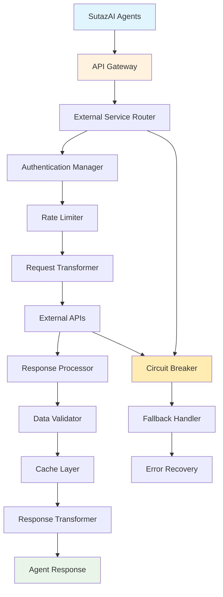
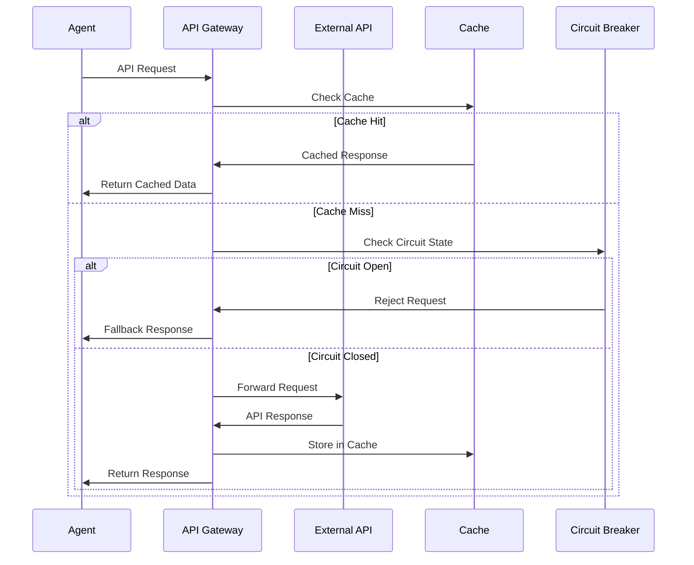
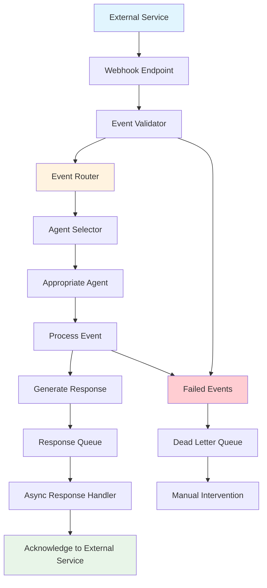
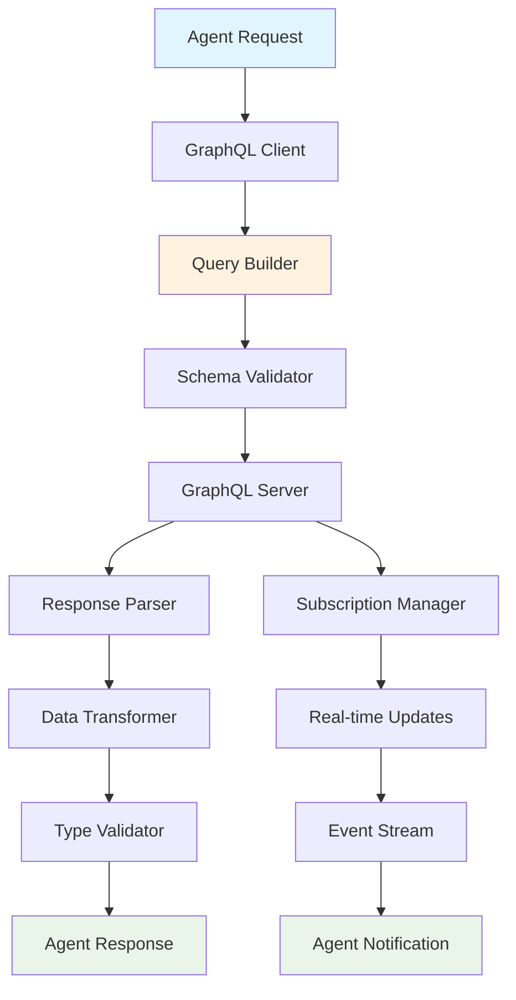

# External API Integration Patterns

This document provides comprehensive patterns for integrating SutazAI agents with external services and APIs.

## Integration Architecture Overview



## Core Integration Patterns

### 1. REST API Integration Pattern



### 2. Webhook Integration Pattern



### 3. GraphQL Integration Pattern



## Service-Specific Integration Patterns

### 1. GitHub Integration

```python
class GitHubIntegrationAgent:
    """
    Specialized agent for GitHub API integration
    """
    
    def __init__(self, token: str):
        self.client = httpx.AsyncClient(
            base_url="https://api.github.com",
            headers={
                "Authorization": f"Bearer {token}",
                "Accept": "application/vnd.github.v3+json"
            }
        )
        self.rate_limiter = RateLimiter(5000, 3600)  # 5000 requests per hour
    
    async def create_pr_review(self, repo: str, pr_number: int, analysis: dict):
        """Create automated PR review"""
        await self.rate_limiter.acquire()
        
        review_data = {
            "body": self._format_review_comment(analysis),
            "event": "COMMENT",
            "comments": self._generate_line_comments(analysis)
        }
        
        response = await self.client.post(
            f"/repos/{repo}/pulls/{pr_number}/reviews",
            json=review_data
        )
        
        return response.json()
    
    async def webhook_handler(self, event_type: str, payload: dict):
        """Handle GitHub webhook events"""
        handlers = {
            "pull_request": self._handle_pr_event,
            "push": self._handle_push_event,
            "issue": self._handle_issue_event
        }
        
        handler = handlers.get(event_type)
        if handler:
            return await handler(payload)
        
        return {"status": "ignored", "reason": "unsupported_event"}
```

### 2. Slack Integration

```python
class SlackIntegrationAgent:
    """
    Slack API integration for notifications and interactions
    """
    
    def __init__(self, bot_token: str):
        self.client = AsyncWebClient(token=bot_token)
        self.socket_client = AsyncSocketModeClient(
            app_token=os.getenv("SLACK_APP_TOKEN"),
            web_client=self.client
        )
    
    async def send_deployment_notification(self, channel: str, deployment_info: dict):
        """Send deployment status notification"""
        blocks = [
            {
                "type": "section",
                "text": {
                    "type": "mrkdwn",
                    "text": f"🚀 Deployment Status: *{deployment_info['status']}*"
                }
            },
            {
                "type": "fields",
                "fields": [
                    {
                        "type": "mrkdwn",
                        "text": f"*Service:* {deployment_info['service']}"
                    },
                    {
                        "type": "mrkdwn", 
                        "text": f"*Environment:* {deployment_info['environment']}"
                    }
                ]
            }
        ]
        
        return await self.client.chat_postMessage(
            channel=channel,
            blocks=blocks
        )
    
    async def interactive_command_handler(self, command: str, args: list):
        """Handle interactive slash commands"""
        command_handlers = {
            "/deploy": self._handle_deploy_command,
            "/status": self._handle_status_command,
            "/rollback": self._handle_rollback_command
        }
        
        handler = command_handlers.get(command)
        if handler:
            return await handler(args)
        
        return "Unknown command"
```

### 3. Jira Integration

```python
class JiraIntegrationAgent:
    """
    Jira API integration for issue tracking and project management
    """
    
    def __init__(self, server: str, email: str, api_token: str):
        self.jira = JIRA(
            server=server,
            basic_auth=(email, api_token)
        )
    
    async def create_bug_ticket(self, bug_report: dict):
        """Create bug ticket from automated detection"""
        issue_dict = {
            'project': {'key': bug_report['project']},
            'summary': f"[AUTO] {bug_report['title']}",
            'description': self._format_bug_description(bug_report),
            'issuetype': {'name': 'Bug'},
            'priority': {'name': self._map_priority(bug_report['severity'])},
            'labels': ['automated', 'ai-detected'],
            'components': [{'name': bug_report['component']}]
        }
        
        issue = self.jira.create_issue(fields=issue_dict)
        
        # Add attachments if available
        if bug_report.get('attachments'):
            for attachment in bug_report['attachments']:
                self.jira.add_attachment(issue, attachment)
        
        return issue.key
    
    async def update_deployment_status(self, deployment_id: str, status: str):
        """Update deployment tickets with status"""
        jql = f'labels = "deployment-{deployment_id}"'
        issues = self.jira.search_issues(jql)
        
        for issue in issues:
            self.jira.add_comment(
                issue,
                f"Deployment status updated: {status}"
            )
            
            if status == "completed":
                self.jira.transition_issue(issue, "Done")
```

### 4. Docker Registry Integration

```python
class DockerRegistryAgent:
    """
    Docker registry integration for image management
    """
    
    def __init__(self, registry_url: str, username: str, password: str):
        self.registry_url = registry_url
        self.auth = httpx.BasicAuth(username, password)
        self.client = httpx.AsyncClient(auth=self.auth)
    
    async def scan_image_vulnerabilities(self, image_tag: str):
        """Scan container image for vulnerabilities"""
        # Trivy integration
        scan_result = await self._run_trivy_scan(image_tag)
        
        # Harbor API for additional metadata
        image_info = await self._get_harbor_image_info(image_tag)
        
        return {
            "image": image_tag,
            "vulnerabilities": scan_result,
            "metadata": image_info,
            "scan_timestamp": datetime.utcnow().isoformat()
        }
    
    async def automated_image_promotion(self, image_tag: str, test_results: dict):
        """Promote image through environments based on test results"""
        if test_results["all_passed"]:
            # Tag for staging
            await self._tag_image(image_tag, f"{image_tag}-staging")
            
            # Run staging tests
            staging_results = await self._run_staging_tests(image_tag)
            
            if staging_results["success"]:
                # Promote to production
                await self._tag_image(image_tag, f"{image_tag}-production")
                return {"status": "promoted", "environment": "production"}
        
        return {"status": "promotion_failed", "reason": "tests_failed"}
```

## Database Integration Patterns

### 1. Multi-Database Agent

```python
class DatabaseIntegrationAgent:
    """
    Multi-database integration agent
    """
    
    def __init__(self):
        self.connections = {
            "postgresql": asyncpg.create_pool(os.getenv("POSTGRES_URL")),
            "mongodb": AsyncIOMotorClient(os.getenv("MONGO_URL")),
            "redis": aioredis.from_url(os.getenv("REDIS_URL")),
            "elasticsearch": AsyncElasticsearch([os.getenv("ES_URL")])
        }
    
    async def cross_database_query(self, query_spec: dict):
        """Execute queries across multiple databases"""
        results = {}
        
        # PostgreSQL query
        if query_spec.get("sql"):
            async with self.connections["postgresql"].acquire() as conn:
                results["sql"] = await conn.fetch(query_spec["sql"])
        
        # MongoDB query
        if query_spec.get("mongodb"):
            db = self.connections["mongodb"][query_spec["mongodb"]["database"]]
            collection = db[query_spec["mongodb"]["collection"]]
            results["mongodb"] = await collection.find(
                query_spec["mongodb"]["query"]
            ).to_list(None)
        
        # Redis query
        if query_spec.get("redis"):
            results["redis"] = await self.connections["redis"].get(
                query_spec["redis"]["key"]
            )
        
        # Elasticsearch query
        if query_spec.get("elasticsearch"):
            results["elasticsearch"] = await self.connections["elasticsearch"].search(
                index=query_spec["elasticsearch"]["index"],
                body=query_spec["elasticsearch"]["query"]
            )
        
        return results
```

### 2. Time Series Database Integration

```python
class TimeSeriesAgent:
    """
    InfluxDB and Prometheus integration for metrics
    """
    
    def __init__(self):
        self.influx_client = InfluxDBClient(
            url=os.getenv("INFLUXDB_URL"),
            token=os.getenv("INFLUXDB_TOKEN"),
            org=os.getenv("INFLUXDB_ORG")
        )
        self.prometheus_client = PrometheusConnect(
            url=os.getenv("PROMETHEUS_URL")
        )
    
    async def store_agent_metrics(self, agent_name: str, metrics: dict):
        """Store agent performance metrics"""
        points = []
        
        for metric_name, value in metrics.items():
            point = Point("agent_metrics") \
                .tag("agent", agent_name) \
                .field(metric_name, value) \
                .time(datetime.utcnow(), WritePrecision.NS)
            points.append(point)
        
        write_api = self.influx_client.write_api(write_options=SYNCHRONOUS)
        write_api.write_points(points)
    
    async def query_performance_trends(self, agent_name: str, hours: int = 24):
        """Query performance trends from Prometheus"""
        query = f'''
        rate(agent_requests_total{{agent="{agent_name}"}}[5m])
        '''
        
        end_time = datetime.utcnow()
        start_time = end_time - timedelta(hours=hours)
        
        result = self.prometheus_client.custom_query_range(
            query=query,
            start_time=start_time,
            end_time=end_time,
            step="5m"
        )
        
        return result
```

## Event-Based Integration Patterns

### 1. Apache Kafka Integration

```python
class KafkaIntegrationAgent:
    """
    Kafka integration for event streaming
    """
    
    def __init__(self):
        self.producer = AIOKafkaProducer(
            bootstrap_servers=os.getenv("KAFKA_SERVERS"),
            value_serializer=lambda x: json.dumps(x).encode()
        )
        self.consumer = AIOKafkaConsumer(
            "agent-events",
            bootstrap_servers=os.getenv("KAFKA_SERVERS"),
            value_deserializer=lambda m: json.loads(m.decode())
        )
    
    async def publish_agent_event(self, event_type: str, data: dict):
        """Publish agent event to Kafka"""
        event = {
            "type": event_type,
            "data": data,
            "timestamp": datetime.utcnow().isoformat(),
            "source": "sutazai-agent"
        }
        
        await self.producer.send("agent-events", event)
    
    async def event_processor(self):
        """Process incoming events from Kafka"""
        async for message in self.consumer:
            event = message.value
            
            try:
                await self._route_event(event)
            except Exception as e:
                logger.error(f"Event processing failed: {e}")
                await self._send_to_dlq(event, str(e))
```

### 2. RabbitMQ Integration

```python
class RabbitMQIntegrationAgent:
    """
    RabbitMQ integration for task queuing
    """
    
    def __init__(self):
        self.connection = None
        self.channel = None
    
    async def setup_connection(self):
        """Setup RabbitMQ connection"""
        self.connection = await aio_pika.connect_robust(
            os.getenv("RABBITMQ_URL")
        )
        self.channel = await self.connection.channel()
        
        # Declare exchanges and queues
        self.task_exchange = await self.channel.declare_exchange(
            "agent_tasks", aio_pika.ExchangeType.TOPIC, durable=True
        )
        
        self.result_queue = await self.channel.declare_queue(
            "task_results", durable=True
        )
    
    async def queue_task(self, agent_type: str, task_data: dict):
        """Queue task for specific agent type"""
        message = aio_pika.Message(
            json.dumps(task_data).encode(),
            delivery_mode=aio_pika.DeliveryMode.PERSISTENT
        )
        
        routing_key = f"tasks.{agent_type}"
        await self.task_exchange.publish(message, routing_key)
    
    async def consume_results(self, callback):
        """Consume task results"""
        await self.result_queue.consume(callback)
```

## Authentication and Security Patterns

### 1. OAuth2 Integration

```python
class OAuth2IntegrationMixin:
    """
    OAuth2 authentication mixin for external APIs
    """
    
    def __init__(self, client_id: str, client_secret: str, token_url: str):
        self.client_id = client_id
        self.client_secret = client_secret
        self.token_url = token_url
        self.access_token = None
        self.token_expires = None
    
    async def get_access_token(self):
        """Get or refresh OAuth2 access token"""
        if (self.access_token and self.token_expires and 
            datetime.utcnow() < self.token_expires):
            return self.access_token
        
        token_data = {
            "grant_type": "client_credentials",
            "client_id": self.client_id,
            "client_secret": self.client_secret
        }
        
        async with httpx.AsyncClient() as client:
            response = await client.post(self.token_url, data=token_data)
            token_info = response.json()
            
            self.access_token = token_info["access_token"]
            self.token_expires = datetime.utcnow() + timedelta(
                seconds=token_info["expires_in"] - 60  # 60s buffer
            )
            
            return self.access_token
    
    async def authenticated_request(self, method: str, url: str, **kwargs):
        """Make authenticated request"""
        token = await self.get_access_token()
        headers = kwargs.get("headers", {})
        headers["Authorization"] = f"Bearer {token}"
        kwargs["headers"] = headers
        
        async with httpx.AsyncClient() as client:
            return await client.request(method, url, **kwargs)
```

## Error Handling and Resilience

### Circuit Breaker Pattern

```python
class ExternalAPICircuitBreaker:
    """
    Circuit breaker for external API calls
    """
    
    def __init__(self, failure_threshold: int = 5, timeout: int = 60):
        self.failure_threshold = failure_threshold
        self.timeout = timeout
        self.failure_count = 0
        self.last_failure_time = None
        self.state = "CLOSED"  # CLOSED, OPEN, HALF_OPEN
    
    async def call(self, func, *args, **kwargs):
        """Execute function with circuit breaker protection"""
        if self.state == "OPEN":
            if (datetime.utcnow() - self.last_failure_time).seconds >= self.timeout:
                self.state = "HALF_OPEN"
            else:
                raise CircuitBreakerOpenError("Circuit breaker is OPEN")
        
        try:
            result = await func(*args, **kwargs)
            
            if self.state == "HALF_OPEN":
                self.state = "CLOSED"
                self.failure_count = 0
            
            return result
            
        except Exception as e:
            self.failure_count += 1
            self.last_failure_time = datetime.utcnow()
            
            if self.failure_count >= self.failure_threshold:
                self.state = "OPEN"
            
            raise e
```

This comprehensive integration pattern documentation provides the foundation for connecting SutazAI agents with a wide variety of external services while maintaining reliability, security, and performance.