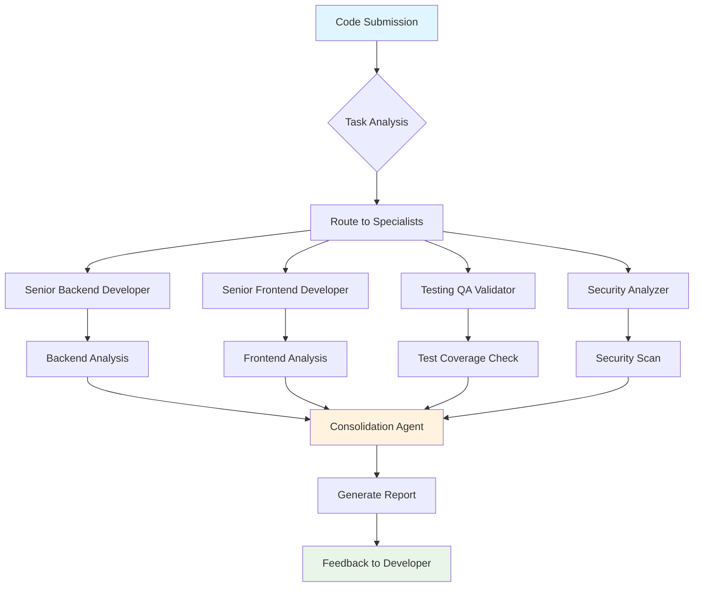
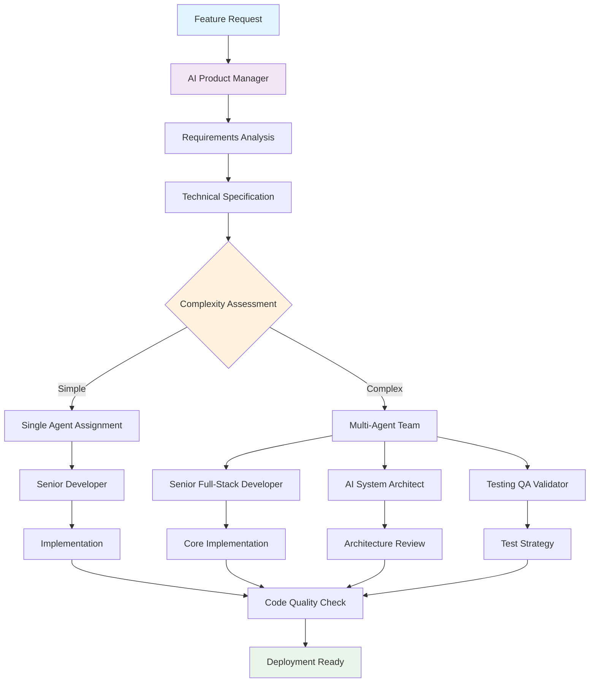
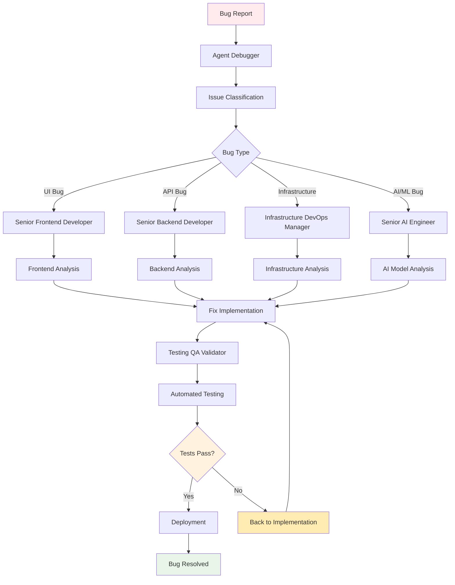
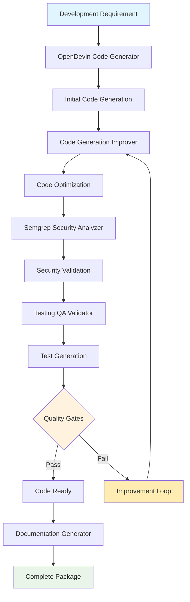
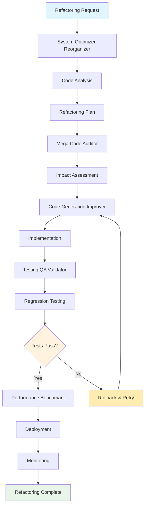

# Development Workflows

This document provides visual workflow diagrams and patterns for common development tasks using SutazAI's agent ecosystem.

## Workflow Overview

Development workflows in SutazAI follow a hierarchical pattern where tasks are analyzed, routed to appropriate specialists, and coordinated through multi-agent collaboration when needed.

## Core Development Workflow Patterns

### 1. Code Review Workflow



**LangFlow Implementation:**
- **Input Node**: Code submission with metadata
- **Classification Node**: Determine code type (frontend/backend/full-stack)
- **Parallel Processing**: Multiple specialist agents analyze simultaneously
- **Aggregation Node**: Combine results from all agents
- **Output Node**: Formatted report with actionable feedback

### 2. Feature Development Workflow



**LangFlow Components:**
- **Requirements Processor**: Extracts and structures feature requirements
- **Complexity Analyzer**: Determines resource allocation needed
- **Agent Coordinator**: Manages multi-agent collaboration
- **Quality Gate**: Ensures standards compliance before completion

### 3. Bug Fix Workflow



**Decision Logic:**
- **Bug Classification**: Analyzes stack trace, error logs, and symptoms
- **Specialist Routing**: Routes to appropriate domain expert
- **Validation Loop**: Ensures fix resolves issue without creating new problems

## Advanced Development Patterns

### 4. AI-Enhanced Code Generation



### 5. Refactoring Workflow



## LangFlow Templates

### Template 1: Simple Code Review

```json
{
  "name": "Code Review Workflow",
  "nodes": [
    {
      "id": "input",
      "type": "input",
      "data": {
        "name": "code_submission",
        "description": "Code files and metadata"
      }
    },
    {
      "id": "classifier",
      "type": "conditional",
      "data": {
        "conditions": [
          {"if": "contains_frontend_files", "then": "frontend_review"},
          {"if": "contains_backend_files", "then": "backend_review"},
          {"if": "contains_both", "then": "full_stack_review"}
        ]
      }
    },
    {
      "id": "frontend_review",
      "type": "agent",
      "data": {
        "agent": "senior-frontend-developer",
        "task": "code_review"
      }
    },
    {
      "id": "backend_review", 
      "type": "agent",
      "data": {
        "agent": "senior-backend-developer",
        "task": "code_review"
      }
    },
    {
      "id": "aggregator",
      "type": "combine",
      "data": {
        "strategy": "merge_reports"
      }
    },
    {
      "id": "output",
      "type": "output",
      "data": {
        "format": "markdown_report"
      }
    }
  ],
  "edges": [
    {"from": "input", "to": "classifier"},
    {"from": "classifier", "to": "frontend_review"},
    {"from": "classifier", "to": "backend_review"},
    {"from": "frontend_review", "to": "aggregator"},
    {"from": "backend_review", "to": "aggregator"},
    {"from": "aggregator", "to": "output"}
  ]
}
```

### Template 2: AI-Enhanced Development

```json
{
  "name": "AI Enhanced Development",
  "nodes": [
    {
      "id": "requirement_input",
      "type": "input",
      "data": {
        "name": "feature_requirement",
        "schema": {
          "description": "string",
          "acceptance_criteria": "array",
          "priority": "enum[low,medium,high,critical]"
        }
      }
    },
    {
      "id": "opendevin_generator",
      "type": "agent",
      "data": {
        "agent": "opendevin-code-generator",
        "task": "generate_feature_code"
      }
    },
    {
      "id": "code_improver",
      "type": "agent", 
      "data": {
        "agent": "code-generation-improver",
        "task": "optimize_generated_code"
      }
    },
    {
      "id": "security_check",
      "type": "agent",
      "data": {
        "agent": "semgrep-security-analyzer",
        "task": "security_scan"
      }
    },
    {
      "id": "test_generator",
      "type": "agent",
      "data": {
        "agent": "testing-qa-validator",
        "task": "generate_tests"
      }
    },
    {
      "id": "quality_gate",
      "type": "conditional",
      "data": {
        "conditions": [
          {"metric": "security_score", "operator": ">", "value": 8},
          {"metric": "test_coverage", "operator": ">", "value": 80},
          {"metric": "code_quality", "operator": ">", "value": 7}
        ]
      }
    },
    {
      "id": "complete_package",
      "type": "output",
      "data": {
        "includes": ["code", "tests", "documentation", "security_report"]
      }
    }
  ]
}
```

## Best Practices

### 1. Agent Selection Guidelines
- **Frontend Tasks**: Use senior-frontend-developer for React/Vue/Angular
- **Backend APIs**: Use senior-backend-developer for FastAPI/Django
- **Full Applications**: Use senior-full-stack-developer for complete features
- **AI/ML Code**: Use senior-ai-engineer for model integration
- **Code Quality**: Always include code-generation-improver for optimization

### 2. Workflow Optimization
- **Parallel Processing**: Run independent analyses simultaneously
- **Early Validation**: Check requirements before implementation
- **Incremental Review**: Review code in small chunks for faster feedback
- **Automated Testing**: Always include testing-qa-validator in workflows

### 3. Error Handling
- **Fallback Agents**: Define backup agents for each specialist
- **Retry Logic**: Implement exponential backoff for failed tasks
- **Circuit Breakers**: Prevent cascade failures in multi-agent workflows
- **Monitoring**: Track agent performance and adjust routing accordingly

### 4. Performance Considerations
- **Load Balancing**: Distribute tasks across available agent instances
- **Caching**: Cache common analysis results to reduce processing time
- **Batch Processing**: Group similar tasks for efficiency
- **Resource Limits**: Set appropriate timeouts and resource constraints

## Integration Examples

### GitHub Integration
```python
# Webhook handler for PR review
@app.post("/webhook/pr-review")
async def handle_pr_review(pr_data: dict):
    workflow = CodeReviewWorkflow()
    result = await workflow.execute({
        "files": pr_data["changed_files"],
        "author": pr_data["author"],
        "title": pr_data["title"]
    })
    await post_pr_comment(pr_data["pr_id"], result.summary)
```

### CI/CD Integration
```yaml
# GitHub Actions workflow
name: AI Code Review
on: [pull_request]
jobs:
  ai-review:
    runs-on: ubuntu-latest
    steps:
      - uses: actions/checkout@v2
      - name: Run SutazAI Review
        run: |
          curl -X POST $SUTAZAI_ENDPOINT/workflows/code-review \
            -H "Content-Type: application/json" \
            -d '{"repository": "${{ github.repository }}", "pr": "${{ github.event.number }}"}'
```

This development workflow documentation provides comprehensive patterns for leveraging SutazAI's agent ecosystem in software development processes. Each workflow is designed to be modular, scalable, and easily customizable for specific project needs.