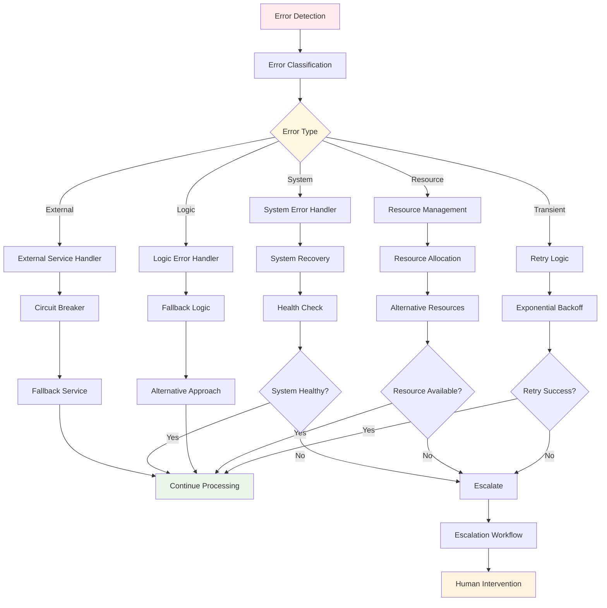
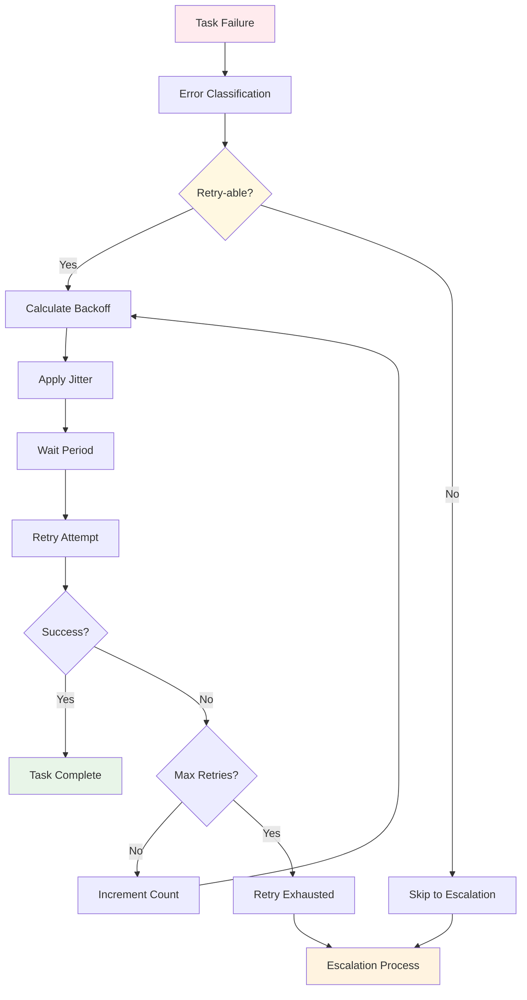
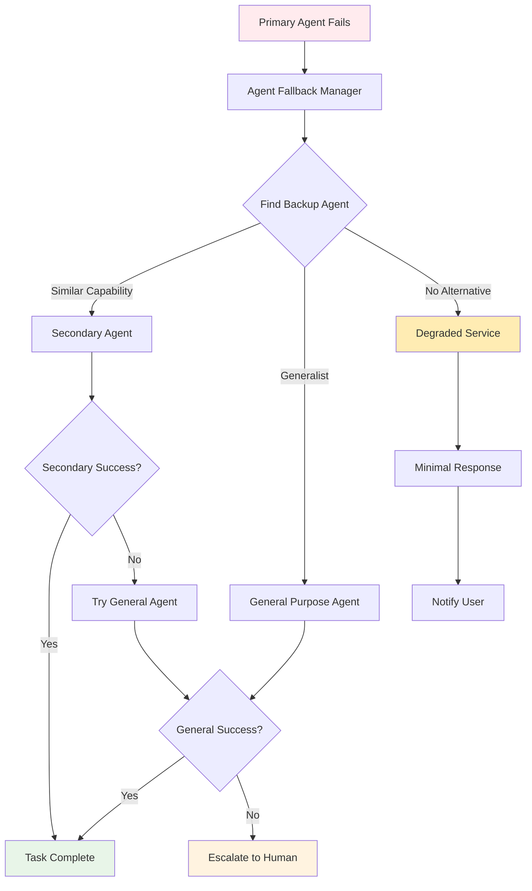
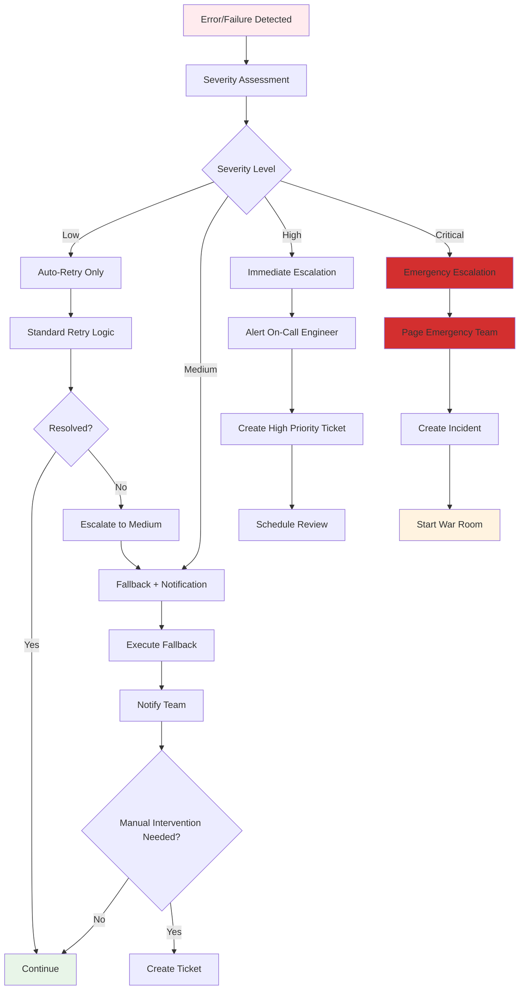
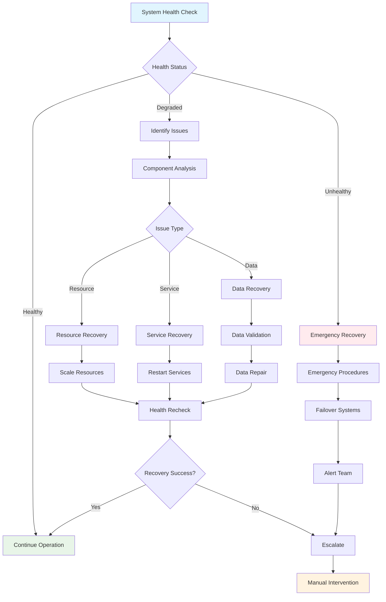

# Error Handling and Recovery Workflows

This document provides comprehensive error handling patterns, recovery procedures, and escalation workflows for the SutazAI agent ecosystem.

## Error Handling Architecture



## Error Classification System

### 1. Error Taxonomy

```python
class ErrorType(Enum):
    """Comprehensive error classification"""
    
    # Transient Errors (retry-able)
    NETWORK_TIMEOUT = "network_timeout"
    CONNECTION_RESET = "connection_reset"
    RATE_LIMIT_EXCEEDED = "rate_limit_exceeded"
    TEMPORARY_UNAVAILABLE = "temporary_unavailable"
    
    # Resource Errors
    MEMORY_EXHAUSTED = "memory_exhausted"
    CPU_OVERLOAD = "cpu_overload"
    DISK_FULL = "disk_full"
    CONNECTION_POOL_EXHAUSTED = "connection_pool_exhausted"
    
    # Logic Errors
    VALIDATION_FAILED = "validation_failed"
    PROCESSING_FAILED = "processing_failed"
    DATA_CORRUPTION = "data_corruption"
    BUSINESS_RULE_VIOLATION = "business_rule_violation"
    
    # System Errors
    SERVICE_UNAVAILABLE = "service_unavailable"
    DATABASE_ERROR = "database_error"
    CONFIGURATION_ERROR = "configuration_error"
    SECURITY_ERROR = "security_error"
    
    # External Service Errors
    API_ERROR = "api_error"
    AUTHENTICATION_FAILED = "authentication_failed"
    AUTHORIZATION_FAILED = "authorization_failed"
    EXTERNAL_SERVICE_DOWN = "external_service_down"

class ErrorSeverity(Enum):
    LOW = "low"
    MEDIUM = "medium"
    HIGH = "high"
    CRITICAL = "critical"
```

### 2. Error Detection and Classification

```python
class ErrorClassifier:
    """
    Intelligent error classification system
    """
    
    def __init__(self):
        self.classification_rules = {
            # Network-related errors
            (httpx.TimeoutException, None): (ErrorType.NETWORK_TIMEOUT, ErrorSeverity.MEDIUM),
            (httpx.ConnectError, None): (ErrorType.CONNECTION_RESET, ErrorSeverity.MEDIUM),
            (httpx.HTTPStatusError, 429): (ErrorType.RATE_LIMIT_EXCEEDED, ErrorSeverity.LOW),
            (httpx.HTTPStatusError, 503): (ErrorType.TEMPORARY_UNAVAILABLE, ErrorSeverity.MEDIUM),
            
            # Resource errors
            (MemoryError, None): (ErrorType.MEMORY_EXHAUSTED, ErrorSeverity.HIGH),
            (asyncio.QueueFull, None): (ErrorType.CONNECTION_POOL_EXHAUSTED, ErrorSeverity.MEDIUM),
            
            # System errors
            (DatabaseError, None): (ErrorType.DATABASE_ERROR, ErrorSeverity.HIGH),
            (AuthenticationError, None): (ErrorType.AUTHENTICATION_FAILED, ErrorSeverity.HIGH),
        }
    
    def classify_error(self, error: Exception, context: dict = None) -> tuple:
        """Classify error and determine severity"""
        error_type = type(error)
        error_code = getattr(error, 'status_code', None)
        
        # Check direct mappings
        classification = self.classification_rules.get((error_type, error_code))
        if classification:
            return classification
        
        # Check base class mappings
        classification = self.classification_rules.get((error_type, None))
        if classification:
            return classification
        
        # Analyze error message for additional context
        error_message = str(error).lower()
        
        if any(keyword in error_message for keyword in ['timeout', 'timed out']):
            return (ErrorType.NETWORK_TIMEOUT, ErrorSeverity.MEDIUM)
        
        if any(keyword in error_message for keyword in ['memory', 'out of memory']):
            return (ErrorType.MEMORY_EXHAUSTED, ErrorSeverity.HIGH)
        
        if any(keyword in error_message for keyword in ['connection', 'connect']):
            return (ErrorType.CONNECTION_RESET, ErrorSeverity.MEDIUM)
        
        # Default classification
        return (ErrorType.PROCESSING_FAILED, ErrorSeverity.MEDIUM)
```

## Retry Strategies

### 1. Exponential Backoff with Jitter



```python
class RetryStrategy:
    """
    Advanced retry strategy with multiple algorithms
    """
    
    def __init__(self, max_retries: int = 3, base_delay: float = 1.0):
        self.max_retries = max_retries
        self.base_delay = base_delay
    
    async def execute_with_retry(self, func: Callable, error_classifier: ErrorClassifier, *args, **kwargs):
        """Execute function with intelligent retry logic"""
        last_error = None
        
        for attempt in range(self.max_retries + 1):
            try:
                result = await func(*args, **kwargs)
                
                # Log success after retry
                if attempt > 0:
                    logger.info(f"Task succeeded after {attempt} retries")
                
                return result
                
            except Exception as e:
                last_error = e
                error_type, severity = error_classifier.classify_error(e)
                
                # Check if error is retry-able
                if not self._is_retryable(error_type):
                    logger.error(f"Non-retryable error: {error_type}")
                    raise e
                
                # Check if we've exhausted retries
                if attempt >= self.max_retries:
                    logger.error(f"Max retries ({self.max_retries}) exceeded")
                    break
                
                # Calculate delay
                delay = self._calculate_delay(attempt, error_type, severity)
                logger.warning(f"Attempt {attempt + 1} failed: {e}. Retrying in {delay}s")
                
                await asyncio.sleep(delay)
        
        # All retries exhausted
        raise RetryExhaustedException(f"Failed after {self.max_retries} retries", last_error)
    
    def _is_retryable(self, error_type: ErrorType) -> bool:
        """Determine if error type is retryable"""
        retryable_errors = {
            ErrorType.NETWORK_TIMEOUT,
            ErrorType.CONNECTION_RESET,
            ErrorType.RATE_LIMIT_EXCEEDED,
            ErrorType.TEMPORARY_UNAVAILABLE,
            ErrorType.CONNECTION_POOL_EXHAUSTED
        }
        return error_type in retryable_errors
    
    def _calculate_delay(self, attempt: int, error_type: ErrorType, severity: ErrorSeverity) -> float:
        """Calculate delay with exponential backoff and jitter"""
        # Base exponential backoff
        delay = self.base_delay * (2 ** attempt)
        
        # Adjust for error type
        if error_type == ErrorType.RATE_LIMIT_EXCEEDED:
            delay *= 2  # Longer delays for rate limiting
        elif error_type == ErrorType.NETWORK_TIMEOUT:
            delay *= 1.5  # Moderate increase for timeouts
        
        # Adjust for severity
        if severity == ErrorSeverity.HIGH:
            delay *= 1.5
        elif severity == ErrorSeverity.CRITICAL:
            delay *= 2
        
        # Add jitter (±25%)
        jitter = delay * 0.25 * (2 * random.random() - 1)
        delay += jitter
        
        # Cap at maximum delay
        return min(delay, 60.0)  # Max 60 seconds
```

### 2. Circuit Breaker Pattern

```python
class CircuitBreaker:
    """
    Circuit breaker for external service calls
    """
    
    def __init__(self, failure_threshold: int = 5, recovery_timeout: int = 60):
        self.failure_threshold = failure_threshold
        self.recovery_timeout = recovery_timeout
        self.failure_count = 0
        self.last_failure_time = None
        self.state = "CLOSED"  # CLOSED, OPEN, HALF_OPEN
        self.success_count = 0
    
    async def call(self, func: Callable, *args, **kwargs):
        """Execute function with circuit breaker protection"""
        
        if self.state == "OPEN":
            if self._should_attempt_reset():
                self.state = "HALF_OPEN"
                self.success_count = 0
            else:
                raise CircuitBreakerOpenError("Circuit breaker is OPEN")
        
        try:
            result = await func(*args, **kwargs)
            self._on_success()
            return result
            
        except Exception as e:
            self._on_failure()
            raise e
    
    def _should_attempt_reset(self) -> bool:
        """Check if enough time has passed to attempt reset"""
        if self.last_failure_time is None:
            return True
        
        time_since_failure = datetime.utcnow() - self.last_failure_time
        return time_since_failure.total_seconds() >= self.recovery_timeout
    
    def _on_success(self):
        """Handle successful call"""
        if self.state == "HALF_OPEN":
            self.success_count += 1
            if self.success_count >= 3:  # Require 3 successes to close
                self.state = "CLOSED"
                self.failure_count = 0
        elif self.state == "CLOSED":
            self.failure_count = max(0, self.failure_count - 1)
    
    def _on_failure(self):
        """Handle failed call"""
        self.failure_count += 1
        self.last_failure_time = datetime.utcnow()
        
        if self.failure_count >= self.failure_threshold:
            self.state = "OPEN"
        elif self.state == "HALF_OPEN":
            self.state = "OPEN"
```

## Fallback Mechanisms

### 1. Agent Fallback Chain



```python
class AgentFallbackManager:
    """
    Manages fallback chains for agent failures
    """
    
    def __init__(self, agent_registry: AgentRegistry):
        self.agent_registry = agent_registry
        self.fallback_chains = {
            "senior-frontend-developer": [
                "senior-full-stack-developer",
                "code-generation-improver",
                "agentzero-coordinator"
            ],
            "senior-backend-developer": [
                "senior-full-stack-developer", 
                "senior-ai-engineer",
                "agentzero-coordinator"
            ],
            "ollama-integration-specialist": [
                "senior-ai-engineer",
                "infrastructure-devops-manager",
                "agentzero-coordinator"
            ]
        }
    
    async def execute_with_fallback(self, primary_agent: str, task: dict):
        """Execute task with automatic fallback"""
        agents_to_try = [primary_agent] + self.fallback_chains.get(primary_agent, [])
        
        last_error = None
        for agent_name in agents_to_try:
            try:
                agent = self.agent_registry.get_agent(agent_name)
                if agent and agent.is_available():
                    result = await agent.process_task(task)
                    
                    # Log fallback usage
                    if agent_name != primary_agent:
                        logger.warning(f"Task completed using fallback agent: {agent_name}")
                    
                    return result
                    
            except Exception as e:
                last_error = e
                logger.error(f"Agent {agent_name} failed: {e}")
                continue
        
        # All agents failed
        raise FallbackExhaustedException(f"All fallback agents failed", last_error)
```

### 2. Service Degradation

```python
class DegradedServiceHandler:
    """
    Handles graceful service degradation
    """
    
    def __init__(self):
        self.degradation_strategies = {
            "code_review": self._degrade_code_review,
            "deployment": self._degrade_deployment,
            "ai_analysis": self._degrade_ai_analysis,
            "security_scan": self._degrade_security_scan
        }
    
    async def handle_degraded_service(self, task_type: str, task_data: dict):
        """Provide degraded service when full processing fails"""
        handler = self.degradation_strategies.get(task_type)
        
        if handler:
            return await handler(task_data)
        
        # Default degradation
        return {
            "status": "degraded",
            "message": "Service temporarily unavailable. Please try again later.",
            "estimated_recovery": "5-10 minutes",
            "alternatives": [
                "Use manual process",
                "Try again later",
                "Check system status"
            ]
        }
    
    async def _degrade_code_review(self, task_data: dict):
        """Provide basic code review when AI agents fail"""
        return {
            "status": "degraded",
            "basic_checks": {
                "syntax_valid": True,  # Basic syntax check
                "file_size_ok": len(task_data.get("content", "")) < 50000,
                "line_count": task_data.get("content", "").count('\n')
            },
            "message": "Full AI review unavailable. Basic checks completed.",
            "recommendation": "Manual review recommended"
        }
    
    async def _degrade_deployment(self, task_data: dict):
        """Provide deployment status when automation fails"""
        return {
            "status": "degraded", 
            "message": "Automated deployment unavailable",
            "manual_steps": [
                "1. Run tests manually: pytest",
                "2. Build image: docker build -t app:latest .",
                "3. Deploy: docker-compose up -d",
                "4. Verify: curl http://localhost:8000/health"
            ],
            "monitoring": "Manual monitoring required"
        }
```

## Escalation Workflows

### 1. Escalation Decision Tree



### 2. Escalation Manager

```python
class EscalationManager:
    """
    Manages error escalation and notification workflows
    """
    
    def __init__(self, notification_service: NotificationService):
        self.notification_service = notification_service
        self.escalation_rules = {
            ErrorSeverity.LOW: self._handle_low_severity,
            ErrorSeverity.MEDIUM: self._handle_medium_severity,
            ErrorSeverity.HIGH: self._handle_high_severity,
            ErrorSeverity.CRITICAL: self._handle_critical_severity
        }
    
    async def escalate_error(self, error: Exception, error_type: ErrorType, 
                           severity: ErrorSeverity, context: dict):
        """Escalate error based on severity"""
        handler = self.escalation_rules[severity]
        return await handler(error, error_type, context)
    
    async def _handle_low_severity(self, error: Exception, error_type: ErrorType, context: dict):
        """Handle low severity errors"""
        # Log only, no immediate escalation
        logger.warning(f"Low severity error: {error_type} - {error}")
        
        return {
            "action": "logged",
            "retry_recommended": True,
            "human_intervention": False
        }
    
    async def _handle_medium_severity(self, error: Exception, error_type: ErrorType, context: dict):
        """Handle medium severity errors"""
        # Notify team, create ticket
        await self.notification_service.send_alert(
            channel="engineering",
            title=f"Medium Severity Error: {error_type}",
            message=f"Error: {error}\nContext: {context}",
            priority="medium"
        )
        
        ticket_id = await self._create_ticket(
            title=f"Medium Severity: {error_type}",
            description=str(error),
            priority="medium",
            context=context
        )
        
        return {
            "action": "notified_and_ticketed",
            "ticket_id": ticket_id,
            "human_intervention": True,
            "sla": "24 hours"
        }
    
    async def _handle_high_severity(self, error: Exception, error_type: ErrorType, context: dict):
        """Handle high severity errors"""
        # Alert on-call engineer
        await self.notification_service.send_alert(
            channel="on-call",
            title=f"HIGH SEVERITY: {error_type}",
            message=f"Immediate attention required\nError: {error}\nContext: {context}",
            priority="high",
            escalation_policy="immediate"
        )
        
        ticket_id = await self._create_ticket(
            title=f"HIGH SEVERITY: {error_type}",
            description=str(error),
            priority="high",
            context=context,
            assignee="on-call-engineer"
        )
        
        return {
            "action": "high_priority_alert",
            "ticket_id": ticket_id,
            "human_intervention": True,
            "sla": "2 hours"
        }
    
    async def _handle_critical_severity(self, error: Exception, error_type: ErrorType, context: dict):
        """Handle critical severity errors"""
        # Emergency escalation
        incident_id = await self._create_incident(
            title=f"CRITICAL: {error_type}",
            description=str(error),
            context=context
        )
        
        # Page emergency team
        await self.notification_service.send_emergency_page(
            title=f"CRITICAL INCIDENT: {incident_id}",
            message=f"Critical system error requiring immediate response",
            error_details=str(error),
            context=context
        )
        
        # Start war room
        war_room_url = await self._start_war_room(incident_id)
        
        return {
            "action": "critical_incident",
            "incident_id": incident_id,
            "war_room_url": war_room_url,
            "human_intervention": True,
            "sla": "15 minutes"
        }
```

## Recovery Procedures

### 1. Self-Healing Workflows



### 2. Automated Recovery Agent

```python
class AutomatedRecoveryAgent:
    """
    Automated system recovery and self-healing
    """
    
    def __init__(self):
        self.recovery_strategies = {
            "high_memory_usage": self._recover_memory,
            "connection_pool_exhausted": self._recover_connections,
            "service_unresponsive": self._recover_service,
            "database_connection_lost": self._recover_database
        }
    
    async def attempt_recovery(self, issue_type: str, context: dict):
        """Attempt automated recovery"""
        strategy = self.recovery_strategies.get(issue_type)
        
        if strategy:
            logger.info(f"Attempting recovery for: {issue_type}")
            return await strategy(context)
        
        logger.warning(f"No recovery strategy for: {issue_type}")
        return {"success": False, "reason": "no_strategy"}
    
    async def _recover_memory(self, context: dict):
        """Recover from high memory usage"""
        try:
            # Force garbage collection
            import gc
            gc.collect()
            
            # Clear caches
            await self._clear_application_caches()
            
            # Restart high-memory agents
            await self._restart_memory_intensive_agents()
            
            return {"success": True, "action": "memory_cleanup"}
            
        except Exception as e:
            return {"success": False, "error": str(e)}
    
    async def _recover_connections(self, context: dict):
        """Recover from connection pool exhaustion"""
        try:
            # Reset connection pools
            await self._reset_connection_pools()
            
            # Scale connection limits
            await self._increase_connection_limits()
            
            return {"success": True, "action": "connection_recovery"}
            
        except Exception as e:
            return {"success": False, "error": str(e)}
    
    async def _recover_service(self, context: dict):
        """Recover unresponsive service"""
        service_name = context.get("service_name")
        
        try:
            # Graceful restart attempt
            await self._graceful_restart_service(service_name)
            
            # Wait for service to be ready
            await self._wait_for_service_ready(service_name, timeout=60)
            
            return {"success": True, "action": "service_restart"}
            
        except Exception as e:
            # Force restart if graceful fails
            try:
                await self._force_restart_service(service_name)
                return {"success": True, "action": "service_force_restart"}
            except Exception as force_error:
                return {"success": False, "error": str(force_error)}
```

This comprehensive error handling and recovery documentation provides robust patterns for maintaining system reliability and ensuring graceful degradation when issues occur in the SutazAI agent ecosystem.