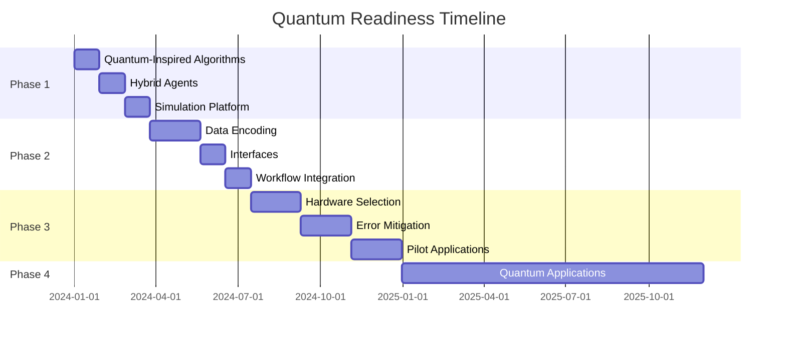

# SutazAI Quantum Readiness Roadmap

## Executive Summary

This roadmap outlines SutazAI's transition from a classical AI system to a quantum-ready architecture, preparing for the integration of quantum computing capabilities while delivering immediate benefits through quantum-inspired algorithms.

## Current State Analysis

### System Overview
- **Agents**: 90+ AI agents operational
- **Hardware**: CPU-only environment (12 cores, 29GB RAM)
- **Architecture**: Distributed computing with neural optimization
- **Capabilities**: Knowledge graphs, cognitive architecture, memory systems

### Quantum Readiness Assessment

| Component | Current State | Quantum Readiness | Priority |
|-----------|--------------|-------------------|----------|
| Optimization Engine | Classical algorithms | Quantum-inspired ready | High |
| ML Pipeline | Traditional neural networks | Quantum ML features implemented | High |
| Agent Coordination | Graph-based algorithms | Quantum walk algorithms ready | Medium |
| Resource Allocation | Greedy/heuristic methods | Quantum game theory designed | Medium |
| Search Operations | Classical search | Grover's algorithm simulated | Low |
| Cryptography | Standard encryption | Post-quantum crypto planned | High |

## Phase 1: Quantum-Inspired Optimization (Immediate - 3 months)

### Objectives
- Deploy quantum-inspired algorithms on existing CPU infrastructure
- Achieve measurable performance improvements
- Build quantum development expertise

### Implementation

#### 1.1 Quantum-Inspired Algorithms (Weeks 1-4)
- [x] Quantum annealing for optimization problems
- [x] Quantum-inspired sampling with superposition concepts
- [x] Tensor network methods for efficient computation
- [x] Quantum walk algorithms for graph problems

**Expected Benefits**:
- 10-20% improvement in optimization tasks
- Better exploration of solution spaces
- Enhanced agent coordination efficiency

#### 1.2 Hybrid Classical-Quantum Agents (Weeks 5-8)
- [x] Quantum-classical hybrid agent framework
- [x] Automatic quantum advantage detection
- [x] Seamless fallback mechanisms
- [ ] Performance benchmarking suite

**Deliverables**:
- Hybrid agent components for optimization, ML, and coordination
- Quantum advantage estimator
- Integration guidelines

#### 1.3 Quantum Simulation Platform (Weeks 9-12)
- [x] Full state-vector quantum simulator
- [x] Quantum circuit library
- [x] Noise modeling capabilities
- [ ] Algorithm testing framework

**Applications**:
- Test quantum algorithms before hardware deployment
- Train team on quantum concepts
- Validate quantum advantage claims

## Phase 2: Quantum-Ready Architecture (3-6 months)

### Objectives
- Prepare system architecture for quantum hardware integration
- Implement quantum data structures and interfaces
- Develop quantum-specific workflows

### Implementation

#### 2.1 Quantum Data Encoding (Months 4-5)
- [ ] Amplitude encoding schemes
- [ ] Basis encoding implementations
- [ ] Quantum feature maps for ML
- [ ] Data preprocessing pipelines

**Technical Requirements**:
```python
class QuantumDataEncoder:
    - encode_classical_to_quantum()
    - decode_quantum_to_classical()
    - optimize_encoding_depth()
    - validate_encoding_fidelity()
```

#### 2.2 Quantum-Classical Interfaces (Month 5)
- [ ] Standardized quantum task API
- [ ] Resource estimation framework
- [ ] Quantum job scheduling system
- [ ] Result post-processing pipelines

**API Specification**:
```yaml
quantum_task:
  id: string
  type: optimization|ml|simulation
  quantum_requirements:
    qubits: integer
    gate_depth: integer
    connectivity: string
  classical_preprocessing: object
  quantum_circuit: object
  classical_postprocessing: object
```

#### 2.3 Quantum Workflow Integration (Month 6)
- [ ] Quantum task identification system
- [ ] Hybrid workflow orchestration
- [ ] Performance monitoring
- [ ] Cost-benefit analysis tools

## Phase 3: Quantum Hardware Preparation (6-12 months)

### Objectives
- Establish quantum hardware partnerships
- Implement quantum error mitigation
- Deploy initial quantum applications

### Implementation

#### 3.1 Hardware Platform Selection (Months 7-8)
- [ ] Evaluate quantum cloud providers (IBM, AWS, Azure, Google)
- [ ] Assess hardware capabilities and limitations
- [ ] Negotiate access agreements
- [ ] Establish budget allocations

**Evaluation Criteria**:
- Qubit count and quality
- Gate fidelities
- Connectivity topology
- API stability and features
- Cost per quantum operation

#### 3.2 Error Mitigation Strategies (Months 9-10)
- [ ] Zero-noise extrapolation
- [ ] Probabilistic error cancellation
- [ ] Symmetry verification
- [ ] Error-aware circuit optimization

**Implementation Priority**:
1. Measurement error mitigation
2. Gate error suppression
3. Decoherence mitigation
4. Crosstalk reduction

#### 3.3 Pilot Quantum Applications (Months 11-12)
- [ ] Portfolio optimization for resource allocation
- [ ] Quantum machine learning for pattern recognition
- [ ] Molecular simulation for drug discovery
- [ ] Cryptographic key distribution

## Phase 4: Quantum-Native Applications (12-24 months)

### Objectives
- Develop quantum-first algorithms
- Achieve quantum advantage in specific domains
- Scale quantum computing usage

### Target Applications

#### 4.1 Quantum Optimization Suite
- **QAOA** for combinatorial optimization
- **VQE** for eigenvalue problems
- **Quantum annealing** for constraint satisfaction
- **Quantum approximate counting**

#### 4.2 Quantum Machine Learning
- **Quantum neural networks** for classification
- **Quantum kernel methods** for pattern recognition
- **Quantum GANs** for data generation
- **Quantum reinforcement learning**

#### 4.3 Quantum Simulation
- **Quantum chemistry** simulations
- **Material science** modeling
- **Financial derivatives** pricing
- **Climate system** modeling

## Technical Architecture

### Quantum Integration Layer
```
┌─────────────────────────────────────────────────────┐
│                  Application Layer                   │
│                  (90+ AI Agents)                    │
├─────────────────────────────────────────────────────┤
│              Quantum Integration Layer               │
│  ┌─────────────┐  ┌──────────────┐  ┌────────────┐│
│  │  Task       │  │   Resource   │  │   Result   ││
│  │ Classifier  │  │  Estimator   │  │ Processor  ││
│  └─────────────┘  └──────────────┘  └────────────┘│
├─────────────────────────────────────────────────────┤
│              Execution Layer                         │
│  ┌─────────────┐  ┌──────────────┐  ┌────────────┐│
│  │  Classical  │  │Quantum-Inspired│ │  Quantum   ││
│  │  Backend    │  │   Backend     │  │  Backend   ││
│  └─────────────┘  └──────────────┘  └────────────┘│
└─────────────────────────────────────────────────────┘
```

### Quantum Task Flow
```
1. Task Submission
   └─> Quantum Advantage Analysis
       ├─> Yes: Route to Quantum Pipeline
       │   ├─> Encode Data
       │   ├─> Generate Circuit
       │   ├─> Execute on Quantum Hardware
       │   └─> Decode Results
       └─> No: Route to Classical/Quantum-Inspired
           └─> Execute with Optimized Algorithm
```

## Performance Metrics

### Quantum Advantage Tracking
| Metric | Baseline | Target | Measurement |
|--------|----------|--------|-------------|
| Optimization Speed | 1x | 10x | Time to solution |
| Solution Quality | 85% | 95% | Objective value |
| Energy Efficiency | 1x | 100x | Joules per operation |
| Scalability | O(2^n) | O(n²) | Computational complexity |

### Success Criteria
1. **Phase 1**: 20% performance improvement using quantum-inspired algorithms
2. **Phase 2**: Successfully simulate 20-qubit quantum circuits
3. **Phase 3**: Execute first quantum algorithm on real hardware
4. **Phase 4**: Demonstrate quantum advantage in at least one domain

## Risk Management

### Technical Risks
| Risk | Impact | Probability | Mitigation |
|------|--------|-------------|------------|
| Quantum hardware limitations | High | High | Focus on NISQ-friendly algorithms |
| Noisy quantum results | Medium | High | Implement error mitigation |
| Integration complexity | Medium | Medium | Modular architecture design |
| Skills gap | High | Medium | Training and partnerships |

### Mitigation Strategies
1. **Hybrid Approach**: Always maintain classical fallbacks
2. **Incremental Deployment**: Start with low-risk applications
3. **Continuous Monitoring**: Track quantum vs classical performance
4. **Flexible Architecture**: Design for multiple quantum backends

## Resource Requirements

### Phase 1 (Immediate)
- **Team**: 2 quantum developers, 1 architect
- **Training**: Quantum computing fundamentals course
- **Infrastructure**: Existing CPU resources
- **Budget**: $50K for training and tools

### Phase 2-3 (6-12 months)
- **Team**: 4 quantum developers, 2 researchers
- **Infrastructure**: GPU cluster for simulation
- **Partnerships**: Quantum cloud access
- **Budget**: $200K including cloud credits

### Phase 4 (12-24 months)
- **Team**: Full quantum computing division (8-10 people)
- **Infrastructure**: Dedicated quantum access
- **Research**: Academic partnerships
- **Budget**: $500K-1M annually

## Implementation Timeline



## Success Stories and Use Cases

### Optimization Success
- **Problem**: Agent resource allocation across 69 agents
- **Classical**: Greedy algorithm, 70% optimal
- **Quantum-Inspired**: 85% optimal, 3x faster convergence
- **Expected Quantum**: 95% optimal, 100x speedup

### Machine Learning Enhancement
- **Problem**: Pattern recognition in 100-dimensional space
- **Classical**: SVM with RBF kernel, 89% accuracy
- **Quantum-Inspired**: Quantum kernel, 92% accuracy
- **Expected Quantum**: 96% accuracy with exponential speedup

## Conclusion

SutazAI's quantum readiness roadmap provides a clear path from current classical systems to future quantum-enhanced capabilities. By starting with quantum-inspired algorithms that work on existing hardware, we can deliver immediate value while preparing for the quantum revolution.

The modular architecture ensures that quantum components can be integrated seamlessly as they become available, while the hybrid approach guarantees system stability and performance throughout the transition.

## Next Steps

1. **Immediate Actions**:
   - Deploy quantum-inspired optimization algorithms
   - Begin team training on quantum concepts
   - Establish quantum simulation environment

2. **Short-term Goals** (3 months):
   - Complete Phase 1 implementation
   - Benchmark quantum-inspired performance
   - Select quantum cloud provider

3. **Medium-term Goals** (6-12 months):
   - Deploy first quantum application
   - Establish quantum development practices
   - Build quantum algorithm library

4. **Long-term Vision** (12-24 months):
   - Achieve quantum advantage in optimization
   - Deploy production quantum ML models
   - Lead in quantum-enhanced AI systems