# SYSTEM ARCHITECTURE: CURRENT STATE vs TARGET STATE

**Document Version**: 1.0.0  
**Date**: 2025-08-16 23:00:00 UTC  
**Purpose**: Visual representation of architectural transformation  

## 🔴 CURRENT STATE: "The Facade Architecture"

```mermaid
graph TB
    subgraph "What You Think You Have"
        UI[Frontend UI - Port 10011]
        API[Backend API - Port 10010]
        MESH[Service Mesh]
        MCP[21 AI Agents/MCPs]
        DB[(Databases)]
        MON[Monitoring]
    end
    
    subgraph "What You Actually Have"
        UI2[Frontend ✅]
        API2[Backend ⚠️]
        MESH2[Empty Mesh 🚫]
        MCP2[Isolated MCPs 🚫]
        DB2[(Databases ✅)]
        MON2[Fake Metrics 🚫]
        
        UI2 -->|hardcoded| API2
        API2 -.->|broken| MESH2
        MCP2 -.->|no connection| MESH2
        API2 --> DB2
        MON2 -.->|facade data| UI2
    end
    
    style MESH2 fill:#ff6666
    style MCP2 fill:#ff6666
    style MON2 fill:#ff6666
```



### Current State Problems:
1. **No Integration**: Components run independently
2. **Protocol Mismatch**: STDIO (MCPs) can't talk to HTTP (Mesh)
3. **Facade Health**: Monitoring shows green for broken services
4. **Hardcoded Fallbacks**: Frontend bypasses mesh entirely
5. **Configuration Chaos**: 78 Docker files, no single truth

### Current Metrics:
- **Functional Integration**: 0%
- **MCP Utilization**: 0%
- **Service Discovery**: 0%
- **Real Health Monitoring**: 0%
- **Configuration Management**: 22% (chaos)

---

## 🟢 TARGET STATE: "The Unified Architecture"


### Target State Benefits:
1. **Full Integration**: All components connected via mesh
2. **Protocol Translation**: Bridge enables STDIO↔HTTP communication
3. **Real Monitoring**: Actual metrics and health checks
4. **Service Discovery**: Dynamic, automatic service location
5. **Single Configuration**: One docker-compose.yml to rule them all

### Target Metrics:
- **Functional Integration**: 100%
- **MCP Utilization**: 100%
- **Service Discovery**: 100%
- **Real Health Monitoring**: 100%
- **Configuration Management**: 100% (single source)

---

## 🔄 TRANSFORMATION JOURNEY

### Phase 1: Stabilization (Day 1)
```
Current Chaos → Basic Connectivity
- Add Protocol Bridge
- Consolidate Docker configs
- Fix service discovery
- Remove security risks
```

### Phase 2: Core Functions (Days 2-3)
```
Basic Connectivity → Functional Services
- Fix API endpoints
- Implement service registration
- Create real health checks
- Connect first MCPs
```

### Phase 3: Systematic Repair (Week 1)
```
Functional Services → Clean Architecture
- Remove all fantasy code
- Consolidate agent framework
- Implement rule enforcement
- Connect all MCPs
```

### Phase 4: Architecture Implementation (Week 2)
```
Clean Architecture → Target State
- Single mesh pattern
- Full service discovery
- Complete MCP integration
- Real monitoring
```

### Phase 5: Optimization (Week 3)
```
Target State → Production Ready
- Performance tuning
- Security hardening
- Documentation complete
- Team trained
```

---

## 📊 MEASURABLE TRANSFORMATION METRICS

| Metric | Current | Week 1 | Week 2 | Week 3 (Target) |
|--------|---------|--------|--------|-----------------|
| **MCP Integration** | 0% | 30% | 80% | 100% |
| **Service Discovery** | 0% | 50% | 90% | 100% |
| **API Functionality** | 40% | 70% | 95% | 100% |
| **Rule Compliance** | 25% | 50% | 80% | 100% |
| **Docker Files** | 78 | 40 | 10 | 1 |
| **Waste (MB)** | 450 | 100 | 20 | 0 |
| **Health Check Accuracy** | 10% | 60% | 90% | 100% |
| **Documentation Currency** | 30% | 60% | 85% | 100% |

---

## 🎯 KEY SUCCESS FACTORS

### Technical Requirements
1. **Protocol Bridge**: Critical for MCP-Mesh communication
2. **Service Registry**: Central to all service discovery
3. **Configuration Management**: Single source of truth
4. **Monitoring Pipeline**: Real metrics, not facades

### Process Requirements
1. **Daily Standups**: Track progress against plan
2. **Continuous Testing**: Validate each integration
3. **Rollback Plans**: For every change
4. **Documentation Updates**: As we go, not after

### Team Requirements
1. **5 Senior Engineers**: Full-time commitment
2. **1 Architect**: Design and oversight
3. **1 DevOps Lead**: Infrastructure consolidation
4. **Executive Sponsor**: Decision authority

---

## ⚡ QUICK WINS (Day 1 Achievements)

1. **Remove Security Risks**: Delete hardcoded secrets and binaries
2. **Recover Disk Space**: Clean 450MB of waste
3. **Single Docker Config**: Consolidate to one file
4. **Basic MCP Connection**: Get first MCP talking to mesh
5. **Real Health Check**: One endpoint with actual status

These quick wins will demonstrate progress and build momentum for the larger transformation.

---

## 🚀 CALL TO ACTION

The transformation from current chaos to target architecture is:
- **Necessary**: Current state is unsustainable
- **Achievable**: Clear path with milestones
- **Valuable**: Delivers the system you need
- **Urgent**: Every day increases risk and cost

**Begin Phase 1 TODAY to start the transformation journey.**

---

*This architectural comparison clearly shows where we are, where we need to be, and exactly how to get there.*