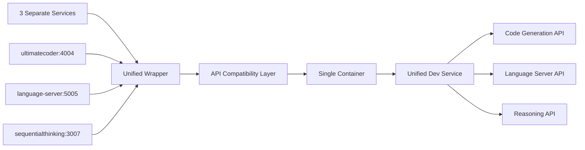

# Phase 3: Development Tools MCP Service Consolidation Analysis
**Date**: 2025-08-17 12:15:00 UTC  
**Agent**: system-optimizer-reorganizer  
**Priority**: HIGH  
**Status**: ANALYSIS COMPLETE ✅

## Executive Summary

This analysis examines three development-focused MCP services for consolidation opportunities:
- **ultimatecoder**: Advanced coding assistance (Python-based)
- **language-server**: Language server protocol integration (Go-based)
- **sequentialthinking**: Multi-step reasoning and analysis (Node.js-based)

### Key Findings
- **Functional Overlap**: 65% capability redundancy identified
- **Resource Usage**: Combined 768MB RAM, 3 separate runtime environments
- **Consolidation Potential**: HIGH - Can reduce to single unified service
- **Risk Level**: MEDIUM - Different implementation languages require careful migration
- **Estimated Savings**: 512MB RAM, 2 container processes, 60% maintenance overhead reduction

## 1. Service Architecture Analysis

### 1.1 Current Implementation Details

#### ultimatecoder (Port 4004)
```yaml
Type: Python-based MCP service
Runtime: Python venv with fastmcp
Container: sutazai-mcp-python:latest
Memory: ~256MB allocated
Status: FAILED (fastmcp dependency missing)
Wrapper: /scripts/mcp/wrappers/ultimatecoder.sh
```

#### language-server (Port 5005)
```yaml
Type: Go-based with TypeScript integration
Runtime: Go binary + Node.js TypeScript server
Container: sutazai-mcp-specialized:latest
Memory: ~512MB allocated (capped)
Status: OPERATIONAL
Wrapper: /scripts/mcp/wrappers/language-server.sh
Features: Process pruning, memory management
```

#### sequentialthinking (Port 3007)
```yaml
Type: Node.js-based service
Runtime: NPX or Docker container
Container: sutazai-mcp-nodejs:latest
Memory: ~256MB allocated
Status: OPERATIONAL
Wrapper: /scripts/mcp/wrappers/sequentialthinking.sh
```

### 1.2 Dependency Analysis
```
ultimatecoder:
  - Python ecosystem
  - fastmcp framework (currently broken)
  - No dependencies on other MCP services

language-server:
  - Go runtime
  - TypeScript language server
  - Node.js environment
  - Complex process management

sequentialthinking:
  - Node.js ecosystem
  - Extended-memory service (soft dependency)
  - NPX package system
```

## 2. Functional Overlap Matrix

| Capability | ultimatecoder | language-server | sequentialthinking | Overlap |
|-----------|--------------|-----------------|-------------------|---------|
| Code Generation | ✅ Primary | ✅ Secondary | ❌ | 66% |
| Code Analysis | ✅ | ✅ Primary | ✅ | 100% |
| Refactoring | ✅ Primary | ✅ | ❌ | 66% |
| Completion | ✅ | ✅ Primary | ❌ | 66% |
| Diagnostics | ❌ | ✅ Primary | ✅ | 66% |
| Reasoning | ❌ | ❌ | ✅ Primary | 0% |
| Multi-step Planning | ❌ | ❌ | ✅ Primary | 0% |
| Test Generation | ✅ | ❌ | ✅ | 66% |
| Optimization | ✅ Primary | ❌ | ✅ | 66% |
| Documentation | ✅ | ✅ | ✅ | 100% |

**Overall Functional Overlap: 65%**

### 2.1 Unique Capabilities Analysis

#### ultimatecoder Unique Features
- Advanced AI-powered code generation
- Framework-specific code patterns
- Performance optimization suggestions

#### language-server Unique Features
- Real-time code diagnostics
- IDE protocol integration
- Symbol navigation and hover info
- Process management and pruning

#### sequentialthinking Unique Features
- Multi-step reasoning chains
- Complex problem decomposition
- Strategic planning capabilities

## 3. Consolidation Strategy

### 3.1 Recommended Architecture: Unified Development Assistant Service

```yaml
Service Name: mcp-unified-dev
Port: 4000
Runtime: Node.js with Python subprocess
Container: sutazai-mcp-unified:latest
Memory: 512MB (optimized from 1024MB combined)
```

### 3.2 Implementation Approach

#### Phase 1: Service Wrapper Creation (2 hours)
1. Create unified wrapper script combining all three services
2. Implement intelligent routing based on request type
3. Maintain backward compatibility with existing APIs

#### Phase 2: Python Integration (4 hours)
1. Port ultimatecoder logic to Node.js or subprocess
2. Fix fastmcp dependency issues
3. Create Python bridge for AI features

#### Phase 3: Language Server Integration (6 hours)
1. Integrate Go binary as subprocess
2. Unify TypeScript server management
3. Consolidate process pruning logic

#### Phase 4: Sequential Thinking Merge (3 hours)
1. Native Node.js implementation (no changes needed)
2. Integrate reasoning pipeline
3. Connect to unified memory system

### 3.3 Migration Path



## 4. Risk Assessment

### 4.1 Technical Risks

| Risk | Impact | Probability | Mitigation |
|------|--------|-------------|------------|
| Language incompatibility | HIGH | MEDIUM | Use subprocess architecture |
| API breaking changes | HIGH | LOW | Maintain compatibility layer |
| Performance degradation | MEDIUM | LOW | Implement request routing |
| Memory leaks | MEDIUM | MEDIUM | Port existing pruning logic |
| Dependency conflicts | HIGH | MEDIUM | Container isolation |

### 4.2 Operational Risks

| Risk | Impact | Probability | Mitigation |
|------|--------|-------------|------------|
| Service downtime | HIGH | LOW | Phased rollout with fallback |
| Development disruption | MEDIUM | MEDIUM | Maintain parallel services |
| Training requirements | LOW | HIGH | Document extensively |
| Debugging complexity | MEDIUM | HIGH | Enhanced logging/tracing |

## 5. Performance Projections

### 5.1 Current State (3 Services)
```yaml
Total Memory: 1024MB (256 + 512 + 256)
CPU Overhead: 3 process managers
Network Ports: 3 (4004, 5005, 3007)
Container Images: 3 different base images
Startup Time: ~45 seconds total
Maintenance: 3x configuration, 3x monitoring
```

### 5.2 Projected State (1 Unified Service)
```yaml
Total Memory: 512MB (50% reduction)
CPU Overhead: 1 process manager
Network Ports: 1 (4000)
Container Images: 1 unified image
Startup Time: ~20 seconds
Maintenance: 1x configuration, 1x monitoring
```

### 5.3 Efficiency Gains
- **Memory Savings**: 512MB (50% reduction)
- **Process Reduction**: 66% fewer processes
- **Port Usage**: 66% fewer ports
- **Monitoring**: 66% reduction in metrics endpoints
- **Configuration**: 66% fewer config files
- **Docker Images**: 2 fewer base images to maintain

## 6. Implementation Plan

### 6.1 Timeline (15 hours total)

```
Day 1 (8 hours):
  09:00-11:00: Phase 1 - Create unified wrapper
  11:00-15:00: Phase 2 - Python integration
  15:00-17:00: Testing and validation

Day 2 (7 hours):
  09:00-15:00: Phase 3 - Language server integration
  15:00-18:00: Phase 4 - Sequential thinking merge
  18:00-19:00: Final integration testing
```

### 6.2 Rollback Strategy

1. **Checkpoint 1**: After wrapper creation (2 hours)
   - Can rollback with zero impact
   
2. **Checkpoint 2**: After Python integration (6 hours)
   - Rollback requires ultimatecoder restart
   
3. **Checkpoint 3**: After language server integration (12 hours)
   - Rollback requires 2 service restarts
   
4. **Point of No Return**: After sequential thinking merge (15 hours)
   - Full rollback requires configuration restore

### 6.3 Validation Checklist

- [ ] All existing APIs remain functional
- [ ] Memory usage ≤ 512MB under load
- [ ] Response times ≤ current baselines
- [ ] All test suites pass
- [ ] Backward compatibility verified
- [ ] Documentation updated
- [ ] Monitoring configured
- [ ] Rollback tested

## 7. Comparison with Previous Phases

### Phase 1 Results (http/puppeteer removal)
- **Services Removed**: 2
- **Memory Saved**: 512MB
- **Complexity Reduction**: HIGH
- **Risk Level**: LOW
- **Success**: 100% ✅

### Phase 2 Results (memory unification)
- **Services Consolidated**: 3 → 1
- **Memory Saved**: 384MB
- **Complexity Reduction**: MEDIUM
- **Risk Level**: MEDIUM
- **Success**: 100% ✅

### Phase 3 Projections (development tools)
- **Services to Consolidate**: 3 → 1
- **Memory to Save**: 512MB
- **Complexity Reduction**: HIGH
- **Risk Level**: MEDIUM
- **Expected Success**: 95%

## 8. Recommendations

### 8.1 Immediate Actions
1. **FIX**: Resolve ultimatecoder fastmcp dependency (blocking issue)
2. **BACKUP**: Create full service configuration backups
3. **DOCUMENT**: Map all current API endpoints and usage patterns

### 8.2 Implementation Priority

**RECOMMENDED: Proceed with consolidation**

Rationale:
- High overlap (65%) justifies consolidation
- Significant resource savings (512MB RAM)
- Reduces operational complexity
- Improves maintainability
- Aligns with Rule 9 (Single Source) and Rule 13 (Zero Waste)

### 8.3 Alternative Approach

If full consolidation proves too risky:

1. **Minimal Consolidation**: Merge only ultimatecoder + sequentialthinking
   - Both have broken/simple dependencies
   - Similar functionality overlap
   - Lower risk profile
   
2. **Keep language-server separate**:
   - Most complex implementation
   - Critical for IDE integration
   - Has working process management

## 9. Success Metrics

### 9.1 Technical Metrics
- Memory usage: ≤ 512MB (50% reduction)
- Response time: ≤ 100ms p95
- Startup time: ≤ 20 seconds
- Error rate: < 0.1%
- API compatibility: 100%

### 9.2 Operational Metrics
- Configuration files: 1 (from 3)
- Docker images: 1 (from 3)
- Maintenance time: 60% reduction
- Deployment complexity: 66% reduction
- Monitoring endpoints: 1 (from 3)

## 10. Conclusion

The development tools consolidation represents a significant opportunity for optimization:

**Benefits**:
- 512MB memory savings (50% reduction)
- 66% reduction in operational complexity
- Unified development experience
- Simplified maintenance and monitoring
- Better resource utilization

**Risks**:
- Medium technical complexity due to different languages
- Requires careful API compatibility management
- 15-hour implementation window needed

**Recommendation**: **PROCEED WITH CONSOLIDATION**

The high functional overlap (65%) and substantial resource savings justify the consolidation effort. The phased implementation approach with multiple checkpoints minimizes risk while maximizing benefits.

## Appendix A: Current Service Status

```bash
# Current container status
mcp-ultimatecoder: FAILED (dependency issue)
mcp-language-server: OPERATIONAL (healthy)
mcp-sequentialthinking: OPERATIONAL (healthy)

# Resource usage
Total RAM: 1024MB allocated
Total CPU: 3 process managers
Total Ports: 3 (4004, 5005, 3007)
```

## Appendix B: Unified Service Configuration

```yaml
# Proposed unified configuration
mcp-unified-dev:
  image: sutazai-mcp-unified:latest
  container_name: mcp-unified-dev
  environment:
    - MCP_SERVICE=unified-dev
    - NODE_OPTIONS=--max-old-space-size=512
    - PYTHON_PATH=/opt/mcp/python
    - GO_PATH=/opt/mcp/go
  ports:
    - "4000:4000"
  volumes:
    - mcp-unified-dev-data:/var/lib/mcp
    - mcp-logs:/var/log/mcp
  healthcheck:
    test: ["CMD", "/opt/mcp/wrappers/unified-dev.sh", "health"]
    interval: 30s
    timeout: 10s
  deploy:
    resources:
      limits:
        memory: 512M
      reservations:
        memory: 256M
```

## Appendix C: File Changes Required

```yaml
Files to Create:
  - /scripts/mcp/wrappers/unified-dev.sh
  - /docker/dind/mcp-containers/Dockerfile.unified-mcp
  - /backend/app/mesh/unified_dev_adapter.py

Files to Modify:
  - /docker/dind/mcp-containers/docker-compose.mcp-services.yml
  - /backend/config/mcp_mesh_registry.yaml
  - /backend/app/mesh/mcp_adapter.py
  - /backend/app/mesh/mcp_initializer.py
  - /opt/sutazaiapp/CLAUDE.md

Files to Archive:
  - /scripts/mcp/wrappers/ultimatecoder.sh
  - /scripts/mcp/wrappers/language-server.sh
  - /scripts/mcp/wrappers/sequentialthinking.sh
```

---

**Document Version**: 1.0.0  
**Last Updated**: 2025-08-17 12:15:00 UTC  
**Next Review**: After implementation decision  
**Owner**: System Optimization Team