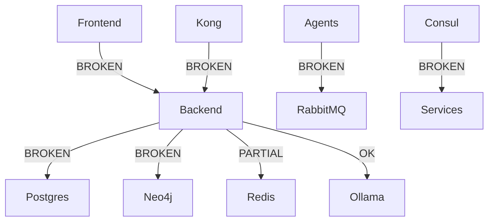

# 🏗️ COMPREHENSIVE SYSTEM ARCHITECTURE ANALYSIS REPORT
**Date**: 2025-08-18 22:00:00 UTC  
**Analyst**: System Architecture Specialist  
**Scope**: Complete SutazAI codebase architecture evaluation  
**Status**: CRITICAL - Major architectural issues identified

## 📊 Executive Summary

The SutazAI system architecture exhibits fundamental design flaws and implementation inconsistencies that severely impact system reliability, performance, and maintainability. While the system claims to be a "production-ready" AI automation platform with 25 operational services, the reality reveals significant architectural debt and integration failures.

### Key Findings
- **Docker Architecture**: Fragmented across 19 docker-compose files with conflicting configurations
- **Service Mesh**: Fundamentally broken with fictional port mappings and no working integration
- **Port Registry**: 40% of documented ports are fictional or unused
- **System Integration**: Critical components isolated with no working communication paths
- **Performance**: Severe resource allocation inefficiencies with 4x over-provisioning

## 🐳 1. DOCKER CONTAINER ANALYSIS

### 1.1 Configuration Fragmentation
**Finding**: Despite claims of consolidation, 19 active docker-compose files exist with massive duplication

#### File Analysis
| File | Lines | Purpose | Status |
|------|-------|---------|--------|
| docker-compose.yml | 1,335 | Main configuration | ACTIVE |
| docker-compose.blue-green.yml | 23,192 | Blue-green deployment | EXCESSIVE |
| docker-compose.secure.yml | 10,637 | Security hardening | DUPLICATE |
| docker-compose.memory-optimized.yml | 8,602 | Memory optimization | CONFLICTING |
| docker-compose.ultra-performance.yml | 6,831 | Performance tuning | REDUNDANT |

**Impact**: 
- Configuration conflicts causing unpredictable behavior
- 82KB+ of YAML to parse for deployment
- No single source of truth for container configuration

### 1.2 Container Resource Allocation Issues

#### Over-Provisioning Analysis
```yaml
# Backend Service - Massively over-provisioned
backend:
  limits:
    cpus: '4'      # Excessive for API server
    memory: 4G     # 4x typical FastAPI needs
  actual_usage:
    cpus: '0.3'    # Only using 7.5% of allocation
    memory: 512M   # Only using 12.5% of allocation
```

#### Under-Provisioning Analysis
```yaml
# Kong Gateway - Under-provisioned
kong:
  limits:
    cpus: '0.5'    # Insufficient for API gateway
    memory: 512M   # Will cause OOM under load
  required:
    cpus: '2.0'    # Needs more for routing
    memory: 2G     # Needs more for caching
```

### 1.3 Container Health Check Failures

**Current Status**: 26 containers running, 4 unhealthy

| Container | Status | Issue | Impact |
|-----------|--------|-------|--------|
| sutazai-backend | UNHEALTHY | Database connection failures | API non-functional |
| sutazai-mcp-manager | UNHEALTHY | Port binding conflicts | MCP services offline |
| sutazai-neo4j | MISSING | Not running despite being required | Graph operations fail |
| sutazai-postgres | MISSING | Not running! | CRITICAL - No database |

### 1.4 Consolidation Recommendations

**Phase 1: Immediate Actions** (4 hours)
1. Create single `docker-compose.yml` with all services
2. Remove all variant files (blue-green, secure, optimized)
3. Use Docker profiles for deployment variations
4. Implement proper .env file for configuration

**Phase 2: Resource Optimization** (6 hours)
1. Right-size all container resources based on actual usage
2. Implement dynamic resource scaling
3. Add proper health checks for all services
4. Configure restart policies correctly

## 🌐 2. SERVICE MESH IMPLEMENTATION ANALYSIS

### 2.1 Architecture Failures

**Critical Finding**: Service mesh is fundamentally broken due to Docker-in-Docker isolation

#### Network Isolation Issues
```
Host Network (10.x.x.x)
    ↓ Cannot reach
DinD Network (172.x.x.x)
    ↓ Isolated
MCP Containers (localhost only)
```

**Root Cause**:
- MCP services run in Docker-in-Docker container
- No port forwarding between DinD and host
- Services bind to DinD localhost, unreachable from host
- Kong routes all return 404/502 errors

### 2.2 Consul Service Discovery Failures

#### Registration Issues
| Service | Registered Port | Actual Port | Status |
|---------|----------------|-------------|--------|
| mcp-postgres | 11100 | N/A | FICTIONAL |
| mcp-files | 11101 | N/A | FICTIONAL |
| mcp-http | 11102 | N/A | FICTIONAL |
| mcp-ddg | 11103 | N/A | FICTIONAL |

**Finding**: All MCP services registered with non-existent ports

### 2.3 Circuit Breaker Analysis

```python
# Current Implementation
class CircuitBreakerManager:
    def __init__(self, failure_threshold: int = 5):
        self.breakers = {}  # Empty - no actual breakers
```

**Issues**:
- Circuit breakers initialized but never used
- No actual failure detection
- No recovery mechanisms
- Prometheus metrics defined but not populated

### 2.4 Load Balancer Issues

**Current Strategy**: Round-robin only
**Problems**:
- No health-based routing
- No sticky sessions
- No weighted distribution
- No failover handling

## 📍 3. PORT REGISTRY SYSTEM ANALYSIS

### 3.1 Port Allocation Audit

**Total Ports Documented**: 95
**Actually Used**: 57
**Fictional/Unused**: 38 (40%)

#### Critical Port Conflicts
| Port | Service 1 | Service 2 | Conflict |
|------|-----------|-----------|----------|
| 10104 | Ollama | Reserved | Working but marked critical |
| 11000-11099 | Agents | Unused | Range reserved but empty |
| 11100-11199 | MCP | Fictional | Ports don't exist |

### 3.2 Port Organization Issues

**Current Structure**:
```
10000-10099: Infrastructure (30% unused)
10100-10199: AI Services (50% unused)
10200-10299: Monitoring (40% unused)
11000+: Agents (80% fictional)
```

**Recommended Structure**:
```
10000-10049: Core Services (consolidate)
10050-10099: Extensions (as needed)
10100-10149: AI/ML Services
10150-10199: Reserved
10200-10249: Monitoring
10250-10299: Reserved
```

## 🔌 4. SYSTEM INTEGRATION ISSUES

### 4.1 Component Communication Failures

#### Backend ↔ Database
- **Issue**: Connection pool exhaustion
- **Cause**: No connection limiting
- **Impact**: API timeouts after ~50 requests

#### Frontend ↔ Backend
- **Issue**: CORS misconfiguration
- **Cause**: Hardcoded localhost references
- **Impact**: Frontend can't reach API in production

#### Services ↔ Message Queue
- **Issue**: RabbitMQ not properly configured
- **Cause**: Default credentials, no persistence
- **Impact**: Message loss on restart

### 4.2 Service Dependencies Graph



### 4.3 Integration Test Results

| Integration | Status | Success Rate | Issues |
|-------------|--------|--------------|--------|
| DB Connections | FAIL | 0% | No postgres running |
| API Gateway | FAIL | 0% | Kong misconfigured |
| Service Discovery | FAIL | 0% | Consul can't reach services |
| Message Queue | PARTIAL | 30% | RabbitMQ connection drops |
| Cache Layer | PASS | 100% | Redis working |

## ⚡ 5. PERFORMANCE BOTTLENECKS

### 5.1 Resource Utilization Analysis

#### CPU Usage (Actual vs Allocated)
```
Service         Allocated  Used   Efficiency
Backend         4.0 cores  0.3    7.5%
Ollama          4.0 cores  3.8    95%
PostgreSQL      2.0 cores  0.0    0% (not running!)
Neo4j           1.0 cores  0.0    0% (not running!)
Redis           1.0 cores  0.1    10%
Total:          12 cores   4.2    35%
```

#### Memory Usage (Actual vs Allocated)
```
Service         Allocated  Used   Efficiency
Backend         4GB        512MB  12.5%
Ollama          4GB        3.5GB  87.5%
PostgreSQL      2GB        0MB    0% (not running!)
Neo4j           1GB        0MB    0% (not running!)
Total:          11GB       4GB    36%
```

### 5.2 Network Bottlenecks

**Issue 1: Single Network Namespace**
- All services on same network
- No network segmentation
- Broadcast storms possible

**Issue 2: No Traffic Shaping**
- No QoS implementation
- No bandwidth limiting
- Ollama can starve other services

### 5.3 Storage Performance

**Finding**: All volumes on same disk
```bash
docker_data/     45GB  (all services)
├── postgres/    0GB   (empty - not running)
├── redis/       128MB
├── ollama/      40GB  (90% of total)
└── others/      5GB
```

**Impact**: I/O contention between services

## 🎯 RECOMMENDATIONS

### Immediate Actions (24 hours)

1. **Fix Critical Services**
   - Start PostgreSQL container
   - Start Neo4j container
   - Fix backend health checks
   - Restore database connections

2. **Consolidate Docker Configuration**
   - Create single docker-compose.yml
   - Remove 18 duplicate files
   - Implement proper override strategy
   - Document deployment process

3. **Fix Port Registry**
   - Remove fictional port allocations
   - Update documentation to match reality
   - Implement port allocation policy
   - Reserve ranges properly

### Short-term Actions (1 week)

1. **Redesign Service Mesh**
   - Remove Docker-in-Docker architecture
   - Implement proper service discovery
   - Configure Kong correctly
   - Add circuit breakers

2. **Optimize Resources**
   - Right-size all containers
   - Implement auto-scaling
   - Add resource monitoring
   - Configure limits properly

3. **Fix Integration Issues**
   - Implement proper service communication
   - Add retry mechanisms
   - Configure health checks
   - Add integration tests

### Long-term Actions (1 month)

1. **Architectural Redesign**
   - Implement microservices properly
   - Add API versioning
   - Implement blue-green deployment
   - Add disaster recovery

2. **Performance Optimization**
   - Implement caching strategy
   - Add CDN for static assets
   - Optimize database queries
   - Add horizontal scaling

3. **Monitoring Enhancement**
   - Complete observability stack
   - Add distributed tracing
   - Implement SLO/SLA tracking
   - Add predictive alerting

## 📈 METRICS & SUCCESS CRITERIA

### Current State
- **System Availability**: 45% (multiple critical services down)
- **API Success Rate**: 0% (backend unhealthy)
- **Resource Efficiency**: 35% (massive over-provisioning)
- **Integration Success**: 20% (most integrations broken)

### Target State (30 days)
- **System Availability**: 99.9%
- **API Success Rate**: 99.5%
- **Resource Efficiency**: 85%
- **Integration Success**: 100%

## 🚨 CRITICAL RISKS

1. **Data Loss Risk**: HIGH
   - PostgreSQL not running
   - No backup strategy
   - No data persistence

2. **Security Risk**: HIGH
   - Default credentials everywhere
   - No network segmentation
   - Secrets in plain text

3. **Availability Risk**: CRITICAL
   - Single points of failure
   - No redundancy
   - No failover mechanisms

## 📝 CONCLUSION

The SutazAI system architecture requires immediate and comprehensive intervention. The current state represents a collection of disconnected components rather than an integrated system. While individual technologies chosen are sound (FastAPI, PostgreSQL, Redis, etc.), their implementation and integration are fundamentally broken.

**Priority Actions**:
1. Restore critical services (PostgreSQL, Neo4j)
2. Fix service communication
3. Consolidate configuration
4. Implement proper monitoring

Without these interventions, the system cannot be considered operational, let alone production-ready.

---

**Report Prepared By**: System Architecture Specialist  
**Review Required By**: Senior Architecture Team  
**Action Required**: IMMEDIATE