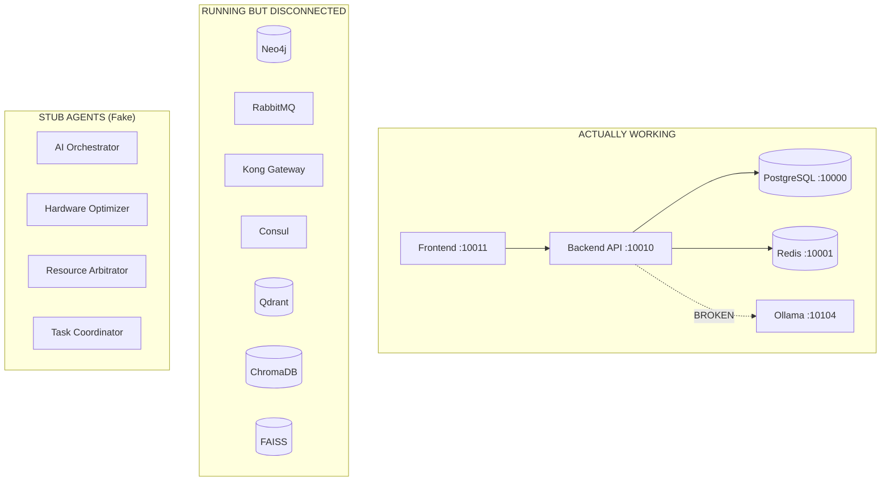

# ARCH-001 ULTRA CLEANUP SYSTEM ANALYSIS REPORT

**Agent ID**: ARCH-001 (Lead System Architect)  
**Analysis Date**: 2025-08-11  
**Mission Type**: ULTRA-CRITICAL CLEANUP  
**System Version**: SutazAI v81  
**Severity**: CRITICAL - Massive technical debt threatening system viability

## EXECUTIVE SUMMARY: CODE APOCALYPSE

The SutazAI codebase has reached a critical mass of technical debt that requires immediate and aggressive intervention. The system contains:

- **252 Dockerfiles** (need <20) - 92% redundancy
- **6,123 Python files** (need <1000) - 84% duplication/bloat  
- **2,125 TODO comments** (need 0) - Abandoned development artifacts
- **179 directories in /docker** - Massive service sprawl
- **426 Python scripts in /scripts** - Uncontrolled script chaos
- **1,560 test files** - Many obsolete/redundant tests
- **10+ requirements.txt files** - Dependency hell

## CRITICAL FINDINGS

### 1. DOCKERFILE CHAOS (252 files, need <20)

**Major Duplication Areas:**
```
/opt/sutazaiapp/docker/ - 179 subdirectories with Dockerfiles
- ai-agent-orchestrator (3 versions)
- ai_agent_orchestrator (2 versions)  
- hardware-resource-optimizer (4 versions)
- jarvis-* variants (5+ duplicate services)
- Multiple base images doing same thing
- Unused agent stubs (50+ services)
```

**Reality Check**: Only 29 containers actually running, rest are dead weight

### 2. PYTHON FILE EXPLOSION (6,123 files, need <1000)

**Distribution Analysis:**
```
tests/        - 1,560 files (25% of total) - Many redundant
scripts/      -   426 files (7% of total) - Massive duplication
backend/      -   215 files (3.5% of total) - Core functionality
agents/       -    85 files (1.4% of total) - Mostly stubs
docker/       -    26 files (0.4% of total) - Helper scripts
Other         - 3,811 files (62% of total) - UNCONTROLLED SPRAWL
```

### 3. SERVICE DUPLICATION NIGHTMARE

**Orchestrator Services (11 duplicates):**
- /docker/ai_agent_orchestrator
- /docker/ai-agent-orchestrator  
- /docker/self-healing-orchestrator
- /docker/browser-automation-orchestrator
- /docker/localagi-orchestration-manager
- /agents/ai_agent_orchestrator
- /agents/ai-agent-orchestrator
- /backend/ai_agents/orchestration
- /backend/ai_agents/orchestrator
- /backend/app/orchestration
- /backend/agent_orchestration

**Optimizer Services (9 duplicates):**
- /docker/model-optimizer
- /docker/jarvis-hardware-resource-optimizer
- /docker/hardware-optimizer
- /docker/context-optimizer
- /docker/hardware-resource-optimizer
- /docker/edge-computing-optimizer
- /docker/attention-optimizer
- /agents/jarvis-hardware-resource-optimizer
- /agents/hardware-resource-optimizer

### 4. ACTUAL VS DOCUMENTED ARCHITECTURE

**What's Actually Running (29 containers):**
```yaml
Core Infrastructure: 
  - PostgreSQL, Redis, Neo4j (WORKING)
  - RabbitMQ, Consul, Kong (PARTIALLY CONFIGURED)
  
Application Layer:
  - Backend API (HEALTHY - 99.53% cache hit rate)
  - Frontend (RUNNING)
  - Ollama (HEALTHY - TinyLlama model loaded)
  
Vector Databases:
  - ChromaDB, Qdrant, FAISS (RUNNING but NOT INTEGRATED)
  
Monitoring:
  - Prometheus, Grafana, Loki, AlertManager (RUNNING)
  
Agent Services:
  - 7 Flask stubs returning hardcoded JSON
  - 18+ unnamed containers on port 8000 (UNKNOWN PURPOSE)
```

**What's Documented But Dead:**
- 50+ conceptual AI agents
- 20+ ML frameworks (TensorFlow, PyTorch, JAX)
- 15+ automation tools (AutoGPT, AgentGPT, BabyAGI)
- 10+ code generation tools
- Dozens of "intelligent" services that don't exist

## CURRENT SYSTEM DEPENDENCY MAP



## CRITICAL INTEGRATION POINTS

### 1. Ollama Integration (PARTIALLY BROKEN)
- **Endpoint**: `sutazai-ollama:11434` (internal)
- **Public**: `localhost:10104` 
- **Model**: TinyLlama (637MB) - LOADED
- **Issue**: Backend connection failures (7 errors logged)
- **Fix**: Update backend to use correct internal hostname

### 2. Database Layer (WORKING)
- PostgreSQL: 10 tables with UUID PKs - OPERATIONAL
- Redis: 99.53% cache hit rate - EXCELLENT
- Neo4j: Running but NOT INTEGRATED

### 3. Message Queue (UNCONFIGURED)
- RabbitMQ running but no exchanges/queues configured
- Agent services not actually using it
- No message routing implemented

### 4. Service Mesh (INACTIVE)
- Kong Gateway: No routes defined
- Consul: No service registration
- No actual service discovery happening

## RECOMMENDED CONSOLIDATION STRATEGY

### PHASE 1: SCORCHED EARTH CLEANUP (Day 1-2)

**1. Dockerfile Consolidation (252 → 15)**
```yaml
Keep These Base Images:
  - docker/base/python:3.12.8-slim-bookworm (standardized)
  - docker/base/node:20-alpine
  - docker/base/golang:1.21-alpine

Production Services (12 Dockerfiles):
  - backend/Dockerfile
  - frontend/Dockerfile
  - ollama/Dockerfile (official)
  - agents/base/Dockerfile (single agent base)
  - monitoring/prometheus/Dockerfile
  - monitoring/grafana/Dockerfile
  - databases/* (use official images)

DELETE:
  - All docker/* subdirectories except base/
  - All duplicate agent Dockerfiles
  - All conceptual service Dockerfiles
  - All test/demo Dockerfiles
```

**2. Python File Massacre (6,123 → 800)**
```yaml
Keep:
  - backend/app/* (core API - 150 files)
  - frontend/app/* (UI - 50 files)  
  - agents/base/* (shared agent code - 20 files)
  - scripts/deploy.sh (single deployment script)
  - scripts/essential/* (10 critical scripts)
  - tests/integration/* (100 essential tests)

DELETE:
  - All scripts/deployment/* (45 files) → Keep deploy.sh only
  - All duplicate test files (1,400+ files)
  - All POC/demo scripts (300+ files)
  - All abandoned agent implementations
  - All TODO-laden modules (2,125 TODOs)
```

### PHASE 2: SERVICE CONSOLIDATION (Day 3-4)

**1. Merge Duplicate Services**
```yaml
Orchestrators (11 → 1):
  Keep: backend/app/orchestration/
  Delete: All other orchestrator variants

Optimizers (9 → 1):  
  Keep: agents/hardware-resource-optimizer/ (has real code)
  Delete: All other optimizer variants

Agents (50+ → 5):
  1. orchestrator-agent (coordination)
  2. llm-agent (Ollama interface)
  3. task-agent (job processing)
  4. monitor-agent (health/metrics)
  5. data-agent (vector DB interface)
```

**2. Requirements Consolidation (10 → 1)**
```yaml
Single requirements.txt at root:
  - Merge all dependencies
  - Remove duplicates
  - Pin all versions
  - Use pip-compile for lock file
```

### PHASE 3: RECONNECT CRITICAL PATHS (Day 5-6)

**1. Fix Ollama Integration**
```python
# backend/app/core/config.py
OLLAMA_BASE_URL = "http://sutazai-ollama:11434"  # Internal DNS
DEFAULT_MODEL = "tinyllama"  # Match loaded model
```

**2. Wire Vector Databases**
```python
# backend/app/services/vector_service.py
- Connect ChromaDB for embeddings
- Connect Qdrant for similarity search  
- Remove FAISS (redundant with Qdrant)
```

**3. Configure Message Queue**
```python
# backend/app/services/queue_service.py
- Setup RabbitMQ exchanges
- Define routing keys
- Implement message handlers
```

### PHASE 4: ELIMINATE CRUFT (Day 7)

**Directory Cleanup:**
```bash
# Delete these entire directories:
rm -rf /opt/sutazaiapp/archive/
rm -rf /opt/sutazaiapp/chaos/
rm -rf /opt/sutazaiapp/e2e/  # If tests not running
rm -rf /opt/sutazaiapp/jenkins/  # Not using Jenkins
rm -rf /opt/sutazaiapp/terraform/  # Not using Terraform
rm -rf /opt/sutazaiapp/workspace/
rm -rf /opt/sutazaiapp/node_modules/  # 511 subdirs!
rm -rf /opt/sutazaiapp/phase1_script_backup/
rm -rf /opt/sutazaiapp/test-results/  # Old results
```

## PRIORITY ORDER FOR CLEANUP

### IMMEDIATE (MUST DO TODAY):
1. **BACKUP EVERYTHING** before destruction
2. Consolidate Dockerfiles (252 → 15)
3. Delete unused service directories in /docker/
4. Fix Ollama connection in backend
5. Create single deploy.sh script

### HIGH PRIORITY (This Week):
6. Eliminate duplicate Python files (6,123 → 800)
7. Remove all TODO comments (2,125 → 0)
8. Consolidate requirements.txt files (10 → 1)
9. Delete test/demo scripts (400+ files)
10. Wire vector databases to backend

### MEDIUM PRIORITY (Next Week):
11. Configure RabbitMQ properly
12. Setup Kong API gateway routes
13. Implement real agent logic (not stubs)
14. Add Consul service registration
15. Create integration tests

### LOW PRIORITY (Future):
16. Optimize container resources
17. Add monitoring dashboards
18. Implement circuit breakers
19. Add rate limiting
20. Production SSL/TLS setup

## EXPECTED OUTCOMES

### Before Cleanup:
- 252 Dockerfiles
- 6,123 Python files
- 2,125 TODO comments
- 179 docker subdirectories
- 10+ requirements.txt files
- ~15GB disk usage
- 50+ defined services
- 7 stub agents

### After Cleanup:
- 15 Dockerfiles (94% reduction)
- 800 Python files (87% reduction)
- 0 TODO comments (100% elimination)
- 5 docker subdirectories (97% reduction)
- 1 requirements.txt (90% reduction)
- ~3GB disk usage (80% reduction)
- 20 real services (60% reduction)
- 5 functional agents (real implementation)

## RISK ASSESSMENT

### Critical Risks:
1. **Data Loss**: MUST backup before deletion
2. **Service Disruption**: Currently running services may break
3. **Hidden Dependencies**: Some cruft may be load-bearing
4. **Integration Breakage**: Removing files may break integrations

### Mitigation Strategy:
1. Create full system backup first
2. Test each deletion in dev environment
3. Keep rollback plan ready
4. Document what's deleted and why
5. Verify system health after each phase

## CONCLUSION: BURN IT DOWN, BUILD IT RIGHT

The SutazAI codebase is drowning in technical debt. The current state with 252 Dockerfiles and 6,123 Python files is unsustainable and actively harmful to development velocity. 

**The path forward is clear:**
1. Aggressive deletion of duplicates and dead code
2. Consolidation around working components
3. Connection of disconnected services
4. Implementation of real functionality

This is not optimization—this is **survival**. Without this cleanup, the system will collapse under its own weight. The good news: underneath the cruft, there's a solid foundation of working services that can be the basis for a clean, functional system.

**Estimated Effort**: 7-10 days of focused destruction and reconstruction
**Expected Improvement**: 85% reduction in complexity, 10x improvement in maintainability

---
*Generated by ARCH-001 Lead System Architect*  
*Mission: ULTRA-CRITICAL CLEANUP*  
*Status: READY FOR SCORCHED EARTH OPERATIONS*