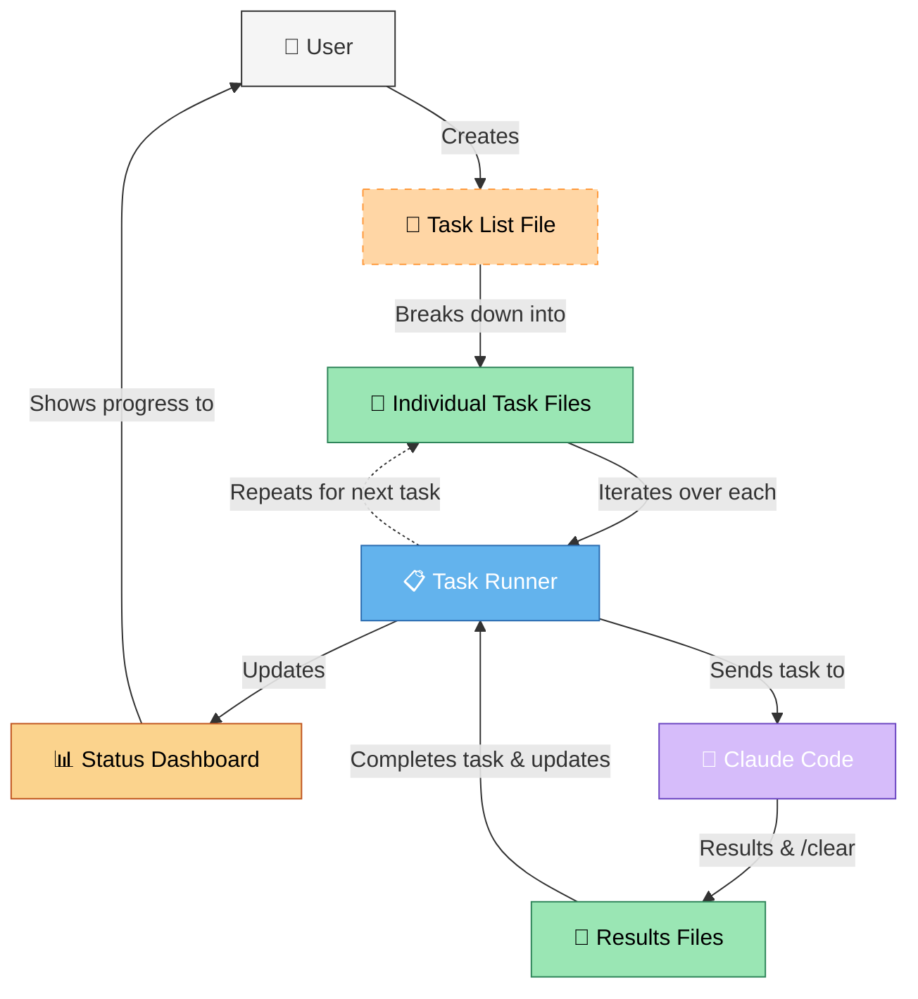
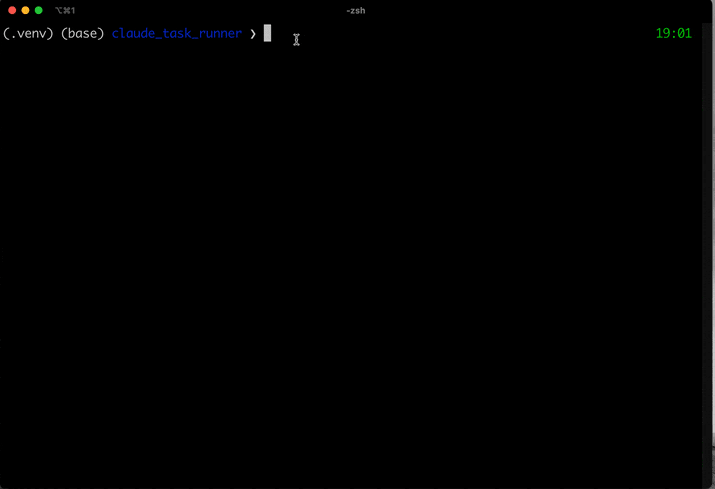

# Claude Task Runner

A specialized tool to manage context isolation and focused task execution with Claude Code, solving the critical challenge of context length limitations and task focus when working with Claude on complex, multi-step projects.

## What is Claude Task Runner?

Claude Task Runner solves a fundamental challenge when working with Large Language Models like Claude on complex projects: context length limitations and maintaining focus on the current task.

## The Problem

When working with Claude Code (or any LLM) on complex projects, you typically face several challenges:

- **Context Length Limitations**: Claude has a limited context window. Long, complex projects can exceed this limit.
- **Task Switching Confusion**: When handling multiple tasks in a single conversation, Claude may get confused about which task it's currently working on.
- **Project Organization**: Large projects need structure and organization to track progress.
- **Effective Prompting**: Each task requires specific, focused instructions to get optimal results.

## The Solution: Boomerang Mode

Claude Task Runner implements a "Boomerang" approach:

- **Task Breakdown**: It analyzes a large project specification and intelligently breaks it down into smaller, self-contained tasks.
- **Context Isolation**: Each task is executed in a clean context window, ensuring Claude focuses solely on that task.
- **Project Organization**: Tasks are organized into projects with proper sequencing and metadata.
- **Execution Management**: Tasks can be run individually or in sequence, with results captured and organized.

## Architecture

The Claude Task Runner uses a clean, modular architecture with real-time streaming output:



## Why Use Claude Task Runner?

- **Overcome Context Limitations**: Break down large projects into manageable chunks that fit within Claude's context window.
- **Maintain Focus**: Ensure Claude stays focused on the current task without being distracted by previous context.
- **Improve Quality**: Get better results by providing Claude with clear, focused instructions for each task.
- **Organize Complex Projects**: Manage multi-step projects with proper structure and sequencing.
- **Track Progress**: Monitor task completion and project status.
- **MCP Integration**: Seamlessly integrate with agent workflows through the Model Context Protocol.
- **Real-time Feedback**: Stream Claude's output in real-time for immediate visibility into progress.

## Demo



*Demonstration of Claude Task Runner processing a sequence of tasks with real-time output streaming*

## Prerequisites

This package requires the following to be installed on your system:

- **Claude Desktop** - You need to have Claude Desktop application installed
- **Claude Code** - The `claude` command-line tool must be accessible in your PATH
- **Desktop Commander** - Required for file system access (see installation instructions below)

### Installing Desktop Commander

Desktop Commander is a critical dependency that enables Claude to access your file system and execute commands. To install:

```bash
# Using npx (recommended)
npx @wonderwhy-er/desktop-commander@latest setup

# Or using Smithery
npx -y @smithery/cli install @wonderwhy-er/desktop-commander --client claude
```

After installation, restart Claude Desktop and ensure you see the hammer icon in the chat interface, indicating that Desktop Commander is properly connected.

## Core Features

- **Task Breakdown**: Parse complex projects into focused, self-contained tasks
- **Context Isolation**: Execute each task with a clean context window
- **Project Management**: Organize tasks into projects with proper metadata
- **Execution Control**: Run tasks individually or in sequence, with result management
- **Status Tracking**: Monitor project progress and task completion status
- **Modern CLI**: Intuitive command-line interface with rich formatting
- **Multiple Dashboard Options**: 
  - Modern Textual-based interactive dashboard UI with fixed header and scrolling output area
  - Real-time task status with color-coded indicators
  - Markdown rendering for Claude output with proper formatting
- **MCP Integration**: Seamless integration with agent workflows via FastMCP
- **Performance Optimization**: Shell redirection for fastest Claude execution
- **Real-time Streaming**: See Claude's output as it's being generated
- **Robust Error Handling**: Clear error messages and recovery options
- **Demo Mode**: Test workflow with simulated responses when Claude is unavailable

## Performance Optimization

The latest version of Claude Task Runner features significant performance improvements:

- **Shell Redirection**: Uses `< file > output` style redirection for optimal speed
- **Context Clearing**: Implements `/clear` between tasks for context isolation
- **Named Pipes**: Uses FIFO pipes for efficient streaming of Claude's output
- **Simplified Processing**: Streamlined execution flow without unnecessary overhead
- **Customizable Pooling**: Configure process pooling to balance performance and resource usage

## Textual Dashboard

The Textual dashboard provides a modern terminal user interface (TUI) with:

- **Fixed Task Status Panel**: A DataTable showing all tasks with their current status, progress, and timing information
- **Streaming Output Area**: A scrollable area showing Claude's output in real-time with markdown rendering
- **Keyboard Navigation**: Simple keyboard shortcuts (q to quit, etc.)
- **Color-Coded Status**: Visual indicators of task status (running, completed, failed, etc.)
- **Auto-Scrolling**: Output automatically scrolls to show the latest content
- **Responsive Layout**: Adapts to terminal size for optimal viewing

To use the Textual dashboard:

```bash
# Using the dedicated textual command (recommended)
python -m task_runner textual [path/to/task_list.md]

# Or using the run command with textual dashboard option
python -m task_runner run --textual-dashboard [path/to/task_list.md]

# Or using the convenience script
./run_textual.sh [path/to/task_list.md]
```

## Quick Start

### Installation

```bash
# Clone the repository
git clone https://github.com/grahama1970/claude_task_runner.git
cd claude_task_runner

# Create a virtual environment with uv
uv venv --python=3.10.11 .venv
source .venv/bin/activate  # On Windows: .venv\Scripts\activate

# Install the package
uv pip install -e .
```

The installation includes all required dependencies, including FastMCP for integration with Claude and other AI agents.

### Basic Usage

1. **Create a task list** (see `examples/sample_task_list.md` for a template)
2. **Create a project and parse tasks**:
   ```bash
   # Either using module syntax
   python -m task_runner.cli.app create my_project /path/to/task_list.md
   # Or using the installed script
   task-runner create my_project /path/to/task_list.md
   ```
3. **Run all tasks**:
   ```bash
   # Either using module syntax
   python -m task_runner.cli.app run --base-dir ~/claude_task_runner
   # Or using the installed script
   task-runner run --base-dir ~/claude_task_runner
   ```
4. **Check status**:
   ```bash
   # Either using module syntax
   python -m task_runner.cli.app status
   # Or using the installed script
   task-runner status
   ```

For more detailed instructions, see the [Quick Start Guide](docs/QUICKSTART.md).

## Command Line Interface

The CLI provides a comprehensive set of commands and options for managing Claude tasks:

### Creating Projects

```bash
# Using module syntax
python -m task_runner.cli.app create <project_name> <task_list_file>

# Using installed script
task-runner create <project_name> <task_list_file>
```

Parameters:
- `<project_name>`: Name of your project folder
- `<task_list_file>`: Path to your markdown file containing tasks

Example:
```bash
# Using module syntax
python -m task_runner.cli.app create my_project input/sample_tasks.md

# Using installed script
task-runner create my_project input/sample_tasks.md
```

### Running Tasks

```bash
# Using module syntax
python -m task_runner.cli.app run [options]

# Using installed script
task-runner run [options]

# Using the Textual dashboard
python -m task_runner.cli.app textual [options]
# Or
task-runner textual [options]

# Simpler option for Textual dashboard
./run_textual.sh [path/to/task_list.md]
```

Options:
- `--base-dir PATH`: Base directory for tasks and results (default: ~/claude_task_runner)
- `--claude-path PATH`: Path to Claude executable (auto-detected by default)
- `--timeout INT`: Timeout in seconds for each task (default: 300s)
- `--quick-demo`: Run with simulated responses (no Claude API usage)
- `--debug-claude`: Enable detailed Claude timing and debugging logs
- `--no-pool`: Disable process pooling (creates new process for each task)
- `--pool-size INT`: Maximum number of Claude processes in pool (default: 3)
- `--reuse-context`: Reuse Claude processes with /clear between tasks (default: True)
- `--no-streaming`: Disable real-time output streaming (uses simple file redirection)
- `--json`: Output results as JSON
- `--textual-dashboard`: Use the modern Textual-based dashboard UI
- `--use-dashboard`: Use the interactive Rich dashboard UI
- `--fixed-dashboard/--no-fixed-dashboard`: Enable/disable the fixed dashboard UI (enabled by default)

Example with Textual dashboard and debugging:
```bash
# Using module syntax
python -m task_runner.cli.app run input/sample_tasks.md --base-dir ./debug_project --textual-dashboard --debug-claude

# Using installed script
task-runner run input/sample_tasks.md --base-dir ./debug_project --textual-dashboard --debug-claude

# Using the dedicated Textual command (same effect, cleaner interface)
python -m task_runner.cli.app textual input/sample_tasks.md --base-dir ./debug_project --debug-claude

# Or simplest option with the convenience script
./run_textual.sh input/sample_tasks.md
```

Example with demo mode (no API usage):
```bash
# Using module syntax
python -m task_runner.cli.app run --base-dir ./debug_project --quick-demo

# Using installed script
task-runner run --base-dir ./debug_project --quick-demo
```

Example with simple file redirection (faster, but no real-time output):
```bash
# Using module syntax
python -m task_runner.cli.app run --base-dir ./debug_project --no-streaming

# Using installed script
task-runner run --base-dir ./debug_project --no-streaming
```

### Checking Status

```bash
# Using module syntax
python -m task_runner.cli.app status [--base-dir PATH] [--json]

# Using installed script
task-runner status [--base-dir PATH] [--json]
```

Options:
- `--base-dir PATH`: Base directory for tasks and results
- `--json`: Output status as JSON

Example:
```bash
# Using module syntax
python -m task_runner.cli.app status --base-dir ./debug_project

# Using installed script
task-runner status --base-dir ./debug_project
```

### Cleaning Up Processes

```bash
# Using module syntax
python -m task_runner.cli.app clean [--base-dir PATH]

# Using installed script
task-runner clean [--base-dir PATH]
```

Options:
- `--base-dir PATH`: Base directory for tasks and results

Example:
```bash
# Using module syntax
python -m task_runner.cli.app clean --base-dir ./debug_project

# Using installed script
task-runner clean --base-dir ./debug_project
```

## Python API

```python
from task_runner.core.task_manager import TaskManager
from pathlib import Path

# Initialize the task manager
manager = TaskManager(Path('~/claude_task_runner').expanduser())

# Parse a task list
task_files = manager.parse_task_list(Path('tasks.md'))

# Run all tasks
results = manager.run_all_tasks()

# Run all tasks in demo mode
results = manager.run_all_tasks(demo_mode=True)

# Get task status
status = manager.get_task_status()
```

## MCP Server

The Task Runner can be used as an MCP server, allowing it to be accessed by Claude and other AI agents:

```bash
# Start the server with default settings
# Using module syntax
python -m task_runner.mcp.server start
# Or using the installed script
task-runner-mcp start

# Start with custom settings
# Using module syntax
python -m task_runner.mcp.server start --host 0.0.0.0 --port 5000 --debug
# Or using the installed script
task-runner-mcp start --host 0.0.0.0 --port 5000 --debug

# Check server health
# Using module syntax
python -m task_runner.mcp.server health
# Or using the installed script
task-runner-mcp health

# Show server info
# Using module syntax
python -m task_runner.mcp.server info
# Or using the installed script
task-runner-mcp info

# Display server schema
# Using module syntax
python -m task_runner.mcp.server schema
# Or using the installed script
task-runner-mcp schema
```

The server exposes the following MCP functions:

- `run_task` - Run a single task with context isolation
- `run_all_tasks` - Run all tasks in a project
- `parse_task_list` - Break down a task list into individual task files
- `create_project` - Create a new project
- `get_task_status` - Get the status of all tasks
- `get_task_summary` - Get summary statistics of all tasks
- `clean` - Clean up any running processes

## Documentation

- [Quick Start Guide](docs/QUICKSTART.md)
- [Task Format Guide](docs/TASK_FORMAT.md)
- [Contributing Guide](CONTRIBUTING.md)

## Project Structure

```
claude_task_runner/
├── src/
│   └── task_runner/
│       ├── core/           # Core business logic
│       │   ├── task_manager.py
│       │   └── claude_streamer.py  # Real-time output streaming
│       ├── cli/            # CLI interface
│       │   ├── app.py      # Typer application with commands
│       │   ├── formatters.py # Rich-based output formatting
│       │   ├── validators.py # Input validation
│       │   └── schemas.py  # Data models and schemas
│       └── mcp/            # MCP integration
│           ├── schema.py   # MCP schema definitions
│           ├── wrapper.py  # FastMCP wrappers
│           └── mcp_server.py # MCP server implementation
├── scripts/                # Utility scripts
├── tests/                  # Test files
├── docs/                   # Documentation
├── examples/               # Example files
└── pyproject.toml          # Project configuration
```

## Development

```bash
# Set up development environment
make dev

# Run tests
make test

# Format code
make format

# Run linting checks
make lint

# Start MCP server
make mcp-server
```

See [CONTRIBUTING.md](CONTRIBUTING.md) for detailed development guidelines.

## Requirements

- Python 3.10+
- Claude Desktop with Desktop Commander enabled
- `claude` command-line tool accessible in your PATH
- `typer` and `rich` Python packages (automatically installed)
- `fastmcp` package (for MCP integration)

## License

This project is licensed under the MIT License - see the LICENSE file for details.