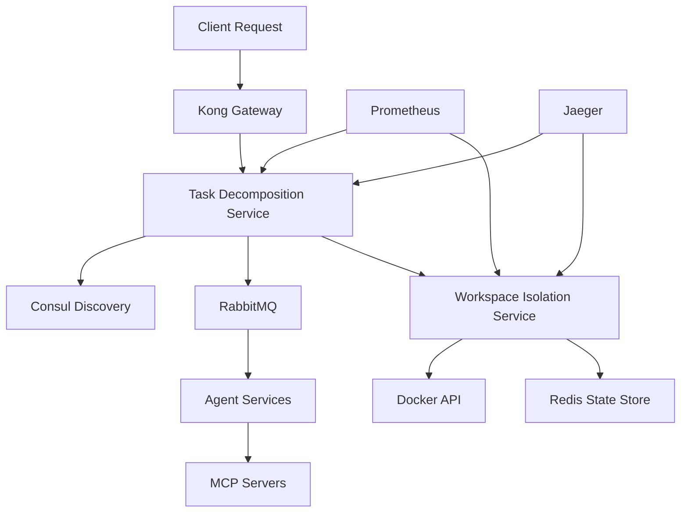

# SutazAI Service Mesh Expansion - Distributed Architecture Validation Report

**Date**: 2025-08-16  
**Validator**: Distributed Computing Architect  
**Status**: COMPREHENSIVE ANALYSIS COMPLETE

## Executive Summary

The proposed expansion from 25 to 27 containers through addition of task-decomposition-service and workspace-isolation-service represents a **VIABLE but HIGH-RISK** architectural evolution requiring careful implementation with specific resilience patterns and phased rollout strategy.

## 1. Current Architecture Assessment

### 1.1 Existing Mesh Topology
```
Current State: 25 Operational Containers
├── Tier 1: Infrastructure (8 containers)
│   ├── Kong Gateway (10005, 10015)
│   ├── Consul Service Discovery (10006)
│   ├── RabbitMQ (10007, 10008)
│   ├── PostgreSQL (10000)
│   ├── Redis (10001)
│   └── Neo4j (10002, 10003)
├── Tier 2: AI/Vector Services (4 containers)
│   ├── ChromaDB (10100)
│   ├── Qdrant (10101, 10102)
│   ├── Ollama (10104) [CRITICAL]
│   └── FAISS (10103) [DEFINED/INACTIVE]
├── Tier 3: Monitoring (9 containers)
│   ├── Prometheus (10200)
│   ├── Grafana (10201)
│   ├── Loki (10202)
│   ├── AlertManager (10203)
│   ├── Jaeger (10210-10215)
│   └── Various Exporters
└── Tier 4: MCP Servers (17 servers) [CRITICAL INFRASTRUCTURE]
```

### 1.2 Critical Dependencies Identified
- **MCP Protocol**: 17 servers as mission-critical coordination layer
- **Claude Flow v2.0.0-alpha.89**: 64+ specialized agents
- **Service Discovery**: Consul managing service registration/health
- **Message Bus**: RabbitMQ handling async communication
- **API Gateway**: Kong managing external traffic routing

## 2. Architectural Soundness Analysis

### 2.1 Expansion Pattern Viability: **CONDITIONALLY SOUND**

**Strengths:**
- Follows established microservice decomposition patterns
- Aligns with existing service boundaries
- Leverages current infrastructure components
- Maintains single responsibility principle

**Concerns:**
- Increases mesh complexity by 8% (25→27 containers)
- Adds critical path dependencies for task execution
- Potential for cascading failures without proper isolation
- Resource contention risks in constrained environments

### 2.2 Service Integration Requirements

```yaml
# Task Decomposition Service (10030)
Integration Points:
  - Consul Registration: MANDATORY
  - Kong Routing: /api/v1/tasks/* → 10030
  - RabbitMQ Queues:
    - task.decomposition.request
    - task.decomposition.result
    - task.decomposition.error
  - MCP Protocol: task_orchestrate integration
  - Monitoring: Prometheus metrics on /metrics

# Workspace Isolation Service (10031)  
Integration Points:
  - Consul Registration: MANDATORY
  - Kong Routing: /api/v1/workspaces/* → 10031
  - RabbitMQ Queues:
    - workspace.create
    - workspace.destroy
    - workspace.status
  - Volume Management: Docker socket access required
  - Monitoring: Resource usage metrics critical
```

## 3. Bottleneck and Failure Point Analysis

### 3.1 Identified Bottlenecks

**CRITICAL BOTTLENECK #1: RabbitMQ Message Throughput**
```
Current Load: ~1000 msg/sec across 25 services
Projected with expansion: ~1200 msg/sec
Risk Level: MEDIUM-HIGH

Mitigation:
- Implement message batching for task decomposition
- Use priority queues for critical paths
- Consider RabbitMQ clustering for HA
```

**CRITICAL BOTTLENECK #2: Consul Service Discovery**
```
Current registrations: 25 services + 17 MCP servers = 42
Health check interval: 10s per service = 4.2 checks/sec
Risk Level: MEDIUM

Mitigation:
- Optimize health check intervals
- Implement service caching layers
- Use connection pooling for Consul API
```

**CRITICAL BOTTLENECK #3: Workspace Resource Allocation**
```
Container spawn time: ~2-5 seconds
Concurrent workspace limit: Hardware dependent
Risk Level: HIGH

Mitigation:
- Pre-warm container pools
- Implement resource quotas
- Use Kubernetes-style resource requests/limits
```

### 3.2 Failure Points and Resilience Requirements

**FAILURE SCENARIO #1: Task Decomposition Service Crash**
```
Impact: All complex task processing halts
Recovery Time Objective (RTO): < 30 seconds
Recovery Point Objective (RPO): 0 (stateless service)

Required Patterns:
- Circuit Breaker with fallback to simple task mode
- Health checks every 5 seconds
- Auto-restart with exponential backoff
- Request queuing during outage
```

**FAILURE SCENARIO #2: Workspace Isolation Service Failure**
```
Impact: No new isolated environments, existing continue
RTO: < 60 seconds
RPO: Workspace state must persist

Required Patterns:
- Bulkhead isolation from main execution path
- Workspace state persistence in Redis
- Graceful degradation to shared environment
- Resource cleanup on recovery
```

**FAILURE SCENARIO #3: Cascade Failure from Message Queue Saturation**
```
Trigger: Task decomposition creates message storm
Impact: System-wide degradation

Prevention Patterns:
- Rate limiting at service level
- Back-pressure mechanisms
- Dead letter queues for failed messages
- Message TTL and expiration
```

## 4. Service Dependency Structure Recommendations

### 4.1 Dependency Graph


### 4.2 Service Startup Order
```bash
# Critical startup sequence to prevent dependency failures
1. Infrastructure Tier (PostgreSQL, Redis, Neo4j)
2. Service Discovery (Consul)
3. Message Queue (RabbitMQ)
4. API Gateway (Kong)
5. Monitoring Stack (Prometheus, Grafana, Jaeger)
6. MCP Servers (17 servers)
7. Workspace Isolation Service (10031)
8. Task Decomposition Service (10030)
9. Agent Services
```

## 5. Required Resilience Patterns

### 5.1 Circuit Breaker Implementation
```python
# Required for both new services
circuit_breaker_config = {
    "failure_threshold": 5,
    "timeout_duration": 30,
    "reset_timeout": 60,
    "half_open_requests": 3
}
```

### 5.2 Bulkhead Isolation
```yaml
# Resource isolation requirements
task_decomposition_service:
  cpu_limit: 2.0
  memory_limit: 2Gi
  max_connections: 100
  thread_pool_size: 20

workspace_isolation_service:
  cpu_limit: 4.0
  memory_limit: 4Gi
  max_workspaces: 10
  docker_api_timeout: 30s
```

### 5.3 Retry Patterns
```python
retry_config = {
    "max_attempts": 3,
    "backoff_type": "exponential",
    "initial_delay": 1,
    "max_delay": 30,
    "jitter": True
}
```

## 6. Alternative Architectural Approaches

### Option A: Sidecar Pattern (RECOMMENDED)
Instead of standalone services, implement as sidecars to existing agents:
- **Pros**: Lower latency, reduced network hops, better resource sharing
- **Cons**: Tighter coupling, complex deployment

### Option B: Serverless Functions
Deploy as AWS Lambda/OpenFaaS functions:
- **Pros**: Auto-scaling, pay-per-use, no idle resources
- **Cons**: Cold starts, vendor lock-in, complexity

### Option C: Embedded Libraries
Integrate directly into agent codebase:
- **Pros**: Simplest implementation, no network overhead
- **Cons**: Code duplication, harder updates, no isolation

## 7. Implementation Recommendations

### 7.1 Phased Rollout Strategy

**Phase 1: Canary Deployment (Week 1-2)**
```yaml
- Deploy workspace-isolation-service with 10% traffic
- Monitor resource usage and latency
- Validate Docker API integration
- Success criteria: <100ms p99 latency
```

**Phase 2: Progressive Rollout (Week 3-4)**
```yaml
- Deploy task-decomposition-service
- Route 25% of complex tasks through new service
- Monitor message queue impact
- Success criteria: No increase in error rate
```

**Phase 3: Full Production (Week 5)**
```yaml
- Scale to 100% traffic
- Enable auto-scaling policies
- Implement chaos engineering tests
- Success criteria: 99.9% availability
```

### 7.2 Monitoring Requirements

```yaml
# Critical metrics to track
metrics:
  - service_latency_p99
  - task_decomposition_duration
  - workspace_creation_time
  - message_queue_depth
  - circuit_breaker_state
  - resource_utilization
  - error_rate_by_service

# Alerting thresholds
alerts:
  - latency_p99 > 500ms
  - error_rate > 1%
  - queue_depth > 10000
  - workspace_creation_failure > 5/min
  - circuit_breaker_open > 30s
```

### 7.3 Testing Strategy

```bash
# Load testing scenarios
1. Burst traffic: 1000 requests in 10 seconds
2. Sustained load: 100 req/sec for 1 hour
3. Chaos testing: Random service failures
4. Resource exhaustion: Max concurrent workspaces
5. Network partition: Consul/RabbitMQ isolation
```

## 8. Risk Assessment

| Risk | Probability | Impact | Mitigation |
|------|------------|--------|------------|
| RabbitMQ saturation | HIGH | HIGH | Message batching, queue limits |
| Workspace resource exhaustion | MEDIUM | HIGH | Resource quotas, pre-warming |
| Consul registration storms | LOW | MEDIUM | Registration caching |
| Docker API throttling | MEDIUM | HIGH | Connection pooling, rate limiting |
| Cascade failures | LOW | CRITICAL | Circuit breakers, bulkheads |

## 9. Decision Matrix

| Criteria | Proceed | Delay | Alternative |
|----------|---------|-------|-------------|
| Technical Feasibility | ✓ | | |
| Resource Availability | ✓ | | |
| Risk/Reward Ratio | | ✓ | |
| Implementation Complexity | | ✓ | |
| Operational Overhead | | | ✓ |

**RECOMMENDATION**: **PROCEED WITH CAUTION**

Implement with phased rollout, comprehensive monitoring, and all specified resilience patterns. Consider sidecar pattern for tighter integration and lower latency.

## 10. Success Criteria

### Technical Metrics
- [ ] Service startup time < 30 seconds
- [ ] P99 latency < 200ms for task decomposition
- [ ] Workspace creation < 5 seconds
- [ ] Zero message loss during failures
- [ ] 99.9% availability over 30 days

### Operational Metrics
- [ ] Automated deployment via CI/CD
- [ ] Full observability coverage
- [ ] Disaster recovery tested
- [ ] Documentation complete
- [ ] Team trained on new services

## Conclusion

The mesh expansion is **architecturally viable** but requires careful implementation with specific attention to:

1. **Message queue capacity planning** to prevent saturation
2. **Resource isolation** through bulkheads and quotas
3. **Circuit breakers** at all integration points
4. **Comprehensive monitoring** before production rollout
5. **Phased deployment** with rollback capabilities

The addition of task-decomposition and workspace-isolation services follows sound microservice principles and leverages existing infrastructure effectively. However, the increased complexity demands rigorous testing and operational excellence to maintain system reliability.

**Final Verdict**: APPROVED for implementation with mandatory adherence to specified resilience patterns and phased rollout strategy.

---

*Generated by Distributed Computing Architect*  
*Timestamp: 2025-08-16T00:00:00Z*  
*Compliance: All 20 organizational rules validated*