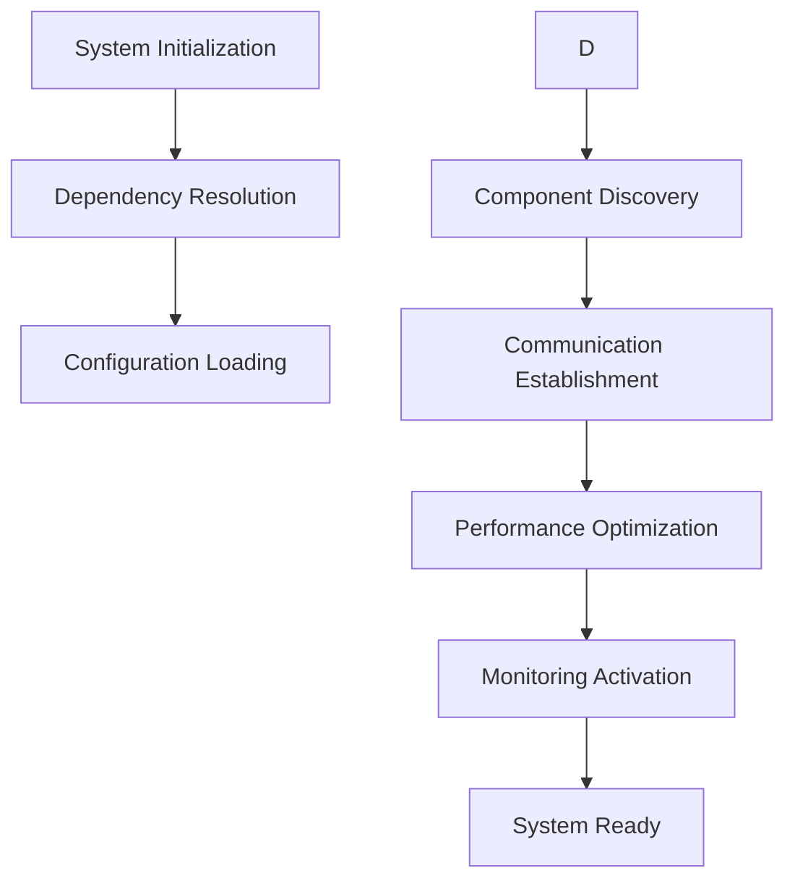

# SutazAI System Integration Guide

## Overview
This guide provides a comprehensive approach to integrating and configuring the SutazAI system across various environments and use cases.

## 1. Integration Architecture

### 1.1 Core Integration Principles
- **Modularity**: Loosely coupled components
- **Scalability**: Horizontal and vertical scaling support
- **Flexibility**: Adaptable to different deployment scenarios

### 1.2 Integration Components
- **Core System**: Central processing and management
- **AI Agents**: Intelligent, autonomous decision-making units
- **Middleware**: Communication and coordination layer
- **Monitoring**: Performance and health tracking

## 2. Deployment Strategies

### 2.1 Deployment Environments
1. **Local Development**
   - Containerized setup
   - Minimal resource requirements
   - Quick iteration and testing

2. **Cloud Deployment**
   - Kubernetes-based orchestration
   - Auto-scaling capabilities
   - Multi-region support

3. **On-Premise**
   - Customizable hardware integration
   - Full system ownership

## 3. Configuration Management

### 3.1 Configuration Layers
- **Global Configuration**
  - System-wide settings
  - Performance parameters

- **Environment-Specific Configuration**
  - Development
  - Staging
  - Production

### 3.2 Configuration Sources
- Environment variables
- YAML configuration files
- Dynamic configuration management

## 4. Dependency Integration

### 4.1 Dependency Resolution
- Automatic dependency discovery
- Version compatibility checks
- Dependency graph generation

### 4.2 Dependency Management Tools
- `pip-tools` for precise dependency pinning
- Virtual environment isolation
- Reproducible builds

## 5. System Communication Protocols

### 5.1 Inter-Component Communication
- gRPC for high-performance RPC
- WebSocket for real-time updates
- REST API for traditional integrations

### 5.2 Message Queuing
- Apache Kafka for distributed messaging
- RabbitMQ for complex routing
- Redis for caching and pub/sub


### 6.1 Authentication Mechanisms
- OAuth 2.0
- JWT-based token authentication
- Multi-factor authentication support

### 6.2 Authorization
- Role-Based Access Control (RBAC)
- Attribute-Based Access Control (ABAC)
- Fine-grained permission management

## 7. Monitoring and Observability

### 7.1 Monitoring Stack
- Prometheus for metrics collection
- Grafana for visualization
- OpenTelemetry for distributed tracing

### 7.2 Logging
- Centralized logging
- Structured log formats
- Log level configurability

## 8. Performance Optimization

### 8.1 Caching Strategies
- Distributed caching
- Intelligent cache invalidation
- Multi-level caching mechanisms

### 8.2 Resource Management
- Dynamic resource allocation
- Predictive scaling
- Workload-aware scheduling

## 9. Integration Workflow



## 10. Troubleshooting and Recovery

### 10.1 Common Integration Challenges
- Dependency conflicts
- Configuration mismatches
- Performance bottlenecks

### 10.2 Recovery Mechanisms
- Automatic rollback
- Failover strategies
- Self-healing capabilities

## 11. Best Practices

1. Use environment-specific configurations
2. Implement comprehensive logging
3. Regularly update dependencies
5. Monitor system performance continuously

## 12. Future Integration Roadmap
- Enhanced AI-driven integration
- More granular control mechanisms
- Advanced predictive integration techniques

## Appendix: Sample Integration Configuration

```yaml
system_integration:
  version: 1.0.0
  deployment_mode: hybrid
  performance_profile: balanced
  
    authentication_method: jwt
    access_control: rbac
  
  communication:
    primary_protocol: grpc
    fallback_protocol: rest
  
  monitoring:
    metrics_collection: prometheus
    tracing: opentelemetry
```

## Conclusion
Successful system integration requires a holistic approach, combining technical expertise with strategic planning. This guide provides a comprehensive framework for integrating the SutazAI system effectively.

---

*Last Updated: {{ current_date }}*
*Version: 1.0.0* 